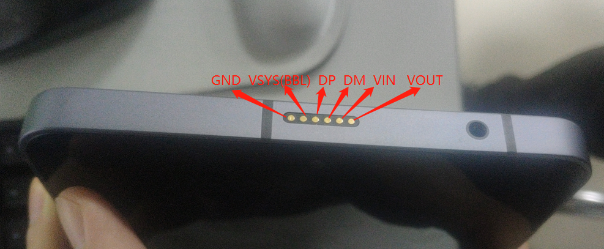
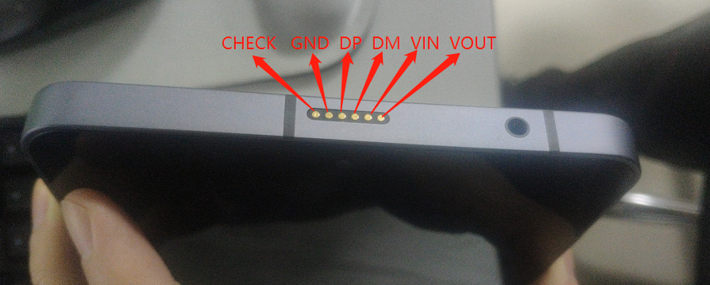
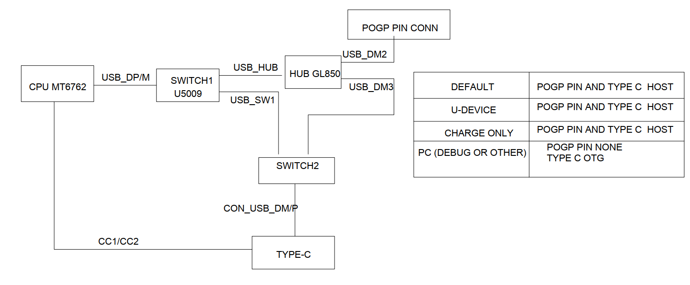
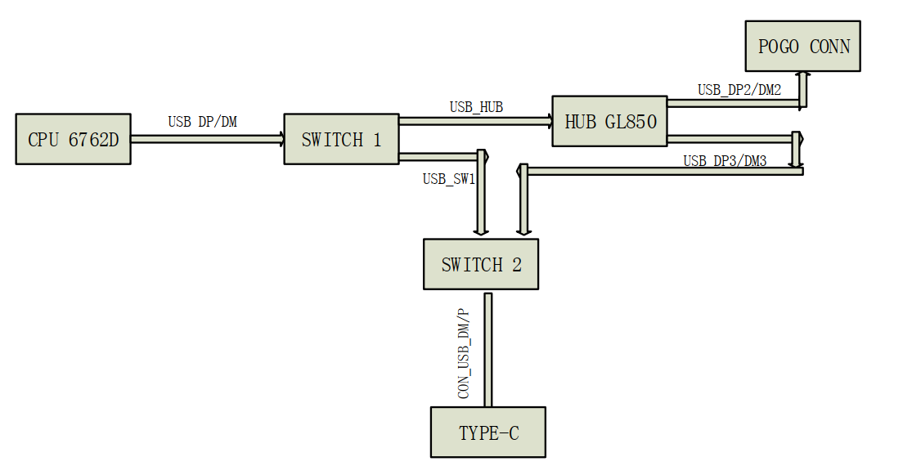
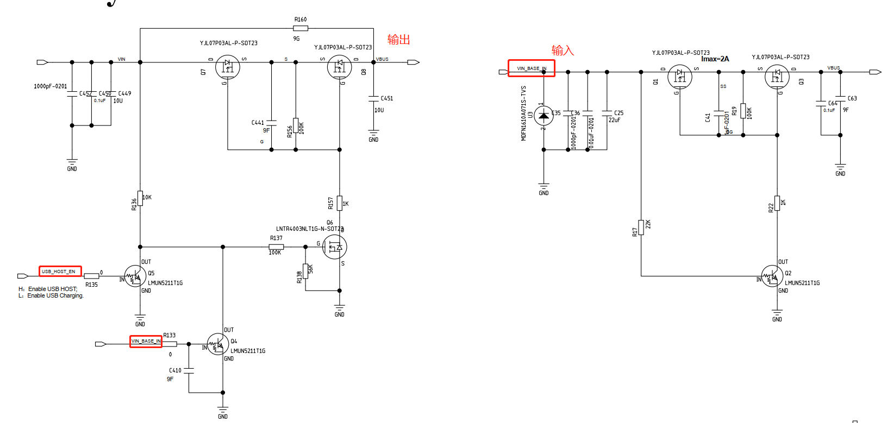
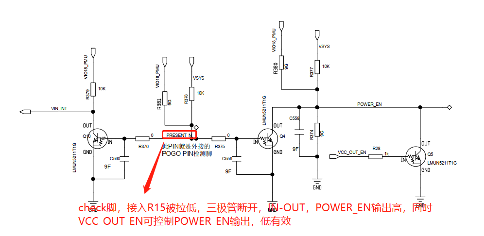

# 概述

M8项目USB_SWITCH功能介绍。

## 参考

* 驱动代码：

[pax_usb_switch.c](refers/pax_usb_switch.c)

## 架构

* 硬件架构

V03版本：



V04版本：



主要修改为，增加CHECK脚检测R15状态，插入则打开VOUT电。BBL供电去掉，单独一路VOUT供电，由R15内部转BBL。

* 1.USB逻辑图





* 2.Vbus逻辑图



* 3.Check脚逻辑图



* 涉及的GPIO作用

```
USB_HOST_EN （AE23）  双输入电源方向控制，高电平输出Vbus，低电平vbus输入

USB_SW1_SEL  （F24）   USB信号切换开关

USB_SW2_SEL  （H24）   USB信号切换开关

GL850_EN     （AD24）  控制HUB芯片POWER

VCC_OUT_EN  （AD23）   在POGO端接USB device时候控制5V输出；故此信号全由你控制，后续不做描述
```