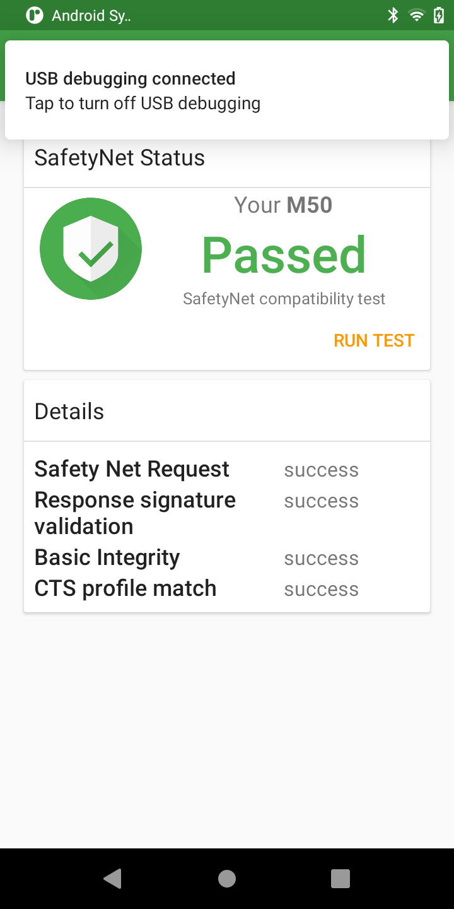
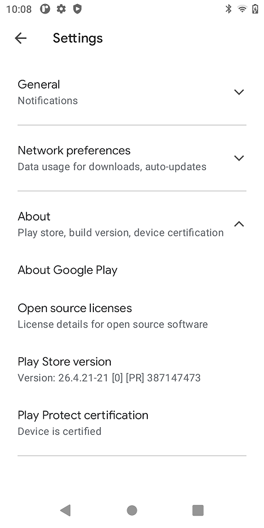
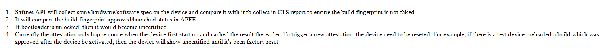
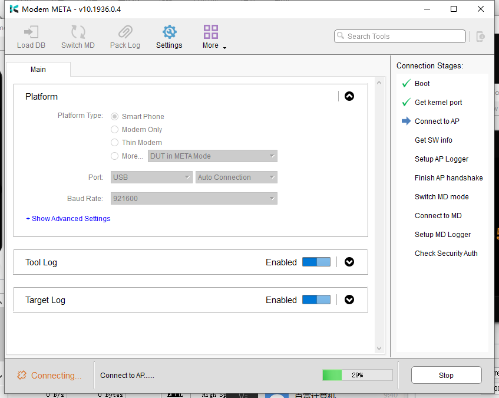

# 概述 

讲解GMS认证判定是否是认证机器的条件及避开技巧。

## 检测认证方法

[Test Plan]:
* (1)需要在GMS下测试;
* (2)SafetyNet要测试通过;
        测试方法：下载SafetyNet测试应用，打开运行 -> "RUN SAFETYNET TEST"。
        测试结果： "CTS profile match" 和 "Basic Integrity" 均为true 的情况为测试通过；否则测试失败。
* (3)Google Play Store要显示设备已通过认证；
        Google Play Store的 "Settings" -> "Play Protect certification" 要显示
        "Device is certified"， 表示设备通过认证。
* (4)设置中显示的Android安全补丁日期与ro.build.security_patch.pax属性值一致。
        查看Settings -> About device -> Android version -> Android security update

* safetynettest.apk：
* [0002_google认证测试safetynettest.apk](refers/0002_google认证测试safetynettest.apk)

safetynettest认证成功：


google play认证成功：


## 判定条件

参考：

* [Magisk and MagiskHide Installation and Troubleshooting guide : MagiskHideSafetyNet](https://www.didgeridoohan.com/magisk/MagiskHideSafetyNet)



总结以下几点：
* 1.设备BootLoader未解锁。
* 2.第一是要确保系统文件的完整性，不能被篡改，这一点既是关键又是前提*(这里的“系统文件”可能不单单指System 分区中的文件，最近我发现，有些设备的校验好像比较严格，相同操作条件下，使用了第三方Recovery 就无法通过校验，此时System 分区并没有解锁，并没有修改)。
* 3.要通过CTS（Compatibility Test Suite 兼容测试）认证，其过程可以简单理解为设备的系统指纹（fingerprint）信息必须提交给Google方面审核，Google审核通过后他们的服务器才会添加上这个设备的系统指纹信息。
* 4.ro.build.fingerprint and possibly ro.build.version.security_patch 属性必须是提交给google的。

## 程序实现

### 1.指纹相关

1.指纹属性赋值在init进程中：

```c++
static void property_derive_build_fingerprint() {
    std::string build_fingerprint = GetProperty("ro.build.fingerprint", "");
    if (!build_fingerprint.empty()) {
        return;
    }
    const std::string UNKNOWN = "unknown";
    std::string error;
    //[FEATURE]-Add-BEGIN by (qumy@paxsz.com), 2021/08/11, modify pro ro.build.version.incremental
    std::string payphonem50 = "2106041716";
    std::string payphonem50eea = "2106082124";
    std::string paytabletm8 = "2106041717";
    std::string paytabletm8eea = "2106082125";

    if(GetProperty("ro.boot.terminal_name", UNKNOWN) == "M8"){
        if(GetProperty("ro.paxdroid.name", UNKNOWN) == "k62v1_64_pax"){
                PropertySet("ro.build.version.incremental", paytabletm8, &error);
        }else{
                PropertySet("ro.build.version.incremental", paytabletm8eea, &error);
        }

    }else if(GetProperty("ro.boot.terminal_name", UNKNOWN) == "M50"){
    if(GetProperty("ro.paxdroid.name", UNKNOWN) == "k62v1_64_pax"){
        PropertySet("ro.build.version.incremental", payphonem50, &error);
    }else{
        PropertySet("ro.build.version.incremental", payphonem50eea, &error);
    }
    }

    //[FEATURE]-Add-END by (qumy@paxsz.com), 2021/08/11,
    build_fingerprint = GetProperty("ro.product.brand", UNKNOWN);
    build_fingerprint += '/';
    //[FEATURE]-Add-BEGIN by (wugangnan@paxsz.com), 2021/05/11, set some fingerprint prop for GMS
    build_fingerprint += GetProperty("ro.boot.terminal_name", UNKNOWN);
    //[FEATURE]-Add-BEGIN by (wugangnan@paxsz.com), 2021/08/06, for eea product
    if (GetProperty("ro.paxdroid.name", UNKNOWN) == "k62v1_64_pax_eea") {
        build_fingerprint += '_';
    build_fingerprint += 'E';
    build_fingerprint += 'E';
    build_fingerprint += 'A';
    }
    build_fingerprint += '/';
    build_fingerprint += 'P';
    build_fingerprint += 'A';
    build_fingerprint += 'Y';
   if(GetProperty("ro.boot.terminal_name", UNKNOWN) == "M8") {
        build_fingerprint += 'T';
        build_fingerprint += 'A';
        build_fingerprint += 'B';
        build_fingerprint += 'L';
        build_fingerprint += 'E';
    build_fingerprint += 'T';
   }else{
    build_fingerprint += 'P';
    build_fingerprint += 'H';
    build_fingerprint += 'O';
    build_fingerprint += 'N';
    build_fingerprint += 'E';
   }
    build_fingerprint += GetProperty("ro.boot.terminal_name", UNKNOWN);
    //[FEATURE]-Add-BEGIN by (wugangnan@paxsz.com), 2021/08/06, for eea product for eea,not to add _M8
    // if (GetProperty("ro.paxdroid.name", UNKNOWN) == "k62v1_64_pax_eea" && GetProperty("ro.boot.terminal_name", UNKNOWN) == "M8") {
    //  build_fingerprint += '_';
    //  build_fingerprint += 'E';
    //  build_fingerprint += 'E';
    //  build_fingerprint += 'A';
    // }
    //[FEATURE]-Add-END by (wugangnan@paxsz.com), 2021/08/06, for eea product
    //[FEATURE]-Add-END by (wugangnan@paxsz.com), 2021/05/11, set some fingerprint prop for GMS
    build_fingerprint += ':';
    build_fingerprint += GetProperty("ro.build.version.release", UNKNOWN);
    build_fingerprint += '/';
    build_fingerprint += GetProperty("ro.build.id", UNKNOWN);
    build_fingerprint += '/';
    build_fingerprint += GetProperty("ro.build.version.incremental", UNKNOWN);
    build_fingerprint += ':';
    build_fingerprint += GetProperty("ro.build.type", UNKNOWN);
    build_fingerprint += '/';
    build_fingerprint += GetProperty("ro.build.tags", UNKNOWN);

    LOG(INFO) << "Setting property 'ro.build.fingerprint' to '" << build_fingerprint << "'";

    uint32_t res = PropertySet("ro.build.fingerprint", build_fingerprint, &error);
    //[FEATURE]-Add-BEGIN by (wugangnan@paxsz.com), 2021/05/11, set some fingerprint prop for GMS
    res = PropertySet("ro.bootimage.build.fingerprint", build_fingerprint, &error);
    res = PropertySet("ro.odm.build.fingerprint", build_fingerprint, &error);
    res = PropertySet("ro.system.build.fingerprint", build_fingerprint, &error);
    res = PropertySet("ro.system_ext.build.fingerprint", build_fingerprint, &error);
    res = PropertySet("ro.vendor.build.fingerprint", build_fingerprint, &error);
    res = PropertySet("ro.product.build.fingerprint", build_fingerprint, &error);
    //[FEATURE]-Add-BEGIN by (wugangnan@paxsz.com), 2021/05/11, set some fingerprint prop for GMS
    if (res != PROP_SUCCESS) {
        LOG(ERROR) << "Error setting property 'ro.build.fingerprint': err=" << res << " (" << error
                   << ")";
    }
}
```

部分其他修改请参考 [GMS系统属性定制](0003_GMS系统属性定制.md)

* 结果：

```
M50:
[ro.build.fingerprint]: [PAX/M50_EEA/PAYPHONEM50:11/RP1A.200720.011/2106082124:user/release-keys]

M8:
[ro.build.fingerprint]: [PAX/M8_EEA/PAYPHONEM50:11/RP1A.200720.011/2106082124:user/release-keys]
```

2.安全补丁日期定制：

```diff
 system/core/init/property_service.cpp         | 148 +++++++++---------
 .../apps/Google/google/products/eea_common.mk |   1 -
 .../apps/Google/google/products/gms.mk        |   1 -
  .../rc_file/M50/init.mt6762_common_M50.rc     |  71 ++++-----
 .../rc_file/M50/init.mt6762_common_M50_eea.rc |  64 ++++----
 .../rc_file/M8/init.mt6762_common_M8.rc       |  61 ++++----
 .../rc_file/M8/init.mt6762_common_M8_eea.rc   |  69 ++++----
  build/make/core/version_defaults.mk           |   4 +-
 build/make/tools/buildinfo.sh                 |   5 +-

-- a/build/make/core/version_defaults.mk
+++ b/build/make/core/version_defaults.mk
@@ -240,9 +240,7 @@ ifndef PLATFORM_SECURITY_PATCH
     #  It must be of the form "YYYY-MM-DD" on production devices.
     #  It must match one of the Android Security Patch Level strings of the Public Security Bulletins.
     #  If there is no $PLATFORM_SECURITY_PATCH set, keep it empty.
-    # [BUGFIX]-BEGIN by (wugangnan@paxsz.com), 2021/12/22 for keep the security patch date the same as at the time of certification,and define in rc file
-    #  PLATFORM_SECURITY_PATCH := 2021-11-05
-    # [BUGFIX]-END by (wugangnan@paxsz.com), 2021/12/22 for keep the security patch date the same as at the time of certification,and define in rc file
+      PLATFORM_SECURITY_PATCH := 2021-11-05
 endif
 .KATI_READONLY := PLATFORM_SECURITY_PATCH
 
diff --git a/build/make/tools/buildinfo.sh b/build/make/tools/buildinfo.sh
index 7346ba35082..a00494cdd98 100755
--- a/build/make/tools/buildinfo.sh
+++ b/build/make/tools/buildinfo.sh
@@ -15,7 +15,10 @@ echo "ro.build.version.codename=$PLATFORM_VERSION_CODENAME"
 echo "ro.build.version.all_codenames=$PLATFORM_VERSION_ALL_CODENAMES"
 echo "ro.build.version.release=$PLATFORM_VERSION_LAST_STABLE"
 echo "ro.build.version.release_or_codename=$PLATFORM_VERSION"
-echo "ro.build.version.security_patch=$PLATFORM_SECURITY_PATCH"
+#[FEATURE]-Add-BEGIN by (lib@paxsz.com) 2021/12/21 add the pax security patch
+#echo "ro.build.version.security_patch=$PLATFORM_SECURITY_PATCH"
+echo "ro.build.version.security_patch_pax=$PLATFORM_SECURITY_PATCH"
+#[FEATURE]-Add-END by (lib@paxsz.com) 2021/12/21
 echo "ro.build.version.base_os=$PLATFORM_BASE_OS"
 echo "ro.build.version.min_supported_target_sdk=$PLATFORM_MIN_SUPPORTED_TARGET_SDK_VERSION"
 echo "ro.build.date=`$DATE`"

 --- a/paxdroid/device/rc_file/M50/init.mt6762_common_M50.rc
+++ b/paxdroid/device/rc_file/M50/init.mt6762_common_M50.rc

+    setprop ro.build.version.security_patch 2021-06-15
+    setprop ro.com.google.gmsversion 11_202104

--- a/teksun/packages/apps/Google/google/products/eea_common.mk
+++ b/teksun/packages/apps/Google/google/products/eea_common.mk
@@ -105,4 +105,3 @@ PRODUCT_PRODUCT_PROPERTIES += \
     ro.setupwizard.rotation_locked=true \
     setupwizard.theme=glif_v3_light \
     ro.opa.eligible_device=true \
-    ro.com.google.gmsversion=11_202106
diff --git a/teksun/packages/apps/Google/google/products/gms.mk b/teksun/packages/apps/Google/google/products/gms.mk
index 19975a0e40f..fa1345560e2 100644
--- a/teksun/packages/apps/Google/google/products/gms.mk
+++ b/teksun/packages/apps/Google/google/products/gms.mk
@@ -132,4 +132,3 @@ PRODUCT_PRODUCT_PROPERTIES += \
     ro.setupwizard.rotation_locked=true \
     setupwizard.theme=glif_v3_light \
     ro.opa.eligible_device=true \
-    ro.com.google.gmsversion=11_202108
-- 
```

* 结果：

```
M50:
[ro.build.version.security_patch]: [2021-06-05]
[ro.build.version.security_patch_pax]: [2021-11-05]
[ro.vendor.build.security_patch]: [2021-11-05]
getprop ro.com.google.gmsversion : 11_202104
```

```
M8:
[ro.build.version.security_patch]: [2021-11-05]
[ro.build.version.security_patch_pax]: [2021-11-05]
[ro.vendor.build.security_patch]: [2021-11-05]
getprop ro.com.google.gmsversion : 11_202108
```

## 问题分析

### 1.modem meta无法connect

* 现象如下，卡在connect to AP这一步：



* 原因：

meta_init.mt6762_M50_V2.rc文件中未设置ro.build.version.security_patch属性，导致meta系统无法启动。

