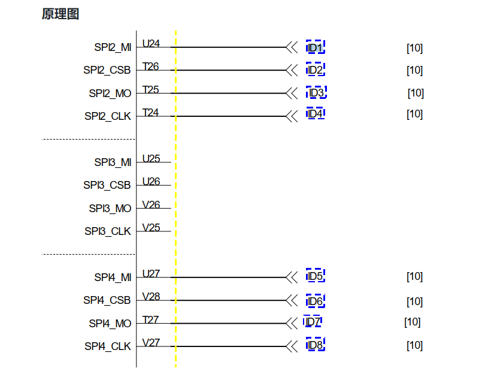

# 简介

GMS相关属性定制

## 参考

[Android之build.prop属性详解](https://www.cnblogs.com/pngcui/p/7193622.html)

## 概述

目前MTK平台有两个项目，M8和M50，需要共用同一套代码，需要从RC、kernel、lk三个方面做产品兼容。

* 参考A35平台

```
shell
MAG_CARD="05"
IC_CARD="00"   
SAM_NUM="02"
ETHERNET="03"            
TOUCH_SCREEN="158"      
LCD="158"               
WIFI="30"               
CAMERA_NUMBER="01"
CAMERA_FRONT="46"       
MAIN_BOARD="V01"
PORT_BOARD="V01"
PN="A35-0NA-RD6-02AA"
CONFIG_FILE_VER="V1.0"
RF_1356M="03"            
RF_PARA_1="00000FFF0404107F1000"
RF_PARA_2="7F3C0B0B020300000000"
RF_PARA_3="00000000000000000000"
TERMINAL_NAME="A35" 
```
* 设备上电的时候，sp会通过串口发送以上配置文件给ap，u-boot需要解析出这些参数，并放到bootargs中，然后传送给kernel。
* 需要注意的是：TERMINAL_NAME表示产品名称， MAIN_BOARD表示主板版本，PORT_BOARD表示副板版本，u-boot会用这3个配置项的组合查找对应的dts，然后启动kernel，例如A35_V01_V01.dts。同理，在android的init进程启动的时候，也会根据这几个参数加载对应的rc文件


## 硬件boradid信息

### M50项目


### M8项目


## RC平台化
* 参考A35在rc文件中设置各种手机配置，如下：

```
on init
#机型名称
    setprop ro.product.model M50
    setprop ro.product.name M50
    setprop ro.product.device M50
	setprop	ro.product.board M50
```
* selinux报错如下：

```
简化：
denied { set } for property=ro.product.model pid=332 uid=0 gid=0 scontext=u:r:vendor_init:s0 tcontext=u:object_r:exported2_default_prop:s0 tclass=property_service permissive=0

(210510_16:12:30.721)[    7.987986] <1>.(1)[1:init]init 24: [7959][0]processing action (init) from (/vendor/paxdroid/rc_file/init.mt6762_M50_V0.rc:33)
(210510_16:12:30.721)[    7.990326] <6>.(6)[331:init]init 22: [7961][33]ReapLogF PropSet [sys.usb.configfs]=[0]7905 [hwservicemanager.ready]=[true]7928 Done
(210510_16:12:30.721)[    7.990428] <4>.(4)[369:logd.auditd]type=1107 audit(1620634162.040:6): uid=0 auid=4294967295 ses=4294967295 subj=u:r:init:s0 msg='avc: denied { set } for property=ro.product.model pid=332 uid=0 gid=0 scontext=u:r:vendor_init:s0 tcontext=u:object_r:exported2_default_prop:s0 tclass=property_service permissive=0'
(210510_16:12:30.721)[    7.991837] <6>.(6)[331:init]init 22: [7961][33]Unable to set property 'ro.product.model' from uid:0 gid:0 pid:332: SELinux permission check failed
(210510_16:12:30.721)[    7.998082] <7>.(7)[331:init]init 22: [7969][0]Unable to set property 'ro.product.name' from uid:0 gid:0 pid:332: SELinux permission check failed
(210510_16:12:30.721)[    7.998109] <4>.(4)[369:logd.auditd]type=1107 audit(1620634162.048:7): uid=0 auid=4294967295 ses=4294967295 subj=u:r:init:s0 msg='avc: denied { set } for property=ro.product.name pid=332 uid=0 gid=0 scontext=u:r:vendor_init:s0 tcontext=u:object_r:exported2_default_prop:s0 tclass=property_service permissive=0'
(210510_16:12:30.721)[    8.000575] <7>.(7)[331:init]init 22: [7972][0]Unable to set property 'ro.product.device' from uid:0 gid:0 pid:332: SELinux permission check failed
(210510_16:12:30.721)[    8.003390] <2>.(2)[369:logd.auditd]type=1107 audit(1620634162.052:8): uid=0 auid=4294967295 ses=4294967295 subj=u:r:init:s0 msg='avc: denied { set } for property=ro.product.device pid=332 uid=0 gid=0 scontext=u:r:vendor_init:s0 tcontext=u:object_r:exported2_default_prop:s0 tclass=property_service permissive=0'
(210510_16:12:30.721)[    8.005519] <4>.(4)[331:init]init 22: [7977][0]Unable to set property 'ro.product.board' from uid:0 gid:0 pid:332: Read-only property was already set
```
* 但是发现系统报错neverallow：

```
修改如下：
set_prop(vendor_init, exported2_default_prop)
set_prop参考：
https://blog.csdn.net/u013398960/article/details/98998653

报错：
system/sepolicy/public/property.te:258
  (neverallow base_typeattr_217 base_typeattr_481 (property_service (set)))

代码如下：
neverallow { coredomain -init } {
  vendor_property_type
  -vendor_public_property_type
}:property_service set;
```


* 发现放到vendor下面行不通，参考A35放到root下面可以避开selinux权限问题。

```
device/a133/a133.mk
70:    paxdroid/device/a133/init.paxdroid.rc:root/init.paxdroid.rc \
71:    paxdroid/device/a133/init.paxdroid.A35.rc:root/init.paxdroid.A35.rc \
72:    paxdroid/device/a133/init.paxdroid.A660.rc:root/init.paxdroid.A660.rc \
73:    paxdroid/device/a133/init.paxdroid.A660.rc:root/init.paxdroid.P100.rc \
74:    paxdroid/device/a133/init.paxdroid.QR500.rc:root/init.paxdroid.QR500.rc \
75:    paxdroid/device/a133/init.paxdroid.AF5.rc:root/init.paxdroid.AF5.rc \
76:    paxdroid/device/a133/init.pax.usb.rc:root/init.pax.usb.rc \
```
## rc定制属性类型
* 目前M50需要定制的变量如下：

属性 | 说明 | 值
---|---|---
ro.build.product | 已经过时，现在使用“ro.product.device” | 值同“ro.product.device”即可 M50
ro.product.device | 设备名称 | PAYPHONEM50
ro.product.model | 型号名称 | M50
ro.product.name | 产品名称 | M50
ro.product.board | 采用的底板/处理器 | M50
ro.product.manufacturer | 制造商名称 | PAX

另外还有一些属性如下：

```
	setprop	ro.product.odm.device M50
	setprop	ro.product.odm.model M50
	setprop	ro.product.odm.name M50
	
    setprop ro.product.product.device PAYPHONEM50
	setprop	ro.product.product.model M50
	setprop	ro.product.product.name M50
	
	setprop	ro.product.system.device PAYPHONEM50
	setprop	ro.product.system.model M50
	setprop	ro.product.system.name M50
	
	setprop	ro.product.vendor.device PAYPHONEM50
	setprop	ro.product.vendor.model M50
	setprop	ro.product.vendor.name M50
	
	setprop	ro.product.system_ext.device PAYPHONEM50
	setprop	ro.product.system_ext.model M50
	setprop	ro.product.system_ext.name M50
```

这些属性分别存在于各自的build.prop,例如ro.product.system.device就存在于`/system/build.prop`路径
```
./system/build.prop
./system/system_ext/build.prop
./vendor/build.prop
./vendor/odm/etc/build.prop
./product/build.prop
```
这些属性的用途是备用的，如下：


> If the ro.product.[brand|device|manufacturer|model|name] properties have not been explicitly set, derive them from ro.product.${partition}.* properties


## RC属性定义
### 1.ro.product定义
* 主要包括如下属性：

```
    setprop ro.product.device PAYPHONEM50
	setprop ro.product.model M50
	setprop ro.product.name M50
	setprop	ro.product.board M50
	setprop ro.product.manufacturer PAX
```

* ro.product.name定义如下：`device/mediateksample/k62v1_64_pax/k62v1_64_pax.mk`:

```
ro.product.name:
PRODUCT_NAME := k62v1_64_pax
```
* ro.product.brand、ro.product.model、ro.product.manufacture、ro.product.devicer定义如下：`device/mediateksample/k62v1_64_pax/vnd_k62v1_64_pax.mk`
```
这边只是初步定义，可以全部改变，但是最后是在接下来讲的cpp文件里面改：
MTK_BASE_PROJECT := k62v1_64_pax
PRODUCT_MANUFACTURER := alps
PRODUCT_DEVICE := $(strip $(MTK_BASE_PROJECT))
PRODUCT_MODEL := k62v1_64_pax
PRODUCT_BRAND := alps
```
####  1.1 ro.product属性初始化赋值
* 如下是定制好后的文件`system/core/init/property_service.cpp`:

```
static void property_initialize_ro_product_props() {
    const char* RO_PRODUCT_PROPS_PREFIX = "ro.product.";
    const char* RO_PRODUCT_PROPS[] = {
			/* [FEATURE]-Modify-BEGIN by (wugangnan@paxsz.com), 2021/05/10, don't set ro.product property auto*/
            //"brand", "device", "manufacturer", "model", "name",  注释掉这里就好了
			"brand",
			/* [FEATURE]-Modify-END by (wugangnan@paxsz.com), 2021/05/10, don't set ro.product property auto*/
    };
    const char* RO_PRODUCT_PROPS_ALLOWED_SOURCES[] = {
            "odm", "product", "system_ext", "system", "vendor",
    };
    const char* RO_PRODUCT_PROPS_DEFAULT_SOURCE_ORDER = "product,odm,vendor,system_ext,system";
    const std::string EMPTY = "";

    std::string ro_product_props_source_order =
            GetProperty("ro.product.property_source_order", EMPTY);

    if (!ro_product_props_source_order.empty()) {
        // Verify that all specified sources are valid
        for (const auto& source : Split(ro_product_props_source_order, ",")) {
            // Verify that the specified source is valid
            bool is_allowed_source = false;
            for (const auto& allowed_source : RO_PRODUCT_PROPS_ALLOWED_SOURCES) {
                if (source == allowed_source) {
                    is_allowed_source = true;
                    break;
                }
            }
            if (!is_allowed_source) {
                LOG(ERROR) << "Found unexpected source in ro.product.property_source_order; "
                              "using the default property source order";
                ro_product_props_source_order = RO_PRODUCT_PROPS_DEFAULT_SOURCE_ORDER;
                break;
            }
        }
    } else {
        ro_product_props_source_order = RO_PRODUCT_PROPS_DEFAULT_SOURCE_ORDER;
    }

    for (const auto& ro_product_prop : RO_PRODUCT_PROPS) {
        std::string base_prop(RO_PRODUCT_PROPS_PREFIX);
        base_prop += ro_product_prop;

        std::string base_prop_val = GetProperty(base_prop, EMPTY);
        if (!base_prop_val.empty()) {
            continue;
        }

        for (const auto& source : Split(ro_product_props_source_order, ",")) {
            std::string target_prop(RO_PRODUCT_PROPS_PREFIX);
            target_prop += source;
            target_prop += '.';
			
            target_prop += ro_product_prop;

            std::string target_prop_val = GetProperty(target_prop, EMPTY);
            if (!target_prop_val.empty()) {
                LOG(INFO) << "Setting product property " << base_prop << " to '" << target_prop_val
                          << "' (from " << target_prop << ")";
                std::string error;
                uint32_t res = PropertySet(base_prop, target_prop_val, &error);//在这里赋值这些变量
                if (res != PROP_SUCCESS) {
                    LOG(ERROR) << "Error setting product property " << base_prop << ": err=" << res
                               << " (" << error << ")";
                }
                break;
            }
        }
    }
}
```
* 打印：

```
Setting product property ro.product.brand to 'PAX' (from ro.product.odm.brand)
```
#### 1.2ro.product重新赋值
既然在property_initialize_ro_product_props中已经将赋值全部删除，就需要重新赋值，修改如下`paxdroid/device/paxdroid_common.mk`：

```
赋值这个属性必须放在root路径下，否则会有selinux权限报错：
ifeq ($(strip $(POS_OS_PLATFORM)), MT6762)
PRODUCT_COPY_FILES += \
        paxdroid/device/build.prop/build_A80.prop:vendor/paxdroid/build_A80.prop \
        paxdroid/device/build.prop/build_IM30.prop:vendor/paxdroid/build_IM30.prop \
        paxdroid/device/etc/pms_app_grant_permission_list.txt:vendor/paxdroid/pms_app_grant_permission_list.txt \
        paxdroid/device/rc_file/M50/init.recovery.M50_V0.rc:root/init.recovery.M50_V0.rc \
        paxdroid/device/rc_file/M50/init.mt6762_M50_V0.rc:root/init.mt6762_M50_V0.rc \
        
init.mt6762_M50_V0.rc: 重新赋值        
on init
	setprop	ro.build.product M50
	
    setprop ro.product.device PAYPHONEM50
	setprop ro.product.model M50
	setprop ro.product.name M50
	setprop	ro.product.board M50
	setprop ro.product.manufacturer PAX
```
### ro.product.{odm/product/system/vendor/system_ext}.{device/model/name}定义
#### 1.首先看看build.prop里面的内容
* 参考M50 Android R代码：

```
只展现相关属性
system/build.prop：
ro.product.system.brand=PAX
ro.product.system.device=PAXM50
ro.product.system.manufacturer=PAX
ro.product.system.model=M50
ro.product.system.name=M50
ro.build.product=M50

system/system_ext/build.prop:
ro.product.system_ext.brand=alps
ro.product.system_ext.device=k62v1_64_pax
ro.product.system_ext.manufacturer=alps
ro.product.system_ext.model=k62v1_64_pax
ro.product.system_ext.name=k62v1_64_pax

vendor/build.prop:
ro.product.vendor.brand=alps
ro.product.vendor.device=k62v1_64_pax
ro.product.vendor.manufacturer=alps
ro.product.vendor.model=k62v1_64_pax
ro.product.vendor.name=k62v1_64_pax

vendor/odm/etc/build.prop：
ro.product.odm.brand=alps
ro.product.odm.device=k62v1_64_pax
ro.product.odm.manufacturer=alps
ro.product.odm.model=k62v1_64_pax
ro.product.odm.name=k62v1_64_pax

product/build.prop：
ro.product.product.brand=alps
ro.product.product.device=k62v1_64_pax
ro.product.product.manufacturer=alps
ro.product.product.model=k62v1_64_pax
ro.product.product.name=k62v1_64_pax
```
#### 2. build.prop生成过程
　build.prop的生成是由make系统解析build/core/Makefile完成，Makefile生成build.prop的主要代码如下`build/make/core/Makefile`：
　
```
使用的脚本：
BUILDINFO_SH := build/make/tools/buildinfo.sh
BUILDINFO_COMMON_SH := build/make/tools/buildinfo_common.sh
POST_PROCESS_PROPS :=$= build/make/tools/post_process_props.py

ifdef TARGET_SYSTEM_PROP
system_prop_file := $(TARGET_SYSTEM_PROP)
else
system_prop_file := $(wildcard $(TARGET_DEVICE_DIR)/system.prop)
endif
$(intermediate_system_build_prop): $(BUILDINFO_SH) $(BUILDINFO_COMMON_SH) $(INTERNAL_BUILD_ID_MAKEFILE) $(BUILD_SYSTEM)/version_defaults.mk $(system_prop_file) $(INSTALLED_ANDROID_INFO_TXT_TARGET) $(API_FINGERPRINT) $(POST_PROCESS_PROPS)
	@echo Target buildinfo: $@
	@mkdir -p $(dir $@)
	$(hide) echo > $@
ifneq ($(PRODUCT_OEM_PROPERTIES),)
	$(hide) echo "#" >> $@; \
	        echo "# PRODUCT_OEM_PROPERTIES" >> $@; \
	        echo "#" >> $@;
	$(hide) $(foreach prop,$(PRODUCT_OEM_PROPERTIES), \
	    echo "import /oem/oem.prop $(prop)" >> $@;)
endif
	$(hide) PRODUCT_BRAND="$(PRODUCT_SYSTEM_BRAND)" \
	        PRODUCT_MANUFACTURER="$(PRODUCT_SYSTEM_MANUFACTURER)" \
	        PRODUCT_MODEL="$(PRODUCT_SYSTEM_MODEL)" \
	        PRODUCT_NAME="$(PRODUCT_SYSTEM_NAME)" \
	        PRODUCT_DEVICE="$(PRODUCT_SYSTEM_DEVICE)" \
	        $(call generate-common-build-props-with-product-vars-set,system,$@)
	$(hide) TARGET_BUILD_TYPE="$(TARGET_BUILD_VARIANT)" \
	        TARGET_BUILD_FLAVOR="$(TARGET_BUILD_FLAVOR)" \
	        TARGET_DEVICE="$(TARGET_DEVICE)" \
	        PRODUCT_DEFAULT_LOCALE="$(call get-default-product-locale,$(PRODUCT_LOCALES))" \
	        PRODUCT_DEFAULT_WIFI_CHANNELS="$(PRODUCT_DEFAULT_WIFI_CHANNELS)" \
	        PRIVATE_BUILD_DESC="$(PRIVATE_BUILD_DESC)" \
	        BUILD_ID="$(BUILD_ID)" \
	        BUILD_DISPLAY_ID="$(BUILD_DISPLAY_ID)" \
	        DATE="$(DATE_FROM_FILE)" \
	        BUILD_USERNAME="$(BUILD_USERNAME)" \
	        BUILD_HOSTNAME="$(BUILD_HOSTNAME)" \
	        BUILD_NUMBER="$(BUILD_NUMBER_FROM_FILE)" \
	        BOARD_BUILD_SYSTEM_ROOT_IMAGE="$(BOARD_BUILD_SYSTEM_ROOT_IMAGE)" \
	        PLATFORM_VERSION="$(PLATFORM_VERSION)" \
	        PLATFORM_VERSION_LAST_STABLE="$(PLATFORM_VERSION_LAST_STABLE)" \
	        PLATFORM_SECURITY_PATCH="$(PLATFORM_SECURITY_PATCH)" \
	        PLATFORM_BASE_OS="$(PLATFORM_BASE_OS)" \
	        PLATFORM_SDK_VERSION="$(PLATFORM_SDK_VERSION)" \
	        PLATFORM_PREVIEW_SDK_VERSION="$(PLATFORM_PREVIEW_SDK_VERSION)" \
	        PLATFORM_PREVIEW_SDK_FINGERPRINT="$$(cat $(API_FINGERPRINT))" \
	        PLATFORM_VERSION_CODENAME="$(PLATFORM_VERSION_CODENAME)" \
	        PLATFORM_VERSION_ALL_CODENAMES="$(PLATFORM_VERSION_ALL_CODENAMES)" \
	        PLATFORM_MIN_SUPPORTED_TARGET_SDK_VERSION="$(PLATFORM_MIN_SUPPORTED_TARGET_SDK_VERSION)" \
	        BUILD_VERSION_TAGS="$(BUILD_VERSION_TAGS)" \
	        $(if $(OEM_THUMBPRINT_PROPERTIES),BUILD_THUMBPRINT="$(BUILD_THUMBPRINT_FROM_FILE)") \
	        TARGET_CPU_ABI_LIST="$(TARGET_CPU_ABI_LIST)" \
	        TARGET_CPU_ABI_LIST_32_BIT="$(TARGET_CPU_ABI_LIST_32_BIT)" \
	        TARGET_CPU_ABI_LIST_64_BIT="$(TARGET_CPU_ABI_LIST_64_BIT)" \
	        TARGET_CPU_ABI="$(TARGET_CPU_ABI)" \
	        TARGET_CPU_ABI2="$(TARGET_CPU_ABI2)" \
	        bash $(BUILDINFO_SH) >> $@
最后追加余下的属性：
	$(hide) $(foreach file,$(system_prop_file), \
	    if [ -f "$(file)" ]; then \
	        echo Target buildinfo from: "$(file)"; \
	        echo "" >> $@; \
	        echo "#" >> $@; \
	        echo "# from $(file)" >> $@; \
	        echo "#" >> $@; \
	        cat $(file) >> $@; \
	        echo "# end of $(file)" >> $@; \
	    fi;)
	$(if $(FINAL_BUILD_PROPERTIES), \
	    $(hide) echo >> $@; \
	            echo "#" >> $@; \
	            echo "# ADDITIONAL_BUILD_PROPERTIES" >> $@; \
	            echo "#" >> $@; )
	$(hide) $(foreach line,$(FINAL_BUILD_PROPERTIES), \
	    echo "$(line)" >> $@;)
	$(hide) $(POST_PROCESS_PROPS) $@ $(PRODUCT_SYSTEM_PROPERTY_BLACKLIST)

其中system_prop_file定义：
    ifdef TARGET_SYSTEM_PROP
    system_prop_file := $(TARGET_SYSTEM_PROP)
    else
    system_prop_file := $(wildcard $(TARGET_DEVICE_DIR)/system.prop)
    endif
即$(TARGET_DEVICE_DIR)/system.prop文件
这里指的是：device/mediatek/system/common/system.prop
而不是device/mediateksample/k62v1_64_pax/system.prop
　　到此，prop文件生成完毕！
```
##### system/build.prop生成过程
以上定义了各种属性需要用到的变量，system/build.prop目前用到两个脚本生成属性`buildinfo_common.sh`及`buildinfo.sh`,以及追加属性system.prop，可以看到如下内容：
```
第一部分由buildinfo_common.sh脚本实现
# begin common build properties
# autogenerated by build/make/tools/buildinfo_common.sh
ro.system.build.date=Wed Jul 14 04:58:08 CST 2021
ro.system.build.date.utc=1626209888
ro.system.build.id=RP1A.200720.011
ro.system.build.tags=release-keys
ro.system.build.type=userdebug
ro.system.build.version.incremental=PayDroid1100BirchV15100
ro.system.build.version.release=11
ro.system.build.version.release_or_codename=11
ro.system.build.version.sdk=30
ro.product.system.brand=PAX
ro.product.system.manufacturer=PAX
# end common build properties   这里截止

第二部分由buildinfo.sh脚本实现
# begin build properties
# autogenerated by buildinfo.sh
ro.build.id=RP1A.200720.011
ro.build.display.id=k62v1_64_pax-userdebug 11 RP1A.200720.011 PayDroid1100BirchV15100 release-keys
ro.build.version.incremental=PayDroid1100BirchV15100
ro.build.version.sdk=30
ro.build.version.preview_sdk=0
ro.build.version.preview_sdk_fingerprint=REL
ro.build.version.codename=REL
ro.build.version.all_codenames=REL
ro.build.version.release=11
ro.build.version.release_or_codename=11
ro.build.version.security_patch=2021-03-05
ro.build.version.base_os=
ro.build.version.min_supported_target_sdk=23
ro.build.date=Wed Jul 14 04:58:08 CST 2021
ro.build.date.utc=1626209888
ro.build.type=userdebug
ro.build.user=wugn
ro.build.host=jcrj-tf-compile
ro.build.tags=release-keys
ro.build.system_root_image=false
# ro.product.cpu.abi and ro.product.cpu.abi2 are obsolete,
# use ro.product.cpu.abilist instead.
ro.product.cpu.abi=arm64-v8a
ro.product.cpu.abilist=arm64-v8a,armeabi-v7a,armeabi
ro.product.cpu.abilist32=armeabi-v7a,armeabi
ro.product.cpu.abilist64=arm64-v8a
ro.product.locale=en-US
ro.wifi.channels=
# Do not try to parse description or thumbprint
# end build properties


追加属性system.prop
#
# from device/mediatek/system/common/system.prop
#
ro.product.property_source_order=odm,vendor,product,system

vendor.rild.libpath=mtk-ril.so
vendor.rild.libargs=-d /dev/ttyC0


wifi.interface=wlan0
ro.mediatek.wlan.wsc=1
ro.mediatek.wlan.p2p=1
mediatek.wlan.ctia=0


#
wifi.tethering.interface=ap0
#

ro.opengles.version=196610
# ro.kernel.qemu=1
# ro.kernel.qemu.gles=0

wifi.direct.interface=p2p0
#dalvik.vm.heapgrowthlimit=256m
#dalvik.vm.heapsize=512m

# USB MTP WHQL
ro.sys.usb.mtp.whql.enable=0

# Power off opt in IPO
sys.ipo.pwrdncap=2

ro.sys.usb.storage.type=mtp

# USB BICR function
ro.sys.usb.bicr=no

# USB Charge only function
ro.sys.usb.charging.only=yes

# audio
ro.camera.sound.forced=0
ro.audio.silent=0

ro.zygote.preload.enable=0

# temporary enables NAV bar (soft keys)
qemu.hw.mainkeys=0

ro.kernel.zio=38,108,105,16
#ro.kernel.qemu=1
#ro.kernel.qemu.gles=0
#ro.boot.selinux=disable

# Disable dirty region for Mali
#debug.hwui.render_dirty_regions=false


# performance
ro.mtk_perf_simple_start_win=1
ro.mtk_perf_fast_start_win=1
ro.mtk_perf_response_time=1

# disable ipo for development
sys.ipo.disable=1

# identity
Build.BRAND=MTK

# Disable iorapd
ro.iorapd.enable=false

# end of device/mediatek/system/common/system.prop

#
# from paxdroid/device/build.prop/build_k62v1_64_pax.prop
#
ro.config.vc_call_vol_default=5
# end of paxdroid/device/build.prop/build_k62v1_64_pax.prop

#
# ADDITIONAL_BUILD_PROPERTIES
#
ro.treble.enabled=true
persist.debug.dalvik.vm.core_platform_api_policy=just-warn
dalvik.vm.lockprof.threshold=500
net.bt.name=Android
```
#### 3.vendor/build.prop生成过程
* `build/make/core/Makefile`这里是和system中的差不多:

```
# -----------------------------------------------------------------
# vendor build.prop
#
# For verifying that the vendor build is what we think it is
INSTALLED_VENDOR_BUILD_PROP_TARGET := $(TARGET_OUT_VENDOR)/build.prop
ALL_DEFAULT_INSTALLED_MODULES += $(INSTALLED_VENDOR_BUILD_PROP_TARGET)

ifdef TARGET_VENDOR_PROP
vendor_prop_files := $(TARGET_VENDOR_PROP)
else
vendor_prop_files := $(wildcard $(TARGET_DEVICE_DIR)/vendor.prop)
endif

ifdef property_overrides_split_enabled
FINAL_VENDOR_BUILD_PROPERTIES += \
    $(call collapse-pairs, $(PRODUCT_PROPERTY_OVERRIDES))
FINAL_VENDOR_BUILD_PROPERTIES := $(call uniq-pairs-by-first-component, \
    $(FINAL_VENDOR_BUILD_PROPERTIES),=)
endif  # property_overrides_split_enabled

1.开始一段的属性在这里写的：
$(INSTALLED_VENDOR_BUILD_PROP_TARGET): $(BUILDINFO_COMMON_SH) $(POST_PROCESS_PROPS) $(intermediate_system_build_prop) $(vendor_prop_files)
	@echo Target vendor buildinfo: $@
	@mkdir -p $(dir $@)
	$(hide) echo > $@
ifeq ($(PRODUCT_USE_DYNAMIC_PARTITIONS),true)
	$(hide) echo ro.boot.dynamic_partitions=true >> $@
endif
ifeq ($(PRODUCT_RETROFIT_DYNAMIC_PARTITIONS),true)
	$(hide) echo ro.boot.dynamic_partitions_retrofit=true >> $@
endif
	$(hide) grep 'ro.product.first_api_level' $(intermediate_system_build_prop) >> $@ || true
	$(hide) echo ro.vendor.build.security_patch="$(VENDOR_SECURITY_PATCH)">>$@
	$(hide) echo ro.vendor.product.cpu.abilist="$(TARGET_CPU_ABI_LIST)">>$@
	$(hide) echo ro.vendor.product.cpu.abilist32="$(TARGET_CPU_ABI_LIST_32_BIT)">>$@
	$(hide) echo ro.vendor.product.cpu.abilist64="$(TARGET_CPU_ABI_LIST_64_BIT)">>$@
	#[FEATURE]-Add-BEGIN by (wugangnan@paxsz.com), 2021/05/11, delete prop ro.product.board set in vendor's prop file
	#$(hide) echo ro.product.board="$(TARGET_BOOTLOADER_BOARD_NAME)">>$@
	#[FEATURE]-Add-END by (wugangnan@paxsz.com), 2021/05/11, delete prop ro.product.board set in vendor's prop file
	$(hide) echo ro.board.platform="$(TARGET_BOARD_PLATFORM)">>$@
	$(hide) echo ro.hwui.use_vulkan="$(TARGET_USES_VULKAN)">>$@
ifdef TARGET_SCREEN_DENSITY
	$(hide) echo ro.sf.lcd_density="$(TARGET_SCREEN_DENSITY)">>$@
endif
ifeq ($(AB_OTA_UPDATER),true)
	$(hide) echo ro.build.ab_update=true >> $@
endif


2.调用buildinfo_common.sh写vendor分区专有属性，ro.vendor.build类
	$(hide) $(call generate-common-build-props,vendor,$@)
	$(hide) echo "#" >> $@; \
	        echo "# BOOTIMAGE_BUILD_PROPERTIES" >> $@; \
	        echo "#" >> $@;
	$(hide) echo ro.bootimage.build.date=`$(DATE_FROM_FILE)`>>$@
	$(hide) echo ro.bootimage.build.date.utc=`$(DATE_FROM_FILE) +%s`>>$@
	#[FEATURE]-Add-BEGIN by (wugangnan@paxsz.com), 2021/05/11, delete prop ro.bootimage.build.fingerprint set in vendor's prop file
	#$(hide) echo ro.bootimage.build.fingerprint="$(BUILD_FINGERPRINT_FROM_FILE)">>$@
	#[FEATURE]-Add-END by (wugangnan@paxsz.com), 2021/05/11, delete prop ro.bootimage.build.fingerprint set in vendor's prop file
	
3.最后追加余下的属性：

	$(hide) echo "#" >> $@; \
	        echo "# ADDITIONAL VENDOR BUILD PROPERTIES" >> $@; \
	        echo "#" >> $@;
	$(hide) cat $(INSTALLED_ANDROID_INFO_TXT_TARGET) | grep 'require version-' | sed -e 's/require version-/ro.build.expect./g' >> $@
ifdef property_overrides_split_enabled
	$(hide) $(foreach file,$(vendor_prop_files), \
	    if [ -f "$(file)" ]; then \
	        echo Target vendor properties from: "$(file)"; \
	        echo "" >> $@; \
	        echo "#" >> $@; \
	        echo "# from $(file)" >> $@; \
	        echo "#" >> $@; \
	        cat $(file) >> $@; \
	        echo "# end of $(file)" >> $@; \
	    fi;)
	$(hide) $(foreach line,$(FINAL_VENDOR_BUILD_PROPERTIES), \
	    echo "$(line)" >> $@;)
endif  # property_overrides_split_enabled
	$(hide) $(POST_PROCESS_PROPS) $@ $(PRODUCT_VENDOR_PROPERTY_BLACKLIST)

# -----------------------------------------------------------------
# product build.prop

其中vendor_prop_files定义如下：
ifdef TARGET_VENDOR_PROP
vendor_prop_files := $(TARGET_VENDOR_PROP)
else
vendor_prop_files := $(wildcard $(TARGET_DEVICE_DIR)/vendor.prop)
endif
但是device/mediatek/system/common/目录下面没有vendor.prop文件

继续追踪FINAL_VENDOR_BUILD_PROPERTIES
ifdef property_overrides_split_enabled
FINAL_VENDOR_BUILD_PROPERTIES += \
    $(call collapse-pairs, $(PRODUCT_PROPERTY_OVERRIDES))
FINAL_VENDOR_BUILD_PROPERTIES := $(call uniq-pairs-by-first-component, \
    $(FINAL_VENDOR_BUILD_PROPERTIES),=)
endif  # property_overrides_split_enabled

而PRODUCT_PROPERTY_OVERRIDES则在device/mediatek/common/device.mk被赋值，如：
ifeq ($(strip $(MTK_EXTERNAL_SIM_RSIM_ENHANCEMENT)), yes)
  PRODUCT_PROPERTY_OVERRIDES += ro.vendor.mtk_non_dsda_rsim_support=1
endif
所以这里才是真正的追加属性。


以上函数generate-common-build-props定义，主要是给要用到的变量赋值，给sh脚本用：

# Generates a set of sysprops common to all partitions to a file.
# $(1): Partition name
# $(2): Output file name
define generate-common-build-props
	PRODUCT_BRAND="$(PRODUCT_BRAND)" \
	PRODUCT_DEVICE="$(TARGET_DEVICE)" \
	PRODUCT_MANUFACTURER="$(PRODUCT_MANUFACTURER)" \
	PRODUCT_MODEL="$(PRODUCT_MODEL)" \
	PRODUCT_NAME="$(TARGET_PRODUCT)" \
	$(call generate-common-build-props-with-product-vars-set,$(1),$(2))
endef

# Like the above macro, but requiring the relevant PRODUCT_ environment
# variables to be set when called.
define generate-common-build-props-with-product-vars-set
	BUILD_FINGERPRINT="$(BUILD_FINGERPRINT_FROM_FILE)" \
	BUILD_ID="$(BUILD_ID)" \
	BUILD_NUMBER="$(BUILD_NUMBER_FROM_FILE)" \
	BUILD_VERSION_TAGS="$(BUILD_VERSION_TAGS)" \
	DATE="$(DATE_FROM_FILE)" \
	PLATFORM_SDK_VERSION="$(PLATFORM_SDK_VERSION)" \
	PLATFORM_VERSION_LAST_STABLE="$(PLATFORM_VERSION_LAST_STABLE)" \
	PLATFORM_VERSION="$(PLATFORM_VERSION)" \
	TARGET_BUILD_TYPE="$(TARGET_BUILD_VARIANT)" \
	bash $(BUILDINFO_COMMON_SH) "$(1)" >> $(2)
endef
```
* `build/make/tools/buildinfo_common.sh`这个脚本的意思是传参partition信息，比如vendor分区传进来，会执行`echo "ro.vendor.build.id=$BUILD_ID"`内容如下:
```
#!/bin/bash

partition="$1"

if [ "$#" -ne 1 ]; then
  echo "Usage: $0 <partition>" 1>&2
  exit 1
fi

echo "# begin common build properties"
echo "# autogenerated by $0"

echo "ro.${partition}.build.date=`$DATE`"
echo "ro.${partition}.build.date.utc=`$DATE +%s`"
#[FEATURE]-Add-BEGIN by (wugangnan@paxsz.com), 2021/05/11, delete ro.${partition}.build.fingerprint set
#echo "ro.${partition}.build.fingerprint=$BUILD_FINGERPRINT"
#[FEATURE]-Add-END by (wugangnan@paxsz.com), 2021/05/11, delete ro.${partition}.build.fingerprint set 
echo "ro.${partition}.build.id=$BUILD_ID"
echo "ro.${partition}.build.tags=$BUILD_VERSION_TAGS"
echo "ro.${partition}.build.type=$TARGET_BUILD_TYPE"
echo "ro.${partition}.build.version.incremental=$BUILD_NUMBER"
echo "ro.${partition}.build.version.release=$PLATFORM_VERSION_LAST_STABLE"
echo "ro.${partition}.build.version.release_or_codename=$PLATFORM_VERSION"
echo "ro.${partition}.build.version.sdk=$PLATFORM_SDK_VERSION"

echo "ro.product.${partition}.brand=$PRODUCT_BRAND"
#[FEATURE]-Add-BEGIN by (wugangnan@paxsz.com), 2021/05/11, delete prop ro.product.product set 
#echo "ro.product.${partition}.device=$PRODUCT_DEVICE"
echo "ro.product.${partition}.manufacturer=$PRODUCT_MANUFACTURER"
#echo "ro.product.${partition}.model=$PRODUCT_MODEL"
#echo "ro.product.${partition}.name=$PRODUCT_NAME"
#[FEATURE]-Add-END by (wugangnan@paxsz.com), 2021/05/11, delete prop ro.product.product set

echo "# end common build properties"
```


* `vendor/build.prop`n内容如下:

```
1.开始的属性是Makefile中去写的：
ro.boot.dynamic_partitions=true
ro.product.first_api_level=30
ro.vendor.build.security_patch=2021-03-05
ro.vendor.product.cpu.abilist=arm64-v8a,armeabi-v7a,armeabi
ro.vendor.product.cpu.abilist32=armeabi-v7a,armeabi
ro.vendor.product.cpu.abilist64=arm64-v8a
ro.board.platform=mt6765
ro.hwui.use_vulkan=
ro.build.ab_update=true

2.buildinfo_common.sh写的属性
# begin common build properties
# autogenerated by build/make/tools/buildinfo_common.sh
ro.vendor.build.date=Thu Jul 15 03:04:24 CST 2021
ro.vendor.build.date.utc=1626289464
ro.vendor.build.id=RP1A.200720.011
ro.vendor.build.tags=release-keys
ro.vendor.build.type=userdebug
ro.vendor.build.version.incremental=PayDroid1100BirchV15100
ro.vendor.build.version.release=11
ro.vendor.build.version.release_or_codename=11
ro.vendor.build.version.sdk=30
ro.product.vendor.brand=PAX
ro.product.vendor.manufacturer=PAX
# end common build properties
这里结束

#
# BOOTIMAGE_BUILD_PROPERTIES
#
ro.bootimage.build.date=Thu Jul 15 03:04:24 CST 2021
ro.bootimage.build.date.utc=1626289464
#
# ADDITIONAL VENDOR BUILD PROPERTIES
#
ro.virtual_ab.enabled=true
debug.mtk_tflite.target_nnapi=29
ro.vendor.mtk_nn.option=A,B,C,D,E,F,G,Z
ro.vendor.mtk_nn_quant_preferred=1
init.userspace_reboot.is_supported=true
ro.carrier=unknown
ro.config.notification_sound=OnTheHunt.ogg
ro.config.alarm_alert=Alarm_Classic.ogg
ro.hardware.egl=meow
ro.vendor.enable.geo.fencing=1
vendor.camera.mdp.cz.enable=1
ro.opengles.version=196610
persist.vendor.radio.fd.counter=150
persist.vendor.radio.fd.off.counter=50
persist.vendor.radio.fd.r8.counter=150
persist.vendor.radio.fd.off.r8.counter=50
dalvik.vm.mtk-stack-trace-file=/data/anr/mtk_traces.txt
ro.frp.pst=/dev/block/platform/bootdevice/by-name/frp
ro.vendor.camera3.zsl.default=130
ro.vendor.mediatek.platform=MT6765
ro.surface_flinger.vsync_event_phase_offset_ns=
ro.surface_flinger.vsync_sf_event_phase_offset_ns=
ro.lmk.psi_complete_stall_ms=70
ro.lmk.swap_free_low_percentage=20
ro.vendor.mtk_config_max_dram_size=0x800000000
dalvik.vm.heapgrowthlimit=256m
dalvik.vm.heapsize=512m
ro.vendor.mtk_f2fs_enable=0
ro.vendor.mtk_protocol1_rat_config=Lf/Lt/W/G
ro.telephony.default_network=9,9,9,9
ro.vendor.mtk_md1_support=9
ro.vendor.mtk_c2k_lte_mode=0
ro.vendor.mtk_eccci_c2k=1
ro.vendor.mtk_ps1_rat=Lf/Lt/W/G
ro.vendor.mtk_lte_support=1
ro.vendor.mtk_audio_alac_support=1
ro.vendor.num_md_protocol=2
ro.vendor.mtk_privacy_protection_lock=1
vendor.camera.mdp.dre.enable=0
persist.vendor.camera3.pipeline.bufnum.min.high_ram.imgo=7
persist.vendor.camera3.pipeline.bufnum.min.low_ram.imgo=6
persist.vendor.camera3.pipeline.bufnum.base.imgo=4
persist.vendor.camera3.pipeline.bufnum.min.high_ram.rrzo=7
persist.vendor.camera3.pipeline.bufnum.min.low_ram.rrzo=6
persist.vendor.camera3.pipeline.bufnum.base.rrzo=4
persist.vendor.camera3.pipeline.bufnum.min.high_ram.lcso=7
persist.vendor.camera3.pipeline.bufnum.min.low_ram.lcso=6
persist.vendor.camera3.pipeline.bufnum.base.lcso=4
persist.vendor.camera3.pipeline.bufnum.min.high_ram.rsso=7
persist.vendor.camera3.pipeline.bufnum.min.low_ram.rsso=6
persist.vendor.camera3.pipeline.bufnum.base.rsso=5
persist.vendor.camera3.pipeline.bufnum.min.high_ram.fdyuv=5
persist.vendor.camera3.pipeline.bufnum.min.low_ram.fdyuv=5
ro.vendor.mediatek.version.branch=alps-mp-r0.mp1
ro.vendor.mediatek.version.release=PayDroid_11.0.0_Birch_V15.2.00_20210715
persist.radio.multisim.config=dsds
persist.vendor.radio.msimmode=dsds
ro.vendor.radio.max.multisim=dsds
ro.telephony.sim.count=2
telephony.active_modems.max_count=2
ro.vendor.mtk_besloudness_support=1
ro.vendor.mtk_wapi_support=1
ro.vendor.mtk_wappush_support=1
ro.vendor.mtk_agps_app=1
ro.vendor.mtk_audio_tuning_tool_ver=V2.2
ro.vendor.wifi.sap.interface=ap0
wifi.concurrent.interface=ap0
ro.vendor.mtk_gps_support=1
ro.vendor.mtk_fd_support=1
drm.service.enabled=true
ro.vendor.mtk_widevine_drm_l3_support=1
ro.vendor.mtk_audio_ape_support=1
ro.vendor.mtk_emmc_support=1
ro.vendor.mtk_ril_mode=c6m_1rild
ro.vendor.md_prop_ver=1
ro.vendor.mtk_aal_support=1
ro.vendor.mtk_pq_support=2
ro.vendor.mtk_pq_color_mode=1
ro.vendor.mtk_blulight_def_support=1
ro.vendor.mtk_wfd_support=1
ro.vendor.mtk_world_phone_policy=0
ro.vendor.mtk_md_world_mode_support=1
ro.vendor.mtk_sim_hot_swap_common_slot=1
ro.vendor.mtk_sim_card_onoff=3
ro.vendor.mtk_mobile_management=1
ro.vendor.mtk_zsdhdr_support=1
ro.vendor.mtk_slow_motion_support=1
ro.vendor.mtk_rild_read_imsi=1
ro.vendor.sim_refresh_reset_by_modem=1
ro.vendor.mtk_external_sim_support=1
ro.vendor.mtk_external_sim_only_slots=0
ro.vendor.sim_me_lock_mode=0
ro.vendor.ap_info_monitor=0
ro.vendor.md_auto_setup_ims=1
persist.vendor.ims_support=1
persist.vendor.mtk_dynamic_ims_switch=1
persist.vendor.mims_support=2
persist.vendor.mtk_wfc_support=1
persist.vendor.volte_support=1
persist.vendor.mtk.volte.enable=1
persist.vendor.vilte_support=1
persist.vendor.viwifi_support=1
ro.vendor.wfd.dummy.enable=0
ro.vendor.wfd.iframesize.level=0
ro.vendor.mtk_trustkernel_tee_support=1
ro.hardware.kmsetkey=trustkernel
ro.hardware.gatekeeper=trustkernel
persist.vendor.connsys.coredump.mode=2
persist.vendor.connsys.chipid=-1
persist.vendor.connsys.patch.version=-1
persist.vendor.connsys.dynamic.dump=0
vendor.connsys.driver.ready=no
persist.vendor.connsys.fm_chipid=mt6631
ro.vendor.wlan.gen=gen4m
persist.vendor.radio.mtk_dsbp_support=1
persist.vendor.mtk_ct_volte_support=1
persist.vendor.radio.mtk_ps2_rat=L/W/G
persist.vendor.radio.mtk_ps3_rat=G
persist.log.tag.RILMUXD=I
persist.vendor.log.tel_log_ctrl=1
persist.log.tag.AT=I
persist.log.tag.RILC-MTK=I
persist.log.tag.RILC=I
persist.log.tag.RfxMainThread=I
persist.log.tag.RfxRoot=I
persist.log.tag.RfxRilAdapter=I
persist.log.tag.RfxController=I
persist.log.tag.RILC-RP=I
persist.log.tag.RfxTransUtils=I
persist.log.tag.RfxMclDisThread=I
persist.log.tag.RfxCloneMgr=I
persist.log.tag.RfxHandlerMgr=I
persist.log.tag.RfxIdToStr=I
persist.log.tag.RfxDisThread=I
persist.log.tag.RfxMclStatusMgr=I
persist.log.tag.RIL-Fusion=I
persist.log.tag.RtcEccNumberController=D
persist.log.tag.RmcEccNumberUrcHandler=D
persist.log.tag.RpPhoneNumberController=D
persist.log.tag.RilOpProxy=I
persist.log.tag.RILC-OP=I
persist.log.tag.RilOemClient=I
persist.log.tag.WpfaCcciDataHeaderEncoder=I
persist.log.tag.WpfaCcciReader=I
persist.log.tag.WpfaCcciSender=I
persist.log.tag.WpfaControlMsgHandler=I
persist.log.tag.WpfaDriver=I
persist.log.tag.WpfaDriverAccept=I
persist.log.tag.WpfaDriverAdapter=I
persist.log.tag.WpfaDriverDeReg=I
persist.log.tag.WpfaDriverMessage=I
persist.log.tag.WpfaDriverRegFilter=I
persist.log.tag.WpfaDriverULIpPkt=I
persist.log.tag.WpfaDriverUtilis=I
persist.log.tag.WpfaDriverVersion=I
persist.log.tag.WpfaFilterRuleReqHandler=I
persist.log.tag.WpfaRingBuffer=I
persist.log.tag.WpfaShmAccessController=I
persist.log.tag.WpfaShmReadMsgHandler=I
persist.log.tag.WpfaShmSynchronizer=I
persist.log.tag.WpfaShmWriteMsgHandler=I
persist.log.tag.wpfa_iptable_android=I
persist.log.tag.WpfaRuleRegister=I
persist.log.tag.WpfaParsing=I
persist.log.tag.WpfaRuleContainer=I
persist.log.tag.MtkDct=I
persist.log.tag.MtkDc=I
persist.log.tag.MtkDcc=I
persist.log.tag.MtkRetryManager=I
persist.log.tag.DcFcMgr=I
persist.log.tag.RtcDC=I
persist.log.tag.RmcDcCommon=I
persist.log.tag.NetAgentService=I
persist.log.tag.NetAgent_IO=I
persist.log.tag.NetLnkEventHdlr=I
persist.log.tag.RIL-DATA=I
persist.log.tag.C2K_RIL-DATA=I
persist.log.tag.GsmCdmaPhone=I
persist.log.tag.RILMD2-SS=I
persist.log.tag.CapaSwitch=I
persist.log.tag.DSSelector=I
persist.log.tag.DSSelectorOm=I
persist.log.tag.DSSelectorOP01=I
persist.log.tag.DSSelectorOP02=I
persist.log.tag.DSSelectorOP09=I
persist.log.tag.DSSelectorOP18=I
persist.log.tag.DSSelectorUtil=I
persist.log.tag.SimSwitchOP01=I
persist.log.tag.SimSwitchOP02=I
persist.log.tag.SimSwitchOP18=I
persist.log.tag.IccProvider=I
persist.log.tag.IccPhoneBookIM=I
persist.log.tag.AdnRecordCache=I
persist.log.tag.AdnRecordLoader=I
persist.log.tag.AdnRecord=I
persist.log.tag.RIL-PHB=I
persist.log.tag.MtkIccProvider=I
persist.log.tag.MtkIccPHBIM=I
persist.log.tag.MtkAdnRecord=I
persist.log.tag.MtkRecordLoader=I
persist.log.tag.RpPhbController=I
persist.log.tag.RmcPhbReq=I
persist.log.tag.RmcPhbUrc=I
persist.log.tag.RtcPhb=I
persist.log.tag.VT=I
persist.log.tag.ImsVTProvider=I
persist.log.tag.IccCardProxy=I
persist.log.tag.IsimFileHandler=I
persist.log.tag.IsimRecords=I
persist.log.tag.SIMRecords=I
persist.log.tag.SpnOverride=I
persist.log.tag.UiccCard=I
persist.log.tag.UiccController=I
persist.log.tag.RIL-SIM=I
persist.log.tag.CountryDetector=I
persist.log.tag.NetworkStats=I
persist.log.tag.NetworkPolicy=I
persist.log.tag.DataDispatcher=I
persist.log.tag.ImsService=I
persist.log.tag.IMS_RILA=I
persist.log.tag.IMSRILRequest=I
persist.log.tag.ImsManager=I
persist.log.tag.ImsApp=I
persist.log.tag.ImsBaseCommands=I
persist.log.tag.MtkImsManager=I
persist.log.tag.MtkImsService=I
persist.log.tag.RP_IMS=I
persist.log.tag.RtcIms=I
persist.log.tag.RtcImsConference=I
persist.log.tag.RtcImsDialog=I
persist.log.tag.RmcImsCtlUrcHdl=I
persist.log.tag.RmcImsCtlReqHdl=I
persist.log.tag.ImsCall=I
persist.log.tag.ImsPhone=I
persist.log.tag.ImsPhoneCall=I
persist.log.tag.ImsPhoneBase=I
persist.log.tag.ImsCallSession=I
persist.log.tag.ImsCallProfile=I
persist.log.tag.ImsEcbm=I
persist.log.tag.ImsEcbmProxy=I
persist.log.tag.OperatorUtils=I
persist.log.tag.WfoApp=I
persist.log.tag.GsmCdmaConn=I
persist.log.tag.Phone=I
persist.log.tag.RIL-CC=I
persist.log.tag.RpCallControl=I
persist.log.tag.RpAudioControl=I
persist.log.tag.GsmCallTkrHlpr=I
persist.log.tag.MtkPhoneNotifr=I
persist.log.tag.MtkFactory=I
persist.log.tag.MtkGsmCdmaConn=I
persist.log.tag.RadioManager=I
persist.log.tag.RIL_Mux=I
persist.log.tag.RIL-OEM=I
persist.log.tag.RIL=I
persist.log.tag.RIL_UIM_SOCKET=I
persist.log.tag.RILD=I
persist.log.tag.RIL-RP=I
persist.log.tag.RfxMessage=I
persist.log.tag.RfxDebugInfo=I
persist.log.tag.RfxTimer=I
persist.log.tag.RfxObject=I
persist.log.tag.SlotQueueEntry=I
persist.log.tag.RfxAction=I
persist.log.tag.RFX=I
persist.log.tag.RpRadioMessage=I
persist.log.tag.RpModemMessage=I
persist.log.tag.PhoneFactory=I
persist.log.tag.ProxyController=I
persist.log.tag.AirplaneHandler=I
persist.log.tag.RfxDefDestUtils=I
persist.log.tag.RfxSM=I
persist.log.tag.RfxSocketSM=I
persist.log.tag.RfxDT=I
persist.log.tag.RpCdmaOemCtrl=I
persist.log.tag.RpRadioCtrl=I
persist.log.tag.RpMDCtrl=I
persist.log.tag.RpCdmaRadioCtrl=I
persist.log.tag.RpFOUtils=I
persist.log.tag.ExternalSimMgr=I
persist.log.tag.VsimAdaptor=I
persist.log.tag.MtkCsimFH=I
persist.log.tag.MtkIsimFH=I
persist.log.tag.MtkRuimFH=I
persist.log.tag.MtkSIMFH=I
persist.log.tag.MtkSIMRecords=I
persist.log.tag.MtkSmsCbHeader=I
persist.log.tag.MtkSmsManager=I
persist.log.tag.MtkSmsMessage=I
persist.log.tag.MtkSpnOverride=I
persist.log.tag.MtkIccCardProxy=I
persist.log.tag.MtkUiccCard=I
persist.log.tag.MtkUiccCardApp=I
persist.log.tag.MtkUiccCtrl=I
persist.log.tag.MtkUsimFH=I
persist.log.tag.RpRilClientCtrl=I
persist.log.tag.RilMalClient=I
persist.log.tag.RpSimController=I
persist.log.tag.MtkSubCtrl=I
persist.log.tag.RmcEmbmsReq=I
persist.log.tag.RmcEmbmsUrc=I
persist.log.tag.RtcEmbmsUtil=I
persist.log.tag.RtcEmbmsAt=I
persist.log.tag.MtkEmbmsAdaptor=I
persist.log.tag.RP_DAC=I
persist.log.tag.RP_DC=I
persist.log.tag.RTC_DAC=I
persist.log.tag.RilClient=I
persist.log.tag.RmcCommSimReq=I
persist.log.tag.RmcCdmaSimRequest=I
persist.log.tag.RmcGsmSimRequest=I
persist.log.tag.RmcCommSimUrc=I
persist.log.tag.RmcGsmSimUrc=I
persist.log.tag.RtcCommSimCtrl=I
persist.log.tag.RmcCommSimOpReq=I
persist.log.tag.RtcRadioCont=I
persist.log.tag.RmcDcPdnManager=I
persist.log.tag.RmcDcReqHandler=I
persist.log.tag.RmcDcUtility=I
persist.log.tag.RfxIdToMsgId=I
persist.log.tag.RfxOpUtils=I
persist.log.tag.RfxMclMessenger=I
persist.log.tag.RfxFragEnc=I
persist.log.tag.RfxStatusMgr=I
persist.log.tag.MTKSST=D
persist.log.tag.RfxRilUtils=I
persist.log.tag.RmcNwHdlr=D
persist.log.tag.RmcNwReqHdlr=D
persist.log.tag.RmcNwRTReqHdlr=D
persist.log.tag.RmcRatSwHdlr=D
persist.log.tag.RtcRatSwCtrl=D
persist.log.tag.RtcNwCtrl=I
persist.log.tag.RmcRadioReq=I
persist.log.tag.RmcCapa=I
persist.log.tag.RtcCapa=I
persist.log.tag.RpMalController=I
persist.log.tag.WORLDMODE=I
persist.log.tag.RtcWp=I
persist.log.tag.RmcWp=I
persist.log.tag.RmcOpRadioReq=I
persist.log.tag.RfxContFactory=I
persist.log.tag.RfxChannelMgr=I
persist.log.tag.RmcCdmaSimUrc=I
persist.log.tag.MtkPhoneNumberUtils=I
persist.log.tag.RmcOemHandler=I
persist.log.tag.RtcModeCont=I
persist.log.tag.MtkPhoneSwitcher=D
persist.log.tag.RIL-Parcel=I
persist.log.tag.RIL-Socket=I
persist.log.tag.RIL-SocListen=I
persist.log.tag.RIL-Netlink=I
persist.log.tag.MwiRIL=I
persist.log.tag.PQ_DS=I
ro.vendor.mtk_data_config=1
vendor.mtk.vdec.waitkeyframeforplay=9
ro.vendor.mtk_embms_support=1
persist.vendor.duraspeed.support=1
ro.lmk.downgrade_pressure=60
persist.vendor.duraspeed.app.on=1
debug.sf.disable_backpressure=1
persist.log.tag.libPowerHal=I
persist.log.tag.mtkpower@impl=I
persist.log.tag.mtkpower_client=I
persist.log.tag.UxUtility=I
persist.log.tag.PowerHalAddressUitls=I
persist.log.tag.PowerHalMgrImpl=I
persist.log.tag.PowerHalMgrServiceImpl=I
persist.log.tag.PowerHalWifiMonitor=I
ro.vendor.mtk_log_hide_gps=0
ro.vendor.mtk_modem_monitor_support=1
ro.vendor.have_aeev_feature=1
ro.vendor.mtk_exchange_support=1
ro.vendor.md_log_memdump_wait=15
ro.vendor.mtk_single_bin_modem_support=1
ro.cp_system_other_odex=1
ro.control_privapp_permissions=enforce
ro.vendor.mtk_camera_app_version=3
persist.vendor.radio.smart.data.switch=1
ro.telephony.iwlan_operation_mode=default
ro.vendor.connsys.dedicated.log=1
ro.vendor.app_resolution_tuner=1
ro.crypto.volume.filenames_mode=aes-256-cts
ro.vendor.mtk.bt_sap_enable=true
persist.vendor.mtk_sim_switch_policy=2
ro.vendor.pref_scale_enable_cfg=1
ro.surface_flinger.primary_display_orientation=ORIENTATION_0
ro.surface_flinger.force_hwc_copy_for_virtual_displays=true
ro.surface_flinger.max_frame_buffer_acquired_buffers=3
persist.vendor.md_c2k_cap_dep_check=0
ro.incremental.enable=yes
ro.config.ringtone=CaribbeanIce.ogg
ro.config.ringtone2=CaribbeanIce.ogg
persist.vendor.cs.fp.chips=3711
persist.vendor.cs.fp.cover=0
persist.vendor.cs.fp.scan_bit=16
persist.vendor.cs.fp.mtp_data=false
persist.vendor.cs.fp.aliyunos=false
persist.vendor.cs.fp.fb_notify_signal=true
persist.vendor.cs.fp.samespace_enroll=false
persist.vendor.cs.fp.repeat_enroll=false
persist.vendor.cs.fp.enroll_count=15
persist.vendor.cs.fp.key_support=true
persist.vendor.cs.fp.navigation=true
persist.vendor.cs.fp.down_up_click=false
persist.vendor.cs.fp.singleclick=true
persist.vendor.cs.fp.doubleclick=true
persist.vendor.cs.fp.longtouch=true
persist.vendor.cs.fp.doubleclick.time=300
persist.vendor.cs.fp.longtouch.time=500
persist.vendor.cs.fp.finger_up_time=80
persist.vendor.cs.fp.open_error_tag=true
persist.vendor.cs.fp.save_sample=true
persist.vendor.cs.cpu.bit=64
persist.vendor.cs.fp.vdd=3.3
persist.vendor.cs.fp.nav.threshold=180
persist.vendor.cs.fp.key.singleclick=87
persist.vendor.cs.fp.key.doubleclick=64
persist.vendor.cs.fp.key.longtouch=63
persist.vendor.cs.fp.key.up=65
persist.vendor.cs.fp.key.down=66
persist.vendor.cs.fp.key.left=67
persist.vendor.cs.fp.key.right=68
persist.vendor.cs.fp.key.down_and_up=189
persist.vendor.cs.fp.nav.angle=180
```

### fingerprint属性定制
* GMS认证要求如下：

```
确保以下三个值完全一致
ro.vendor.build.fingerprint
ro.build.fingerprint
ro.bootimage.build.fingerprint

Build fingerprint 必须包含release-keys
```
* 需要定制的fingerprint属性如下：

```
ro.bootimage.build.fingerprint
ro.vendor.build.fingerprint

ro.build.fingerprint
ro.odm.build.fingerprint
ro.system.build.fingerprint
ro.system_ext.build.fingerprint
ro.vendor.build.fingerprint
ro.product.build.fingerprint
```
* fingerprint属性生成过程`build/make/core/Makefile`:

```
+5623

# The string used to uniquely identify the combined build and product; used by the OTA server.
ifeq (,$(strip $(BUILD_FINGERPRINT)))
  ifeq ($(strip $(HAS_BUILD_NUMBER)),false)
    BF_BUILD_NUMBER := $(BUILD_USERNAME)$$($(DATE_FROM_FILE) +%m%d%H%M)
  else
    BF_BUILD_NUMBER := $(file <$(BUILD_NUMBER_FILE))
  endif
  BUILD_FINGERPRINT := $(PRODUCT_BRAND)/$(TARGET_PRODUCT)/$(TARGET_DEVICE):$(PLATFORM_VERSION)/$(BUILD_ID)/$(BF_BUILD_NUMBER):$(TARGET_BUILD_VARIANT)/$(BUILD_VERSION_TAGS)
endif
# unset it for safety.
BF_BUILD_NUMBER :=

BUILD_FINGERPRINT_FILE := $(PRODUCT_OUT)/build_fingerprint.txt
ifneq (,$(shell mkdir -p $(PRODUCT_OUT) && echo $(BUILD_FINGERPRINT) >$(BUILD_FINGERPRINT_FILE) && grep " " $(BUILD_FINGERPRINT_FILE)))
  $(error BUILD_FINGERPRINT cannot contain spaces: "$(file <$(BUILD_FINGERPRINT_FILE))")
endif
BUILD_FINGERPRINT_FROM_FILE := $$(cat $(BUILD_FINGERPRINT_FILE))
# unset it for safety.
BUILD_FINGERPRINT :=

+559
#$(hide) echo ro.bootimage.build.fingerprint="$(BUILD_FINGERPRINT_FROM_FILE)">>$@
```

可以看出来这些属性都是由以下属性构成：  
> BUILD_FINGERPRINT :=$(PRODUCT_BRAND)/$(TARGET_PRODUCT)/$(TARGET_DEVICE):$(PLATFORM_VERSION)/$BUILD_ID)/$(BF_BUILD_NUMBER):$(TARGET_BUILD_VARIANT)/$(BUILD_VERSION_TAGS)

然后把这个属性写到目录out的`build_fingerprint.txt`文件下：

```
PAX/k62v1_64_pax/k62v1_64_pax:11/RP1A.200720.011/PayDroid1100BirchV15100:userdebug/release-keys
```


* 属性设置有三个地方，下面是两个地方的：

```
build/make/core/Makefile：
$(hide) echo ro.bootimage.build.fingerprint="$(BUILD_FINGERPRINT_FROM_FILE)">>$@

build/make/tools/buildinfo_common.sh：
echo "ro.${partition}.build.fingerprint=$BUILD_FINGERPRINT"
```

* ro.build.fingerprint属性设置`system/core/init/property_service.cpp`:

```
* PropertyInit();
    * PropertyLoadBootDefaults();
        * property_derive_build_fingerprint();
        
static void property_derive_build_fingerprint() {
    std::string build_fingerprint = GetProperty("ro.build.fingerprint", "");
    if (!build_fingerprint.empty()) {
        return;
    }

    const std::string UNKNOWN = "unknown";
    build_fingerprint = GetProperty("ro.product.brand", UNKNOWN);
    build_fingerprint += '/';
	//[FEATURE]-Add-BEGIN by (wugangnan@paxsz.com), 2021/05/11, set some fingerprint prop for GMS
    build_fingerprint += GetProperty("ro.boot.terminal_name", UNKNOWN);
    build_fingerprint += '/';
	build_fingerprint += 'P';
	build_fingerprint += 'A';
	build_fingerprint += 'Y';
	build_fingerprint += 'P';
	build_fingerprint += 'H';
	build_fingerprint += 'O';
	build_fingerprint += 'N';
	build_fingerprint += 'E';
    build_fingerprint += GetProperty("ro.boot.terminal_name", UNKNOWN);
	if (GetProperty("ro.paxdroid.name", UNKNOWN) == "k62v1_64_pax") {
		build_fingerprint += '_';
		build_fingerprint += 'E';
		build_fingerprint += 'E';
		build_fingerprint += 'A';
	}
	//[FEATURE]-Add-END by (wugangnan@paxsz.com), 2021/05/11, set some fingerprint prop for GMS
    build_fingerprint += ':';
    build_fingerprint += GetProperty("ro.build.version.release", UNKNOWN);
    build_fingerprint += '/';
    build_fingerprint += GetProperty("ro.build.id", UNKNOWN);
    build_fingerprint += '/';
    build_fingerprint += GetProperty("ro.build.version.incremental", UNKNOWN);
    build_fingerprint += ':';
    build_fingerprint += GetProperty("ro.build.type", UNKNOWN);
    build_fingerprint += '/';
    build_fingerprint += GetProperty("ro.build.tags", UNKNOWN);

    LOG(INFO) << "Setting property 'ro.build.fingerprint' to '" << build_fingerprint << "'";

    std::string error;
    uint32_t res = PropertySet("ro.build.fingerprint", build_fingerprint, &error);
	//[FEATURE]-Add-BEGIN by (wugangnan@paxsz.com), 2021/05/11, set some fingerprint prop for GMS
	res = PropertySet("ro.bootimage.build.fingerprint", build_fingerprint, &error);
	res = PropertySet("ro.odm.build.fingerprint", build_fingerprint, &error);
	res = PropertySet("ro.system.build.fingerprint", build_fingerprint, &error);
	res = PropertySet("ro.system_ext.build.fingerprint", build_fingerprint, &error);
	res = PropertySet("ro.vendor.build.fingerprint", build_fingerprint, &error);
	res = PropertySet("ro.product.build.fingerprint", build_fingerprint, &error);
	//[FEATURE]-Add-BEGIN by (wugangnan@paxsz.com), 2021/05/11, set some fingerprint prop for GMS
    if (res != PROP_SUCCESS) {
        LOG(ERROR) << "Error setting property 'ro.build.fingerprint': err=" << res << " (" << error
                   << ")";
    }
}
```
我们知道fingerprint的属性有三个地方，我目前的做法是前两个地方的都不用了，注释掉，将所有属性定义都放在`property_derive_build_fingerprint`中，这样能够灵活的区分是M50还是M8，或者EEA版本还是非EEA版本。

## 总结
以下几个prop文件生成方式都是差不多的，这里不再一一叙述，主要是理解怎么生成的，就知道如何去修改。

```
./system/system_ext/build.prop
./vendor/odm/etc/build.prop
./product/build.prop
```
