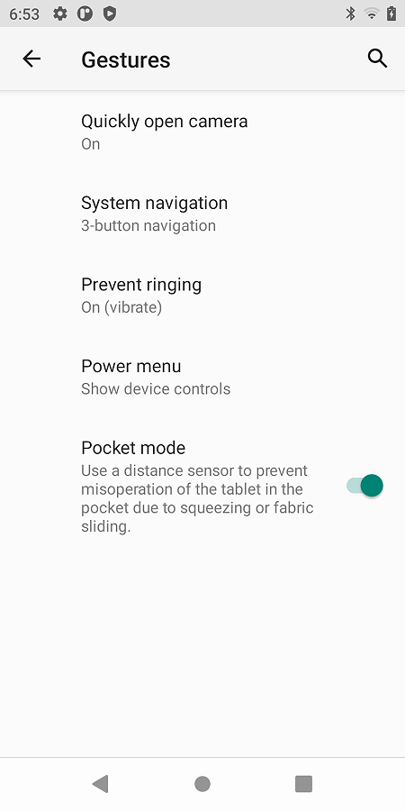
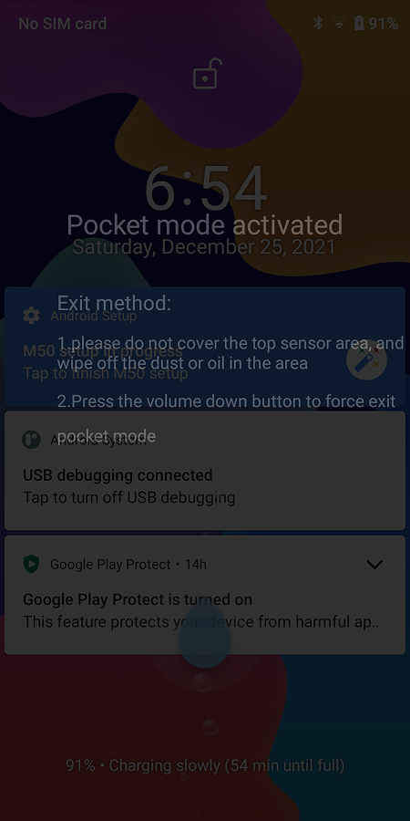
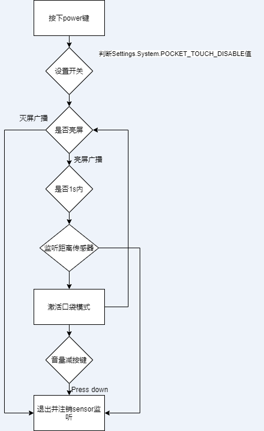

# 概述

本文主要讲解口袋模式功能实现。


## 参考

* [MT6763 N1 防误触模式的实现](https://blog.csdn.net/weixin_38363123/article/details/80110712?utm_medium=distribute.pc_relevant.none-task-blog-2~default~baidujs_title~default-0.no_search_link&spm=1001.2101.3001.4242)

* [Android中BroadCastReceiver使用-IntentFilter（整理）](https://blog.csdn.net/weixin_30596343/article/details/99801833?utm_medium=distribute.pc_relevant.none-task-blog-2~default~baidujs_title~default-0.no_search_link&spm=1001.2101.3001.4242.1&utm_relevant_index=3)

## 界面

```
[Summary]:
        1.口袋模式说明:当触发双击唤醒或power键解锁操作，根据距离传感器检测的
        数据判断为口袋，即弹出提示界面，用户无法进行点击，可通过音量减按键强行退出。
        2.打开开关:setting-system-gestures-Pocket mode。

[Test Plan]:
        1.打开Pocket mode开关，锁屏，将手机置于口袋，按power键或者双击唤醒，观察屏幕是否提示口袋模式已激活，
        检查此时是否可操作屏幕。
```

### 1.设置界面



### 2.功能界面



## 软件实现

###  1、新增Settings全局变量

* 1.新增setting string变量：

```diff
--- a/frameworks/base/core/java/android/provider/Settings.java
+++ b/frameworks/base/core/java/android/provider/Settings.java
@@ -3055,6 +3055,8 @@ public final class Settings {
         private static final ContentProviderHolder sProviderHolder =
                 new ContentProviderHolder(CONTENT_URI);
 
+		public static final String POCKET_TOUCH_DISABLE = "pocket_touch_disable";
+
         @UnsupportedAppUsage
         private static final NameValueCache sNameValueCache = new NameValueCache(
                 CONTENT_URI,
```

* 2.make update-api 后，自动更新此文件，检查确认正确后，跟代码一起提交即可。

```diff
--- a/frameworks/base/api/current.txt
+++ b/frameworks/base/api/current.txt
@@ -40815,6 +40815,7 @@ package android.provider {
     field @Deprecated public static final String PARENTAL_CONTROL_ENABLED = "parental_control_enabled";
     field @Deprecated public static final String PARENTAL_CONTROL_LAST_UPDATE = "parental_control_last_update";
     field @Deprecated public static final String PARENTAL_CONTROL_REDIRECT_URL = "parental_control_redirect_url";
+    field public static final String POCKET_TOUCH_DISABLE = "pocket_touch_disable";
     field @Deprecated public static final String RADIO_BLUETOOTH = "bluetooth";
     field @Deprecated public static final String RADIO_CELL = "cell";
     field @Deprecated public static final String RADIO_NFC = "nfc";

--- a/frameworks/base/non-updatable-api/current.txt
+++ b/frameworks/base/non-updatable-api/current.txt
@@ -38983,6 +38983,7 @@ package android.provider {
     field @Deprecated public static final String PARENTAL_CONTROL_ENABLED = "parental_control_enabled";
     field @Deprecated public static final String PARENTAL_CONTROL_LAST_UPDATE = "parental_control_last_update";
     field @Deprecated public static final String PARENTAL_CONTROL_REDIRECT_URL = "parental_control_redirect_url";
+    field public static final String POCKET_TOUCH_DISABLE = "pocket_touch_disable";
     field @Deprecated public static final String RADIO_BLUETOOTH = "bluetooth";
     field @Deprecated public static final String RADIO_CELL = "cell";
     field @Deprecated public static final String RADIO_NFC = "nfc";
```

### 2、新增Settings界面自定义SwitchPreference样式


* 1.新建SwitchPreference样式

```diff
--- a/vendor/mediatek/proprietary/packages/apps/MtkSettings/res/values-zh-rCN/strings.xml
+++ b/vendor/mediatek/proprietary/packages/apps/MtkSettings/res/values-zh-rCN/strings.xml
@@ -4965,8 +4965,13 @@
     <string name = "selet_chargemode">选择充电模式</string>
     <!-- [FEATURE]-Add-END by (qumy@paxsz.com), 2021/05/08 for add chargemode -->
 
-        <!-- DoubleTapScreen setting title [CHAR LIMIT=NONE] -->
+    <!-- DoubleTapScreen setting title [CHAR LIMIT=NONE] -->
     <string name="double_tap_awake_name"> 双击唤醒</string>
     <!-- DoubleTapScreen setting summary [CHAR LIMIT=NONE] -->
-    <string name="double_tap_awake_summary"> 双击唤醒状态</string>
+    <string name="double_tap_awake_summary">锁屏状态下的双击唤醒功能</string>
+
+	<!-- PocketMode setting title [CHAR LIMIT=NONE] -->
+    <string name="pocket_mode_name">口袋模式</string>
+     <!-- PocketMode setting summary [CHAR LIMIT=NONE] -->
+    <string name="pocket_mode_summary">利用距离感应器，防止手机在口袋中由于挤压或织物滑动引起的误操作</string>
 </resources>
diff --git a/vendor/mediatek/proprietary/packages/apps/MtkSettings/res/values/strings.xml b/vendor/mediatek/proprietary/packages/apps/MtkSettings/res/values/strings.xml
index 978ad3c222a..1e78456d57c 100755
--- a/vendor/mediatek/proprietary/packages/apps/MtkSettings/res/values/strings.xml
+++ b/vendor/mediatek/proprietary/packages/apps/MtkSettings/res/values/strings.xml
@@ -12147,11 +12147,16 @@
     <string name="cards_passes_setting_subtitle">To access things like your payment methods and boarding passes, press and hold the Power button.</string>
 
  	<!-- DoubleTapScreen setting title [CHAR LIMIT=NONE] -->
-    <string name="double_tap_awake_name">Double Tap Screen</string>
+    <string name="double_tap_awake_name">Double tap screen</string>
     
      <!-- DoubleTapScreen setting summary [CHAR LIMIT=NONE] -->
-    <string name="double_tap_awake_summary">Double Tap Screen status</string>
+    <string name="double_tap_awake_summary">Double-tap wake-up function in locked screen state</string>
 
+     <!-- PocketMode setting title [CHAR LIMIT=NONE] -->
+    <string name="pocket_mode_name">Pocket mode</string>
+
+     <!-- PocketMode setting summary [CHAR LIMIT=NONE] -->
+    <string name="pocket_mode_summary">Use a distance sensor to prevent misoperation of the tablet in the pocket due to squeezing or fabric sliding.</string>
 
     <!-- Title for RTT setting. [CHAR LIMIT=NONE] -->
     <string name="rtt_settings_title"></string>
diff --git a/vendor/mediatek/proprietary/packages/apps/MtkSettings/res/xml/gestures.xml b/vendor/mediatek/proprietary/packages/apps/MtkSettings/res/xml/gestures.xml
index 3f3404630c1..5a9145595e5 100755
--- a/vendor/mediatek/proprietary/packages/apps/MtkSettings/res/xml/gestures.xml
+++ b/vendor/mediatek/proprietary/packages/apps/MtkSettings/res/xml/gestures.xml
@@ -92,4 +92,11 @@
         android:summary="@string/double_tap_awake_summary"
         settings:searchable="true"
         settings:controller="com.android.settings.gestures.PaxDoubleTapAwakeGesturePreferenceController" />
+
+    <SwitchPreference
+        android:key="pocket_mode"
+        android:title="@string/pocket_mode_name"
+        android:summary="@string/pocket_mode_summary"
+        settings:searchable="true"
+        settings:controller="com.android.settings.gestures.PaxPocketModePreferenceController" />
 </PreferenceScreen>

--- a/vendor/mediatek/proprietary/packages/apps/MtkSettings/src/com/android/settings/gestures/GesturesSettingPreferenceController.java
+++ b/vendor/mediatek/proprietary/packages/apps/MtkSettings/src/com/android/settings/gestures/GesturesSettingPreferenceController.java
@@ -82,6 +82,7 @@ public class GesturesSettingPreferenceController extends BasePreferenceControlle
                 .setConfig(ambientDisplayConfiguration));
         controllers.add(new PreventRingingParentPreferenceController(context, FAKE_PREF_KEY));
 		controllers.add(new PaxDoubleTapAwakeGesturePreferenceController(context));
+		controllers.add(new PaxPocketModePreferenceController(context));
         return controllers;
     }
```

* 2.新增Settings界面Controller，这里点击界面开关`Pocket mode`后，将设置全局变量`Settings.System.POCKET_TOUCH_DISABLE`的值为1或者0，例子如下：

```log
PAYTABLETM8:/ # dumpsys settings | grep pocket_touch_disable
_id:30 name:pocket_touch_disable pkg:android value:1 default:1 defaultSystemSet:true

PAYTABLETM8:/ # dumpsys settings | grep pocket_touch_disable
_id:77 name:pocket_touch_disable pkg:com.android.settings value:0 default:0 defaultSystemSet:true
1970-01-06 19:19:28 update pocket_touch_disable
```

* 代码如下： 

```java
/*
 * Copyright (C) 2016 The Android Open Source Project
 *
 * Licensed under the Apache License, Version 2.0 (the "License");
 * you may not use this file except in compliance with the License.
 * You may obtain a copy of the License at
 *
 *      http://www.apache.org/licenses/LICENSE-2.0
 *
 * Unless required by applicable law or agreed to in writing, software
 * distributed under the License is distributed on an "AS IS" BASIS,
 * WITHOUT WARRANTIES OR CONDITIONS OF ANY KIND, either express or implied.
 * See the License for the specific language governing permissions and
 * limitations under the License.
 */
package com.android.settings.gestures;


import android.content.Context;
import android.provider.Settings;

import androidx.preference.Preference;
import androidx.preference.SwitchPreference;
import com.android.settingslib.Utils;
import com.android.settings.core.BasePreferenceController;

import android.util.Log;
import java.io.IOException;
import android.os.SystemProperties;


public class PaxPocketModePreferenceController extends BasePreferenceController
	implements Preference.OnPreferenceChangeListener{

    private static final String KEY_POCKET_MODE = "pocket_mode";
    private static final String TAG = "PaxPocketModePreferenceController";

    public PaxPocketModePreferenceController(Context context) {
        super(context,KEY_POCKET_MODE);
		Log.d(TAG,"start");
    }

    @Override
    public String getPreferenceKey() {
        return KEY_POCKET_MODE;
    }

    @Override
    public void updateState(Preference preference) {
	 Log.d(TAG,"updateState");
        if (!(preference instanceof SwitchPreference)) {
            return;
        }
        ((SwitchPreference) preference).setChecked(isProximityScreenEnabled());
    }

	  boolean isProximityScreenEnabled() {
        return Settings.System.getInt(mContext.getContentResolver(),
                Settings.System.POCKET_TOUCH_DISABLE,
                0) == 1;
	  }


     @Override
    public boolean onPreferenceChange(Preference preference, Object newValue) {
		Log.d(TAG,"onPreferenceChange");
        boolean powerEnabled = (Boolean) newValue;
		Log.d(TAG,"onPreferenceChange powerEnabled = "+powerEnabled);
        try{
            if(powerEnabled){
				Settings.System.putInt(mContext.getContentResolver(),
			Settings.System.POCKET_TOUCH_DISABLE,1);
            }
            else {
				Settings.System.putInt(mContext.getContentResolver(),
			Settings.System.POCKET_TOUCH_DISABLE,0);
            }
        }catch (Exception e) {
            e.printStackTrace();
        }

        return true;
    }

    public int getAvailabilityStatus(){
        return AVAILABLE;
    }
}
```

* 3.开关默认值设定，首先创建一个int型资源，比如下面就是默认打开。

```diff
--- a/paxdroid/frameworks/base/core/res/res/values/config.xml
+++ b/paxdroid/frameworks/base/core/res/res/values/config.xml
@@ -41,5 +41,8 @@
     <!-- paxsz@ 2019.10.17 def control device reboot every 24 hours -->
     <integer name="def_reboot_every_24_hours" translatable="false">0</integer>

+    <!-- defualt pocket mode value -->
+    <integer name="def_pax_pocket_mode_enabled">1</integer>
+
     <string name="def_use_pax_theme" translatable="false">TRUE</string>
 </resources>
diff --git a/paxdroid/frameworks/base/core/res/res/values/symbols.xml b/paxdroid/frameworks/base/core/res/res/values/symbols.xml
index 2bb5409d957..5945d534847 100755
--- a/paxdroid/frameworks/base/core/res/res/values/symbols.xml
+++ b/paxdroid/frameworks/base/core/res/res/values/symbols.xml
@@ -38,4 +38,6 @@

     <java-symbol type="string" name="def_use_pax_theme" />

+    <java-symbol type="integer" name="def_pax_pocket_mode_enabled" />
+
```

* `paxdroid/frameworks/base/core/java/android/provider/PaxSettings.java`然后load该资源，并初始化`Settings.System.POCKET_TOUCH_DISABLE`变量值:

```diff
--- a/paxdroid/frameworks/base/core/java/android/provider/PaxSettings.java
+++ b/paxdroid/frameworks/base/core/java/android/provider/PaxSettings.java
@@ -207,7 +207,10 @@ public final class PaxSettings {
                 loadStringSetting(stmt, PaxSettings.System.USE_PAX_THEME,
                         R.string.def_use_pax_theme);
                 //[FEATURE]-Add-END
-
+                //[FEATURE]-Add-BEGIN by (wugangnan@paxsz.com), 2021/12/07,for default pocket mode enabled
+                loadIntegerSetting(stmt, Settings.System.POCKET_TOUCH_DISABLE,
+                    R.integer.def_pax_pocket_mode_enabled);
+                //[FEATURE]-Add-END
```

### 3.新增口袋模式view

* 1.新建一个view。


```diff
diff --git a/frameworks/base/core/res/res/layout/pocket_touch_disable.xml b/frameworks/base/core/res/res/layout/pocket_touch_disable.xml
new file mode 100755
index 00000000000..7a9af472af4
--- /dev/null
+++ b/frameworks/base/core/res/res/layout/pocket_touch_disable.xml
@@ -0,0 +1,43 @@
+<?xml version="1.0" encoding="utf-8"?>
+<LinearLayout xmlns:android="http://schemas.android.com/apk/res/android"
+    android:layout_width="match_parent"
+    android:layout_height="2160px"
+    android:background="#cc000000"
+    android:orientation="vertical">
+
+    <TextView
+    android:layout_marginTop="360px"
+    android:layout_width="wrap_content"
+    android:layout_height="wrap_content"
+    android:layout_gravity="center_horizontal"
+    android:text="@string/oos_ptd_title"
+    android:textColor="#4cffffff"
+    android:textSize="48px" />
+
+    <TextView
+    android:layout_width="wrap_content"
+    android:layout_height="wrap_content"
+    android:paddingTop="80px"
+    android:text="@string/oos_ptd_exit_mode"
+    android:textColor="#4cffffff"
+    android:layout_marginLeft="100px"
+    android:textSize="36px" />
+    <TextView
+    android:layout_width="wrap_content"
+    android:layout_height="wrap_content"
+    android:paddingTop="26px"
+    android:textSize="30px"
+    android:textColor="#4cffffff"
+    android:layout_marginLeft="100px"
+    android:text="@string/oos_ptd_notice1"
+    />
+   <TextView
+    android:layout_width="wrap_content"
+    android:layout_height="wrap_content"
+    android:paddingTop="26px"
+    android:textSize="30px"
+    android:textColor="#4cffffff"
+    android:layout_marginLeft="100px"
+    android:text="@string/oos_ptd_notice2"
+    android:lineSpacingExtra="26px"/>
+</LinearLayout>

增加layout
--- a/frameworks/base/core/res/res/values/symbols.xml
+++ b/frameworks/base/core/res/res/values/symbols.xml
@@ -4052,4 +4052,5 @@
   <java-symbol type="string" name="config_pdp_reject_multi_conn_to_same_pdn_not_allowed" />
 
   <java-symbol type="array" name="config_notificationMsgPkgsAllowedAsConvos" />
+  <java-symbol type="layout" name="pocket_touch_disable" />
 </resources>
```

### 3.PhoneWindowManager增加具体功能实现

* 1.增加sensor类。

```diff
--- a/frameworks/base/services/core/java/com/android/server/policy/PhoneWindowManager.java
+++ b/frameworks/base/services/core/java/com/android/server/policy/PhoneWindowManager.java
@@ -233,6 +233,17 @@ import java.util.List;
 import android.content.ComponentName;
 import java.util.Queue;
 import java.util.concurrent.LinkedBlockingQueue;
+
+//[NEW FEATURE]-BEGIN by wugangnan@paxsz.com 2021-10-02, for Pocket mode
+import android.hardware.Sensor;
+import android.hardware.SensorEvent;
+import android.hardware.SensorEventListener;
+import android.hardware.SensorManager;
+import android.graphics.PixelFormat;
+import android.view.Gravity;
+//[NEW FEATURE]-END by wugangnan@paxsz.com 2021-10-02, for Pocket mode
```

* 2.增加各种接口，解释如下：

```java
	//[NEW FEATURE]-BEGIN by wugangnan@paxsz.com 2021-10-02, for Pocket mode
	private static final long ALS_PS_DELAY = 1000;

	private boolean mProximitySensorEnabled;
	private boolean mProximityScreenShown;
	private long mScreenOnTime;

	private SensorManager mSensorManager;
	private Sensor mProximitySensor;
	private View mProximityView;
	private WindowManager.LayoutParams mProximityParams;

        1.读取Settings.System.POCKET_TOUCH_DISABLE变量，判断设置开关是否打开
	boolean isProximityScreenEnabled() {   
		Log.i(TAG, "isProximityScreenEnabled.");
		return Settings.System.getInt(mContext.getContentResolver(),
				Settings.System.POCKET_TOUCH_DISABLE,
				0) == 1;
	}

        2.传参ture，注册距离传感器监听，否则注销和隐藏口袋模式界面。
	private void setProximitySensorEnabled(boolean enable) {
		Log.i(TAG, "setProximitySensorEnabled." + enable);
		if (enable) {
			if (!mProximitySensorEnabled) {
				mProximitySensorEnabled = true;
				mSensorManager.registerListener(mProximitySensorListener, mProximitySensor,
						SensorManager.SENSOR_DELAY_UI, mHandler);
				mScreenOnTime = SystemClock.uptimeMillis();
			}
		} else {
			if (mProximitySensorEnabled) {
				mProximitySensorEnabled = false;
				hideProximityScreen();
				mSensorManager.unregisterListener(mProximitySensorListener);
			}
		}
	}

        3.显示口袋模式界面
	private void showProximityScreen() {
		Log.i(TAG, "showProximityScreen." + mProximityScreenShown);
		if (!mProximityScreenShown) {
			if (mProximityView == null) {
				mProximityView = View.inflate(mContext,
						com.android.internal.R.layout.pocket_touch_disable, null);
				mProximityView.setSystemUiVisibility(View.STATUS_BAR_DISABLE_EXPAND);
				mProximityView.setFocusable(true);
				mProximityView.setFocusableInTouchMode(true);
				View.OnKeyListener listener = new View.OnKeyListener() {
					public boolean onKey(View v, int keyCode, KeyEvent event) {
						// capture all key event
						return true;
					}
				};
				mProximityView.setOnKeyListener(listener);

				mProximityParams = new WindowManager.LayoutParams(
						WindowManager.LayoutParams.MATCH_PARENT,
						WindowManager.LayoutParams.MATCH_PARENT);
				mProximityParams.type = WindowManager.LayoutParams.TYPE_BOOT_PROGRESS;
				mProximityParams.flags = WindowManager.LayoutParams.FLAG_FULLSCREEN
					| WindowManager.LayoutParams.FLAG_LAYOUT_IN_SCREEN | WindowManager.LayoutParams.FLAG_LAYOUT_NO_LIMITS | WindowManager.LayoutParams.FLAG_NOT_FOCUSABLE;


				mProximityParams.format = PixelFormat.TRANSLUCENT;
				mProximityParams.gravity = Gravity.END | Gravity.TOP;
				mProximityParams.setTitle("PTD view");
				//mProximityParams.x = getResources().getDisplayMetrics().widthPixels/2;
				//mProximityParams.y = 100;
			}
			WindowManager wm = (WindowManager) mContext.getSystemService(Context.WINDOW_SERVICE);
			wm.addView(mProximityView, mProximityParams);

			mProximityScreenShown = true;
			mHandler.removeCallbacks(mPsRunnable);
		}
	}

        4.隐藏口袋模式界面
	private void hideProximityScreen() {
		Log.i(TAG, "hideProximityScreen.");
		if (mProximityScreenShown) {
			WindowManager wm = (WindowManager) mContext.getSystemService(Context.WINDOW_SERVICE);
			wm.removeView(mProximityView);
			mProximityView = null;
			mProximityParams = null;
			mProximityScreenShown = false;
		}
	}

        5.Runnable定时器，亮屏后延时1s启动，也就是说口袋模式有效时间为亮屏后1s。
	public Runnable mPsRunnable = new Runnable() {
		@Override
			public void run() {
				setProximitySensorEnabled(false);
			}
	};

        6.距离传感器监听函数，检测到手靠近则激活口袋模式
	private final SensorEventListener mProximitySensorListener = new SensorEventListener() {
		 @Override
			 public void onSensorChanged(SensorEvent event) {
				 boolean isNear = event.values[0] == 0.0f;
				 long time = SystemClock.uptimeMillis();

				 Log.i(TAG, "mProximitySensorListener." + mProximityScreenShown);
				 if (!mProximityScreenShown) {
					 if (isNear) {
						 showProximityScreen();
					 }
				 } else {
					 if (!isNear) {
						 setProximitySensorEnabled(false);
					 }
				 }
			 }

		 @Override
			 public void onAccuracyChanged(Sensor sensor, int accuracy) {
				 // Not used.
			 }
	};

        7.激活口袋模式后，音量减按下则隐藏画面，注销监听。
	private void ProximityScreenVolumeDownKeyTriggered(){
		if (mScreenshotChordVolumeDownKeyTriggered && !mA11yShortcutChordVolumeUpKeyTriggered) {
			if (mProximityScreenShown) {
				setProximitySensorEnabled(false);
			}
		}
	}
	//[NEW FEATURE]-END by wugangnan@paxsz.com 2021-10-02, for Pocket mode
```

* 2.新增sensor监听

```java
@Override
public void init(Context context, IWindowManager windowManager,
        WindowManagerFuncs windowManagerFuncs) {
                1.获取ProximitySensor实时数据。
                //[NEW FEATURE]-BEGIN by wugangnan@paxsz.com 2021-10-02, for Pocket mode read the value of the distance sensor
                mSensorManager = (SensorManager) context.getSystemService(Context.SENSOR_SERVICE);
                mProximitySensor = mSensorManager.getDefaultSensor(Sensor.TYPE_PROXIMITY);
                //[NEW FEATURE]-END by wugangnan@paxsz.com 2021-10-02, for Pocket mode read the value of the distance sensor

                2.注册一个广播接收器
                //[NEW FEATURE]-BEGIN by wugangnan@paxsz.com 2021-10-02, for Pocket mode register a broadcast when screen is on or off
                IntentFilter turningOnScreenfilter = new IntentFilter(); 
                turningOnScreenfilter.addAction(Intent.ACTION_SCREEN_OFF); //为BroadcastReceiver指定action，使之用于接收同action的广播
                turningOnScreenfilter.addAction(Intent.ACTION_SCREEN_ON);
                context.registerReceiver(mBatInfoReceiver, turningOnScreenfilter);
		 //[NEW FEATURE]-END by wugangnan@paxsz.com 2021-10-02, for Pocket mode register a broadcast when screen is on or off
        }

重写广播onReceive方法，监听亮灭屏：
//[NEW FEATURE]-BEGIN by wugangnan@paxsz.com 2021-10-02, for Pocket mode receive broadcast when screen is on or off
    BroadcastReceiver mBatInfoReceiver = new BroadcastReceiver() {
        @Override
            public void onReceive(final Context context, final Intent intent) {
                final String action = intent.getAction();
                1.亮屏时，首先判断开关是否打开。
                if(Intent.ACTION_SCREEN_ON.equals(action)){
                    if (isProximityScreenEnabled()) {
                        setProximitySensorEnabled(true);  2.注册距离传感器监听
                        mHandler.postDelayed(mPsRunnable, ALS_PS_DELAY); 3.延时1秒后调用此Runnable对象
                    }
                }else if(Intent.ACTION_SCREEN_OFF.equals(action)){
                    if (isProximityScreenEnabled()) setProximitySensorEnabled(false);

                }
            }
	};
	//[NEW FEATURE]-END by wugangnan@paxsz.com 2021-10-02, for Pocket mode receive broadcast when screen is on or off
```

* 3.增加音量减按键退出功能

```java
private void ProximityScreenVolumeDownKeyTriggered(){
        if (mScreenshotChordVolumeDownKeyTriggered && !mA11yShortcutChordVolumeUpKeyTriggered) {
                if (mProximityScreenShown) {
                        setProximitySensorEnabled(false); 音量减按下则隐藏画面，注销监听。
                }
        }
}

    @Override
    public int interceptKeyBeforeQueueing(KeyEvent event, int policyFlags) {

        // Handle special keys.
        switch (keyCode) {
          case KeyEvent.KEYCODE_VOLUME_MUTE: {
                if (keyCode == KeyEvent.KEYCODE_VOLUME_DOWN) {
                    if (down) {
                        // Any activity on the vol down button stops the ringer toggle shortcut
                        cancelPendingRingerToggleChordAction();

                        if (interactive && !mScreenshotChordVolumeDownKeyTriggered
                                && (event.getFlags() & KeyEvent.FLAG_FALLBACK) == 0) {
                            mScreenshotChordVolumeDownKeyTriggered = true;
                            mScreenshotChordVolumeDownKeyTime = event.getDownTime();
                            mScreenshotChordVolumeDownKeyConsumed = false;
                            //[NEW FEATURE]-BEGIN by wugangnan@paxsz.com 2021-10-02, for Pocket mode
                            ProximityScreenVolumeDownKeyTriggered();
                            //[NEW FEATURE]-END by wugangnan@paxsz.com 2021-10-02, for Pocket mode
                            cancelPendingPowerKeyAction();
                            interceptScreenshotChord();
                            interceptAccessibilityShortcutChord();
                        }
        }
    }
```

### 4.整体程序流程

* 软件流程如下：

```
* context.registerReceiver(mBatInfoReceiver, turningOnScreenfilter);  注册亮灭屏广播监听
  ├── onReceive(final Context context, final Intent intent) { 重写onReceive方法
  ├── if(Intent.ACTION_SCREEN_ON.equals(action)){   亮屏
  ├── if (isProximityScreenEnabled()) {  判断设置开关是否打开
  ├── setProximitySensorEnabled(true);  注册距离传感器监听
  │   └── mProximitySensorListener = new SensorEventListener() 距离传感器监听
  │       ├── isNear = event.values[0] == 0.0f; 读取距离数据
  │       └── if (!mProximityScreenShown) { //未显示口袋模式界面
  │           ├── if (isNear) { 触发近距
  │           │   └── showProximityScreen(); 显示口袋模式界面
  │           │       ├── mProximityScreenShown = true; 设置显示flag为ture
  │           │       └── mHandler.removeCallbacks(mPsRunnable); 关闭定时器
  │           └── if (!isNear) { 
  │               └── setProximitySensorEnabled(false); 注销距感监听
  │                   ├── mSensorManager.unregisterListener(mProximitySensorListener); 注销距感监听
  │                   └── hideProximityScreen(); 隐藏口袋模式界面
  └── else if(Intent.ACTION_SCREEN_OFF.equals(action)){  灭屏
      └── if (isProximityScreenEnabled())
          └── setProximitySensorEnabled(false);   注销距感监听，隐藏口袋模式界面
```

* 流程图如下：

