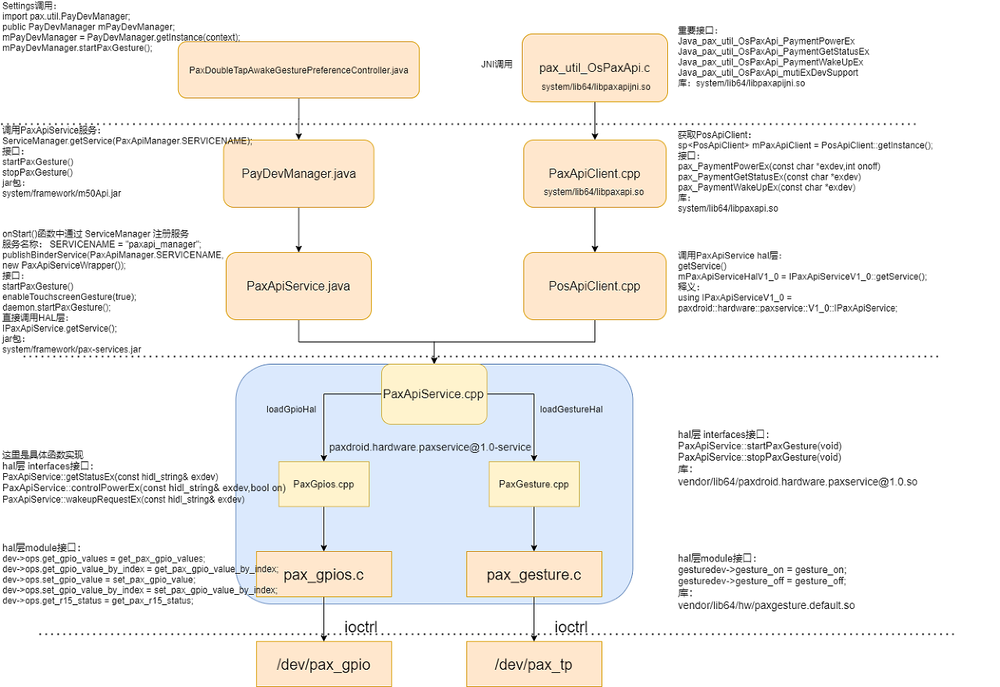

# 概述
介绍PaxApiService架构

## 参考

* [Android中AIDL的使用详解](https://www.jianshu.com/p/d1fac6ccee98)

* [Android HIDL HAL 接口定义语言详解](https://blog.csdn.net/qq_19923217/article/details/88398660)

* [Android P HAL层添加HIDL实例（详细实现步骤）](https://blog.csdn.net/sinat_18179367/article/details/95940030)

## 架构图



* 涉及文件：

```log
kernel层：
 kernel-4.19/touchscreen/ilitek_limv/ilitek_main.c     |  12 +-
 kernel-4.19/drivers/misc/pax/gpio/pax_gpio_control.c
 
jni层： 
 paxdroid/external/pax/jni/libpaxapijni/pax_util_OsPaxApi.c  |  12 +
 paxdroid/external/pax/jni/libpaxapijni/pax_util_OsPaxApi.h  |  17 +
 paxdroid/external/pax/lib/libpaxapiclient/paxapiclient.cpp  |  22 +
 paxdroid/external/pax/lib/libpaxapiclient/paxapiclient.h    |   2 +
 
java服务层：
 paxdroid/frameworks/base/core/java/pax/util/IPaxApi.aidl      |   4 +-
 paxdroid/frameworks/base/m50api/java/pax/util/PayDevManager.java   |  91 ++
 paxdroid/frameworks/base/services/core/java/com/android/server/PaxApiService.java     |  34 +
 
hal层(gpio驱动类似)：
 paxdroid/device/paxdroid_mt6762.mk            |   1 +
 paxdroid/device/paxdroid_mt6762_vnd.mk        |   1 +
 paxdroid/device/sepolicy/vendor/file_contexts |   1 +
 paxdroid/hardware/interfaces/current.txt      |   2 +-
 paxdroid/hardware/interfaces/paxservice/1.0/IPaxApiService.hal         |   5 +
 paxdroid/hardware/interfaces/paxservice/1.0/default/PaxApiService.cpp  |   5 +
 paxdroid/hardware/interfaces/paxservice/1.0/default/PaxApiService.h    |   3 +
 paxdroid/hardware/interfaces/paxservice/1.0/default/gesture/PaxGesture.cpp        | 103 ++
 paxdroid/hardware/interfaces/paxservice/1.0/default/gesture/PaxGesture.h          |  11 +
 paxdroid/hardware/interfaces/paxservice/1.0/default/axdroid.hardware.paxservice@1.0-service.rc |   3 +
 paxdroid/hardware/libhardware/include/hardware/pax_gesture.h            |  82 ++
 paxdroid/hardware/libhardware/modules/gesture/pax_gesture.c | 180 ++++
```

## 增加双击唤醒功能

tp需要增加双击唤醒功能开关，功能已经在驱动层实现，现在需要增加hal接口及设置界面。

### 1.kernel层ioctrl接口

* `kernel-4.19/drivers/input/touchscreen/ilitek_limv/ilitek_platform_init.c`将生产/dev/pax_tp节点:

```diff
+#include <linux/miscdevice.h>
+
 struct ilitek_ts_data *ilitek_data;
 /*
    Data struct init. When the driver will be setup, the driver initial the data struct.
    If the memory alloc fail the function will return -ENOMEM.
    The log level be set ILITEK_DEFAULT_LOG_LEVEL.
  */
+
+static int tp_open(struct inode *inode, struct file *file)
+{
+	return 0;
+}
+
+static int tp_release(struct inode *inode, struct file *file)
+{
+	return 0;
+}
+
+static long tp_ioctl(struct file *file, unsigned int cmd,
+				unsigned long arg)
+{
+	void __user *user_data = (void __user *)arg;
+	int ret = 0;
+	int en = 1;
+
+	switch (cmd) {
+		case SET_GESTURE_ONOFF:
+			ret = copy_from_user(&en, user_data, sizeof(int));
+			if (ret < 0) {
+				pr_info("SET_GESTURE_ONOFF.\n");
+				ret = -1;
+				break;
+			}
+
+			pr_info("SET_GESTURE_ONOFF: %d\n", en);
+			ilitek_data->enable_gesture = en;
+			break;
+		case SET_DEFAULT:
+			ret = copy_from_user(&en, user_data, sizeof(int));
+			if (ret < 0) {
+				pr_info("SET_DEFAULT.\n");
+				ret = -1;
+				break;
+			}
+			pr_info("SET_DEFAULT: %d\n", en);
+			//tp_chg_vote(NC_DISABLE_CHG_BY_USER, !en);
+			break;
+		default:
+			pr_info("cmd: %u is not support.\n", cmd);
+			ret = -1;
+			break;
+	}
+
+	return ret;
+}
+
+#ifdef CONFIG_COMPAT
+static long tp_compat_ioctl(struct file *file,
+			unsigned int cmd, unsigned long arg)
+{
+	return tp_ioctl(file, cmd, arg);
+}
+#endif
+
+static const struct file_operations tp_fops = {
+	.owner = THIS_MODULE,
+	.open = tp_open,
+	.release = tp_release,
+	.unlocked_ioctl = tp_ioctl,
+#ifdef CONFIG_COMPAT
+	.compat_ioctl = tp_compat_ioctl,
+#endif
+};
+
+static struct miscdevice tp_miscdev = {
+	.minor      = MISC_DYNAMIC_MINOR,
+	.name		= ILITEK_TS_NAME,
+	.fops		= &tp_fops,
+};
+
+
 int ilitek_data_init(void) {
 	ilitek_data = kzalloc(sizeof(*ilitek_data), GFP_KERNEL);
 	if (ilitek_data == NULL) {
@@ -135,6 +211,8 @@ static struct i2c_driver tpd_i2c_driver = {
 	.detect = tpd_detect,
 };
 
+
+
 static int tpd_local_init(void)
 {
 	tp_log_info("TPD init device driver\n");
@@ -153,6 +231,7 @@ static int tpd_local_init(void)
 		tpd_button_setting(tpd_dts_data.tpd_key_num, tpd_dts_data.tpd_key_local, tpd_dts_data.tpd_key_dim_local);
 
 	tpd_type_cap = 1;
+	
 	tp_log_info("TPD init done\n");
 	return TPD_OK;
 }
@@ -403,6 +482,8 @@ static int __init ilitek_touch_driver_init(void)
 		i2c_del_driver(&ilitek_touch_device_driver);
 		return -ENODEV;
 	}
+
+	misc_register(&tp_miscdev);
```
### 2.新增HAL层Interface及module

```diff
1.增加包：
--- a/paxdroid/device/paxdroid_mt6762.mk
+++ b/paxdroid/device/paxdroid_mt6762.mk
@@ -98,6 +98,7 @@ USE_PAX_HELLO := AP
 #add by zengzp for paxservice
 PRODUCT_PACKAGES += \
     paxgpios.default \
+    paxgesture.default \

2.增加配置好的selinux节点属性：
--- a/paxdroid/device/sepolicy/vendor/file_contexts
+++ b/paxdroid/device/sepolicy/vendor/file_contexts
@@ -6,6 +6,7 @@
 /(vendor|system/vendor)/paxdroid(/.*)?     u:object_r:vendor_configs_file:s0
 
 /dev/pax_gpios                             u:object_r:pax_chr_device:s0
+/dev/ilitek_ts                             u:object_r:pax_chr_device:s0

3.增加hal层interface及module接口，涉及文件：
 paxdroid/hardware/interfaces/current.txt      |   2 +-
 paxdroid/hardware/interfaces/paxservice/1.0/IPaxApiService.hal         |   5 +
 paxdroid/hardware/interfaces/paxservice/1.0/default/PaxApiService.cpp  |   5 +
 paxdroid/hardware/interfaces/paxservice/1.0/default/PaxApiService.h    |   3 +
 paxdroid/hardware/interfaces/paxservice/1.0/default/gesture/PaxGesture.cpp        | 103 ++
 paxdroid/hardware/interfaces/paxservice/1.0/default/gesture/PaxGesture.h          |  11 +
 paxdroid/hardware/interfaces/paxservice/1.0/default/axdroid.hardware.paxservice@1.0-service.rc |   3 +
 paxdroid/hardware/libhardware/include/hardware/pax_gesture.h            |  82 ++
 paxdroid/hardware/libhardware/modules/gesture/pax_gesture.c | 180 ++++
 
 详细写一个ioctrl实现：
 +++ b/paxdroid/hardware/libhardware/modules/gesture/pax_gesture.c
@@ -0,0 +1,180 @@
+/*
+ * Copyright (C) 2013 The Android Open Source Project
+ *
+ * Licensed under the Apache License, Version 2.0 (the "License");
+ * you may not use this file except in compliance with the License.
+ * You may obtain a copy of the License at
+ *
+ *      http://www.apache.org/licenses/LICENSE-2.0
+ *
+ * Unless required by applicable law or agreed to in writing, software
+ * distributed under the License is distributed on an "AS IS" BASIS,
+ * WITHOUT WARRANTIES OR CONDITIONS OF ANY KIND, either express or implied.
+ * See the License for the specific language governing permissions and
+ * limitations under the License.
+ */
+
+#include <hardware/hardware.h>
+#include <hardware/pax_gesture.h>
+
+#include <stdio.h>
+#include <stdlib.h>
+#include <sys/types.h>
+#include <unistd.h>
+#include <sys/stat.h>
+#include <unistd.h>
+#include <errno.h>
+#include <fcntl.h>
+#include <malloc.h>
+#include <stdint.h>
+#include <dirent.h>
+#include <string.h>
+#include <pthread.h>
+#include <time.h>
+#include <stdlib.h>
+#include <log/log.h>
+
+#define TIMEOUT_STR_LEN         20
+#define LOG_NDEBUG 0
+#define LOG_TAG "pax_gesture_hal"
+static pthread_once_t g_init = PTHREAD_ONCE_INIT;
+static pthread_mutex_t g_lock = PTHREAD_MUTEX_INITIALIZER;
+
+#define PAX_TP_DEV			"/dev/ilitek_ts"
+
+/**
+ * device methods
+ */
+
+void init_globals(void)
+{
+    // init the mutex
+    pthread_mutex_init(&g_lock, NULL);
+}
+
+static bool device_exists(const char *file) {
+    int fd;
+
+    fd = open(file, O_RDWR);
+    if(fd < 0) {
+        return false;
+    }
+
+    close(fd);
+    return true;
+}
+
+static bool gesture_exists() {
+    return device_exists(PAX_TP_DEV);
+}
+
+static int open_pax_tp_dev(void)
+{
+	int fd = -1;
+
+	fd = open(PAX_TP_DEV, O_RDWR);
+
+	return fd;
+}
+
+static int pax_tp_ctl( unsigned long cmd, void *data)
+{
+	static int pax_tp_fd = -1;
+	int ret = -1;
+
+
+	if (pax_tp_fd < 0) {
+		pax_tp_fd = open_pax_tp_dev();
+
+		if (pax_tp_fd < 0) {
+			return -ENODEV;
+		}
+	}
+
+    pthread_mutex_lock(&g_lock);
+
+	switch(cmd) {
+		case SET_GESTURE_ONOFF:
+			{
+				int en = *(int *)data;
+				ret = ioctl(pax_tp_fd, cmd, &en);
+			}
+			break;
+		default:
+			break;
+	};
+
+    pthread_mutex_unlock(&g_lock);
+
+	return ret;
+}
+
+static int gesture_on(void)
+{
+	int en = 1;
+    return pax_tp_ctl( SET_GESTURE_ONOFF, &en);
+ 
+}
+
+static int gesture_off(void)
+{
+   	int en = 0;
+    return pax_tp_ctl( SET_GESTURE_ONOFF, &en);
+}
+
+static int gesture_close(hw_device_t *device)
+{
+    free(device);
+    return 0;
+}
+
+static int gesture_open(const hw_module_t* module, const char* id __unused,
+                      hw_device_t** device __unused) {
+
+    if (gesture_exists()) {
+        ALOGD("touchscreen gesture sys file exist");
+    }else {
+        ALOGE("touchscreen gesture sys file not exis. Cannot start gesture");
+        return -ENODEV;
+    }
+
+	pthread_once(&g_init, init_globals);
+	
+    gesture_device_t *gesturedev = malloc(sizeof(gesture_device_t));
+    memset(gesturedev, 0, sizeof(gesture_device_t));
+	
+    if (!gesturedev) {
+        ALOGE("Can not allocate memory for the gesture device");
+        return -ENOMEM;
+    }
+
+    gesturedev->common.tag = HARDWARE_DEVICE_TAG;
+    gesturedev->common.module = (hw_module_t *) module;
+    gesturedev->common.version = HARDWARE_DEVICE_API_VERSION(1,0);
+    gesturedev->common.close = gesture_close;
+
+	gesturedev->gesture_on = gesture_on;
+	gesturedev->gesture_off = gesture_off;
+
+    *device = (hw_device_t *) gesturedev;
+
+    return 0;
+}
+
+/*===========================================================================*/
+/* Default gesture HW module interface definition                           */
+/*===========================================================================*/
+
+static struct hw_module_methods_t gesture_module_methods = {
+    .open = gesture_open,
+};
+
+struct hw_module_t HAL_MODULE_INFO_SYM = {
+    .tag = HARDWARE_MODULE_TAG,
+    .module_api_version = GESTURE_API_VERSION,
+    .hal_api_version = HARDWARE_HAL_API_VERSION,
+    .id = GESTURE_HARDWARE_MODULE_ID,
+    .name = "pax gesture HAL",
+    .author = "The Paxdroid Open Source Project",
+    .methods = &gesture_module_methods,
+};
```

### 3.增加PaxApiService接口及对外PayDevManager aidl接口

```log
涉及文件：
 paxdroid/frameworks/base/core/java/pax/util/IPaxApi.aidl      |   4 +-
 paxdroid/frameworks/base/m50api/java/pax/util/PayDevManager.java   |  91 ++
 paxdroid/frameworks/base/services/core/java/com/android/server/PaxApiService.java     |  34 +
```

### 4.双击唤醒功能添加

```diff
From 29fd100dbbd832db17b7e620a157a6f29a44e372 Mon Sep 17 00:00:00 2001
From: wugn <wugangnan@paxsz.com>
Date: Sun, 26 Sep 2021 18:00:54 +0800
Subject: [PATCH] =?UTF-8?q?[Title]:=20New=20Feature:=E5=A2=9E=E5=8A=A0?=
 =?UTF-8?q?=E5=8F=8C=E5=87=BB=E5=94=A4=E9=86=92hal=E5=B1=82=E3=80=81PaxApi?=
 =?UTF-8?q?=E6=8E=A5=E5=8F=A3=E3=80=82?=
MIME-Version: 1.0
Content-Type: text/plain; charset=UTF-8
Content-Transfer-Encoding: 8bit

[Summary]:
	1.增加双击唤醒hal层、PaxApi接口。

[Test Plan]:

[Module]: tp

[Model]: M8

[author]: wugangnan@paxsz.com

[date]: 2021-9-26
---
 .../touchscreen/ilitek_limv/ilitek_common.h   | 895 +++++++++---------
 .../touchscreen/ilitek_limv/ilitek_main.c     |  12 +-
 .../ilitek_limv/ilitek_platform_init.c        |  81 ++
 .../touchscreen/ilitek_limv/ilitek_tool.c     |  12 +-
 paxdroid/device/paxdroid_mt6762.mk            |   1 +
 paxdroid/device/paxdroid_mt6762_vnd.mk        |   1 +
 paxdroid/device/sepolicy/vendor/file_contexts |   1 +
 .../pax/jni/libpaxapijni/pax_util_OsPaxApi.c  |  12 +
 .../pax/jni/libpaxapijni/pax_util_OsPaxApi.h  |  17 +
 .../pax/lib/libpaxapiclient/paxapiclient.cpp  |  22 +
 .../pax/lib/libpaxapiclient/paxapiclient.h    |   2 +
 .../base/core/java/pax/util/IPaxApi.aidl      |   4 +-
 .../m50api/java/pax/util/PayDevManager.java   |  91 ++
 .../com/android/server/PaxApiService.java     |  34 +
 paxdroid/hardware/interfaces/current.txt      |   2 +-
 .../paxservice/1.0/IPaxApiService.hal         |   5 +
 .../paxservice/1.0/default/PaxApiService.cpp  |   5 +
 .../paxservice/1.0/default/PaxApiService.h    |   3 +
 .../1.0/default/gesture/PaxGesture.cpp        | 103 ++
 .../1.0/default/gesture/PaxGesture.h          |  11 +
 ...axdroid.hardware.paxservice@1.0-service.rc |   3 +
 .../include/hardware/pax_gesture.h            |  82 ++
 .../hardware/libhardware/modules/Android.mk   |   3 +-
 .../libhardware/modules/gesture/Android.mk    |  34 +
 .../libhardware/modules/gesture/pax_gesture.c | 180 ++++
 25 files changed, 1165 insertions(+), 451 deletions(-)
 create mode 100755 paxdroid/hardware/interfaces/paxservice/1.0/default/gesture/PaxGesture.cpp
 create mode 100755 paxdroid/hardware/interfaces/paxservice/1.0/default/gesture/PaxGesture.h
 create mode 100755 paxdroid/hardware/libhardware/include/hardware/pax_gesture.h
 create mode 100755 paxdroid/hardware/libhardware/modules/gesture/Android.mk
 create mode 100755 paxdroid/hardware/libhardware/modules/gesture/pax_gesture.c

diff --git a/kernel-4.19/drivers/input/touchscreen/ilitek_limv/ilitek_common.h b/kernel-4.19/drivers/input/touchscreen/ilitek_limv/ilitek_common.h
index e3dd0826388..33485cc701f 100755
--- a/kernel-4.19/drivers/input/touchscreen/ilitek_limv/ilitek_common.h
+++ b/kernel-4.19/drivers/input/touchscreen/ilitek_limv/ilitek_common.h
@@ -1,445 +1,450 @@

diff --git a/kernel-4.19/drivers/input/touchscreen/ilitek_limv/ilitek_main.c b/kernel-4.19/drivers/input/touchscreen/ilitek_limv/ilitek_main.c
index dea7d0f5115..2f51f8ee129 100755
--- a/kernel-4.19/drivers/input/touchscreen/ilitek_limv/ilitek_main.c
+++ b/kernel-4.19/drivers/input/touchscreen/ilitek_limv/ilitek_main.c
@@ -965,7 +965,9 @@ int ilitek_read_data_and_report_3XX(void)
 				tp_log_info("system is suspend not report point\n");
 #ifdef ILITEK_GESTURE
 #if ILITEK_GESTURE == ILITEK_DOUBLE_CLICK_WAKEUP
-				finger_state = ilitek_double_click_touch(x, y, finger_state, i);
+				if (ilitek_data->enable_gesture) {
+					finger_state = ilitek_double_click_touch(x, y, finger_state, i);
+				}
 #endif
 #endif
 			} else {
@@ -1028,6 +1030,7 @@ int ilitek_read_data_and_report_3XX(void)
 			input_sync(input);
 			//ilitek_data->system_suspend = false;
 #elif ILITEK_GESTURE == ILITEK_DOUBLE_CLICK_WAKEUP
+			if (ilitek_data->enable_gesture) {
 			finger_state = ilitek_double_click_release(finger_state);
 			if (finger_state == 5) {
 				tp_log_info("double click wakeup\n");
@@ -1041,6 +1044,7 @@ int ilitek_read_data_and_report_3XX(void)
 				input_sync(input);
 				//ilitek_data->system_suspend = false;
 			}
+			}
 #endif
 #endif
 		}
@@ -1151,7 +1155,9 @@ int ilitek_read_data_and_report_6XX(void) {
 				tp_log_info("system is suspend not report point\n");
 #ifdef ILITEK_GESTURE
 #if ILITEK_GESTURE == ILITEK_DOUBLE_CLICK_WAKEUP
-				finger_state = ilitek_double_click_touch(ilitek_data->tp[i].x, ilitek_data->tp[i].y, finger_state, i);
+				if (ilitek_data->enable_gesture) {
+					finger_state = ilitek_double_click_touch(ilitek_data->tp[i].x, ilitek_data->tp[i].y, finger_state, i);
+				}
 #endif
 #endif
 			}
@@ -1225,6 +1231,7 @@ int ilitek_read_data_and_report_6XX(void) {
 			input_sync(input);
 			//ilitek_data->system_suspend = false;
 #elif ILITEK_GESTURE == ILITEK_DOUBLE_CLICK_WAKEUP
+			if (ilitek_data->enable_gesture) {
 			finger_state = ilitek_double_click_release(finger_state);
 			if (finger_state == 5) {
 
@@ -1239,6 +1246,7 @@ int ilitek_read_data_and_report_6XX(void) {
 				input_sync(input);
 				//ilitek_data->system_suspend = false;
 			}
+			}
 #endif
 #endif
 		}
diff --git a/kernel-4.19/drivers/input/touchscreen/ilitek_limv/ilitek_platform_init.c b/kernel-4.19/drivers/input/touchscreen/ilitek_limv/ilitek_platform_init.c
index 2b4b5497eb2..25a3f963516 100755
--- a/kernel-4.19/drivers/input/touchscreen/ilitek_limv/ilitek_platform_init.c
+++ b/kernel-4.19/drivers/input/touchscreen/ilitek_limv/ilitek_platform_init.c
@@ -24,12 +24,88 @@
 
 #include "ilitek_ts.h"
 #include "ilitek_common.h"
+#include <linux/miscdevice.h>
+
 struct ilitek_ts_data *ilitek_data;
 /*
    Data struct init. When the driver will be setup, the driver initial the data struct.
    If the memory alloc fail the function will return -ENOMEM.
    The log level be set ILITEK_DEFAULT_LOG_LEVEL.
  */
+
+static int tp_open(struct inode *inode, struct file *file)
+{
+	return 0;
+}
+
+static int tp_release(struct inode *inode, struct file *file)
+{
+	return 0;
+}
+
+static long tp_ioctl(struct file *file, unsigned int cmd,
+				unsigned long arg)
+{
+	void __user *user_data = (void __user *)arg;
+	int ret = 0;
+	int en = 1;
+
+	switch (cmd) {
+		case SET_GESTURE_ONOFF:
+			ret = copy_from_user(&en, user_data, sizeof(int));
+			if (ret < 0) {
+				pr_info("SET_GESTURE_ONOFF.\n");
+				ret = -1;
+				break;
+			}
+
+			pr_info("SET_GESTURE_ONOFF: %d\n", en);
+			ilitek_data->enable_gesture = en;
+			break;
+		case SET_DEFAULT:
+			ret = copy_from_user(&en, user_data, sizeof(int));
+			if (ret < 0) {
+				pr_info("SET_DEFAULT.\n");
+				ret = -1;
+				break;
+			}
+			pr_info("SET_DEFAULT: %d\n", en);
+			//tp_chg_vote(NC_DISABLE_CHG_BY_USER, !en);
+			break;
+		default:
+			pr_info("cmd: %u is not support.\n", cmd);
+			ret = -1;
+			break;
+	}
+
+	return ret;
+}
+
+#ifdef CONFIG_COMPAT
+static long tp_compat_ioctl(struct file *file,
+			unsigned int cmd, unsigned long arg)
+{
+	return tp_ioctl(file, cmd, arg);
+}
+#endif
+
+static const struct file_operations tp_fops = {
+	.owner = THIS_MODULE,
+	.open = tp_open,
+	.release = tp_release,
+	.unlocked_ioctl = tp_ioctl,
+#ifdef CONFIG_COMPAT
+	.compat_ioctl = tp_compat_ioctl,
+#endif
+};
+
+static struct miscdevice tp_miscdev = {
+	.minor      = MISC_DYNAMIC_MINOR,
+	.name		= ILITEK_TS_NAME,
+	.fops		= &tp_fops,
+};
+
+
 int ilitek_data_init(void) {
 	ilitek_data = kzalloc(sizeof(*ilitek_data), GFP_KERNEL);
 	if (ilitek_data == NULL) {
@@ -135,6 +211,8 @@ static struct i2c_driver tpd_i2c_driver = {
 	.detect = tpd_detect,
 };
 
+
+
 static int tpd_local_init(void)
 {
 	tp_log_info("TPD init device driver\n");
@@ -153,6 +231,7 @@ static int tpd_local_init(void)
 		tpd_button_setting(tpd_dts_data.tpd_key_num, tpd_dts_data.tpd_key_local, tpd_dts_data.tpd_key_dim_local);
 
 	tpd_type_cap = 1;
+	
 	tp_log_info("TPD init done\n");
 	return TPD_OK;
 }
@@ -403,6 +482,8 @@ static int __init ilitek_touch_driver_init(void)
 		i2c_del_driver(&ilitek_touch_device_driver);
 		return -ENODEV;
 	}
+
+	misc_register(&tp_miscdev);
 	tp_log_info("add touch device driver i2c driver.\n");
 	return ret;
 }
diff --git a/kernel-4.19/drivers/input/touchscreen/ilitek_limv/ilitek_tool.c b/kernel-4.19/drivers/input/touchscreen/ilitek_limv/ilitek_tool.c
index 892b5ccd29c..0f5b1de60cc 100755
--- a/kernel-4.19/drivers/input/touchscreen/ilitek_limv/ilitek_tool.c
+++ b/kernel-4.19/drivers/input/touchscreen/ilitek_limv/ilitek_tool.c
@@ -1754,7 +1754,17 @@ static ssize_t ilitek_gesture_show(struct device *dev, struct device_attribute *
 
 static ssize_t ilitek_gesture_store(struct device *dev, struct device_attribute *attr, const char *buf, size_t size)
 {
-	if (buf[0])
+        unsigned int state;
+        ssize_t ret;
+        //struct usb_switch_data *data = dev_get_drvdata(dev->parent);
+
+        ret = kstrtouint(buf, 10, &state);
+        if (ret) {
+                pr_notice("set state fail\n");
+                return ret;
+        }
+
+	if (state)
 		ilitek_data->enable_gesture = true;
 	else
 		ilitek_data->enable_gesture = false;
diff --git a/paxdroid/device/paxdroid_mt6762.mk b/paxdroid/device/paxdroid_mt6762.mk
index c0268f7816b..e2dda6bb2e3 100755
--- a/paxdroid/device/paxdroid_mt6762.mk
+++ b/paxdroid/device/paxdroid_mt6762.mk
@@ -98,6 +98,7 @@ USE_PAX_HELLO := AP
 #add by zengzp for paxservice
 PRODUCT_PACKAGES += \
     paxgpios.default \
+    paxgesture.default \
     paxdroid.hardware.paxservice@1.0-service
 
 #add by zengzp for systool
diff --git a/paxdroid/device/paxdroid_mt6762_vnd.mk b/paxdroid/device/paxdroid_mt6762_vnd.mk
index 10284cd681b..ee48e23f15d 100755
--- a/paxdroid/device/paxdroid_mt6762_vnd.mk
+++ b/paxdroid/device/paxdroid_mt6762_vnd.mk
@@ -49,6 +49,7 @@ USE_PAX_HELLO := AP
 #add by zengzp for paxservice
 PRODUCT_PACKAGES += \
     paxgpios.default \
+    paxgesture.default \
     paxdroid.hardware.paxservice@1.0-service
 
 #add by zengzp for systool
diff --git a/paxdroid/device/sepolicy/vendor/file_contexts b/paxdroid/device/sepolicy/vendor/file_contexts
index 5d5b596ea65..c7f7d14666a 100755
--- a/paxdroid/device/sepolicy/vendor/file_contexts
+++ b/paxdroid/device/sepolicy/vendor/file_contexts
@@ -6,6 +6,7 @@
 /(vendor|system/vendor)/paxdroid(/.*)?     u:object_r:vendor_configs_file:s0
 
 /dev/pax_gpios                             u:object_r:pax_chr_device:s0
+/dev/ilitek_ts                             u:object_r:pax_chr_device:s0
 /data/vendor/paxdroid/*                    u:object_r:paxdroid_data_file:s0
 
 /dev/ttyS0         u:object_r:pax_tty_device:s0
diff --git a/paxdroid/external/pax/jni/libpaxapijni/pax_util_OsPaxApi.c b/paxdroid/external/pax/jni/libpaxapijni/pax_util_OsPaxApi.c
index 13c967666e8..b1e9c40d5af 100755
--- a/paxdroid/external/pax/jni/libpaxapijni/pax_util_OsPaxApi.c
+++ b/paxdroid/external/pax/jni/libpaxapijni/pax_util_OsPaxApi.c
@@ -13539,6 +13539,18 @@ JNIEXPORT jint JNICALL Java_pax_util_OsPaxApi_PaymentGetStatus
 {
     return pax_PaymentGetStatus();
 }
+
+JNIEXPORT jint JNICALL Java_pax_util_OsPaxApi_StartTouchScreenGesture
+(JNIEnv *env, jobject obj)
+{
+    return pax_StartTouchScreenGesture();
+}
+
+JNIEXPORT jint JNICALL Java_pax_util_OsPaxApi_StopTouchScreenGesture
+(JNIEnv *env, jobject obj)
+{
+    return pax_StopTouchScreenGesture();
+}
 //end
 
 #ifdef __cplusplus
diff --git a/paxdroid/external/pax/jni/libpaxapijni/pax_util_OsPaxApi.h b/paxdroid/external/pax/jni/libpaxapijni/pax_util_OsPaxApi.h
index 464c6263914..717804e7ce0 100755
--- a/paxdroid/external/pax/jni/libpaxapijni/pax_util_OsPaxApi.h
+++ b/paxdroid/external/pax/jni/libpaxapijni/pax_util_OsPaxApi.h
@@ -1956,6 +1956,23 @@ JNIEXPORT jint JNICALL Java_pax_util_OsPaxApi_PaymentGetWakeupStatus
 JNIEXPORT jint JNICALL Java_pax_util_OsPaxApi_PaymentGetStatus
 (JNIEnv *env, jobject obj);
 
+/*
+ * Class:     pax_util_OsPaxApi
+ * Method:    StartTouchScreenGesture
+ * Signature: ()I
+ */
+JNIEXPORT jint JNICALL Java_pax_util_OsPaxApi_StartTouchScreenGesture
+(JNIEnv *env, jobject obj);
+
+/*
+ * Class:     pax_util_OsPaxApi
+ * Method:    StopTouchScreenGesture
+ * Signature: ()I
+ */
+JNIEXPORT jint JNICALL Java_pax_util_OsPaxApi_StopTouchScreenGesture
+(JNIEnv *env, jobject obj);
+
+
 #ifdef __cplusplus
 }
 #endif
diff --git a/paxdroid/external/pax/lib/libpaxapiclient/paxapiclient.cpp b/paxdroid/external/pax/lib/libpaxapiclient/paxapiclient.cpp
index 9c1c84e960c..186f76e6207 100755
--- a/paxdroid/external/pax/lib/libpaxapiclient/paxapiclient.cpp
+++ b/paxdroid/external/pax/lib/libpaxapiclient/paxapiclient.cpp
@@ -6017,6 +6017,28 @@ int pax_PaymentGetStatus() {
     return mPaxApiClient->getService()->getStatus();
 }
 
+int pax_StartTouchScreenGesture() {
+    int result = -1;
+
+    if (mPaxApiClient->getService() == nullptr) {
+        ALOGE("paxapiservice is null");
+        return result;
+    }
+
+    return mPaxApiClient->getService()->startPaxGesture();
+}
+
+int pax_StopTouchScreenGesture() {
+    int result = -1;
+
+    if (mPaxApiClient->getService() == nullptr) {
+        ALOGE("paxapiservice is null");
+        return result;
+    }
+
+    return mPaxApiClient->getService()->stopPaxGesture();
+}
+
 }//end extern "C"
 
 //} //namespace android
diff --git a/paxdroid/external/pax/lib/libpaxapiclient/paxapiclient.h b/paxdroid/external/pax/lib/libpaxapiclient/paxapiclient.h
index 98f442846e7..f39fbc6f876 100755
--- a/paxdroid/external/pax/lib/libpaxapiclient/paxapiclient.h
+++ b/paxdroid/external/pax/lib/libpaxapiclient/paxapiclient.h
@@ -324,6 +324,8 @@ int pax_PaymentWakeUp();
 int pax_PaymentGetPowerStatus();
 int pax_PaymentGetWakeupStatus();
 int pax_PaymentGetStatus();
+int pax_StartTouchScreenGesture();
+int pax_StopTouchScreenGesture();
 //add by zengzp end
 
 #ifdef __cplusplus
diff --git a/paxdroid/frameworks/base/core/java/pax/util/IPaxApi.aidl b/paxdroid/frameworks/base/core/java/pax/util/IPaxApi.aidl
index 2635cffd7de..579c41f9ded 100755
--- a/paxdroid/frameworks/base/core/java/pax/util/IPaxApi.aidl
+++ b/paxdroid/frameworks/base/core/java/pax/util/IPaxApi.aidl
@@ -11,6 +11,8 @@ interface IPaxApi{
     int sleepRequest();
     int getSleepState();
     int getPowerState();
+    int startPaxGesture();
+    int stopPaxGesture();
     /* end gpio */
 
     /* paydev log, now not use, just left here */
@@ -27,4 +29,4 @@ interface IPaxApi{
     int deleteFile(String filePath);
     String[] getFiles(String dir);
     int paxWriteRawImage(String blkdev, String imagePath);
-}
\ No newline at end of file
+}
diff --git a/paxdroid/frameworks/base/m50api/java/pax/util/PayDevManager.java b/paxdroid/frameworks/base/m50api/java/pax/util/PayDevManager.java
index afbffe59da9..b20cde978f9 100755
--- a/paxdroid/frameworks/base/m50api/java/pax/util/PayDevManager.java
+++ b/paxdroid/frameworks/base/m50api/java/pax/util/PayDevManager.java
@@ -82,6 +82,60 @@ public class PayDevManager {
         return ret;
     }
 
+    @UnsupportedAppUsage
+    public int writeFile(int fd, byte[] content, int realBytes) throws IOException {
+        int ret = -1;
+        if (mService != null) {
+            try {
+                ret = mService.writeFile(fd, content, realBytes);
+            } catch (RemoteException e) {
+                //throw e.rethrowFromSystemServer();
+                Slog.e(TAG, "getPowerState binder error");
+            }
+        }
+
+        if (ret < 0)
+            throw new IOException("write File fail");
+
+        return ret;
+    }
+
+    @UnsupportedAppUsage
+    public int openFile(String targetDir, String targetFileName) throws IOException {
+        int ret = -1;
+        if (mService != null) {
+            try {
+                ret = mService.openFile(targetDir, targetFileName);
+            } catch (RemoteException e) {
+                //throw e.rethrowFromSystemServer();
+                Slog.e(TAG, "getPowerState binder error");
+            }
+        }
+
+        if (ret < 0)
+            throw new IOException("open File fail");
+
+        return ret;
+    }
+
+    @UnsupportedAppUsage
+    public int closeFile(int fd) throws IOException {
+        int ret = -1;
+        if (mService != null) {
+            try {
+                ret = mService.closeFile(fd);
+            } catch (RemoteException e) {
+                //throw e.rethrowFromSystemServer();
+                Slog.e(TAG, "getPowerState binder error");
+            }
+        }
+
+        if (ret < 0)
+            throw new IOException("close File fail");
+
+        return ret;
+    }
+	
     @UnsupportedAppUsage
     public int wakeupRequest() throws IOException {
         int ret = -1;
@@ -153,4 +207,41 @@ public class PayDevManager {
 
         return ret;
     }
+	
+    @UnsupportedAppUsage
+    public int startPaxGesture() throws IOException {
+        Slog.e(TAG, "startPaxGesture");
+        int ret = -1;
+        if (mService != null) {
+            try {
+                ret = mService.startPaxGesture();
+            } catch (RemoteException e) {
+                //throw e.rethrowFromSystemServer();
+                Slog.e(TAG, "startPaxGesture binder error");
+            }
+        }
+
+        if (ret < 0)
+            throw new IOException("startPaxGesture fail");
+
+        return ret;
+    }
+
+    @UnsupportedAppUsage
+    public int stopPaxGesture() throws IOException {
+        int ret = -1;
+        if (mService != null) {
+            try {
+                ret = mService.stopPaxGesture();
+            } catch (RemoteException e) {
+                //throw e.rethrowFromSystemServer();
+                Slog.e(TAG, "stopPaxGesture binder error");
+            }
+        }
+
+        if (ret < 0)
+            throw new IOException("stopPaxGesture fail");
+
+        return ret;
+    }
 }
diff --git a/paxdroid/frameworks/base/services/core/java/com/android/server/PaxApiService.java b/paxdroid/frameworks/base/services/core/java/com/android/server/PaxApiService.java
index 8c1d3bdadca..3b0a729e9be 100755
--- a/paxdroid/frameworks/base/services/core/java/com/android/server/PaxApiService.java
+++ b/paxdroid/frameworks/base/services/core/java/com/android/server/PaxApiService.java
@@ -180,6 +180,30 @@ public class PaxApiService extends SystemService implements IHwBinder.DeathRecip
         return res;
     }
 
+    private int enableTouchscreenGesture(boolean enable) {
+        int res = -1;
+
+        IPaxApiService daemon = getPaxApiDaemon();
+        if (daemon == null)
+            return -1;
+
+        if (enable) {
+            try {
+                res = daemon.startPaxGesture();
+            } catch(RemoteException e){
+                Slog.e(TAG, "paxapi binder error");
+            }
+        } else {
+            try {
+                res = daemon.stopPaxGesture();
+            } catch(RemoteException e) {
+                Slog.e(TAG, "paxapi binder error");
+            }
+        }
+
+        return res;
+    }
+
     public long getDirectorySize(String path) {
         long res = 0;
 
@@ -469,5 +493,15 @@ public class PaxApiService extends SystemService implements IHwBinder.DeathRecip
         public int paxWriteRawImage(String blkdev, String imagePath) {
             return paxWriteRawImage2(blkdev, imagePath);
         }
+
+        @Override // Binder call
+        public int startPaxGesture() {
+            return enableTouchscreenGesture(true);
+        }
+
+        @Override // Binder call
+        public int stopPaxGesture() {
+            return enableTouchscreenGesture(false);
+        }
     }
 }
\ No newline at end of file
diff --git a/paxdroid/hardware/interfaces/current.txt b/paxdroid/hardware/interfaces/current.txt
index 6317e7d8013..876bf55dfec 100755
--- a/paxdroid/hardware/interfaces/current.txt
+++ b/paxdroid/hardware/interfaces/current.txt
@@ -3,6 +3,6 @@ b5772891d23d223dab8525ce603ae743c9d2aa0c1e4d7ff487c370af15b32865 paxdroid.hardwa
 296c29f15736a7e3dcbac0f7bcc1cef9b31e48d5cf11a6eb0d5536b44f437e0e paxdroid.hardware.hello@1.1::types
 f05b057688945efaab1200df9b74d9b976636fe41c016536e65d87214cc3ab89 paxdroid.hardware.hello@1.1::IHello
 72d5e633f2c89901e98846565128af1417b95e7a535ae70b28c0fa867dc9b703 paxdroid.hardware.paxservice@1.0::types
-9c2b073b7c8fb0d54c99b9add22a2054e588bc45609a6198512c7185d2349423 paxdroid.hardware.paxservice@1.0::IPaxApiService
+9e563eb9414865f6f55f4b4ebc45328a84d8fd9593471b2f768b3a500029209e paxdroid.hardware.paxservice@1.0::IPaxApiService
 1be06fcf4df534ec501fe828cd84a8dbe29f9ff4461102fc1939081aea85e4e0 paxdroid.hardware.systool@1.0::types
 1a18b6bd90b3a3bb52f738742f7c8c61fa334487244f80a4009f252d28a89bb5 paxdroid.hardware.systool@1.0::ISystoolServer
diff --git a/paxdroid/hardware/interfaces/paxservice/1.0/IPaxApiService.hal b/paxdroid/hardware/interfaces/paxservice/1.0/IPaxApiService.hal
index 0b0781df008..5e656942ee5 100755
--- a/paxdroid/hardware/interfaces/paxservice/1.0/IPaxApiService.hal
+++ b/paxdroid/hardware/interfaces/paxservice/1.0/IPaxApiService.hal
@@ -38,6 +38,11 @@ interface IPaxApiService{
   startPayDevLogOut() generates (int32_t res);
   stopPayDevLogOut() generates (int32_t res);
 
+  /* touchscreen gesture control start*/
+  startPaxGesture() generates (int32_t res);
+  stopPaxGesture() generates (int32_t res);
+  /* touchscreen gesture control end*/
+  
   //preapp
   getDirSize(string dir) generates (uint64_t res);
   openFile(string dir, string fileName) generates (int32_t res);
diff --git a/paxdroid/hardware/interfaces/paxservice/1.0/default/PaxApiService.cpp b/paxdroid/hardware/interfaces/paxservice/1.0/default/PaxApiService.cpp
index 845d3e1c664..2eb27aa3d1a 100755
--- a/paxdroid/hardware/interfaces/paxservice/1.0/default/PaxApiService.cpp
+++ b/paxdroid/hardware/interfaces/paxservice/1.0/default/PaxApiService.cpp
@@ -470,6 +470,8 @@ Return<void> PaxApiService::openHal() {
 
     /* gpio module */
     loadGpioHal();
+	/* gesture module */
+	loadGestureHal();
     //loadPayLogHal();
 
     return Void();
@@ -538,12 +540,15 @@ Return<void> PaxApiService::closeHal() {
 
     /* gpio module */
     unloadGpioHal();
+	/* gesture module */
+	unloadGestureHal();
     unloadPayLogHal();
 
     return Void();
 }
 
 #include "./gpios/PaxGpios.cpp"
+#include "./gesture/PaxGesture.cpp"
 #include "./paylog/PayDevLog.cpp"
 
 
diff --git a/paxdroid/hardware/interfaces/paxservice/1.0/default/PaxApiService.h b/paxdroid/hardware/interfaces/paxservice/1.0/default/PaxApiService.h
index 9c3831cb002..90636d0dcf3 100755
--- a/paxdroid/hardware/interfaces/paxservice/1.0/default/PaxApiService.h
+++ b/paxdroid/hardware/interfaces/paxservice/1.0/default/PaxApiService.h
@@ -9,6 +9,7 @@
 //#include <hardware/printer.h>
 #include <hardware/pax_gpios.h>
 #include <hardware/r20_log.h>
+#include <hardware/pax_gesture.h>
 #include <hidl/MQDescriptor.h>
 #include <hidl/Status.h>
 #include <paxdroid/hardware/paxservice/1.0/IPaxApiService.h>
@@ -62,6 +63,7 @@ public:
 
     #include "./gpios/PaxGpios.h"
     #include "./paylog/PayDevLog.h"
+    #include "./gesture/PaxGesture.h"
 
     Return<uint64_t> getDirSize(const hidl_string& dir) override;
     Return<int32_t> openFile(const hidl_string& dir, const hidl_string& fileName) override;
@@ -83,6 +85,7 @@ private:
     //printer_device_t *mPrinterDevice;
     pax_gpios_device_t *mGpiosDevice;
     r20log_device_t *mR20PayDevice;
+    gesture_device_t *GesturePayDevice;
 };
 
 }  // namespace implementation
diff --git a/paxdroid/hardware/interfaces/paxservice/1.0/default/gesture/PaxGesture.cpp b/paxdroid/hardware/interfaces/paxservice/1.0/default/gesture/PaxGesture.cpp
new file mode 100755
index 00000000000..0e7e98a52c4
--- /dev/null
+++ b/paxdroid/hardware/interfaces/paxservice/1.0/default/gesture/PaxGesture.cpp
@@ -0,0 +1,103 @@
+/**
+ * functions for paydev log -> logcat&& save_files, be included by paxapiservice.cpp
+ *
+ * note:
+ *     these fuctions may nerver use, we just left here, and not supply framework api call interface;
+ *     if these used, we just add framework api interface and no need to modify here again;
+ */
+ 
+#define CHECK_GESTURE_DEVICE_VALID() if (GesturePayDevice == nullptr) { \
+                    ALOGD("pay device null, reget"); \
+                    loadGestureHal(); \
+                    if (GesturePayDevice == nullptr) { \
+					    ALOGE("pay device still null"); \
+                        return -1; \
+					} \
+                } 
+
+Return<int32_t> PaxApiService::loadGestureHal(void)
+{
+    int err;
+    const hw_module_t *hw_mdl = nullptr;
+    hw_device_t *device = nullptr;
+    const gesture_module_t *module = nullptr;
+
+    ALOGD("load module");
+    err = hw_get_module(GESTURE_HARDWARE_MODULE_ID, &hw_mdl);
+    if (err) {
+        ALOGE("hw_get_module %s failed: %d", GESTURE_HARDWARE_MODULE_ID, err);
+    } else if (hw_mdl == nullptr){
+        ALOGE("No valid module");
+        return -1;
+    } else {
+        module = reinterpret_cast<const gesture_module_t*>(hw_mdl);
+        if (module->common.methods->open == nullptr) {
+            ALOGE("No valid open method");
+        } else {
+            err = module->common.methods->open(
+                    hw_mdl, GESTURE_HARDWARE_MODULE_ID,
+                    &device);
+            if (err) {
+                ALOGE("Can't open methods, error: %d", err);
+                return -1;
+            }
+        }
+    }
+
+    GesturePayDevice = reinterpret_cast<gesture_device_t*>(device);
+    if (!GesturePayDevice) {
+        ALOGE("Can't open pax_gesture HAL module");
+    } else {
+        ALOGD("open pax_gesture HAL module sucess");
+    }
+
+    return 0;
+}
+
+Return<int32_t> PaxApiService::unloadGestureHal(void)
+{
+    int err;
+
+    ALOGV("~unloadLogHal()");
+    if (GesturePayDevice == nullptr) {
+        ALOGE("No valid paydev device");
+    } else {
+        if (0 != (err = GesturePayDevice->common.close(
+            reinterpret_cast<hw_device_t*>(GesturePayDevice)))) {
+            ALOGE("Can't close paydev module, error: %d", err);
+        }
+        GesturePayDevice = nullptr;
+    }
+
+    return 0;
+}
+
+Return<int32_t> PaxApiService::startPaxGesture(void)
+{
+    int32_t res = -1;
+
+    CHECK_GESTURE_DEVICE_VALID();
+
+    if (GesturePayDevice != nullptr) {
+        res = GesturePayDevice->gesture_on();
+    } else {
+        ALOGE("No valid device");
+    }
+
+    return res;
+}
+
+Return<int32_t> PaxApiService::stopPaxGesture(void)
+{
+    int32_t res = -1;
+
+    CHECK_GESTURE_DEVICE_VALID();
+
+    if (GesturePayDevice != nullptr) {
+        res = GesturePayDevice->gesture_off();
+    } else {
+        ALOGE("No valid device");
+    }
+
+    return res;
+}
\ No newline at end of file
diff --git a/paxdroid/hardware/interfaces/paxservice/1.0/default/gesture/PaxGesture.h b/paxdroid/hardware/interfaces/paxservice/1.0/default/gesture/PaxGesture.h
new file mode 100755
index 00000000000..2a86567dc7a
--- /dev/null
+++ b/paxdroid/hardware/interfaces/paxservice/1.0/default/gesture/PaxGesture.h
@@ -0,0 +1,11 @@
+    /**
+     * methods for control touchstreen gesture, be included by PaxApiService.h
+     */
+public:
+    /* paydev log -> logcat&&save_files */
+    Return<int32_t> startPaxGesture(void) override;
+    Return<int32_t> stopPaxGesture(void) override;
+
+private:
+    Return<int32_t> loadGestureHal(void);
+    Return<int32_t> unloadGestureHal(void);
\ No newline at end of file
diff --git a/paxdroid/hardware/interfaces/paxservice/1.0/default/paxdroid.hardware.paxservice@1.0-service.rc b/paxdroid/hardware/interfaces/paxservice/1.0/default/paxdroid.hardware.paxservice@1.0-service.rc
index 1ea00f1300d..a9a045fadec 100755
--- a/paxdroid/hardware/interfaces/paxservice/1.0/default/paxdroid.hardware.paxservice@1.0-service.rc
+++ b/paxdroid/hardware/interfaces/paxservice/1.0/default/paxdroid.hardware.paxservice@1.0-service.rc
@@ -17,6 +17,9 @@ on boot
     chmod 0666 /dev/ttyGS0
     chown system system /dev/ttyGS0
 
+    chmod 0666 /dev/ilitek_ts
+    chown system system /dev/ilitek_ts
+
 # when boot complete power off payment dev; eng version still need uart logout,
 # for uart0(connect to R20), when R20 powerdown, will pull down uart to low,
 # in eng version, if we need uart0 logout, must keep R20 power on
diff --git a/paxdroid/hardware/libhardware/include/hardware/pax_gesture.h b/paxdroid/hardware/libhardware/include/hardware/pax_gesture.h
new file mode 100755
index 00000000000..6eb7c7299a0
--- /dev/null
+++ b/paxdroid/hardware/libhardware/include/hardware/pax_gesture.h
@@ -0,0 +1,82 @@
+/*
+ * Copyright (C) 2013 The Android Open Source Project
+ *
+ * Licensed under the Apache License, Version 2.0 (the "License");
+ * you may not use this file except in compliance with the License.
+ * You may obtain a copy of the License at
+ *
+ *      http://www.apache.org/licenses/LICENSE-2.0
+ *
+ * Unless required by applicable law or agreed to in writing, software
+ * distributed under the License is distributed on an "AS IS" BASIS,
+ * WITHOUT WARRANTIES OR CONDITIONS OF ANY KIND, either express or implied.
+ * See the License for the specific language governing permissions and
+ * limitations under the License.
+ */
+
+#ifndef _HARDWARE_GESTURE_H
+#define _HARDWARE_GESTURE_H
+
+#include <hardware/hardware.h>
+#include <sys/types.h>
+#include <sys/ioctl.h>
+
+__BEGIN_DECLS
+
+#define GESTURE_API_VERSION HARDWARE_MODULE_API_VERSION(1,0)
+
+/**
+ * The id of this module
+ */
+#define GESTURE_HARDWARE_MODULE_ID "paxgesture"
+
+/**
+ * The id of the main gesture device
+ */
+#define GESTURE_DEVICE_ID_MAIN "tp_gesture"
+
+#define SET_GESTURE_ONOFF         _IOW('b', 0, int)
+/**
+ * pax_gesture module
+ */
+typedef struct gesture_module {
+    /*
+     * pax_gesture module
+     */
+    struct hw_module_t common;
+} gesture_module_t;
+
+
+struct gesture_device;
+typedef struct gesture_device {
+    /**
+     * Common methods of the gesture device.  This *must* be the first member of
+     * gesture_device as users of this structure will cast a hw_device_t to
+     * gesture_device pointer in contexts where it's known the hw_device_t references a
+     * gesture_device.
+     */
+    struct hw_device_t common;
+
+    /** Turn on gesture
+     *
+     * This function must only be called after the previous timeout has expired or
+     * was canceled (through gesture_off()).
+     *
+     * @param timeout_ms number of milliseconds to gesturete
+     *
+     * @return 0 in case of success, negative errno code else
+     */
+    int (*gesture_on)(void);
+
+    /** Turn off gesture
+     *
+     * Cancel a previously-started gesturetion, if any.
+     *
+     * @return 0 in case of success, negative errno code else
+     */
+    int (*gesture_off)(void);
+} gesture_device_t;
+
+__END_DECLS
+
+#endif  // _HARDWARE_GESTURE_H
diff --git a/paxdroid/hardware/libhardware/modules/Android.mk b/paxdroid/hardware/libhardware/modules/Android.mk
index b6df15257c2..4b6d20ef985 100755
--- a/paxdroid/hardware/libhardware/modules/Android.mk
+++ b/paxdroid/hardware/libhardware/modules/Android.mk
@@ -4,5 +4,6 @@ hardware_modules := \
     gpios \
     fingerprint \
     systool \
-    r20log
+    r20log \
+	gesture
 include $(call all-named-subdir-makefiles,$(hardware_modules))
diff --git a/paxdroid/hardware/libhardware/modules/gesture/Android.mk b/paxdroid/hardware/libhardware/modules/gesture/Android.mk
new file mode 100755
index 00000000000..9e494b12bd0
--- /dev/null
+++ b/paxdroid/hardware/libhardware/modules/gesture/Android.mk
@@ -0,0 +1,34 @@
+# Copyright (C) 2019 The paxdroid Open Source Project
+#
+# Licensed under the Apache License, Version 2.0 (the "License");
+# you may not use this file except in compliance with the License.
+# You may obtain a copy of the License at
+#
+#      http://www.apache.org/licenses/LICENSE-2.0
+#
+# Unless required by applicable law or agreed to in writing, software
+# distributed under the License is distributed on an "AS IS" BASIS,
+# WITHOUT WARRANTIES OR CONDITIONS OF ANY KIND, either express or implied.
+# See the License for the specific language governing permissions and
+# limitations under the License.
+
+LOCAL_PATH := $(call my-dir)
+
+include $(CLEAR_VARS)
+
+LOCAL_MODULE := paxgesture.default
+LOCAL_PROPRIETARY_MODULE := true
+LOCAL_MODULE_RELATIVE_PATH := hw
+LOCAL_PRELINK_MODULE := false
+
+LOCAL_CFLAGS += -Wno-unused-parameter \
+                -Wno-macro-redefined
+
+LOCAL_HEADER_LIBRARIES := libpaxhardware_headers
+
+LOCAL_SRC_FILES := pax_gesture.c 
+
+LOCAL_SHARED_LIBRARIES := liblog libhardware
+LOCAL_MODULE_TAGS := optional
+
+include $(BUILD_SHARED_LIBRARY)
diff --git a/paxdroid/hardware/libhardware/modules/gesture/pax_gesture.c b/paxdroid/hardware/libhardware/modules/gesture/pax_gesture.c
new file mode 100755
index 00000000000..72ba9598f91
--- /dev/null
+++ b/paxdroid/hardware/libhardware/modules/gesture/pax_gesture.c
@@ -0,0 +1,180 @@
+/*
+ * Copyright (C) 2013 The Android Open Source Project
+ *
+ * Licensed under the Apache License, Version 2.0 (the "License");
+ * you may not use this file except in compliance with the License.
+ * You may obtain a copy of the License at
+ *
+ *      http://www.apache.org/licenses/LICENSE-2.0
+ *
+ * Unless required by applicable law or agreed to in writing, software
+ * distributed under the License is distributed on an "AS IS" BASIS,
+ * WITHOUT WARRANTIES OR CONDITIONS OF ANY KIND, either express or implied.
+ * See the License for the specific language governing permissions and
+ * limitations under the License.
+ */
+
+#include <hardware/hardware.h>
+#include <hardware/pax_gesture.h>
+
+#include <stdio.h>
+#include <stdlib.h>
+#include <sys/types.h>
+#include <unistd.h>
+#include <sys/stat.h>
+#include <unistd.h>
+#include <errno.h>
+#include <fcntl.h>
+#include <malloc.h>
+#include <stdint.h>
+#include <dirent.h>
+#include <string.h>
+#include <pthread.h>
+#include <time.h>
+#include <stdlib.h>
+#include <log/log.h>
+
+#define TIMEOUT_STR_LEN         20
+#define LOG_NDEBUG 0
+#define LOG_TAG "pax_gesture_hal"
+static pthread_once_t g_init = PTHREAD_ONCE_INIT;
+static pthread_mutex_t g_lock = PTHREAD_MUTEX_INITIALIZER;
+
+#define PAX_TP_DEV			"/dev/ilitek_ts"
+
+/**
+ * device methods
+ */
+
+void init_globals(void)
+{
+    // init the mutex
+    pthread_mutex_init(&g_lock, NULL);
+}
+
+static bool device_exists(const char *file) {
+    int fd;
+
+    fd = open(file, O_RDWR);
+    if(fd < 0) {
+        return false;
+    }
+
+    close(fd);
+    return true;
+}
+
+static bool gesture_exists() {
+    return device_exists(PAX_TP_DEV);
+}
+
+static int open_pax_tp_dev(void)
+{
+	int fd = -1;
+
+	fd = open(PAX_TP_DEV, O_RDWR);
+
+	return fd;
+}
+
+static int pax_tp_ctl( unsigned long cmd, void *data)
+{
+	static int pax_tp_fd = -1;
+	int ret = -1;
+
+
+	if (pax_tp_fd < 0) {
+		pax_tp_fd = open_pax_tp_dev();
+
+		if (pax_tp_fd < 0) {
+			return -ENODEV;
+		}
+	}
+
+    pthread_mutex_lock(&g_lock);
+
+	switch(cmd) {
+		case SET_GESTURE_ONOFF:
+			{
+				int en = *(int *)data;
+				ret = ioctl(pax_tp_fd, cmd, &en);
+			}
+			break;
+		default:
+			break;
+	};
+
+    pthread_mutex_unlock(&g_lock);
+
+	return ret;
+}
+
+static int gesture_on(void)
+{
+	int en = 1;
+    return pax_tp_ctl( SET_GESTURE_ONOFF, &en);
+ 
+}
+
+static int gesture_off(void)
+{
+   	int en = 0;
+    return pax_tp_ctl( SET_GESTURE_ONOFF, &en);
+}
+
+static int gesture_close(hw_device_t *device)
+{
+    free(device);
+    return 0;
+}
+
+static int gesture_open(const hw_module_t* module, const char* id __unused,
+                      hw_device_t** device __unused) {
+
+    if (gesture_exists()) {
+        ALOGD("touchscreen gesture sys file exist");
+    }else {
+        ALOGE("touchscreen gesture sys file not exis. Cannot start gesture");
+        return -ENODEV;
+    }
+
+	pthread_once(&g_init, init_globals);
+	
+    gesture_device_t *gesturedev = malloc(sizeof(gesture_device_t));
+    memset(gesturedev, 0, sizeof(gesture_device_t));
+	
+    if (!gesturedev) {
+        ALOGE("Can not allocate memory for the gesture device");
+        return -ENOMEM;
+    }
+
+    gesturedev->common.tag = HARDWARE_DEVICE_TAG;
+    gesturedev->common.module = (hw_module_t *) module;
+    gesturedev->common.version = HARDWARE_DEVICE_API_VERSION(1,0);
+    gesturedev->common.close = gesture_close;
+
+	gesturedev->gesture_on = gesture_on;
+	gesturedev->gesture_off = gesture_off;
+
+    *device = (hw_device_t *) gesturedev;
+
+    return 0;
+}
+
+/*===========================================================================*/
+/* Default gesture HW module interface definition                           */
+/*===========================================================================*/
+
+static struct hw_module_methods_t gesture_module_methods = {
+    .open = gesture_open,
+};
+
+struct hw_module_t HAL_MODULE_INFO_SYM = {
+    .tag = HARDWARE_MODULE_TAG,
+    .module_api_version = GESTURE_API_VERSION,
+    .hal_api_version = HARDWARE_HAL_API_VERSION,
+    .id = GESTURE_HARDWARE_MODULE_ID,
+    .name = "pax gesture HAL",
+    .author = "The Paxdroid Open Source Project",
+    .methods = &gesture_module_methods,
+};
-- 
2.17.1
```

### 4.增加R15接口

```diff
From 9ad16a5a1d8b75ce5772c59bca978506071158b6 Mon Sep 17 00:00:00 2001
From: wugn <wugangnan@paxsz.com>
Date: Wed, 3 Nov 2021 10:27:37 +0800
Subject: [PATCH] =?UTF-8?q?[Title]:=20=E5=A2=9E=E5=8A=A0R15=20HIDL?=
 =?UTF-8?q?=E5=B1=82=E7=9B=B8=E5=85=B3=E6=8E=A5=E5=8F=A3=E3=80=82?=
MIME-Version: 1.0
Content-Type: text/plain; charset=UTF-8
Content-Transfer-Encoding: 8bit

[Summary]:
	1.在pax_gpio hal层增加HIDL接口：
	Return<int32_t> getStatusEx(const hidl_string& exdev);
	Return<int32_t> controlPowerEx(const hidl_string& exdev,bool on); [Test Plan]:
	Return<int32_t> wakeupRequestEx(const hidl_string& exdev);

	2.R15供电vcc_out改为长供电，usb_switch驱动休眠唤醒不对vcc_out进行操作。

[Module]: system

[Model]: M8

[author]: wugangnan@paxsz.com

[date]: 2021-11-3
---
 .../arch/arm64/boot/dts/mediatek/M8.dts       |   9 +-
 .../drivers/misc/pax/gpio/pax_gpio_control.c  |   7 +-
 .../misc/pax/usb_switch/pax_usb_switch.c      |  20 +--
 paxdroid/hardware/interfaces/current.txt      |   2 +-
 .../paxservice/1.0/IPaxApiService.hal         |   3 +
 .../paxservice/1.0/default/gpios/PaxGpios.cpp | 114 ++++++++++++++++++
 .../paxservice/1.0/default/gpios/PaxGpios.h   |   3 +
 .../libhardware/include/hardware/pax_gpios.h  |   6 +-
 .../libhardware/modules/gpios/dev_gpios.c     |  19 ++-
 .../libhardware/modules/gpios/dev_gpios.h     |   3 +-
 .../libhardware/modules/gpios/pax_gpios.c     |   1 +
 11 files changed, 164 insertions(+), 23 deletions(-)

diff --git a/kernel-4.19/arch/arm64/boot/dts/mediatek/M8.dts b/kernel-4.19/arch/arm64/boot/dts/mediatek/M8.dts
index 35f1e3ffb75..51b0f9a8bb4 100755
--- a/kernel-4.19/arch/arm64/boot/dts/mediatek/M8.dts
+++ b/kernel-4.19/arch/arm64/boot/dts/mediatek/M8.dts
@@ -627,7 +627,7 @@
 	usb_sw2_sel_gpio = <&pio 170 0x0>;
 	gl850_en_gpio = <&pio 151 0x0>;
 	otg_en_gpio  = <&pio 7 0x0>;
-	vcc_out_en_gpio  = <&pio 152 0x0>;
+	/* vcc_out_en_gpio  = <&pio 152 0x0>; */
 	default_mode = <1>;  //0-device mode, 1-host mode
 };
 
@@ -689,11 +689,11 @@
 
 &pax_gpios {
 	status = "okay";
-	gpio_num = <8>;
+	gpio_num = <9>;
 	gpio_in_num = <4>;
 	gpio_input_index_array = <0 2 3 4>;
-	gpio_output_index_array = <1 5 6 7>;
-	gpio_output_default = <0 0 0 0>;  /* output default value */
+	gpio_output_index_array = <1 5 6 7 8>;
+	gpio_output_default = <0 0 0 0 1>;  /* output default value */
 	gpio_eint_num = <0>;
 	gpio_eint_index_array = <0xff>; /* 0xff: invalid */
 
@@ -705,6 +705,7 @@
 	gpio5_out = <&pio 163 0x0>;
 	gpio6_out = <&pio 164 0x0>;
 	gpio7_out = <&pio 171 0x0>;
+	gpio8_out  = <&pio 152 0x0>;
 };
 
 &pax_lcm_control {
diff --git a/kernel-4.19/drivers/misc/pax/gpio/pax_gpio_control.c b/kernel-4.19/drivers/misc/pax/gpio/pax_gpio_control.c
index 8b68c44e5c7..909c264b03c 100755
--- a/kernel-4.19/drivers/misc/pax/gpio/pax_gpio_control.c
+++ b/kernel-4.19/drivers/misc/pax/gpio/pax_gpio_control.c
@@ -32,8 +32,6 @@
 #include <linux/uaccess.h>
 #include <linux/ioctl.h>
 
-
-
 //#define PAX_USE_PINCTRL
 
 #define DEV_NAME "pax_gpios"
@@ -59,7 +57,8 @@ enum {
 	PAX_GPIO_POWER_EN_1 = 5,
 	PAX_GPIO_POWER_EN_2 = 6,
 	PAX_GPIO_MODULE_EN = 7,
-	PAX_GPIO_MAX = PAX_GPIO_MODULE_EN,
+	PAX_GPIO_R15_MODULE_EN = 8,
+	PAX_GPIO_MAX = PAX_GPIO_R15_MODULE_EN,
 };
 
 #define PAY_DEV_SLEEP_PIN  PAX_GPIO_2
@@ -73,7 +72,6 @@ enum {
 #define PAX_GPIO_IOCTL_CONFIG	_IOR(PAX_GPIO_IOCTL_MAGIC, 2, unsigned int)
 
 
-
 enum {
 	GPIO_FUNC_INPUT = (1UL<<0),
 	GPIO_FUNC_OUTPUT = (1UL<<1),
@@ -130,7 +128,6 @@ static irqreturn_t pax_gpio_irq_handle(int irq, void *dev_id);
 
 extern struct class *g_class_pax;
 
-
 static int get_gpio_info_from_dts(struct platform_device *pdev, struct pax_gpio_info *info)
 {
 	int i;
diff --git a/kernel-4.19/drivers/misc/pax/usb_switch/pax_usb_switch.c b/kernel-4.19/drivers/misc/pax/usb_switch/pax_usb_switch.c
index 6864df2049e..5b24dbf28eb 100755
--- a/kernel-4.19/drivers/misc/pax/usb_switch/pax_usb_switch.c
+++ b/kernel-4.19/drivers/misc/pax/usb_switch/pax_usb_switch.c
@@ -41,7 +41,7 @@ struct usb_switch_data {
 	int usb_sw2_sel_gpio;
 	int gl850_en_gpio;
 	int otg_en_gpio;
-	int vcc_out_en_gpio;
+	//int vcc_out_en_gpio;
 	int status;
 
 	u32 default_mode;
@@ -101,7 +101,7 @@ static irqreturn_t pax_otg_gpio_irq_handle(int irq, void *dev_id)
 		gpio_set_value(data->usb_sw1_sel_gpio, 1);
 		gpio_set_value(data->usb_sw2_sel_gpio, 1);
 		gpio_set_value(data->gl850_en_gpio, 1);
-		gpio_set_value(data->vcc_out_en_gpio, 1);
+		//gpio_set_value(data->vcc_out_en_gpio, 1);
 		data->status = 0;
 	}
 	else {
@@ -110,7 +110,7 @@ static irqreturn_t pax_otg_gpio_irq_handle(int irq, void *dev_id)
 		gpio_set_value(data->usb_sw1_sel_gpio, 0);
 		gpio_set_value(data->usb_sw2_sel_gpio, 0);
 		gpio_set_value(data->gl850_en_gpio, 0);
-		gpio_set_value(data->vcc_out_en_gpio, 0);
+		g//pio_set_value(data->vcc_out_en_gpio, 0);
 		data->status = 1;
 	}
 	return IRQ_HANDLED;	
@@ -154,7 +154,7 @@ int pax_charger_gpio_init(struct usb_switch_data *data, struct device_node *np)
 		data->gl850_en_gpio, ret);
 		goto init_alert_err;
 	}
-
+	/*
 	data->vcc_out_en_gpio = of_get_named_gpio(np, "vcc_out_en_gpio", 0);
 	ret = gpio_request(data->vcc_out_en_gpio, "vcc_out_en_gpio");
 	if (ret < 0) {
@@ -162,7 +162,7 @@ int pax_charger_gpio_init(struct usb_switch_data *data, struct device_node *np)
 		data->vcc_out_en_gpio, ret);
 		goto init_alert_err;
 	}
-
+	*/
 	ret = of_property_read_u32(np, "default_mode", (u32 *)&data->default_mode);
 	if (ret < 0)
 		data->default_mode = 0;
@@ -201,7 +201,7 @@ void pax_charger_usbswitch_set(struct usb_switch_data *data)
 		gpio_set_value(data->usb_sw1_sel_gpio, 1);
 		gpio_set_value(data->usb_sw2_sel_gpio, 1);
 		gpio_set_value(data->gl850_en_gpio, 1);
-		gpio_set_value(data->vcc_out_en_gpio, 1);
+		//gpio_set_value(data->vcc_out_en_gpio, 1);
 		data->status = 0;
 	}
 	else {
@@ -210,7 +210,7 @@ void pax_charger_usbswitch_set(struct usb_switch_data *data)
 		gpio_set_value(data->usb_sw1_sel_gpio, 0);
 		gpio_set_value(data->usb_sw2_sel_gpio, 0);
 		gpio_set_value(data->gl850_en_gpio, 0);
-		gpio_set_value(data->vcc_out_en_gpio, 0);
+		//gpio_set_value(data->vcc_out_en_gpio, 0);
 		data->status = 1;
 	}
 }
@@ -279,11 +279,13 @@ int pax_usb_switch_poweoff_charging_mode(struct device *dev)
 	return 0;
 }
 
+/*
 static void prog_vbus_en(struct usb_switch_data *data, int on)
 {
 	if (gpio_is_valid(data->vcc_out_en_gpio))
 		gpio_set_value(data->vcc_out_en_gpio, 1);
 }
+*/
 
 static void vbus_en(struct usb_switch_data *data, int on)
 {
@@ -303,7 +305,7 @@ static void usb_host_switch(struct usb_switch_data *data, int on)
 		if (gpio_is_valid(data->usb_sw2_sel_gpio))
 			gpio_set_value(data->usb_sw2_sel_gpio, 1);
 
-		prog_vbus_en(data, 1);
+		//prog_vbus_en(data, 1);
 	}
 	else {
 		if (gpio_is_valid(data->gl850_en_gpio))
@@ -313,7 +315,7 @@ static void usb_host_switch(struct usb_switch_data *data, int on)
 		if (gpio_is_valid(data->usb_sw2_sel_gpio))
 			gpio_set_value(data->usb_sw2_sel_gpio, 0);
 
-		prog_vbus_en(data, 0);
+		//prog_vbus_en(data, 0);
 	}
 }
 
diff --git a/paxdroid/hardware/interfaces/current.txt b/paxdroid/hardware/interfaces/current.txt
index 876bf55dfec..898c7595d4b 100755
--- a/paxdroid/hardware/interfaces/current.txt
+++ b/paxdroid/hardware/interfaces/current.txt
@@ -3,6 +3,6 @@ b5772891d23d223dab8525ce603ae743c9d2aa0c1e4d7ff487c370af15b32865 paxdroid.hardwa
 296c29f15736a7e3dcbac0f7bcc1cef9b31e48d5cf11a6eb0d5536b44f437e0e paxdroid.hardware.hello@1.1::types
 f05b057688945efaab1200df9b74d9b976636fe41c016536e65d87214cc3ab89 paxdroid.hardware.hello@1.1::IHello
 72d5e633f2c89901e98846565128af1417b95e7a535ae70b28c0fa867dc9b703 paxdroid.hardware.paxservice@1.0::types
-9e563eb9414865f6f55f4b4ebc45328a84d8fd9593471b2f768b3a500029209e paxdroid.hardware.paxservice@1.0::IPaxApiService
+4dac403bb45b3b3abaad5468257b32700a5761e59eabda186c0d93a574105335 paxdroid.hardware.paxservice@1.0::IPaxApiService
 1be06fcf4df534ec501fe828cd84a8dbe29f9ff4461102fc1939081aea85e4e0 paxdroid.hardware.systool@1.0::types
 1a18b6bd90b3a3bb52f738742f7c8c61fa334487244f80a4009f252d28a89bb5 paxdroid.hardware.systool@1.0::ISystoolServer
diff --git a/paxdroid/hardware/interfaces/paxservice/1.0/IPaxApiService.hal b/paxdroid/hardware/interfaces/paxservice/1.0/IPaxApiService.hal
index 5e656942ee5..1d723d799e4 100755
--- a/paxdroid/hardware/interfaces/paxservice/1.0/IPaxApiService.hal
+++ b/paxdroid/hardware/interfaces/paxservice/1.0/IPaxApiService.hal
@@ -32,6 +32,9 @@ interface IPaxApiService{
   getSleepState() generates (int32_t res);
   getPowerState() generates (int32_t res);
   getStatus() generates (int32_t res);
+  getStatusEx(string exdev) generates (int32_t res);
+  controlPowerEx(string exdev,bool on) generates (int32_t res);
+  wakeupRequestEx(string exdev) generates (int32_t res);
   /* gpio method end */
 
   /* paydev log, now not use, just left here */
diff --git a/paxdroid/hardware/interfaces/paxservice/1.0/default/gpios/PaxGpios.cpp b/paxdroid/hardware/interfaces/paxservice/1.0/default/gpios/PaxGpios.cpp
index 5115456abc4..099ca603c91 100755
--- a/paxdroid/hardware/interfaces/paxservice/1.0/default/gpios/PaxGpios.cpp
+++ b/paxdroid/hardware/interfaces/paxservice/1.0/default/gpios/PaxGpios.cpp
@@ -188,3 +188,117 @@ Return<int32_t> PaxApiService::getStatus(void)
         return 1; /* power off */
     }
 }
+
+/**
+ * @return
+ *   1：mpos power off
+ *   2：mpos power on, but monitor not ready
+ *   3：mpos power on, monitor ready
+ *   4：mpos sleep
+ */
+Return<int32_t> PaxApiService::getStatusEx(const hidl_string& exdev)
+{
+    uint32_t value;
+
+    CHECK_GPIO_DEVICE_VALID();
+	if (strcmp((char *)exdev.c_str(), "R20") == 0) {
+		/* check power */
+		if (mPayDevPowerOn) {
+			/* check paydev power status gpio */
+			if (!mGpiosDevice->ops.get_gpio_value_by_index(PAX_GPIO_4, &value)) {
+				if (value) { /* payment dev show power on, means monitor ready */
+					/* get paydev sleep gpio state */
+					if (!mGpiosDevice->ops.get_gpio_value_by_index(PAX_GPIO_1, &value)) {
+						if (!value) {
+							return 4; /* paydev sleep */
+						}
+					} else {
+						ALOGE("get status sleep gpio val fail!!");
+						return -1;
+					}
+
+					return 3;
+				} else {  /* payment dev still show power off, means monitor not ready */
+					return 2;
+				}
+			} else {
+				ALOGE("get status power gpio val fail!!");
+				return -1;
+			}
+		} else {
+			return 1; /* power off */
+		}
+	}
+	else if (strcmp((char *)exdev.c_str(), "R15") == 0) {
+		return mGpiosDevice->ops.get_r15_status();
+	}
+	else {
+		ALOGE("get status fail!!");
+		return -1;
+	}
+}
+
+Return<int32_t> PaxApiService::controlPowerEx(const hidl_string& exdev,bool on)
+{
+	ALOGD("control Power");
+	CHECK_GPIO_DEVICE_VALID();
+	if (strcmp((char *)exdev.c_str(), "R20") == 0) {
+		if (on) {
+			/* when poweron wakeup R20 gpio must set to 0, in case R20 power on goto sleep */
+			mGpiosDevice->ops.set_gpio_value_by_index(PAX_GPIO_2, 0);
+
+			mGpiosDevice->ops.set_gpio_value_by_index(PAX_GPIO_POWER_EN_1, 1);
+			mGpiosDevice->ops.set_gpio_value_by_index(PAX_GPIO_POWER_EN_2, 1);
+			mGpiosDevice->ops.set_gpio_value_by_index(PAX_GPIO_MODULE_EN, 1);
+
+			/* add 2020.12.16, request by R20 */
+			mGpiosDevice->ops.set_gpio_value_by_index(PAX_GPIO_2, 1);
+
+			mPayDevPowerOn = true;
+		}
+		else {
+			mGpiosDevice->ops.set_gpio_value_by_index(PAX_GPIO_POWER_EN_1, 0);
+			mGpiosDevice->ops.set_gpio_value_by_index(PAX_GPIO_POWER_EN_2, 0);
+			mGpiosDevice->ops.set_gpio_value_by_index(PAX_GPIO_MODULE_EN, 0);
+
+			/* default output 0 */
+			mGpiosDevice->ops.set_gpio_value_by_index(PAX_GPIO_2, 0);
+
+			mPayDevPowerOn = false;
+		}
+	}
+	else if (strcmp((char *)exdev.c_str(), "R15") == 0) {
+		if (on) {
+			mGpiosDevice->ops.set_gpio_value_by_index(PAX_GPIO_R15_MODULE_EN, 1);
+		}
+		else {
+			mGpiosDevice->ops.set_gpio_value_by_index(PAX_GPIO_R15_MODULE_EN, 0);
+		}
+	}
+	return 0;
+}
+
+Return<int32_t> PaxApiService::wakeupRequestEx(const hidl_string& exdev)
+{
+    ALOGD("wakeup sp");
+    CHECK_GPIO_DEVICE_VALID();
+	if (strcmp((char *)exdev.c_str(), "R20") == 0) {
+		/* raising pulse wakeup R20 */
+		mGpiosDevice->ops.set_gpio_value_by_index(PAX_GPIO_2, 1);
+		usleep(1000);
+		mGpiosDevice->ops.set_gpio_value_by_index(PAX_GPIO_2, 0);
+
+		/* add 2020.12.16, request by R20 */
+		usleep(1000);
+		mGpiosDevice->ops.set_gpio_value_by_index(PAX_GPIO_2, 1);
+	}
+	else if (strcmp((char *)exdev.c_str(), "R15") == 0) {
+		mGpiosDevice->ops.set_gpio_value_by_index(PAX_GPIO_R15_MODULE_EN, 0);
+		usleep(1000);
+		mGpiosDevice->ops.set_gpio_value_by_index(PAX_GPIO_R15_MODULE_EN, 1);
+
+	}
+    return 0;
+}
+
+
diff --git a/paxdroid/hardware/interfaces/paxservice/1.0/default/gpios/PaxGpios.h b/paxdroid/hardware/interfaces/paxservice/1.0/default/gpios/PaxGpios.h
index 0117f887b18..564c5228df2 100755
--- a/paxdroid/hardware/interfaces/paxservice/1.0/default/gpios/PaxGpios.h
+++ b/paxdroid/hardware/interfaces/paxservice/1.0/default/gpios/PaxGpios.h
@@ -14,6 +14,9 @@ public:
     Return<int32_t> getPowerState(void);
 
     Return<int32_t> getStatus(void);
+	Return<int32_t> getStatusEx(const hidl_string& exdev);
+	Return<int32_t> controlPowerEx(const hidl_string& exdev,bool on);
+	Return<int32_t> wakeupRequestEx(const hidl_string& exdev);
 
 private:
     Return<int32_t> loadGpioHal(void);
diff --git a/paxdroid/hardware/libhardware/include/hardware/pax_gpios.h b/paxdroid/hardware/libhardware/include/hardware/pax_gpios.h
index 5e97918cccd..d3ee8b2bfb7 100755
--- a/paxdroid/hardware/libhardware/include/hardware/pax_gpios.h
+++ b/paxdroid/hardware/libhardware/include/hardware/pax_gpios.h
@@ -27,7 +27,8 @@ enum {
     PAX_GPIO_POWER_EN_1 = 5,
     PAX_GPIO_POWER_EN_2 = 6,
     PAX_GPIO_MODULE_EN  = 7,
-    PAX_GPIO_MAX = PAX_GPIO_MODULE_EN,
+	PAX_GPIO_R15_MODULE_EN = 8,
+    PAX_GPIO_MAX = PAX_GPIO_R15_MODULE_EN,
 };
 
 struct pax_gpios_ops {
@@ -48,6 +49,9 @@ struct pax_gpios_ops {
 
     /* set output gpio value by index */
     int (*set_gpio_value_by_index)(unsigned int index, unsigned int value);
+
+    /* get r15 power status */
+    int (*get_r15_status)(void);
 };
 
 /**
diff --git a/paxdroid/hardware/libhardware/modules/gpios/dev_gpios.c b/paxdroid/hardware/libhardware/modules/gpios/dev_gpios.c
index 134009483de..29f4ce1abd9 100755
--- a/paxdroid/hardware/libhardware/modules/gpios/dev_gpios.c
+++ b/paxdroid/hardware/libhardware/modules/gpios/dev_gpios.c
@@ -21,7 +21,7 @@
 #define PAX_GPIO_IOCTL_READ		_IOR(PAX_GPIO_IOCTL_MAGIC, 0, unsigned int)
 #define PAX_GPIO_IOCTL_WRITE	_IOW(PAX_GPIO_IOCTL_MAGIC, 1, unsigned int)
 #define PAX_GPIO_IOCTL_CONFIG	_IOR(PAX_GPIO_IOCTL_MAGIC, 2, unsigned int)
-
+#define PAX_GPIO_IOCTL_WAKEUP	_IOR(PAX_GPIO_IOCTL_MAGIC, 3, unsigned int)
 
 #define CHECK_GPIO_VALID(index) if (index > SP_GPIO_MAX) { \
                                     ALOGE("gpio index invalid"); \
@@ -37,7 +37,6 @@
 
 static struct dev_gpios g_dev_gpios;
 
-
 static int get_gpios_config(int fd, unsigned int *value)
 {
     int ret;
@@ -228,3 +227,19 @@ int set_pax_gpio_value_by_index(unsigned int index, unsigned int value)
     return set_pax_gpio_value(val);
 }
 
+/**
+ * get_pax_r15_status
+ */
+int get_pax_r15_status(void)
+{
+    unsigned int val;
+
+	if((access("/dev/ttyACM0",F_OK)) != -1) {
+		val = 3;
+	}
+	else {
+		val = 4;
+	}
+
+	return val;
+}
\ No newline at end of file
diff --git a/paxdroid/hardware/libhardware/modules/gpios/dev_gpios.h b/paxdroid/hardware/libhardware/modules/gpios/dev_gpios.h
index 1d97b895d5a..dac8222a413 100755
--- a/paxdroid/hardware/libhardware/modules/gpios/dev_gpios.h
+++ b/paxdroid/hardware/libhardware/modules/gpios/dev_gpios.h
@@ -52,7 +52,8 @@ int get_pax_gpio_value_by_index(unsigned int index, unsigned int *value);
 int set_pax_gpio_value(unsigned int value);
 /* set output gpio value by index */
 int set_pax_gpio_value_by_index(unsigned int index, unsigned int value);
-
+/* get r15 power status */
+int get_pax_r15_status(void);
 
 
 
diff --git a/paxdroid/hardware/libhardware/modules/gpios/pax_gpios.c b/paxdroid/hardware/libhardware/modules/gpios/pax_gpios.c
index faa79d4cd49..0beb7319537 100755
--- a/paxdroid/hardware/libhardware/modules/gpios/pax_gpios.c
+++ b/paxdroid/hardware/libhardware/modules/gpios/pax_gpios.c
@@ -64,6 +64,7 @@ static int open_module(const hw_module_t* module, const char __unused *id,
         dev->ops.get_gpio_value_by_index = get_pax_gpio_value_by_index;
         dev->ops.set_gpio_value = set_pax_gpio_value;
         dev->ops.set_gpio_value_by_index = set_pax_gpio_value_by_index;
+		dev->ops.get_r15_status = get_pax_r15_status;
     } else {
         ALOGE("gpio init fail!");
         free(dev);
-- 
2.17.1
```