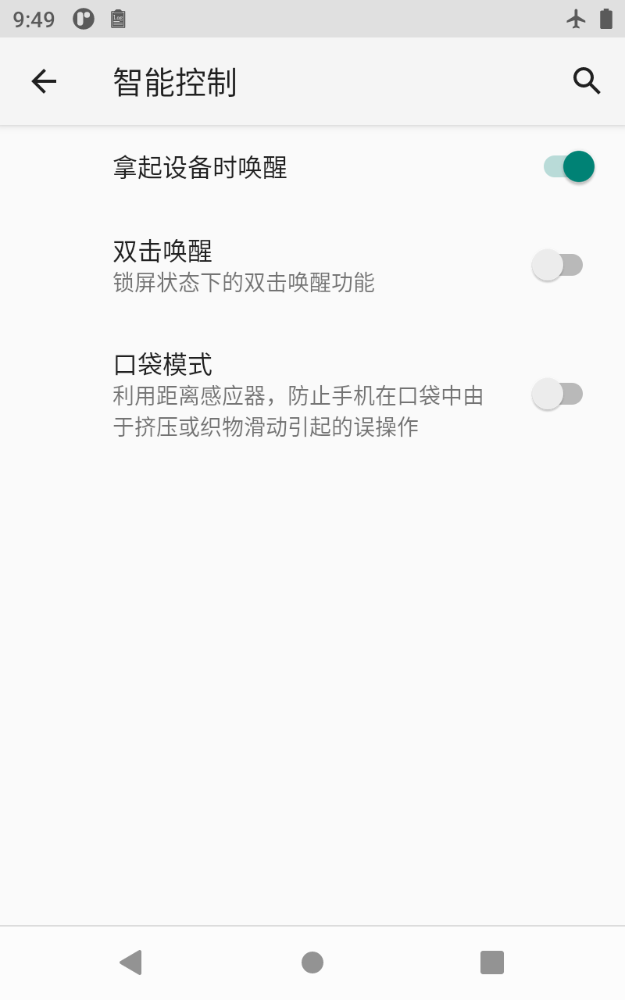
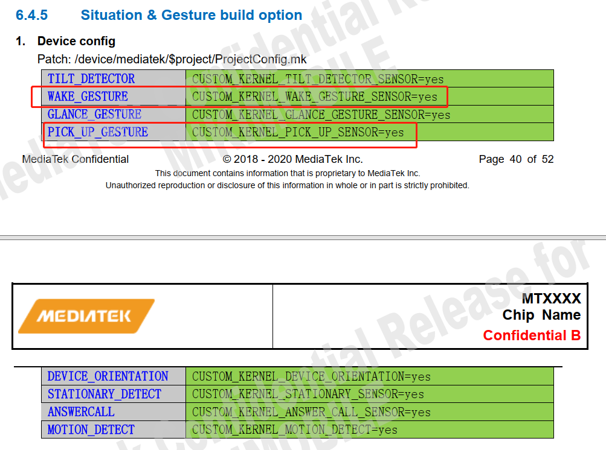
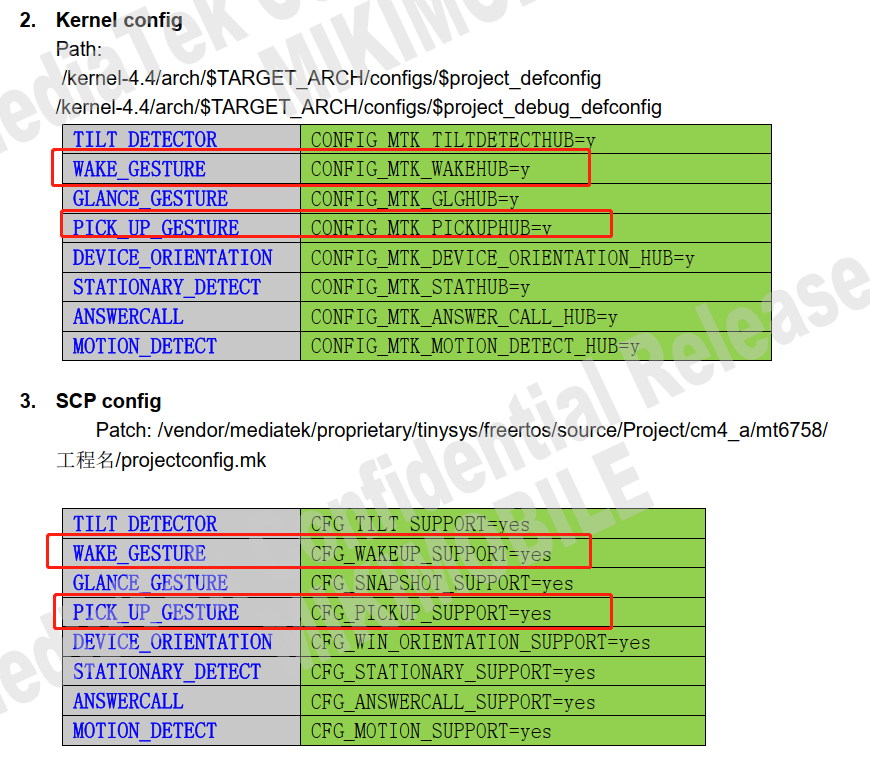

# 概述

本文主要讲解抬起亮屏功能实现。


## 参考

不考虑功耗参考：

* [Android加速度传感器 -- 抬手亮屏](https://blog.csdn.net/qq_25804863/article/details/80594772?spm=1001.2101.3001.6650.1&utm_medium=distribute.pc_relevant.none-task-blog-2%7Edefault%7ECTRLIST%7ERate-1.pc_relevant_default&depth_1-utm_source=distribute.pc_relevant.none-task-blog-2%7Edefault%7ECTRLIST%7ERate-1.pc_relevant_default&utm_relevant_index=2)

## 不考虑功耗实现代码
 
* `frameworks/base/services/core/java/com/android/server/policy/PhoneWindowManager.java`:

```diff
--- a/frameworks/base/services/core/java/com/android/server/policy/PhoneWindowManager.java
+++ b/frameworks/base/services/core/java/com/android/server/policy/PhoneWindowManager.java
@@ -243,6 +243,7 @@ import android.hardware.SensorEventListener;
 import android.hardware.SensorManager;
 import android.graphics.PixelFormat;
 import android.view.Gravity;
+import android.app.KeyguardManager;
 //[NEW FEATURE]-END by wugangnan@paxsz.com 2021-10-02, for Pocket mode

 /**
@@ -696,6 +697,16 @@ public class PhoneWindowManager implements WindowManagerPolicy {
        private View mProximityView;
        private WindowManager.LayoutParams mProximityParams;

+    private PowerManager.WakeLock mWakelock;
+    private long shakeTime;
+    private long showTime;
+    private Sensor accelerometer;
+    private KeyguardManager km; //声明键盘管理对象
+    private static final String PAX_RAISE_TIME_SYSTEMPRO = "pax.raise.time";  可以根据属性动态设定
+       private static final int PAX_DEFAULT_RAISE_TIME = 1000;
+           private static final String PAX_MEDUM_VALUE_SYSTEMPRO = "pax.medum.time";
+       private static final int PAX_DEFAULT_MEDUM_VALUE = 8;
+
        boolean isProximityScreenEnabled() {
                Log.i(TAG, "isProximityScreenEnabled.");
                return Settings.System.getInt(mContext.getContentResolver(),
@@ -709,6 +720,7 @@ public class PhoneWindowManager implements WindowManagerPolicy {
                                mProximitySensorEnabled = true;
                                mSensorManager.registerListener(mProximitySensorListener, mProximitySensor,
                                                SensorManager.SENSOR_DELAY_UI, mHandler);
+
                                mScreenOnTime = SystemClock.uptimeMillis();
                        }
                } else {
@@ -800,6 +812,45 @@ public class PhoneWindowManager implements WindowManagerPolicy {
                                 // Not used.
                         }
        };
+
+ private SensorEventListener sensorEventListener = new SensorEventListener() { 加速度传感器监听
+        @Override
+        public void onSensorChanged(SensorEvent event) {
+            float[] values = event.values;
+            float x = values[0];
+            float y = values[1];
+            float z = values[2];
+            int medumValue = SystemProperties.getInt(PAX_MEDUM_VALUE_SYSTEMPRO,PAX_DEFAULT_MEDUM_VALUE);
+
+            if (km != null) {
+                   if (km.isKeyguardLocked()) { //是否锁屏，是的话执行
+
+                       if (9 < z && -2 < x && x < 2 && -2 < y && y < 2) {
+                           showTime = System.currentTimeMillis();
+                           Slog.w(TAG,"lay flat time" + showTime);
+                       }
+                                       Slog.w(TAG,"raw data x = " + Math.abs(x) + "  y=" + Math.abs(y) + "   z=" +Math.abs(z));
+                       //if (Math.abs(x) > medumValue || Math.abs(y) > medumValue || Math.abs(z) > medumValue) {
+                                       if (y > medumValue ) {   抬手亮屏逻辑，只做y轴
+                           shakeTime = System.currentTimeMillis();
+                           Slog.w(TAG,"raise hand time" + shakeTime);
+                           if (0 < shakeTime - showTime && shakeTime - showTime < SystemProperties.getInt(PAX_RAISE_TIME_SYSTEMPRO,PAX_DEFAULT_RAISE_TIME)) {
+                               shakeTime = 0;
+                               mWakelock.acquire();   
+                               mWakelock.release();
+                           }
+                       }
+                   } else {
+                       Slog.w(TAG,"no screen lock");
+                   }
+            }
+        }
+
+        @Override
+        public void onAccuracyChanged(Sensor arg0, int arg1) {
+        }
+    };
+
        private void ProximityScreenVolumeDownKeyTriggered(){
                if (mScreenshotChordVolumeDownKeyTriggered && !mA11yShortcutChordVolumeUpKeyTriggered) {
                        if (mProximityScreenShown) {
@@ -2111,11 +2162,6 @@ public class PhoneWindowManager implements WindowManagerPolicy {
         mAccessibilityManager = (AccessibilityManager) context.getSystemService(
                 Context.ACCESSIBILITY_SERVICE);

         // register for dock events
         IntentFilter filter = new IntentFilter();
         filter.addAction(UiModeManager.ACTION_ENTER_CAR_MODE);
@@ -4606,9 +4652,13 @@ public class PhoneWindowManager implements WindowManagerPolicy {
                     if (isProximityScreenEnabled()) {
                         setProximitySensorEnabled(true);
                         mHandler.postDelayed(mPsRunnable, ALS_PS_DELAY);
+                                             mSensorManager.unregisterListener(sensorEventListener);  在亮屏后注销
                     }
                 }else if(Intent.ACTION_SCREEN_OFF.equals(action)){
                     if (isProximityScreenEnabled()) setProximitySensorEnabled(false);
+
+                                             mSensorManager.registerListener(sensorEventListener, accelerometer,  灭屏时注册监听
+                                                     SensorManager.SENSOR_DELAY_UI, mHandler);

                 }
             }
@@ -5069,6 +5119,17 @@ public class PhoneWindowManager implements WindowManagerPolicy {
         readCameraLensCoverState();
         updateUiMode();
         mDefaultDisplayRotation.updateOrientationListener();
+
+               //[NEW FEATURE]-BEGIN by wugangnan@paxsz.com 2021-10-02, for Pocket mode read the value of the distance sensor
+               km = (KeyguardManager) mContext.getSystemService(Context.KEYGUARD_SERVICE);//<BB><F1><B5><C3>KeyguardManager<B7><FE><CE><F1>
+        mWakelock = mPowerManager.newWakeLock(PowerManager.ACQUIRE_CAUSES_WAKEUP | PowerManager.SCREEN_BRIGHT_WAKE_LOCK, "bright");
+
+        mSensorManager = (SensorManager) mContext.getSystemService(Context.SENSOR_SERVICE);
+
+        accelerometer = mSensorManager.getDefaultSensor(Sensor.TYPE_ACCELEROMETER);
+               //[NEW FEATURE]-END by wugangnan@paxsz.com 2021-10-02, for Pocket mode read the value of the distance sensor
```


## 界面



## Pickup sensorhub功能开发

1.我们设备需要支持抬起唤醒功能，需要accel sensor一直active的状态。

sensorhub调通了，但是发现scp这边打印gsensor在灭屏是关闭了，如下打印：

```log
[345.976]sc7a20 acc1 rawdata x:-38, y:26, z:-1106
[346.039]sc7a20 acc1 rawdata x:-42, y:25, z:-1105
[346.102]sc7a20 acc1 rawdata x:-45, y:26, z:-1103
[346.164]sc7a20 acc1 rawdata x:-41, y:27, z:-1103
[346.227]sc7a20 acc1 rawdata x:-48, y:23, z:-1101
[346.289]sc7a20 acc1 rawdata x:-53, y:25, z:-1097
[346.352]sc7a20 acc1 rawdata x:-51, y:26, z:-1108
[346.414]sc7a20 acc1 rawdata x:-50, y:24, z:-1112
[346.435]hostintf: 346435403595, chreType:1, rate:15359, latency:100000000, cmd:0!
[346.435]sensorPowerAcc on:0, nowOn:1
[346.435]sc7a20PowerRead
[346.435]sc7a20PowerDisableWrite: 0x47
[346.435]acc: disable done
```

2.MTK回复如下：

```
请查收guide文档，抬手亮屏feature具体见6.4.5，打开WAKE_GESTURE及PICK_UP_GESTURE相关宏开关，
注：包含ProjectConfig.mk、Kernel Config、SCP config三部分，
测试方法: Settings -> Display -> Lift to wake开关
```

参考文档将如下红色框中的宏打开：




3.调通后scp打印如下：

```log
[149.277]sc7a20 acc1 rawdata x:-950, y:117, z:-279
[149.277]Gesture lib version: eec60996
[149.277]lift notify

[149.277][Wake] Active wake(0)
[149.277]LiftDetectPower:0  发现acc关闭
[149.277][Motion] Active anyMotion(0), noMotion(0)
[149.277][Motion] configAccel off
[149.278]sensorPowerAcc on:0, nowOn:1  休眠后关闭acc
[149.278]sc7a20PowerRead
[149.278]sc7a20PowerDisableWrite: 0x47
[149.279]acc: disable done
[149.282]hostintf: 149282783509, chreType:47, rate:4294967042, latency:0, cmd:0!
[149.406]hostintf: 149406578433, chreType:1, rate:15359, latency:100000000, cmd:0!
[149.408]hostintf: 149408606048, chreType:1, rate:15359, latency:100000000, cmd:1!
[149.408]sensorPowerAcc on:1, nowOn:0  配置打开
[149.408]sc7a20gEnable
[149.408]sc7a20PowerRead
[149.408]sc7a20PowerEnableWrite: 0x7
[149.409]acc: enable done
[149.409]sensorFirmwareAcc
[149.409]sensorRateAcc rate:16384, latency:100000000
[149.409]accGyro, delay=62499840, latency:100000000, min_wm=0, final_watermark=1
[149.409]accGyro, watermark:1
[149.409]sc7a20gRate: 15000, minAccGyroDelay:1, water_mark:228368
[149.409]acc: ratechg done
[149.472]sc7a20 acc1 rawdata x:-1005, y:72, z:-178 上报数据
```

* sensorlist如下，其中WAKE_GESTURE和PICK_UP是需要的:

```
PAYTABLETM8:/ # dumpsys sensorservice
Captured at: 10:14:25.220
Sensor Device:
Total 9 h/w sensors, 9 running 1 disabled clients:
0x00000017) active-count = 1; sampling_period(ms) = {1.0}, selected = 1.00 ms; batching_period(ms) = {0.0}, selected = 0.00 ms
Sensor List:
0x00000001) ACCELEROMETER             | MTK             | ver: 1 | type: android.sensor.accelerometer(1) | perm: n/a | flags: 0x00000000
        continuous | minRate=5.00Hz | maxRate=200.00Hz | no batching | non-wakeUp |
0x00000002) MAGNETOMETER              | MTK             | ver: 1 | type: android.sensor.magnetic_field(2) | perm: n/a | flags: 0x00000000
        continuous | minRate=5.00Hz | maxRate=50.00Hz | no batching | non-wakeUp |
0x00000003) ORIENTATION               | MTK             | ver: 1 | type: android.sensor.orientation(3) | perm: n/a | flags: 0x00000000
        continuous | minRate=50.00Hz | maxRate=200.00Hz | no batching | non-wakeUp |
0x00000011) SIGNIFICANT_MOTION        | MTK             | ver: 1 | type: android.sensor.significant_motion(17) | perm: n/a | flags: 0x00000005
        one-shot | maxDelay=0us | minDelay=-1us | no batching | wakeUp |
0x00000012) STEP_DETECTOR             | MTK             | ver: 1 | type: android.sensor.step_detector(18) | perm: android.permission.ACTIVITY_RECOGNITION | flags: 0x00000006
        special-trigger | maxDelay=0us | minDelay=0us | FIFO (max,reserved) = (4500, 100) events | non-wakeUp |
0x00000013) STEP_COUNTER              | MTK             | ver: 1 | type: android.sensor.step_counter(19) | perm: android.permission.ACTIVITY_RECOGNITION | flags: 0x00000002
        on-change | minRate=1.00Hz | minDelay=0us | no batching | non-wakeUp |
0x00000017) WAKE_GESTURE              | MTK             | ver: 1 | type: android.sensor.wake_gesture(23) | perm: n/a | flags: 0x00000005
        one-shot | maxDelay=0us | minDelay=-1us | no batching | wakeUp |
0x00000019) PICK_UP                   | MTK             | ver: 1 | type: android.sensor.pick_up_gesture(25) | perm: n/a | flags: 0x00000005
        one-shot | maxDelay=0us | minDelay=-1us | no batching | wakeUp |
0x00000065) STEP_DETECTOR_WAKEUP      | MTK             | ver: 1 | type: android.sensor.step_detector(18) | perm: android.permission.ACTIVITY_RECOGNITION | flags: 0x00000007
        special-trigger | maxDelay=0us | minDelay=0us | FIFO (max,reserved) = (4500, 100) events | wakeUp |
0x5f67656f) GeoMag Rotation Vector Sensor | AOSP            | ver: 3 | type: android.sensor.geomagnetic_rotation_vector(20) | perm: n/a | flags: 0x00000000
        continuous | maxDelay=0us | maxRate=200.00Hz | no batching | non-wakeUp |
```

## 代码分析

### 1.sensorhub底层

* 配置如下：

```diff
--- a/vendor/mediatek/proprietary/tinysys/freertos/source/project/CM4_A/mt6765/k62v1_64_pax/ProjectConfig.mk
+++ b/vendor/mediatek/proprietary/tinysys/freertos/source/project/CM4_A/mt6765/k62v1_64_pax/ProjectConfig.mk
@@ -16,13 +16,19 @@ CFG_CHRE_SUPPORT = yes
+CFG_PICKUP_SUPPORT = yes
+CFG_WAKEUP_SUPPORT = yes
```

* `project/CM4_A/mt6765/platform/feature_config/chre.mk`关联文件:

```
######## pickup ########
ifeq ($(CFG_PICKUP_SUPPORT),yes)
C_FILES  += $(SOURCE_DIR)/middleware/contexthub/VIRT_Driver/pickup.c
endif

######## wakeup ########
ifeq ($(CFG_WAKEUP_SUPPORT),yes)
C_FILES  += $(SOURCE_DIR)/middleware/contexthub/VIRT_Driver/wakeup.c
endif
```