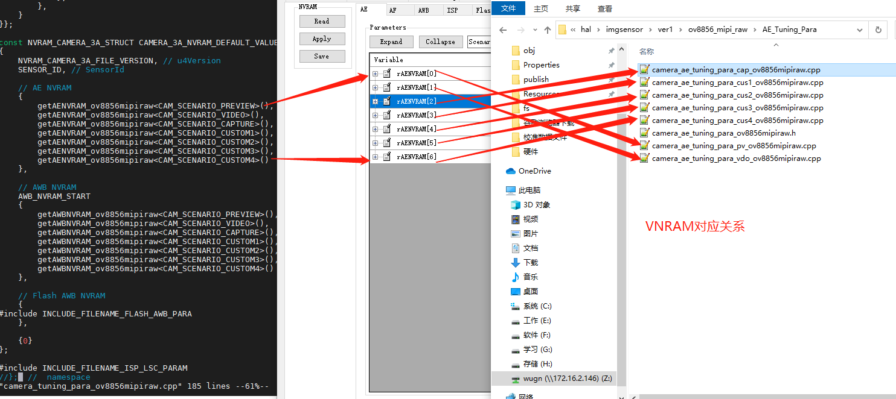
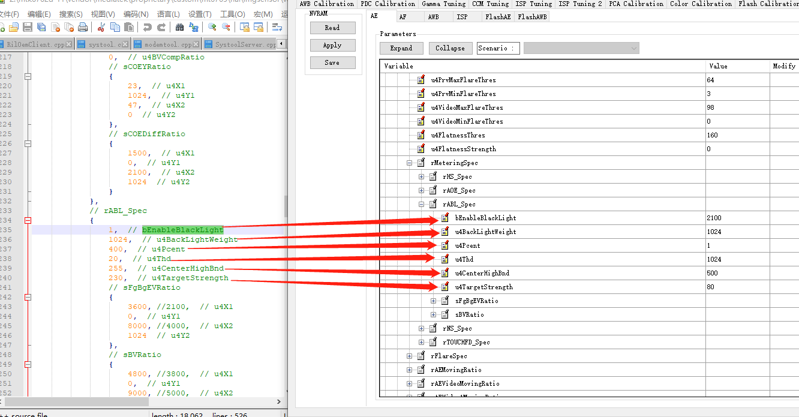
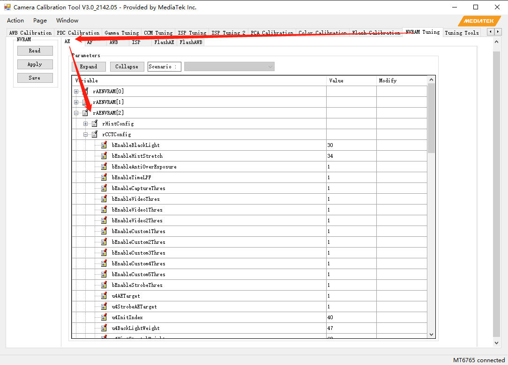
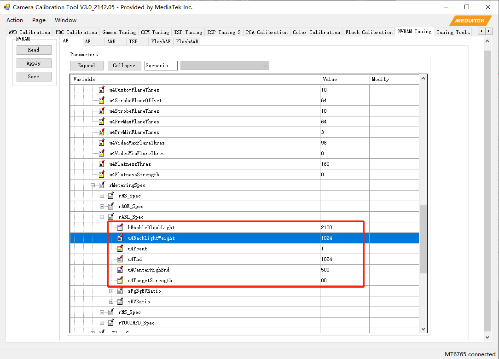
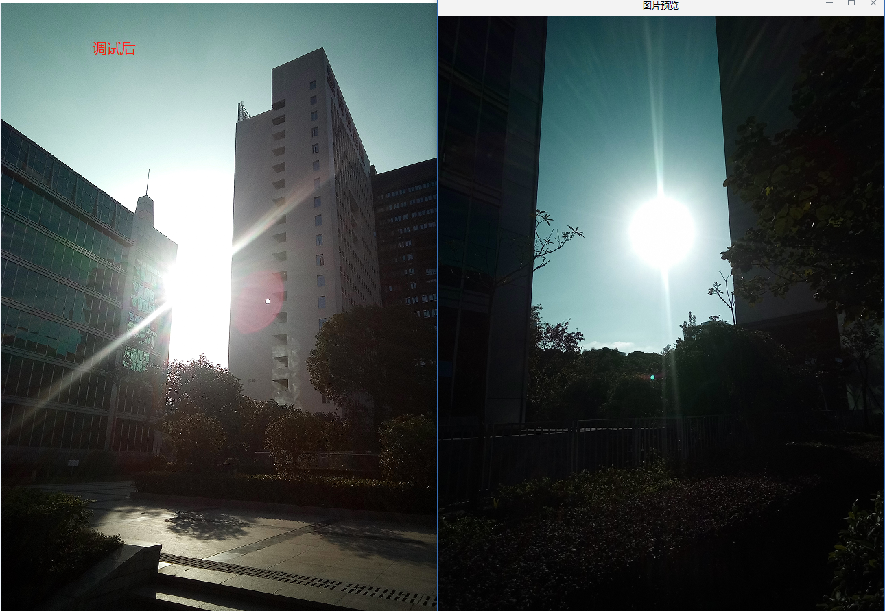

# 概述

AE调试记录

## 参考
* 1-2_MT6762_MT6771_AE_Tone_Debug_SOP_201905.pdf

    * 81页:Dark area too dark

    * 31页：Background over-exposed in face scene

* 1-1_MT6762_MT6771_AE_Tone_Tuning_201905.pdf

    * ABL (ANTI-BACK LIGHT)

## NVRAM对应关系

## AE ABL调试

* 参考如下：

* 户外NVRAM参数调试如下：

## 效果

