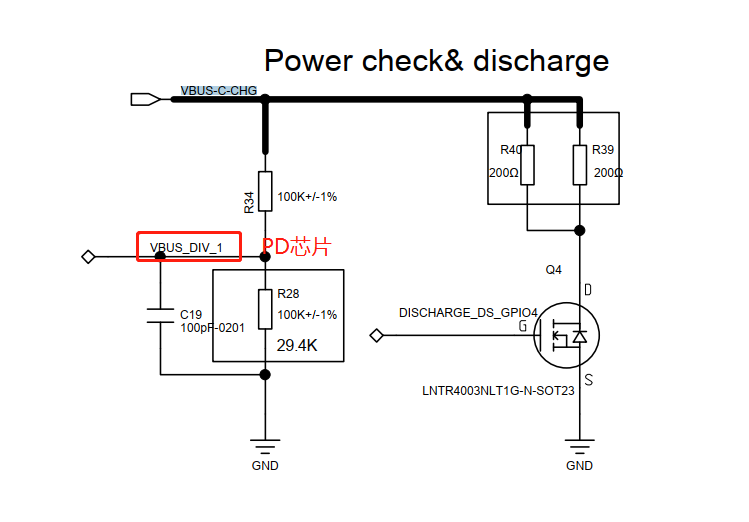

# 概述
R15问题汇总

## 1.开机第一次R15不枚举

* 原因是PDM应用调用了`wakeup`旧接口，M50是vbus控制，没做特殊处理，电源被关闭了。

```log
main log:
行 9950: 12-28 17:42:47.760623   559   559 D paxdroid.hardware.paxservice@1.0-service: wakeup sp
行 9975: 12-28 17:42:47.814496   559   559 D paxdroid.hardware.paxservice@1.0-service: set status
行 11003: 12-28 17:42:52.369429   559   559 D paxdroid.hardware.paxservice@1.0-service: wakeup sp
行 11050: 12-28 17:42:52.518846   559   559 D paxdroid.hardware.paxservice@1.0-service: wakeup sp
行 11116: 12-28 17:42:52.661498   559   559 D paxdroid.hardware.paxservice@1.0-service: wakeup sp
行 11131: 12-28 17:42:52.676141   559   559 D paxdroid.hardware.paxservice@1.0-service: wakeup sp

kernel log:
行 1254: <7>[   28.136931]  (3)[559:paxservice@1.0-][pax_gpio]: ioctl set r15 status: 0x3
行 1256: <7>[   28.136959]  (3)[559:paxservice@1.0-][pax_gpio]: SET_POWER_STATUS: 1
行 1258: <7>[   28.136962]  (3)[559:paxservice@1.0-][pax_gpio]: power_en: 1, set_value = 3
行 1304: <7>[   28.495032]  (7)[559:paxservice@1.0-][pax_gpio]: ioctl read: 0x5
行 1305: <7>[   28.495075]  (7)[559:paxservice@1.0-][pax_gpio]: ioctl write: 0x7
行 1306: <7>[   28.495082]  (7)[559:paxservice@1.0-][pax_gpio]: set_r15_power_status = 0
行 1311: <7>[   28.495124]  (7)[559:paxservice@1.0-][pax_gpio]: SET_POWER_EN: 0
行 1315: <7>[   28.496517]  (1)[559:paxservice@1.0-][pax_gpio]: ioctl read: 0x7
行 1316: <7>[   28.496637]  (1)[559:paxservice@1.0-][pax_gpio]: ioctl write: 0x5
行 1317: <7>[   28.496644]  (1)[559:paxservice@1.0-][pax_gpio]: set_r15_power_status = 0
行 1322: <7>[   28.496685]  (1)[559:paxservice@1.0-][pax_gpio]: SET_POWER_EN: 0
行 1325: <7>[   28.497835]  (1)[559:paxservice@1.0-][pax_gpio]: ioctl read: 0x5
行 1326: <7>[   28.497944]  (1)[559:paxservice@1.0-][pax_gpio]: ioctl write: 0x7
行 1327: <7>[   28.497951]  (1)[559:paxservice@1.0-][pax_gpio]: set_r15_power_status = 0
行 1332: <7>[   28.498018]  (1)[559:paxservice@1.0-][pax_gpio]: SET_POWER_EN: 0
行 1363: <7>[   28.548897]  (1)[559:paxservice@1.0-][pax_gpio]: ioctl set r15 status: 0x1
行 1365: <7>[   28.548925]  (1)[559:paxservice@1.0-][pax_gpio]: SET_POWER_STATUS: 0
行 1367: <7>[   28.548928]  (1)[559:paxservice@1.0-][pax_gpio]: power_en: 0, set_value = 1
行 1596: <7>[   33.103912]  (3)[559:paxservice@1.0-][pax_gpio]: ioctl read: 0x7
行 1597: <7>[   33.103979]  (3)[559:paxservice@1.0-][pax_gpio]: ioctl write: 0x7
行 1598: <7>[   33.103985]  (3)[559:paxservice@1.0-][pax_gpio]: set_r15_power_status = 0
行 1603: <7>[   33.104027]  (3)[559:paxservice@1.0-][pax_gpio]: SET_POWER_EN: 0
行 1606: <7>[   33.107579]  (3)[559:paxservice@1.0-][pax_gpio]: ioctl read: 0x7
行 1607: <7>[   33.110327]  (3)[559:paxservice@1.0-][pax_gpio]: ioctl write: 0x5
行 1608: <7>[   33.110338]  (3)[559:paxservice@1.0-][pax_gpio]: set_r15_power_status = 0
行 1613: <7>[   33.110382]  (3)[559:paxservice@1.0-][pax_gpio]: SET_POWER_EN: 0
行 1616: <7>[   33.114621]  (3)[559:paxservice@1.0-][pax_gpio]: ioctl read: 0x5
行 1617: <7>[   33.115117]  (3)[559:paxservice@1.0-][pax_gpio]: ioctl write: 0x7
行 1618: <7>[   33.115174]  (3)[559:paxservice@1.0-][pax_gpio]: set_r15_power_status = 0
行 1623: <7>[   33.115240]  (3)[559:paxservice@1.0-][pax_gpio]: SET_POWER_EN: 0
行 1648: <7>[   33.253244]  (1)[559:paxservice@1.0-][pax_gpio]: ioctl read: 0x7
行 1649: <7>[   33.253284]  (1)[559:paxservice@1.0-][pax_gpio]: ioctl write: 0x7
行 1650: <7>[   33.253291]  (1)[559:paxservice@1.0-][pax_gpio]: set_r15_power_status = 0
行 1655: <7>[   33.253349]  (1)[559:paxservice@1.0-][pax_gpio]: SET_POWER_EN: 0
行 1658: <7>[   33.255607]  (3)[559:paxservice@1.0-][pax_gpio]: ioctl read: 0x7
行 1659: <7>[   33.255693]  (3)[559:paxservice@1.0-][pax_gpio]: ioctl write: 0x5
行 1660: <7>[   33.255699]  (3)[559:paxservice@1.0-][pax_gpio]: set_r15_power_status = 0
行 1665: <7>[   33.255783]  (3)[559:paxservice@1.0-][pax_gpio]: SET_POWER_EN: 0
行 1668: <7>[   33.256977]  (3)[559:paxservice@1.0-][pax_gpio]: ioctl read: 0x5
行 1669: <7>[   33.257025]  (3)[559:paxservice@1.0-][pax_gpio]: ioctl write: 0x7
行 1670: <7>[   33.257032]  (3)[559:paxservice@1.0-][pax_gpio]: set_r15_power_status = 0
行 1675: <7>[   33.257088]  (3)[559:paxservice@1.0-][pax_gpio]: SET_POWER_EN: 0
行 1678: <7>[   33.395912]  (0)[559:paxservice@1.0-][pax_gpio]: ioctl read: 0x7
行 1679: <7>[   33.395950]  (0)[559:paxservice@1.0-][pax_gpio]: ioctl write: 0x7
行 1680: <7>[   33.395957]  (0)[559:paxservice@1.0-][pax_gpio]: set_r15_power_status = 0
行 1685: <7>[   33.396001]  (0)[559:paxservice@1.0-][pax_gpio]: SET_POWER_EN: 0
行 1688: <7>[   33.397174]  (0)[559:paxservice@1.0-][pax_gpio]: ioctl read: 0x7
行 1689: <7>[   33.397262]  (0)[559:paxservice@1.0-][pax_gpio]: ioctl write: 0x5
行 1690: <7>[   33.397270]  (0)[559:paxservice@1.0-][pax_gpio]: set_r15_power_status = 0
行 1695: <7>[   33.397330]  (0)[559:paxservice@1.0-][pax_gpio]: SET_POWER_EN: 0
行 1699: <7>[   33.398482]  (0)[559:paxservice@1.0-][pax_gpio]: ioctl read: 0x5
行 1700: <7>[   33.398548]  (0)[559:paxservice@1.0-][pax_gpio]: ioctl write: 0x7
行 1701: <7>[   33.398555]  (0)[559:paxservice@1.0-][pax_gpio]: set_r15_power_status = 0
行 1706: <7>[   33.398592]  (0)[559:paxservice@1.0-][pax_gpio]: SET_POWER_EN: 0
行 1712: <7>[   33.410565]  (0)[559:paxservice@1.0-][pax_gpio]: ioctl read: 0x7
行 1713: <7>[   33.410605]  (0)[559:paxservice@1.0-][pax_gpio]: ioctl write: 0x7
行 1714: <7>[   33.410611]  (0)[559:paxservice@1.0-][pax_gpio]: set_r15_power_status = 0
行 1719: <7>[   33.410662]  (0)[559:paxservice@1.0-][pax_gpio]: SET_POWER_EN: 0
行 1722: <7>[   33.411816]  (0)[559:paxservice@1.0-][pax_gpio]: ioctl read: 0x7
行 1723: <7>[   33.411927]  (0)[559:paxservice@1.0-][pax_gpio]: ioctl write: 0x5
行 1724: <7>[   33.411934]  (0)[559:paxservice@1.0-][pax_gpio]: set_r15_power_status = 0
行 1729: <7>[   33.411994]  (0)[559:paxservice@1.0-][pax_gpio]: SET_POWER_EN: 0
行 1732: <7>[   33.413140]  (0)[559:paxservice@1.0-][pax_gpio]: ioctl read: 0x5
行 1733: <7>[   33.413239]  (0)[559:paxservice@1.0-][pax_gpio]: ioctl write: 0x7
行 1734: <7>[   33.413246]  (0)[559:paxservice@1.0-][pax_gpio]: set_r15_power_status = 0
行 1739: <7>[   33.413298]  (0)[559:paxservice@1.0-][pax_gpio]: SET_POWER_EN: 0
行 1763: <7>[   33.653716]  (0)[559:paxservice@1.0-][pax_gpio]: ioctl read: 0x7
行 1764: <7>[   33.653772]  (0)[559:paxservice@1.0-][pax_gpio]: ioctl write: 0x7
行 1765: <7>[   33.653778]  (0)[559:paxservice@1.0-][pax_gpio]: set_r15_power_status = 0
行 1770: <7>[   33.653838]  (0)[559:paxservice@1.0-][pax_gpio]: SET_POWER_EN: 0
行 1772: <7>[   33.653866]  (0)[559:paxservice@1.0-][pax_gpio]: ioctl read: 0x7
行 1773: <7>[   33.653902]  (0)[559:paxservice@1.0-][pax_gpio]: ioctl write: 0x7
行 1774: <7>[   33.653906]  (0)[559:paxservice@1.0-][pax_gpio]: set_r15_power_status = 0
行 1779: <7>[   33.653931]  (0)[559:paxservice@1.0-][pax_gpio]: SET_POWER_EN: 0
行 1781: <7>[   33.653948]  (0)[559:paxservice@1.0-][pax_gpio]: ioctl read: 0x7
行 1782: <7>[   33.653973]  (0)[559:paxservice@1.0-][pax_gpio]: ioctl write: 0x7
行 1783: <7>[   33.653978]  (0)[559:paxservice@1.0-][pax_gpio]: set_r15_power_status = 0
行 1788: <7>[   33.653999]  (0)[559:paxservice@1.0-][pax_gpio]: SET_POWER_EN: 0
行 1790: <7>[   33.654014]  (0)[559:paxservice@1.0-][pax_gpio]: ioctl read: 0x7
行 1791: <7>[   33.654030]  (0)[559:paxservice@1.0-][pax_gpio]: ioctl write: 0x5
行 1792: <7>[   33.654098]  (0)[559:paxservice@1.0-][pax_gpio]: set_r15_power_status = 0
行 1797: <7>[   33.654120]  (0)[559:paxservice@1.0-][pax_gpio]: SET_POWER_EN: 0
行 1849: <7>[   34.162681]  (0)[559:paxservice@1.0-][pax_gpio]: ioctl read: 0x5
行 1850: <7>[   34.162723]  (0)[559:paxservice@1.0-][pax_gpio]: ioctl write: 0x5
行 1851: <7>[   34.162730]  (0)[559:paxservice@1.0-][pax_gpio]: set_r15_power_status = 0
行 1856: <7>[   34.162772]  (0)[559:paxservice@1.0-][pax_gpio]: SET_POWER_EN: 0
行 1858: <7>[   34.162798]  (0)[559:paxservice@1.0-][pax_gpio]: ioctl read: 0x5
行 1859: <7>[   34.162815]  (0)[559:paxservice@1.0-][pax_gpio]: ioctl write: 0x25
行 1860: <7>[   34.162819]  (0)[559:paxservice@1.0-][pax_gpio]: set_r15_power_status = 0
行 1865: <7>[   34.162840]  (0)[559:paxservice@1.0-][pax_gpio]: SET_POWER_EN: 0
行 1867: <7>[   34.162856]  (0)[559:paxservice@1.0-][pax_gpio]: ioctl read: 0x25
行 1868: <7>[   34.162885]  (0)[559:paxservice@1.0-][pax_gpio]: ioctl write: 0x65
行 1869: <7>[   34.162889]  (0)[559:paxservice@1.0-][pax_gpio]: set_r15_power_status = 0
行 1874: <7>[   34.162910]  (0)[559:paxservice@1.0-][pax_gpio]: SET_POWER_EN: 0
行 1876: <7>[   34.162926]  (0)[559:paxservice@1.0-][pax_gpio]: ioctl read: 0x65
行 1877: <7>[   34.162941]  (0)[559:paxservice@1.0-][pax_gpio]: ioctl write: 0xe5
行 1878: <7>[   34.162945]  (0)[559:paxservice@1.0-][pax_gpio]: set_r15_power_status = 0
行 1883: <7>[   34.162964]  (0)[559:paxservice@1.0-][pax_gpio]: SET_POWER_EN: 0
行 1885: <7>[   34.162979]  (0)[559:paxservice@1.0-][pax_gpio]: ioctl read: 0xed
行 1886: <7>[   34.162994]  (0)[559:paxservice@1.0-][pax_gpio]: ioctl write: 0xef
行 1887: <7>[   34.162998]  (0)[559:paxservice@1.0-][pax_gpio]: set_r15_power_status = 0
行 1892: <7>[   34.163017]  (0)[559:paxservice@1.0-][pax_gpio]: SET_POWER_EN: 0
```

* `paxdroid\hardware\interfaces\paxservice\1.0\default\gpios\PaxGpios.cpp`代码如下：

```c
Return<int32_t> PaxApiService::wakeupRequest(void)
{
    ALOGD("wakeup sp");
    CHECK_GPIO_DEVICE_VALID();
    /* raising pulse wakeup R20 */
    mGpiosDevice->ops.set_gpio_value_by_index(PAX_GPIO_2, 1);
    usleep(1000);
    mGpiosDevice->ops.set_gpio_value_by_index(PAX_GPIO_2, 0);

    /* add 2020.12.16, request by R20 */
    usleep(1000);
    mGpiosDevice->ops.set_gpio_value_by_index(PAX_GPIO_2, 1);
    return 0;
}

int set_pax_gpio_value_by_index(unsigned int index, unsigned int value)
{
    int ret;
    unsigned int val;

    CHECK_GPIO_VALID(index);
    CHECK_GPIO_DIR(index, GPIO_OUTPUT);

    ret = get_pax_gpio_values(&val);
    if (ret != 0)
        return -1;

    if (value)
        val |= (1<<index);
    else
        val &= ~(1<<index);

    return set_pax_gpio_value(val);
}

int set_pax_gpio_value(unsigned int value)
{
    int fd;

    ALOGD("%s, value=0x%x", __func__, value);
    fd = g_dev_gpios.dev_fd;
    return g_dev_gpios.ops.write(fd, value);
}

static long gpios_ioctl(struct file *file, unsigned int cmd, unsigned long arg)
{
    switch (cmd) {
	case PAX_GPIO_IOCTL_READ:
		{
			value = read_gpios_value(g_pax_gpio_set);
			copy_to_user((void __user *)arg, (void *)&value, sizeof(value));
			PAX_GPIO_DBG("ioctl read: 0x%x", value);
			ret = 0;
		}
		break;

	case PAX_GPIO_IOCTL_WRITE:
		{
			copy_from_user((void *)&value, (void __user *)arg, sizeof(unsigned int));
			PAX_GPIO_DBG("ioctl write: 0x%x", value);
			if (strcmp(get_terminal_name(), "M50") == 0) {
				r15_power_status =  (value & 1<<8) >> 8;
				ret = set_r15_power_status(r15_power_status);
			}
			value = write_gpios_value(g_pax_gpio_set, value);

			ret = 0;
		}
		break;
}
```

分析以下log得知：

* 1.其实一开始是枚举上了，并且DTS应用设置了`online`状态下来。
* 2.PDM开机调用`wakeup`接口，`ioctl read`状态`0x5`，由于R15在线，实际应该是`0x105`，也就是读取R15状态不对，还是gpio的状态。
* 3.`set_pax_gpio_value_by_index`中会调用`set_pax_gpio_value`函数重新写R15状态，这个时候由于读取出错，设置状态也相对的不对，关闭了。

```
kernel log:
<6>[    6.033061]  (5)[291:kworker/5:2]cdc_acm 1-1.2:1.0: ttyACM0: USB ACM device


行 9975: 12-28 17:42:47.814496   559   559 D paxdroid.hardware.paxservice@1.0-service: set status
行 1254: <7>[   28.136931]  (3)[559:paxservice@1.0-][pax_gpio]: ioctl set r15 status: 0x3
行 1256: <7>[   28.136959]  (3)[559:paxservice@1.0-][pax_gpio]: SET_POWER_STATUS: 1
行 1258: <7>[   28.136962]  (3)[559:paxservice@1.0-][pax_gpio]: power_en: 1, set_value = 3

行 11003: 12-28 17:42:52.369429   559   559 D paxdroid.hardware.paxservice@1.0-service: wakeup sp
行 1304: <7>[   28.495032]  (7)[559:paxservice@1.0-][pax_gpio]: ioctl read: 0x5
行 1305: <7>[   28.495075]  (7)[559:paxservice@1.0-][pax_gpio]: ioctl write: 0x7
行 1306: <7>[   28.495082]  (7)[559:paxservice@1.0-][pax_gpio]: set_r15_power_status = 0
行 1311: <7>[   28.495124]  (7)[559:paxservice@1.0-][pax_gpio]: SET_POWER_EN: 0
行 1315: <7>[   28.496517]  (1)[559:paxservice@1.0-][pax_gpio]: ioctl read: 0x7
行 1316: <7>[   28.496637]  (1)[559:paxservice@1.0-][pax_gpio]: ioctl write: 0x5
行 1317: <7>[   28.496644]  (1)[559:paxservice@1.0-][pax_gpio]: set_r15_power_status = 0
行 1322: <7>[   28.496685]  (1)[559:paxservice@1.0-][pax_gpio]: SET_POWER_EN: 0
行 1325: <7>[   28.497835]  (1)[559:paxservice@1.0-][pax_gpio]: ioctl read: 0x5
行 1326: <7>[   28.497944]  (1)[559:paxservice@1.0-][pax_gpio]: ioctl write: 0x7
行 1327: <7>[   28.497951]  (1)[559:paxservice@1.0-][pax_gpio]: set_r15_power_status = 0
行 1332: <7>[   28.498018]  (1)[559:paxservice@1.0-][pax_gpio]: SET_POWER_EN: 0
行 1363: <7>[   28.548897]  (1)[559:paxservice@1.0-][pax_gpio]: ioctl set r15 status: 0x1
行 1365: <7>[   28.548925]  (1)[559:paxservice@1.0-][pax_gpio]: SET_POWER_STATUS: 0
行 1367: <7>[   28.548928]  (1)[559:paxservice@1.0-][pax_gpio]: power_en: 0, set_value = 1
```

### 解决方案

* 增加M50 R15状态读取功能。

```diff
[Title]:Fix Bug:修复M50第一次开机无法枚举R15问题。

[Summary]:
        1.R15开机接上会进行USB枚举，此状态由dts应用调用set_status()接口通知驱动层。
        2.M50由于是vbus供电，驱动层读取的状态由dts应用设置，非读取GPIO状态。

[Test Plan]:
        1.带皮套开机或者皮套热拔插，看R15是否能正常枚举。

[Module]: R15

[Model]: M50

[author]: wugangnan@paxsz.com

[date]: 2021-12-30

--- a/kernel-4.19/drivers/misc/pax/gpio/pax_gpio_control.c
+++ b/kernel-4.19/drivers/misc/pax/gpio/pax_gpio_control.c
@@ -119,6 +119,8 @@ struct pax_gpio_set {
        struct notifier_block gpio_nb;

        int r15_status;
+
+       int r15_power_status;
 };

 static struct pax_gpio_set *g_pax_gpio_set;
@@ -701,6 +703,11 @@ const char* get_terminal_name(void)

 }

+static int get_r15_power_status(void)
+{
+    return g_pax_gpio_set->r15_power_status;
+}
+
 static int set_r15_power_status(int value)
 {
        PAX_GPIO_DBG("set_r15_power_status = %d\n",value);
@@ -710,16 +717,17 @@ static int set_r15_power_status(int value)

 static int set_r15_status(unsigned int value)
 {
-       int power_en = R15_POWER_DISABLE;
+       int power_en = 0;

        if (value == R15_ONLINE_READY) {
-               power_en = R15_STATUS_ONLINE;
+               g_pax_gpio_set->r15_power_status = R15_STATUS_ONLINE;
        }
        else { /*R15_SLEEP R15_ONLINE_NOT_READY R15_OFFLINE*/
-               power_en = R15_STATUS_OFFLINE;
+               g_pax_gpio_set->r15_power_status = R15_STATUS_OFFLINE;
        }

        g_pax_gpio_set->r15_status = value;
+       power_en = g_pax_gpio_set->r15_power_status;
        r15_status_notify_call_chain(SET_POWER_STATUS, &power_en);
        PAX_GPIO_DBG("power_en: %d, set_value = %d\n", power_en,value);

@@ -773,6 +781,9 @@ static long gpios_ioctl(struct file *file, unsigned int cmd, unsigned long arg)
        case PAX_GPIO_IOCTL_READ:
                {
                        value = read_gpios_value(g_pax_gpio_set);
+                       if (strcmp(get_terminal_name(), "M50") == 0) {
+                               value |= get_r15_power_status() << 8;
+                       }
                        copy_to_user((void __user *)arg, (void *)&value, sizeof(value));
                        PAX_GPIO_DBG("ioctl read: 0x%x", value);
                        ret = 0;
```

## 2.休眠状态无法充电唤醒

* 根据原理图如下：



PD芯片供应商回复原因：

> PD需要检测vbus上电的情况下，才会响应充电，才会有CC中断。

### 解决方案

* 供应商修改PD芯片`FL7102`固件，Vbus不在位的情况下，插入充电器，有CC中断并充电。

* 更新固件后，typec中断如下：

```
<6>[    1.333356] .(3)[1:swapper/0]mt6370_init_alert name = type_c_port0, gpio = 338
<6>[    1.333415] .(3)[1:swapper/0]mt6370_init_alert : IRQ number = 26
```