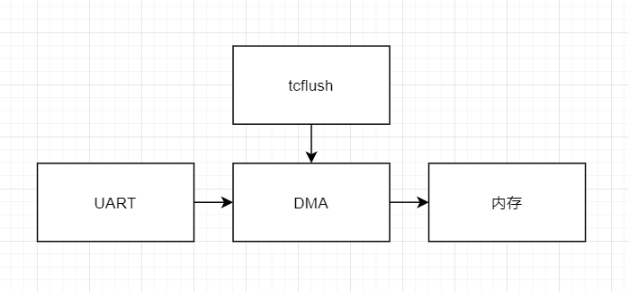

# 概述
pax串口程序overrun问题解析

## 1.错误描述

* AP和R20进行通信压力测试，不同数据长度都需要测，当拔插usb时出现串口发送断开现象。打印如下：

```log
<4>[ 2679.114028]  (0)[6590:kworker/u16:0]ttyS ttyS1: 1 input overrun(s)
```


### 解决方案

* 由于串口传输大数据过程中，插拔USB产生中断导致CPU优先处理中断，FIFO模式接收接受区过小，不断读取数据导致串口提示overrun,所以现在修改为传输过程中接收数据采用DMA形式。这种形式可以防止丢数据。


```diff
--- a/kernel-4.19/arch/arm64/boot/dts/mediatek/mt6765.dts
+++ b/kernel-4.19/arch/arm64/boot/dts/mediatek/mt6765.dts
@@ -2095,6 +2095,9 @@ firmware_class.path=/vendor/firmware";
                interrupts = <GIC_SPI 92 IRQ_TYPE_LEVEL_LOW>;
                clocks = <&clk26m>, <&infracfg_ao CLK_IFR_UART1>;
                clock-names = "baud", "bus";
+               dmas = <&apdma 2
+                       &apdma 3>;
+               dma-names = "tx", "rx";
        };

        i2c_common: i2c_common {
diff --git a/kernel-4.19/drivers/tty/serial/8250/8250_port.c b/kernel-4.19/drivers/tty/serial/8250/8250_port.c
old mode 100644
new mode 100755
index 85e3415a3f8..30da13cca9f
--- a/kernel-4.19/drivers/tty/serial/8250/8250_port.c
+++ b/kernel-4.19/drivers/tty/serial/8250/8250_port.c
@@ -1552,8 +1552,11 @@ static inline void __start_tx(struct uart_port *port)
 {
        struct uart_8250_port *up = up_to_u8250p(port);

-       if (up->dma && !up->dma->tx_dma(up))
-               return;
+       //[FEATURE]-MOD-BEGIN by zengjianfeng@paxsz.com 2021-1-8, tx don't use dma for port 1
+       if (port->line != 1)
+               if (up->dma && !up->dma->tx_dma(up))
+                       return;
+       //[FEATURE]-MOD-END by zengjianfeng@paxsz.com 2021-1-8, tx don't use dma for port 1

        if (!(up->ier & UART_IER_THRI)) {
                up->ier |= UART_IER_THRI;
@@ -1874,9 +1877,18 @@ int serial8250_handle_irq(struct uart_port *port, unsigned int iir)
                        status = serial8250_rx_chars(up, status);
        }
        serial8250_modem_status(up);
-       if ((!up->dma || up->dma->tx_err) && (status & UART_LSR_THRE) &&
-               (up->ier & UART_IER_THRI))
-               serial8250_tx_chars(up);
+       //[FEATURE]-MOD-BEGIN by zengjianfeng@paxsz.com 2021-1-8, tx don't use dma for port 1
+       if (port->line != 1) {
+               if ((!up->dma || up->dma->tx_err) && (status & UART_LSR_THRE) &&
+                       (up->ier & UART_IER_THRI))
+                       serial8250_tx_chars(up);
+       } else {
+               if ((status & UART_LSR_THRE) &&
+                       (up->ier & UART_IER_THRI))
+                       serial8250_tx_chars(up);
+       }
+       //[FEATURE]-MOD-BEGIN by zengjianfeng@paxsz.com 2021-1-8, tx don't use dma for port 1
+

        spin_unlock_irqrestore(&port->lock, flags);
```

### TX不用DMA原因

* 因为应用程序使用了TCIOFLUSH清除缓存导致TX使用DMA方式时，数据还在转发到DMA单片机，就被清除掉了，导致数据无法传输完成。经分析全志、展讯平台驱动，同样存在该问题、

