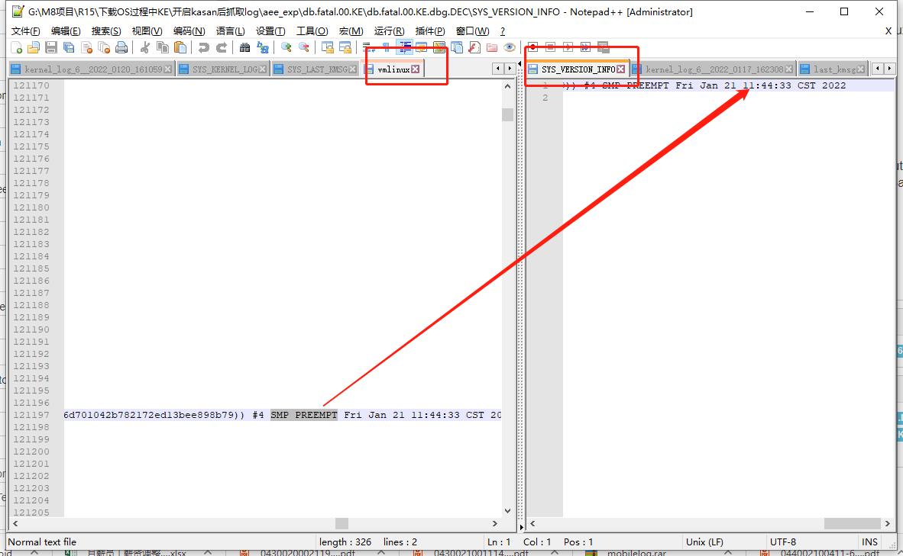

# 概述
R15界面，下载或者握手过程中发生kernel error

## 1.错误描述

* 有以下几种情况，M8机器会重启或者黄屏。

- EDM中处于R15设备操作界面时，将机器接入PC，M8自动重启了。
- 下载R15 monitor软件黄屏重启。

## 2.log分析

* 下载monitor出现3次不同的KE：

```log
$** *** *** *** *** *** *** *** Fatal *** *** *** *** *** *** *** **$
Build Info: 'alps-mp-r0.mp1:PayDroid_11.0.0_Birch_V15.2.01_20220110:mt6765:S01,PAX/M8/PAYTABLETM8:11/RP1A.200720.011/2106041717:userdebug/release-keys'
MSSI Info: 'PAX/M8/PAYTABLETM8:11/RP1A.200720.011/2106041717:userdebug/release-keys'
Exception Log Time:[Tue Jan 11 11:24:11 CST 2022] [13.926650]

Exception Class: Kernel (KE)
PC is at [<ffffffa1ad63bd3c>] binder_pop_transaction_ilocked+0x64/0x68
LR is at [<ffffffa1ad63a7cc>] binder_transaction+0x1b90/0x22b0

Current Executing Process:
[Binder:1182_5, 1418][main, 540]

Backtrace:
[<ffffffa1acadd970>] notify_die+0x34/0x5c      
[<ffffffa1aca90108>] die+0xac/0x380    
[<ffffffa1aca90e6c>] bug_handler+0x4c/0x88     
[<ffffffa1aca85534>] call_break_hook+0x68/0x88 
[<ffffffa1aca85590>] brk_handler+0x3c/0x7c     
[<ffffffa1aca8111c>] do_debug_exception+0xe4/0x174     
[<ffffffa1aca82d20>] el1_dbg+0x14/0xa8 
[<ffffffa1ad63bd3c>] binder_pop_transaction_ilocked+0x64/0x68  
[<ffffffa1ad63a7c8>] binder_transaction+0x1b8c/0x22b0  
[<ffffffa1ad634d90>] binder_ioctl_write_read+0x6c4/0x3894      
[<ffffffa1ad6313d8>] binder_ioctl+0x2bc/0x950  
[<ffffffa1acc7d9fc>] do_vfs_ioctl+0x66c/0xec0  
[<ffffffa1acc7e364>] ksys_ioctl+0x70/0x9c      
[<ffffffa1acc7e3b0>] __arm64_sys_ioctl+0x20/0x34       
[<ffffffa1aca98130>] el0_svc_common+0x98/0x14c 
[<ffffffa1aca98078>] el0_svc_handler+0x64/0x84 
[<ffffffa1aca83cc4>] el0_svc+0x4/0xc   
[<fffffffffffffffb>] 0xfffffffffffffffb


$** *** *** *** *** *** *** *** Fatal *** *** *** *** *** *** *** **$


$** *** *** *** *** *** *** *** Fatal *** *** *** *** *** *** *** **$
Build Info: 'alps-mp-r0.mp1:PayDroid_11.0.0_Birch_V15.2.01_20220113:mt6765:S01,PAX/M8/PAYTABLETM8:11/RP1A.200720.011/2106041717:userdebug/release-keys'
MSSI Info: 'PAX/M8/PAYTABLETM8:11/RP1A.200720.011/2106041717:userdebug/release-keys'
Exception Log Time:[Thu Jan 13 12:12:45 CST 2022] [13.462090]

Exception Class: Kernel (KE)
PC is at [<ffffffaac999ba9c>] musb_h_disable+0x11c/0x548
LR is at [<ffffffaac999bd04>] musb_h_disable+0x384/0x548

Current Executing Process:
[swapper/4, 0]

Backtrace:
[<ffffffaac90dd970>] notify_die+0x34/0x5c      
[<ffffffaac9090108>] die+0xac/0x380    
[<ffffffaac90a3dcc>] die_kernel_fault+0x60/0x74
[<ffffffaac90a3d68>] __do_kernel_fault+0x104/0x108     
[<ffffffaaca01b8f4>] do_page_fault+0xbc/0x4c0  
[<ffffffaaca01b818>] do_translation_fault+0x4c/0x6c    
[<ffffffaac9080d6c>] do_mem_abort+0x58/0xfc    
[<ffffffaac9082bc0>] el1_da+0x18/0xac  
[<ffffffaac999ba9c>] musb_h_disable+0x11c/0x548
[<ffffffaac999b90c>] musb_h_pre_disable+0x64/0xd8      
[<ffffffaac99903b4>] musb_root_disconnect+0x60/0x21c   
[<ffffffaac997cf50>] musb_interrupt+0x9c8/0x18b4       
[<ffffffaac996f800>] mt_usb_interrupt+0x2a0/0x18cc     
[<ffffffaac9126650>] __handle_irq_event_percpu+0xdc/0x25c      
[<ffffffaac9126800>] handle_irq_event_percpu+0x30/0x8c 
[<ffffffaac91268a0>] handle_irq_event+0x44/0x78
[<ffffffaac912aa38>] handle_fasteoi_irq+0xcc/0x1a0     
[<ffffffaac9125838>] __handle_domain_irq+0x80/0xc4     
[<ffffffaac9081394>] gic_handle_irq+0x124/0x1b8
[<ffffffaac9082ee4>] el1_irq+0xe4/0x190
[<ffffffaac9b8e8ec>] cpuidle_enter_state+0x284/0x318   
[<ffffffaac9b8e9f8>] cpuidle_enter+0x2c/0x40   
[<ffffffaac90f1080>] do_idle+0x18c/0x268       
[<ffffffaac90f117c>] cpu_startup_entry+0x20/0x28       
[<ffffffaac9096d88>] secondary_start_kernel+0x13c/0x14c
[<fffffffffffffffb>] 0xfffffffffffffffb


$** *** *** *** *** *** *** *** Fatal *** *** *** *** *** *** *** **$


$** *** *** *** *** *** *** *** Fatal *** *** *** *** *** *** *** **$
Build Info: 'alps-mp-r0.mp1:PayDroid_11.0.0_Birch_V15.2.01_20220113:mt6765:S01,PAX/M8/PAYTABLETM8:11/RP1A.200720.011/2106041717:userdebug/release-keys'
MSSI Info: 'PAX/M8/PAYTABLETM8:11/RP1A.200720.011/2106041717:userdebug/release-keys'
Exception Log Time:[Thu Jan 13 13:46:59 CST 2022] [11.488211]

Exception Class: Kernel (KE)
PC is at [<ffffff98941948ec>] musb_advance_schedule+0x248/0x894
LR is at [<ffffff98941948d4>] musb_advance_schedule+0x230/0x894

Current Executing Process:
[kworker/0:1, 56][kthreadd, 2]

Backtrace:
[<ffffff98938dd970>] notify_die+0x34/0x5c      
[<ffffff9893890108>] die+0xac/0x380    
[<ffffff98938a3dcc>] die_kernel_fault+0x60/0x74
[<ffffff98938a3d68>] __do_kernel_fault+0x104/0x108     
[<ffffff989481b8f4>] do_page_fault+0xbc/0x4c0  
[<ffffff989481b818>] do_translation_fault+0x4c/0x6c    
[<ffffff9893880d6c>] do_mem_abort+0x58/0xfc    
[<ffffff9893882bc0>] el1_da+0x18/0xac  
[<ffffff98941948ec>] musb_advance_schedule+0x248/0x894 
[<ffffff98941a1ba0>] musb_cleanup_urb+0x21c/0x714      
[<ffffff989419cf14>] musb_urb_dequeue+0x480/0x6b4      
[<ffffff989424f420>] unlink1+0x40/0x110
[<ffffff989424f358>] usb_hcd_unlink_urb+0x64/0xec      
[<ffffff9894251eb4>] usb_kill_urb+0x54/0xf8    
[<ffffff9894267620>] acm_softint+0x50/0x144    
[<ffffff98938d6234>] process_one_work+0x20c/0x3e8      
[<ffffff98938d66a8>] worker_thread+0x224/0x3c4 
[<ffffff98938db5f8>] kthread+0x110/0x124       
[<ffffff9893885c98>] ret_from_fork+0xc/0x18    
[<fffffffffffffffb>] 0xfffffffffffffffb


$** *** *** *** *** *** *** *** Fatal *** *** *** *** *** *** *** **$
```
* R15在位，插入USB重启，出现两次：

```log
[27010.987872] <7>-(7)[9023:kworker/7:2][MUSB]musb_urb_dequeue 3120: urb<000000002246d456>,dev<30>,ep<2in>,qh<000000003b4b94fd>,rdy<1>,prev<0>,cur<1>
[27010.987894] <2>-(2)[941:mobile_log_d.rd][MUSB]musb_host_rx 2189: BOGUS RX3 ready, csr 0000, count 0
[27010.987905] <2>-(2)[941:mobile_log_d.rd][MUSB]musb_advance_schedule 706: case<0>, ep<3>, qh<000000003b4b94fd>, type<2>, is_in<128>, empty<1>, use_qmu<0>
[27010.987937] <7>-(7)[9023:kworker/7:2]Unable to handle kernel paging request at virtual address dead000000000139
[27010.987954] <7>-(7)[9023:kworker/7:2]Mem abort info:
[27010.987971] <7>-(7)[9023:kworker/7:2]  ESR = 0x96000004
[27010.987987] <7>-(7)[9023:kworker/7:2]  Exception class = DABT (current EL), IL = 32 bits
[27010.988004] <7>-(7)[9023:kworker/7:2]  SET = 0, FnV = 0
[27010.988022] <7>-(7)[9023:kworker/7:2]  EA = 0, S1PTW = 0
[27010.988039] <7>-(7)[9023:kworker/7:2]Data abort info:
[27010.988057] <7>-(7)[9023:kworker/7:2]  ISV = 0, ISS = 0x00000004
[27010.988075] <7>-(7)[9023:kworker/7:2]  CM = 0, WnR = 0
[27010.988093] <7>-(7)[9023:kworker/7:2][dead000000000139] address between user and kernel address ranges
[27010.988114] <7>-(7)[9023:kworker/7:2]Internal error: Oops: 96000004 [#1] PREEMPT SMP
[27012.012163] <7>-(7)[9023:kworker/7:2]Non-crashing 2 CPUs did not react to IPI
[27013.069608] <7>-(7)[9023:kworker/7:2]Kernel Offset: 0x284c800000 from 0xffffff8008000000
[27013.069624] <7>-(7)[9023:kworker/7:2]PHYS_OFFSET: 0xfffffff280000000
[27013.069635] <7>-(7)[9023:kworker/7:2]Modules linked in: wlan_drv_gen4m ffffffa826c2c000 ffffffa826e01000 1916928 163840 (O) wmt_chrdev_wifi ffffffa826c20000 ffffffa826c27000 24576 8192 (O) gps_drv ffffffa826c0c000 ffffffa826c1c000 61440 12288 (O) fmradio_drv ffffffa826bdc000 ffffffa826c06000 167936 20480 (O) bt_drv ffffffa826bce000 ffffffa826bd8000 36864 12288 (O) wmt_drv ffffffa826aa7000 ffffffa826bb9000 1118208 73728 (O) fpsgo ffffffa8269dd000 ffffffa826aa4000 811008 8192 (PO) trace_mmstat ffffffa8269b6000 ffffffa8269bb000 16384 12288 
[27013.069708] <7>-(7)[9023:kworker/7:2]CPU: 7 PID: 9023 Comm: kworker/7:2 Tainted: P        W  O      4.19.127 #1
[27013.069721] <7>-(7)[9023:kworker/7:2]Hardware name: MT6762V/WD (DT)
[27013.069749] <7>-(7)[9023:kworker/7:2]Workqueue: events acm_softint
[27013.069771] <7>-(7)[9023:kworker/7:2]pstate: 20400085 (nzCv daIf +PAN -UAO)
[27013.069789] <7>-(7)[9023:kworker/7:2]pc : musb_start_urb+0x60/0xa7c
[27013.069804] <7>-(7)[9023:kworker/7:2]lr : musb_advance_schedule+0x394/0x894
[27013.069816] <7>-(7)[9023:kworker/7:2]sp : ffffff801137b9a0
[27013.069827] <7>-(7)[9023:kworker/7:2]x29: ffffff801137b9d0 x28: ffffffce1babcb50 
[27013.069844] <7>-(7)[9023:kworker/7:2]x27: ffffffce1babcb50 x26: ffffff800a8c0000 
[27013.069860] <7>-(7)[9023:kworker/7:2]x25: ffffffa85657d000 x24: 0000000000000000 
[27013.069876] <7>-(7)[9023:kworker/7:2]x23: ffffffce1babc288 x22: 0000000000000080 
[27013.069893] <7>-(7)[9023:kworker/7:2]x21: dead0000000000e0 x20: ffffffcdfd6a0e00 
[27013.069909] <7>-(7)[9023:kworker/7:2]x19: ffffffce1babc288 x18: ffffffa85618b658 
[27013.069925] <7>-(7)[9023:kworker/7:2]x17: 0000000000000000 x16: 0000000000200000 
[27013.069941] <7>-(7)[9023:kworker/7:2]x15: 0000000000000000 x14: ffffffa855f7e418 
[27013.069957] <7>-(7)[9023:kworker/7:2]x13: 0000000000200000 x12: 0000000000200000 
[27013.069973] <7>-(7)[9023:kworker/7:2]x11: ffffffa85657d000 x10: 0000000000000000 
[27013.069990] <7>-(7)[9023:kworker/7:2]x9 : ffffffcdfd6a1718 x8 : 0000000000000000 
[27013.070005] <7>-(7)[9023:kworker/7:2]x7 : 0000000000000000 x6 : ffffffa85638dafa 
[27013.070021] <7>-(7)[9023:kworker/7:2]x5 : ffffff801137b8c0 x4 : 0000000000000000 
[27013.070037] <7>-(7)[9023:kworker/7:2]x3 : 0000000000000000 x2 : ffffffcdfd6a0e00 
[27013.070053] <7>-(7)[9023:kworker/7:2]x1 : 0000000000000080 x0 : ffffffce1babc288 
[27013.070076] <7>-(7)[9023:kworker/7:2]CPU: 7 PID: 9023 Comm: kworker/7:2 Tainted: P        W  O      4.19.127 #1
[27013.070088] <7>-(7)[9023:kworker/7:2]Hardware name: MT6762V/WD (DT)
[27013.070104] <7>-(7)[9023:kworker/7:2]Workqueue: events acm_softint
[27013.070122] <7>-(7)[9023:kworker/7:2]Call trace:
[27013.070142] <7>-(7)[9023:kworker/7:2] dump_backtrace+0x0/0x198
[27013.070159] <7>-(7)[9023:kworker/7:2] show_stack+0x20/0x2c
[27013.070175] <7>-(7)[9023:kworker/7:2] dump_stack+0xb8/0xf0
[27013.070193] <7>-(7)[9023:kworker/7:2] mrdump_common_die+0x174/0x22c
[27013.070208] <7>-(7)[9023:kworker/7:2] ipanic_die+0x34/0x44
[27013.070226] <7>-(7)[9023:kworker/7:2] atomic_notifier_call_chain+0x50/0x88
[27013.070241] <7>-(7)[9023:kworker/7:2] notify_die+0x38/0x5c
[27013.070257] <7>-(7)[9023:kworker/7:2] die+0xb0/0x380
[27013.070274] <7>-(7)[9023:kworker/7:2] die_kernel_fault+0x64/0x74
[27013.070290] <7>-(7)[9023:kworker/7:2] die_kernel_fault+0x0/0x74
[27013.070305] <7>-(7)[9023:kworker/7:2] do_bad_area+0x4c/0xbc
[27013.070322] <7>-(7)[9023:kworker/7:2] do_translation_fault+0x58/0x6c
[27013.070337] <7>-(7)[9023:kworker/7:2] do_mem_abort+0x5c/0xfc
[27013.070352] <7>-(7)[9023:kworker/7:2] el1_da+0x1c/0xac
[27013.070366] <7>-(7)[9023:kworker/7:2] musb_start_urb+0x60/0xa7c
[27013.070381] <7>-(7)[9023:kworker/7:2] musb_advance_schedule+0x394/0x894
[27013.070396] <7>-(7)[9023:kworker/7:2] musb_cleanup_urb+0x220/0x714
[27013.070410] <7>-(7)[9023:kworker/7:2] musb_urb_dequeue+0x484/0x6b4
[27013.070426] <7>-(7)[9023:kworker/7:2] unlink1+0x44/0x110
[27013.070442] <7>-(7)[9023:kworker/7:2] usb_hcd_unlink_urb+0x68/0xec
[27013.070457] <7>-(7)[9023:kworker/7:2] usb_kill_urb+0x58/0xf8
[27013.070473] <7>-(7)[9023:kworker/7:2] acm_softint+0x54/0x144
[27013.070490] <7>-(7)[9023:kworker/7:2] process_one_work+0x210/0x3e8
[27013.070505] <7>-(7)[9023:kworker/7:2] worker_thread+0x228/0x3c4
[27013.070520] <7>-(7)[9023:kworker/7:2] kthread+0x114/0x124
[27013.070536] <7>-(7)[9023:kworker/7:2] ret_from_fork+0x10/0x18
[27013.070913] <7>-(7)[9023:kworker/7:2]mrdump: cpu[7] tsk:0xffffffce4712d700 ti:0xffffff8011378000
[27013.093214] <7>-(7)[9023:kworker/7:2]mrdump: add UFS:0xffffffa8566e9c38 sz:0x0 failed
[27013.095510] <7>-(7)[9023:kworker/7:2]mrdump: add CCCI:0xffffffce79c80000 sz:0x0 failed
================ END of FILE ===============


[ 1632.398187] <1>.(1)[6040:kworker/u16:5]mt6370_pmu_charger mt6370_pmu_charger: mt6370_enable_irq: (chg_mivr) en = 1
[ 1632.398371] <4>.(4)[239:irq/28-mt6370_p]mt6370_pmu_irq_handler
[ 1632.398388] <1>.(1)[6040:kworker/u16:5]PD charger event:14 5
[ 1632.398401] <1>.(1)[6040:kworker/u16:5]pd_tcp_notifier_call USB Plug in, pol = 0
[ 1632.398427] <1>.(1)[6040:kworker/u16:5][MUSB]otg_tcp_notifier_call 404: TCP_NOTIFY_TYPEC_STATE, old_state=0, new_state=1
[ 1632.398436] <1>.(1)[6040:kworker/u16:5][MUSB]mt_usb_host_disconnect 325: disconnect
[ 1632.398448] <1>.(1)[6040:kworker/u16:5][MUSB]issue_host_work 307: issue work, ops<0>, delay<0>, on_st<1>
[ 1632.398474] <1>.(1)[6040:kworker/u16:5][MUSB]mt_usb_connect 715: [MUSB] USB connect
[ 1632.398483] <1>.(1)[6040:kworker/u16:5][MUSB]issue_connection_work 709: issue work, ops<2>
[ 1632.398491] <1>.(1)[6040:kworker/u16:5]tcpc_notifier_call: action:14
[ 1632.398498] <1>.(1)[6040:kworker/u16:5]usb_host_switch: on:0
[ 1632.398526] <1>.(1)[6040:kworker/u16:5][MUSB]do_host_work 898: work start, is_host=1, host_on=0
[ 1632.398533] <1>-(1)[6040:kworker/u16:5][MUSB]do_host_work 954: for not receiving disconnect interrupt
[ 1632.398557] <1>-(1)[6040:kworker/u16:5][MUSB]musb_h_pre_disable 3322: disable all endpoints
[ 1632.398584] <6>-(6)[0:swapper/6][MUSB]musb_host_rx 2219: end 5 RX proto error,rxtoggle=0x4
[ 1632.398626] <1>-(1)[6040:kworker/u16:5][MUSB]musb_h_disable 3239: qh:00000000668af5ea, is_in:80, epnum:2, hep<0000000055ca5263>
[ 1632.398636] <1>-(1)[6040:kworker/u16:5][MUSB]musb_h_disable 3275: list_empty<0>, urb<000000004e855dfd,0,-108>
[ 1632.398667] <1>-(1)[6040:kworker/u16:5][MUSB]musb_h_disable 3239: qh:00000000a8a8ae1c, is_in:80, epnum:3, hep<00000000995ca6d1>
[ 1632.398686] <1>-(1)[6040:kworker/u16:5]Unable to handle kernel read from unreadable memory at virtual address 0000000000000010
[ 1632.398692] <1>-(1)[6040:kworker/u16:5]Mem abort info:
[ 1632.398697] <1>-(1)[6040:kworker/u16:5]  ESR = 0x96000005
[ 1632.398705] <1>-(1)[6040:kworker/u16:5]  Exception class = DABT (current EL), IL = 32 bits
[ 1632.398712] <1>-(1)[6040:kworker/u16:5]  SET = 0, FnV = 0
[ 1632.398718] <1>-(1)[6040:kworker/u16:5]  EA = 0, S1PTW = 0
[ 1632.398723] <1>-(1)[6040:kworker/u16:5]Data abort info:
[ 1632.398729] <1>-(1)[6040:kworker/u16:5]  ISV = 0, ISS = 0x00000005
[ 1632.398736] <1>-(1)[6040:kworker/u16:5]  CM = 0, WnR = 0
[ 1632.398744] <1>-(1)[6040:kworker/u16:5]user pgtable: 4k pages, 39-bit VAs, pgdp = 00000000e0f8e173
[ 1632.398750] <1>-(1)[6040:kworker/u16:5][0000000000000010] pgd=0000000000000000, pud=0000000000000000
[ 1632.398765] <1>-(1)[6040:kworker/u16:5]Internal error: Oops: 96000005 [#1] PREEMPT SMP
[ 1633.437743] <1>-(1)[6040:kworker/u16:5]Kernel Offset: 0x2b90200000 from 0xffffff8008000000
[ 1633.437760] <1>-(1)[6040:kworker/u16:5]PHYS_OFFSET: 0xffffffd3c0000000
[ 1633.437767] <1>-(1)[6040:kworker/u16:5]Modules linked in: wlan_drv_gen4m ffffffab3e1ec000 ffffffab3e3c1000 1916928 163840 (O) wmt_chrdev_wifi ffffffab3e1e0000 ffffffab3e1e7000 24576 8192 (O) gps_drv ffffffab3e1cc000 ffffffab3e1dc000 61440 12288 (O) fmradio_drv ffffffab3e19c000 ffffffab3e1c6000 167936 20480 (O) bt_drv ffffffab3e18e000 ffffffab3e198000 36864 12288 (O) wmt_drv ffffffab3e067000 ffffffab3e179000 1118208 73728 (O) fpsgo ffffffab3df9d000 ffffffab3e064000 811008 8192 (PO) trace_mmstat ffffffab3df76000 ffffffab3df7b000 16384 12288 
[ 1633.437814] <1>-(1)[6040:kworker/u16:5]CPU: 1 PID: 6040 Comm: kworker/u16:5 Tainted: P        W  O      4.19.127 #1
[ 1633.437822] <1>-(1)[6040:kworker/u16:5]Hardware name: MT6762V/WD (DT)
[ 1633.437847] <1>-(1)[6040:kworker/u16:5]Workqueue: usb20_st_wq do_host_work
[ 1633.437860] <1>-(1)[6040:kworker/u16:5]pstate: 80400085 (Nzcv daIf +PAN -UAO)
[ 1633.437873] <1>-(1)[6040:kworker/u16:5]pc : __list_del_entry_valid+0xc/0xd0
[ 1633.437884] <1>-(1)[6040:kworker/u16:5]lr : usb_hcd_unlink_urb_from_ep+0x2c/0x5c
[ 1633.437891] <1>-(1)[6040:kworker/u16:5]sp : ffffff8012cabbd0
[ 1633.437896] <1>-(1)[6040:kworker/u16:5]x29: ffffff8012cabbd0 x28: ffffffab99f7d000 
[ 1633.437904] <1>-(1)[6040:kworker/u16:5]x27: ffffffab9994b018 x26: 00000000cd3af305 
[ 1633.437912] <1>-(1)[6040:kworker/u16:5]x25: 00000000000e000a x24: ffffffec8c268318 
[ 1633.437919] <1>-(1)[6040:kworker/u16:5]x23: ffffffec8c268500 x22: ffffffecdb468000 
[ 1633.437926] <1>-(1)[6040:kworker/u16:5]x21: ffffffecdb468288 x20: 0000000000000010 
[ 1633.437934] <1>-(1)[6040:kworker/u16:5]x19: fffffffffffffff0 x18: ffffffab99b8b658 
[ 1633.437941] <1>-(1)[6040:kworker/u16:5]x17: 0000000000000000 x16: 0000000000000000 
[ 1633.437948] <1>-(1)[6040:kworker/u16:5]x15: 00000000fffffff5 x14: 3861303030303030 
[ 1633.437956] <1>-(1)[6040:kworker/u16:5]x13: 000000000009a638 x12: 0000000000000000 
[ 1633.437964] <1>-(1)[6040:kworker/u16:5]x11: 0000000000000000 x10: fffffffffffffff0 
[ 1633.437971] <1>-(1)[6040:kworker/u16:5]x9 : 0000000000000002 x8 : ffffffec86cd1d00 
[ 1633.437978] <1>-(1)[6040:kworker/u16:5]x7 : 0000000000000000 x6 : ffffffab99d8dae7 
[ 1633.437986] <1>-(1)[6040:kworker/u16:5]x5 : 0000000000001798 x4 : 0000000000000000 
[ 1633.437993] <1>-(1)[6040:kworker/u16:5]x3 : 0000000000000000 x2 : 0000000000000001 
[ 1633.438000] <1>-(1)[6040:kworker/u16:5]x1 : 0000000000000000 x0 : 0000000000000010 
[ 1633.438011] <1>-(1)[6040:kworker/u16:5]CPU: 1 PID: 6040 Comm: kworker/u16:5 Tainted: P        W  O      4.19.127 #1
[ 1633.438018] <1>-(1)[6040:kworker/u16:5]Hardware name: MT6762V/WD (DT)
[ 1633.438025] <1>-(1)[6040:kworker/u16:5]Workqueue: usb20_st_wq do_host_work
[ 1633.438037] <1>-(1)[6040:kworker/u16:5]Call trace:
[ 1633.438051] <1>-(1)[6040:kworker/u16:5] dump_backtrace+0x0/0x198
[ 1633.438060] <1>-(1)[6040:kworker/u16:5] show_stack+0x20/0x2c
[ 1633.438069] <1>-(1)[6040:kworker/u16:5] dump_stack+0xb8/0xf0
[ 1633.438080] <1>-(1)[6040:kworker/u16:5] mrdump_common_die+0x174/0x22c
[ 1633.438087] <1>-(1)[6040:kworker/u16:5] ipanic_die+0x34/0x44
[ 1633.438098] <1>-(1)[6040:kworker/u16:5] atomic_notifier_call_chain+0x50/0x88
[ 1633.438106] <1>-(1)[6040:kworker/u16:5] notify_die+0x38/0x5c
[ 1633.438113] <1>-(1)[6040:kworker/u16:5] die+0xb0/0x380
[ 1633.438123] <1>-(1)[6040:kworker/u16:5] die_kernel_fault+0x64/0x74
[ 1633.438130] <1>-(1)[6040:kworker/u16:5] die_kernel_fault+0x0/0x74
[ 1633.438139] <1>-(1)[6040:kworker/u16:5] do_page_fault+0xc0/0x4c0
[ 1633.438146] <1>-(1)[6040:kworker/u16:5] do_translation_fault+0x50/0x6c
[ 1633.438154] <1>-(1)[6040:kworker/u16:5] do_mem_abort+0x5c/0xfc
[ 1633.438161] <1>-(1)[6040:kworker/u16:5] el1_da+0x1c/0xac
[ 1633.438168] <1>-(1)[6040:kworker/u16:5] __list_del_entry_valid+0xc/0xd0
[ 1633.438175] <1>-(1)[6040:kworker/u16:5] usb_hcd_unlink_urb_from_ep+0x2c/0x5c
[ 1633.438183] <1>-(1)[6040:kworker/u16:5] musb_giveback+0x5c/0x158
[ 1633.438191] <1>-(1)[6040:kworker/u16:5] musb_h_disable+0x178/0x548
[ 1633.438198] <1>-(1)[6040:kworker/u16:5] musb_h_pre_disable+0x68/0xd8
[ 1633.438205] <1>-(1)[6040:kworker/u16:5] musb_root_disconnect+0x64/0x21c
[ 1633.438212] <1>-(1)[6040:kworker/u16:5] do_host_work+0x4f8/0xd78
[ 1633.438222] <1>-(1)[6040:kworker/u16:5] process_one_work+0x210/0x3e8
[ 1633.438229] <1>-(1)[6040:kworker/u16:5] worker_thread+0x228/0x3c4
[ 1633.438236] <1>-(1)[6040:kworker/u16:5] kthread+0x114/0x124
[ 1633.438244] <1>-(1)[6040:kworker/u16:5] ret_from_fork+0x10/0x18
[ 1633.438374] <1>-(1)[6040:kworker/u16:5]mrdump: cpu[1] tsk:0xffffffec86cd1d00 ti:0xffffff8012ca8000
[ 1633.447511] <1>-(1)[6040:kworker/u16:5]mrdump: add UFS:0xffffffab9a0e9c38 sz:0x0 failed
[ 1633.448564] <1>-(1)[6040:kworker/u16:5]mrdump: add CCCI:0xffffffed3a2d0000 sz:0x0 failed
================ END of FILE ===============
```

## KE发生后如何判断vmlinux和log是否匹配

如果遇到内核崩溃(KE)，请将log(里面一定要从手机捞出/data/aee_exp/*，和t卡mtklog目录)和同一次编译生成的vmlinux（用于还原当时的现场，查看函数，解析地址等），两者缺一不可。
如何判断vmlinux和log是否匹配也是非常重要，否则log里的地址和vmlinux对应不上，问题也无法分析。



- 1. vmlinux存放的位置：JB及以前的版本在alps/kernel/out/vmlinux（或alps/kernel/vmlinux），KK及之后版本在alps/out/target/product/$proj/obj/KERNEL_OBJ/vmlinux。
- 2. 用文本工具或UltraEdit打开vmlinux，搜索字符串（注意是大写）SMP PREEMPT，可以搜到类似SMP PREEMPT Sat Apr 20 16:48:34 CST 2013，里面有编译时的时间。
- 3. 查找log对应的kernel编译时间：
    a. 在异常手机的mobile log里有properties或versions文件，里面搜索SMP PREEMPT（可能没有这些信息）
    b. 在异常手机里的KE db用log viewer（GAT里的log viewer）解开后的SYS_VERSION_INFO文件
    c. 也可以从kernel_log.boot里找到（在开机log的tick 0会吐版本信息，但通常会被冲走）
    d. 如果异常的手机还在的话，可以连上adb，用cat /proc/version也可以。
- 4. 对比两个字符串是否一样，一样表示是同一时间编译的（也就是该vmlinux和log是匹配的）

## 结论

- 1. 测试发现不烧录涉及boot文件就不会导致系统重启，也就烧录后如果SP需要重启就有可能导致系统崩溃；
- 2. 经与港南、李斌调试分析发现，目前我们采用直接给SP断电、上电来控制SP的重启，而不是控制SP的reset引脚处理，在SP直接掉电的情况下，USB Host驱动处理释放虚拟串口需要时间，而这个时候上层应用可能又打开了设备节点，从而导致内核USB驱动访问内存异常，从而导致系统崩溃；
- 3. USB转UART在SP重启过程中的两次枚举的阶段，应用程序会打开、关闭虚拟串口，时序要处理好，主要是直接掉电导致虚拟串口设备节点访问出问题；

## 短时间内掉电防范

短时间掉电包括第一次boot阶段枚举和快速拔插皮套，这个最小时间定义应该以boot枚举-卸载过程时间为准，log分析时间为`2.131s`：

```log
]usb 1-1.2: new full-speed USB device number 6 using musb-hdrc
<6>[ 4158.566768] .(4)[4757:kworker/4:2]cdc_acm 1-1.2:1.0: ttyACM0: USB ACM device
<6>[ 4160.697164] .(5)[4999:kworker/5:1]usb 1-1.2: USB disconnect, device number 6
```

解决方案：dts应用中每次枚举需要delay个2.5s左右，再次判断设备是否枚举，才能去重连usb设备。