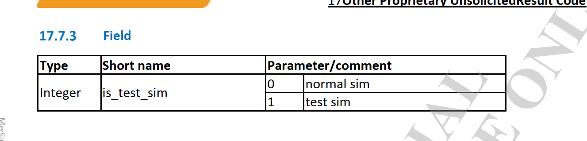
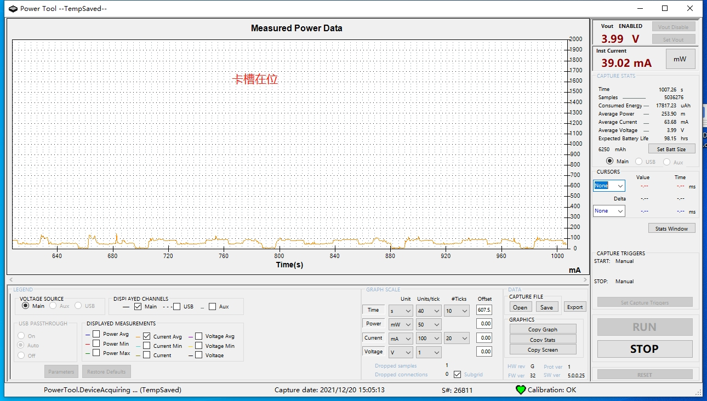
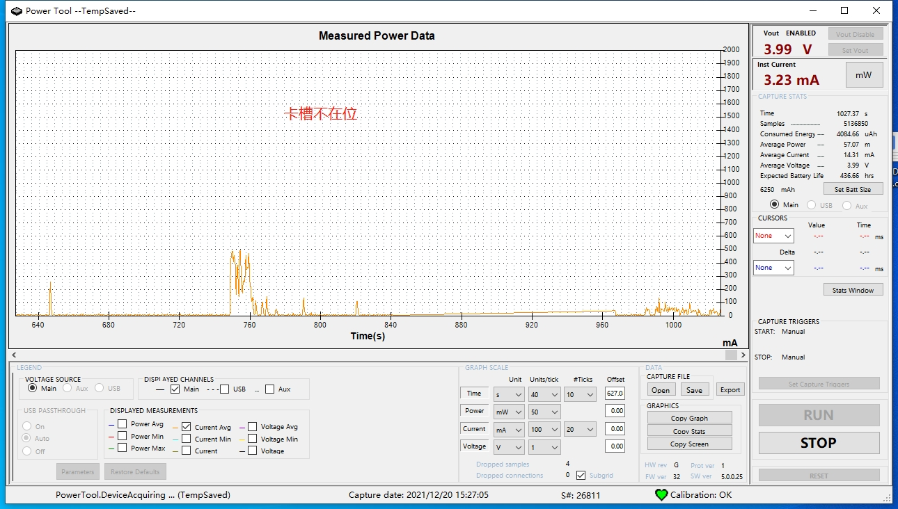
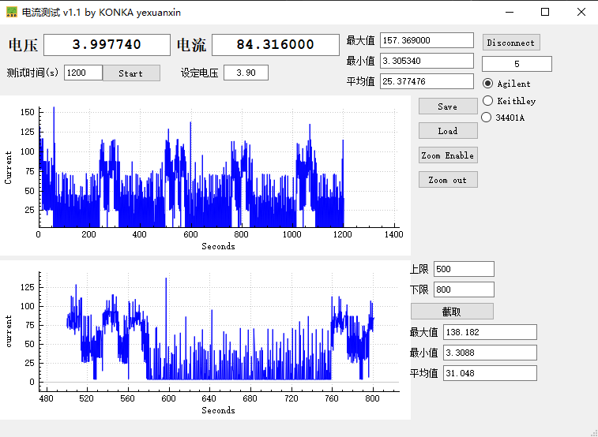
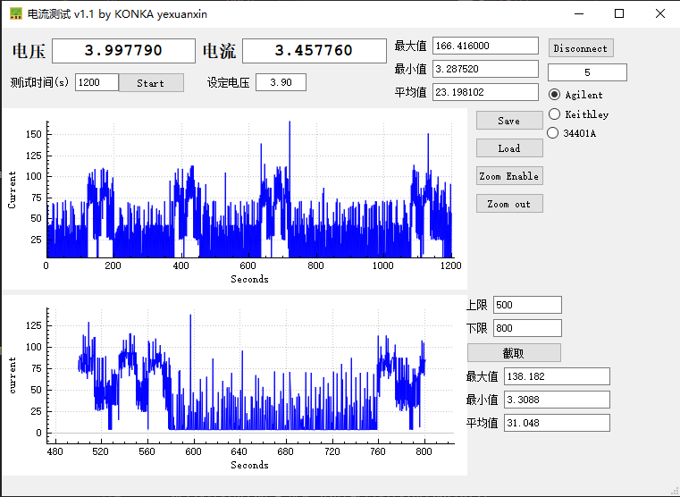
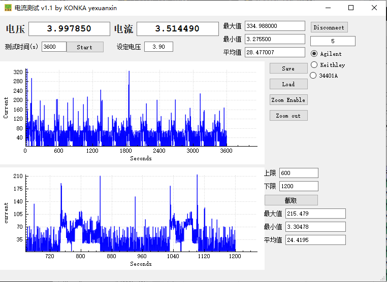
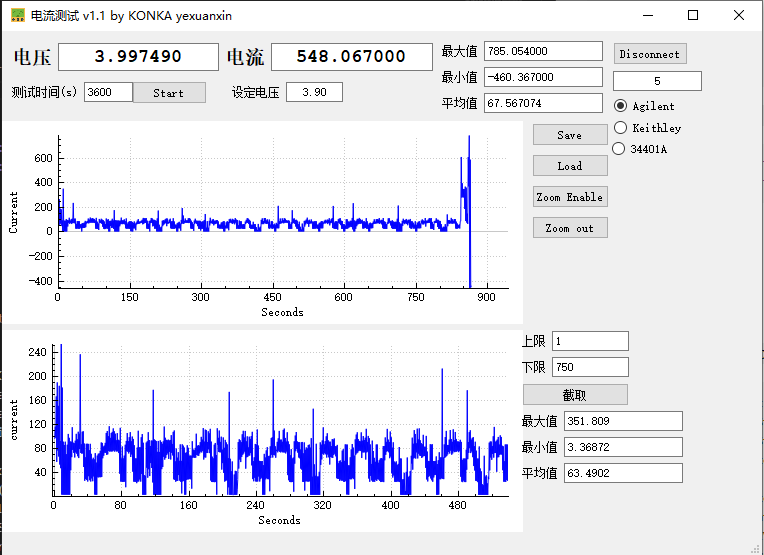
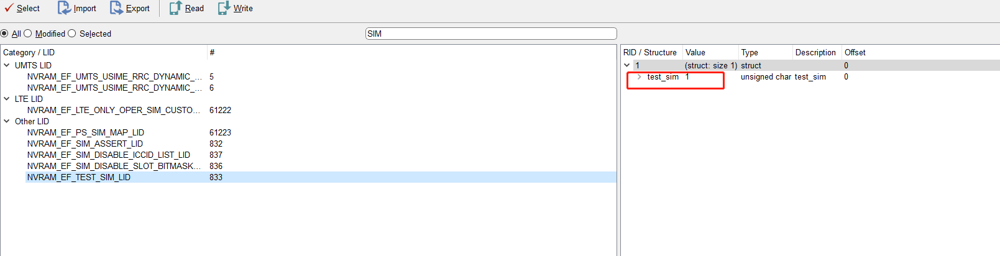
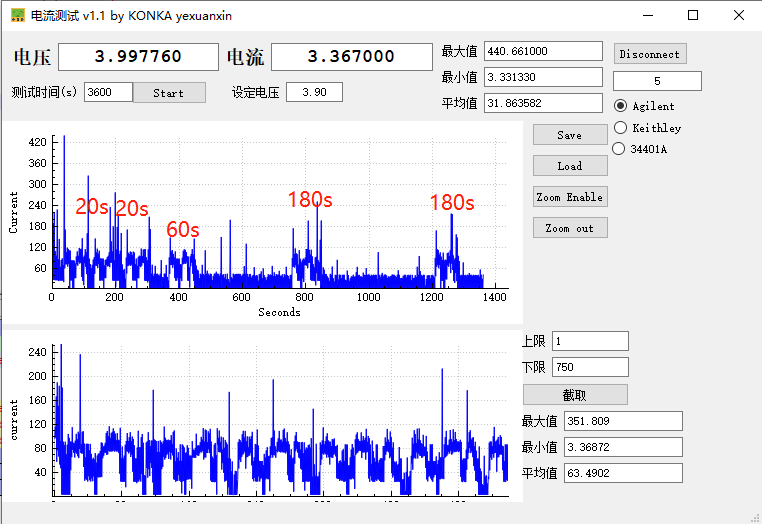

# 概述

Esim休眠功耗大问题分析。

## AT指令解释




## 问题描述

* 1.esim上电休眠，待机15分钟平均功耗为63.68ma：



* 2.esim下电休眠，待机15分钟平均功耗为14.31ma：



## 初步结论

机功耗异常原因主要是欧亚版本esim在上电后，没有做低功耗模式，系统不断搜网造成。

## MTK分析结论

```diff
Dear Customer,

贵司的期望行为是  手机插卡灭屏的情况下的功耗 要保持和 手机没插卡的功耗一致。
	实际结果是   手机插卡灭屏的情况下的功耗比较大，导致续航时间短。 主要原因是手机插卡灭屏的情况下 modem仍然处于激活驻网状态，导致手机整体功耗比较高。
	而手机没插SIM卡时候 modem不处于驻网状态功耗较低。、
-> 现在是MTK modem侧回复，两种场景无法等同，因为既然有卡信息，在radio on的情况下，就会进行搜网以进行快速恢复正常服务或限制服务状态，以实际搜网结果为准。而不插卡的时候，modem也会进行搜网，以获取限制服务时，可以进行紧急电话。
两种情况都不会停止搜网，除非radio off。针对测试来看，当前搜不到网络进行recovery search，可以进行period of timer的客制化修改，可以定义每一次fullband的间隔时间，以降低功耗。

Type	Index	Time	Local Time	Module	TraceType	Message	Comment	Time Differences
PS	17441	2257969546	09:27:56:034	EVAL - NWSEL		MSG_ID_NWSEL_EVAL_PLMN_SEARCH_CNF		
PS	17442	2257969547	09:27:56:034	NWSEL		[NWSEL][PLMN Search CNF] result: PLMN_NOT_FOUND, rat: RAT_LTE, scan_type: FULL_BAND, multi_selected_plmn[0]: 000000		
PS	67644	2258082994	09:28:03:488	NWSEL		NWSEL_RECOVERY_TIMER_ID Timer expires when current is action NWSEL_COMM_NO_ACTION		
PS	193534	2258812133	09:28:50:139	NWSEL		NWSEL_RECOVERY_TIMER_ID Timer starts, period = 10 seconds		
PS	197247	2258968384	09:29:00:153	NWSEL		NWSEL_RECOVERY_TIMER_ID Timer expires when current is action NWSEL_COMM_NO_ACTION		

客制化：

/mcu/custom/service/nvram/nas_nvram_def.c

经过确认要在nv里做客制化

-       以底下為例: 1~6次的fullband間隔為20s, 7~12次的fullband間隔為30s, ...

-        

-      in nas_nvram_def.c

-      NV ID: NVRAM_EF_NWSEL_DATA_LID

-       

-       #ifdef __SGLTE__

-           0xC8,  /*1, 180s, give the enough timer to sniffer @CMCC case 4.3.3/4.1.3*/

-       #else

-           0xC8,  /*1, 20s*/

-       #endif

-           0xC8,  /*2, 20s*/

-       #ifdef __NWSEL_QUICK_SEARCH_FOR_ROAMING__ 

-           0xC8,  /*3, 20s*/

-           0xC8,  /*4, 20s*/

-           0xC8,  /*5, 20s*/

-           0xC8,  /*6, 20s*/

-           0xC8,  /*7, 30s*/

-           0xC8,  /*8, 30s*/

-           0xC8,  /*9, 30s*/

-           0xC8,  /*10, 30s*/

-           0xC8,  /*11, 30s*/

-           0xC8,  /*12, 30s*/

-           0xC8,  /*13, 60s*/


-           0xC8,  /*14, 60s*/

改完nas_nvram_def.c後記得要在nas_nvram_def.h將#define  NVRAM_EF_NWSEL_DATA_LID_VERNO 加1


Brs,
MediaTek Support
```

## 测试

### 1.modem扫描全部改为360s

* 1.使用`ETESTSIM=0`测试结果如下：



* 2.使用`ETESTSIM=1`测试结果如下：



### 2.前三次时间缩短

* 1.扫描周期280s左右。



## 测试结论

* 1.其实上面的图都已经是real sim了，扫描周期修改，都有效。

```java
0 normal sim
1 test sim

AT+ETESTSIM?
+ETESTSIM: 0
OK
```

* 2.而且设置`ETESTSIM`的AT指令如下,设置完后不是立即生效的，需要重启并用AT指令查询。

```java
AT+ETESTSIM=2,0 : Treats TestSIM as TestSIM
AT+ETESTSIM=2,1 : Treats TestSIM same as Normal SIM
```

## 实测

* 1.当ETESTSIM为1时，也就是识别为TEST SIM，扫描周期是10s，无法修改，如下图：



* 2.当被识别成normal sim时，扫描周期使用`NVRAM_EF_NWSEL_DATA_LID`NV里的扫描周期，可修改，如下：


## 软件修改方案

* 我们这个是esim卡，是被modem识别成白卡(TEST SIM)了，而TEST SIM使用的10s recovery timer,也就是扫描周期为10s固定的，无法修改，需要将当前卡强制设置为real SIM，有以下几种方法。

### 1.增加modem AT指令

#### 1.软件架构

* 1.`telcore/client/RilOemClient.cpp`:Ril接收端`RilClient`程序流程如下：

``` java
* RilClient::RilClient(int identity, char* socketName) {
  * activityThread = new StateActivityThread(this);
  * activityThread->run("StateThread");
    * bool RilClient::StateActivityThread::threadLoop() {  跑线程收发socket通信
      * while(1) {
      * client->clientStateCallback();  
        * switch(clientState) {
        * case CLIENT_ACTIVE:
        * handleStateActive();
          * int result = handleSpecialRequestWithArgs(number, args);
           * else if (strcmp(cmd, "SYSTOOL") == 0) {
             * executeSystool(orgArgs); 解析systool指令
               * subCmd = line->atTokNextstr(&err);  AT cmd命令
               * else if(strcmp(subCmd, "AT+ETESTSIM=") == 0) 判断AT指令
                 * rfx_enqueue_request_message_client(RFX_MSG_REQUEST_WRITE_ESIMMODE,(void *) imeiOrBarcode, strlen(imeiOrBarcode), pRI,(RIL_SOCKET_ID) mainSlotId); 
```

* 2.systool发送socket端流程如下`paxdroid/system/core/bootinit/modemtool.cpp`：

```c
* main(int argc, char *argv[]){
  * main(int argc, char *argv[]){
    * write_esim_mode(ESIM_MODEM);
      * gISystoolServiceV1_0->setSystemConfig(ConfigType::ESIM_MODE, vec);
```

* 调用到systool interface接口如下`paxdroid/hardware/interfaces/systool/1.0/default/SystoolServer.cpp`：

```cpp
* Return<int32_t>  SystoolServer::setSystemConfig(ConfigType type, const hidl_vec<uint8_t>& value) {
  * case ConfigType::ESIM_MODE:
  * res = mDevice->set_esim_mode(mDevice, (const unsigned char*)value.data());
```

* `set_esim_mode`接口实现如下`paxdroid/system/core/systool/systool.c`：

```c
* static int systool_m_open(const hw_module_t* module, const char __unused *id,
  * dev->set_esim_mode = systool_set_esim_mode;

int32_t systool_set_esim_mode(struct systool_device *dev, const unsigned char *value) {
    char buf[SOCKET_RECV_LEN] = {0};

    ALOGD("set esim_mode %s\n",value);
	sprintf(buf, "SYSTOOL,AT+ETESTSIM=,%s", value);
    ALOGD("cmd = %s \n", buf);
    int32_t ret = send_to_ril(buf);  //socket发送
    ALOGD("ret = %d \n", ret);
    return ret;
}
```


* 打印如下：

```log
01-11 14:35:52.584  1050  1123 I RilClient: initialize: commandFd is 107
01-11 14:35:52.584  1050  1123 I RilOemClient: systool line = SYSTOOL,AT+ETESTSIM=,0, cmd:SYSTOOL, subCmd:AT+ETESTSIM=, slotId:0, targetSim: 0, imeiOrBarcode:0 arg : (null)
01-11 14:35:52.584  1050  1123 I RilOemClient: arg : (null)
01-11 14:35:52.585  1050  1123 I RilClient: start listen on fd: 26, socket name: rild-oem
01-11 14:35:52.585  1050  1075 E RmcOemHandler: requestWriteEsimMode Enter: AT+ETESTSIM=0
01-11 14:35:52.585  1050  1075 I AT      : [0] AT> AT+ETESTSIM=0 (RIL_CMD_READER_1 tid:504162471104)
```

最后发现这个是modem定制的AT指令才能用，太坑了。

#### 2.具体软件修改

* 1.systool修改如下：

```diff
diff --git a/paxdroid/device/rc_file/M8/init.mt6762_common_M8.rc b/paxdroid/device/rc_file/M8/init.mt6762_common_M8.rc
index 328f33b18b8..ba4b862c26d 100755
--- a/paxdroid/device/rc_file/M8/init.mt6762_common_M8.rc
+++ b/paxdroid/device/rc_file/M8/init.mt6762_common_M8.rc
@@ -17,7 +17,7 @@ on fs
 
 on property:sys.boot_completed=1
     write /sys/class/pax/pax_gpios/value 0x00
-    start modemtool
+    #start modemtool
 
 on property:sys.ttychange=1
     symlink ${pax.ctrl.currentport} /dev/ttyPos0
diff --git a/paxdroid/hardware/interfaces/current.txt b/paxdroid/hardware/interfaces/current.txt
index 500bf66d3a8..5be77a24bd0 100755
--- a/paxdroid/hardware/interfaces/current.txt
+++ b/paxdroid/hardware/interfaces/current.txt
@@ -4,5 +4,5 @@ b5772891d23d223dab8525ce603ae743c9d2aa0c1e4d7ff487c370af15b32865 paxdroid.hardwa
 f05b057688945efaab1200df9b74d9b976636fe41c016536e65d87214cc3ab89 paxdroid.hardware.hello@1.1::IHello
 72d5e633f2c89901e98846565128af1417b95e7a535ae70b28c0fa867dc9b703 paxdroid.hardware.paxservice@1.0::types
 ef8f92fc658f5d4300d3b0ded236eab80231f863466b42c2af6c772e175735fd paxdroid.hardware.paxservice@1.0::IPaxApiService
-1be06fcf4df534ec501fe828cd84a8dbe29f9ff4461102fc1939081aea85e4e0 paxdroid.hardware.systool@1.0::types
+65dccade01e58ff0bb3549de868a97c37dd1a5e5a568832f0dbce91d0e62be19 paxdroid.hardware.systool@1.0::types
 1a18b6bd90b3a3bb52f738742f7c8c61fa334487244f80a4009f252d28a89bb5 paxdroid.hardware.systool@1.0::ISystoolServer
diff --git a/paxdroid/hardware/interfaces/systool/1.0/default/SystoolServer.cpp b/paxdroid/hardware/interfaces/systool/1.0/default/SystoolServer.cpp
index 0118deabe59..39dbd32d528 100755
--- a/paxdroid/hardware/interfaces/systool/1.0/default/SystoolServer.cpp
+++ b/paxdroid/hardware/interfaces/systool/1.0/default/SystoolServer.cpp
@@ -61,6 +61,9 @@ Return<int32_t>  SystoolServer::setSystemConfig(ConfigType type, const hidl_vec<
         case ConfigType::SERIALNO:
              res = mDevice->set_serialNo(mDevice, (const unsigned char*)value.data());
              break;
+		case ConfigType::ESIM_MODE:
+			 res = mDevice->set_esim_mode(mDevice, (const unsigned char*)value.data());
+			 break;
         default:
              break;
     }
diff --git a/paxdroid/hardware/interfaces/systool/1.0/types.hal b/paxdroid/hardware/interfaces/systool/1.0/types.hal
index 9e1e83b1f3d..e349574580b 100755
--- a/paxdroid/hardware/interfaces/systool/1.0/types.hal
+++ b/paxdroid/hardware/interfaces/systool/1.0/types.hal
@@ -9,4 +9,5 @@ enum ConfigType : uint32_t {
     SYSVER,
     DEVICEINFO,
     MODEM_VERSION,
+    ESIM_MODE,
 };
diff --git a/paxdroid/hardware/libhardware/include/hardware/systool.h b/paxdroid/hardware/libhardware/include/hardware/systool.h
index d93eb3a1783..4a86b3a211f 100755
--- a/paxdroid/hardware/libhardware/include/hardware/systool.h
+++ b/paxdroid/hardware/libhardware/include/hardware/systool.h
@@ -71,6 +71,7 @@ typedef struct systool_device {
     int32_t (*get_device_info)(struct systool_device *dev, unsigned char *result);
     int32_t (*exec_shell_cmd)(struct systool_device *dev, const char *cmd, int32_t pid, int32_t uid);
     int32_t (*get_modem_version)(struct systool_device *dev, unsigned char *result);
+    int32_t (*set_esim_mode)(struct systool_device *dev, const unsigned char *value);
 }systool_device_t;
 
 
diff --git a/paxdroid/hardware/libhardware/modules/systool/systool.c b/paxdroid/hardware/libhardware/modules/systool/systool.c
index 171612de393..bbdf8c52725 100755
--- a/paxdroid/hardware/libhardware/modules/systool/systool.c
+++ b/paxdroid/hardware/libhardware/modules/systool/systool.c
@@ -1217,6 +1217,18 @@ int32_t systool_get_modem_version(struct systool_device *dev, unsigned char *res
 
 }
 
+int32_t systool_set_esim_mode(struct systool_device *dev, const unsigned char *value) {
+    char buf[SOCKET_RECV_LEN] = {0};
+
+    ALOGD("set esim_mode %s\n",value);
+	sprintf(buf, "SYSTOOL,AT+ETESTSIM=,%s", value);
+    ALOGD("cmd = %s \n", buf);
+    int32_t ret = send_to_ril(buf);
+    ALOGD("ret = %d \n", ret);
+    return ret;
+
+}
+
 extern int serverExecShellCmd(char *cmd, int callingPid, int callingUid);
 int32_t systool_exec_shell_cmd(struct systool_device *dev, const char *cmd, int32_t pid, int32_t uid) {
     ALOGD("pid=%d, uid=%d\n", pid, uid);
@@ -1255,6 +1267,7 @@ static int systool_m_open(const hw_module_t* module, const char __unused *id,
     dev->get_device_info = systool_get_device_info;
     dev->exec_shell_cmd = systool_exec_shell_cmd;
     dev->get_modem_version = systool_get_modem_version;
+    dev->set_esim_mode = systool_set_esim_mode;
 
     *device = (hw_device_t*) dev;
     return 0;
diff --git a/paxdroid/system/core/bootinit/modemtool.cpp b/paxdroid/system/core/bootinit/modemtool.cpp
index 284df917fd0..cd002248eb2 100755
--- a/paxdroid/system/core/bootinit/modemtool.cpp
+++ b/paxdroid/system/core/bootinit/modemtool.cpp
@@ -80,7 +80,6 @@ int write_nvram_imei(int index, char *value) {
     return result;
 }
 
-
 /**
  * set the 15 digit of the imei
  * [get_IMEI_checkDigit description]
@@ -187,10 +186,32 @@ int check_imei(){
 
 }
 
+int write_esim_mode(char *value) {
+    int result = -1;
+    char buf[IMEI_LEN + 5] = {0};
+
+    sprintf(buf, "%s", value);
+
+    ALOGD("value = %s, len=%zu \n", buf, strlen(buf));
+
+    if (getSystoolService() == nullptr) {
+        ALOGE("systoll service is null");
+        return result;
+    }
+
+    hidl_vec<uint8_t> vec;
+
+    vec.setToExternal(const_cast<uint8_t *>((uint8_t *)buf), strlen(buf));
+
+    result = gISystoolServiceV1_0->setSystemConfig(ConfigType::ESIM_MODE, vec);
+
+    return result;
+}
 
 int main(int argc, char *argv[]){
     int result = -1;
     char info[MODEM_VERSION_LENGTH + 1] = {0};
+	char ESIM_MODEM[] = "0";
 
     ALOGD("modem tool start");
     init_tp_version();
@@ -207,6 +228,9 @@ int main(int argc, char *argv[]){
                        }
                    };
     gISystoolServiceV1_0->getSystemConfig(ConfigType::MODEM_VERSION, MODEM_VERSION_LENGTH, hidl_cb);
+    //[NEW FEATURE]-BEGIN by wugangnan@paxsz.com 2022-01-07, for Treats ESIM same as Normal SIM,Reduce scan frequency.
+    //write_esim_mode(ESIM_MODEM);
+    //[NEW FEATURE]-END by wugangnan@paxsz.com 2022-01-07, for Treats ESIM same as Normal SIM,Reduce scan frequency.
 
     printf("%s", info);
     ALOGD("modem tool info is %s",info);
```

* 2.ril层修改如下：

```diff
diff --git a/vendor/mediatek/proprietary/hardware/ril/fusion/mtk-ril/framework/base/RfxIdToMsgIdUtils.cpp b/vendor/mediatek/proprietary/hardware/ril/fusion/mtk-ril/framework/base/RfxIdToMsgIdUtils.cpp
index c3ac244495d..9958a505bb8 100755
--- a/vendor/mediatek/proprietary/hardware/ril/fusion/mtk-ril/framework/base/RfxIdToMsgIdUtils.cpp
+++ b/vendor/mediatek/proprietary/hardware/ril/fusion/mtk-ril/framework/base/RfxIdToMsgIdUtils.cpp
@@ -2179,6 +2179,7 @@ int RfxIdToMsgIdUtils::msgIdToId(int msgId) {
         case RFX_MSG_REQUEST_READ_BARCODE:
         case RFX_MSG_REQUEST_WRITE_BARCODE:
         case RFX_MSG_REQUEST_READ_MODEMVERISON:
+        case RFX_MSG_REQUEST_WRITE_ESIMMODE:
             return RIL_UNSOL_OEM_HOOK_RAW;
         //[FEATURE]-Add-END by (zengzp@paxsz.com), 2020/6/15,for add at command for systool
         ///M: Video ringtone event indication
diff --git a/vendor/mediatek/proprietary/hardware/ril/fusion/mtk-ril/framework/include/RfxOemMessageId.h b/vendor/mediatek/proprietary/hardware/ril/fusion/mtk-ril/framework/include/RfxOemMessageId.h
index 3c414c6c266..8ff0905378c 100755
--- a/vendor/mediatek/proprietary/hardware/ril/fusion/mtk-ril/framework/include/RfxOemMessageId.h
+++ b/vendor/mediatek/proprietary/hardware/ril/fusion/mtk-ril/framework/include/RfxOemMessageId.h
@@ -85,7 +85,8 @@ RFX_MSG_ID_EXPN(RFX_MSG_REQUEST_WRITE_IMEI)
 RFX_MSG_ID_EXPN(RFX_MSG_REQUEST_READ_BARCODE)
 RFX_MSG_ID_EXPN(RFX_MSG_REQUEST_WRITE_BARCODE)
 RFX_MSG_ID_EXPN(RFX_MSG_REQUEST_READ_MODEMVERISON)
+RFX_MSG_ID_EXPN(RFX_MSG_REQUEST_WRITE_ESIMMODE)
 //[FEATURE]-Add-END by (zengzp@paxsz.com), 2020/6/15,for add at command for systool
 RFX_MSG_ID_EXPN(RFX_MSG_REQUEST_SET_MODEM_CONFIG)
 RFX_MSG_ID_EXPN(RFX_MSG_EVENT_OEM_RAW_URC)
-#endif
\ No newline at end of file
+#endif
diff --git a/vendor/mediatek/proprietary/hardware/ril/fusion/mtk-ril/mdcomm/oem/RmcOemRequestHandler.cpp b/vendor/mediatek/proprietary/hardware/ril/fusion/mtk-ril/mdcomm/oem/RmcOemRequestHandler.cpp
index 8d08bb0165d..5d2083aa2c1 100755
--- a/vendor/mediatek/proprietary/hardware/ril/fusion/mtk-ril/mdcomm/oem/RmcOemRequestHandler.cpp
+++ b/vendor/mediatek/proprietary/hardware/ril/fusion/mtk-ril/mdcomm/oem/RmcOemRequestHandler.cpp
@@ -115,6 +115,8 @@ RFX_REGISTER_DATA_TO_REQUEST_ID(RfxStringData, RfxIntsData,
         RFX_MSG_REQUEST_WRITE_BARCODE);
 RFX_REGISTER_DATA_TO_REQUEST_ID(RfxStringData, RfxStringData,
         RFX_MSG_REQUEST_READ_MODEMVERISON);
+RFX_REGISTER_DATA_TO_REQUEST_ID(RfxStringData, RfxStringData,
+        RFX_MSG_REQUEST_WRITE_ESIMMODE);
 //[FEATURE]-Add-END by (zengzp@paxsz.com), 2020/6/15,for add at command for systool
 RFX_REGISTER_DATA_TO_REQUEST_ID(RfxIntsData, RfxVoidData,
         RFX_MSG_REQUEST_SET_MODEM_CONFIG);
@@ -150,6 +152,7 @@ RmcOemRequestHandler::RmcOemRequestHandler(int slot_id, int channel_id) :
         RFX_MSG_REQUEST_READ_BARCODE,
         RFX_MSG_REQUEST_WRITE_BARCODE,
         RFX_MSG_REQUEST_READ_MODEMVERISON,
+	RFX_MSG_REQUEST_WRITE_ESIMMODE,
         //[FEATURE]-Add-END by (zengzp@paxsz.com), 2020/6/15,for add at command for systool
         RFX_MSG_REQUEST_SET_MODEM_CONFIG,
     };
@@ -279,7 +282,9 @@ void RmcOemRequestHandler::onHandleRequest(const sp<RfxMclMessage>& msg) {
         case RFX_MSG_REQUEST_READ_MODEMVERISON:
             requestReadModemVersion(msg);
             break;
-
+        case RFX_MSG_REQUEST_WRITE_ESIMMODE:
+            requestWriteEsimMode(msg);
+            break;
         //[FEATURE]-Add-END by (zengzp@paxsz.com), 2020/6/15,for add at command for systool
         case RFX_MSG_REQUEST_SET_MODEM_CONFIG:
             requestSetModemConfig(msg);
@@ -2132,6 +2137,26 @@ void RmcOemRequestHandler::requestReadModemVersion(const sp<RfxMclMessage>& msg)
     responseToTelCore(responseMsg);
 }
 
+void RmcOemRequestHandler::requestWriteEsimMode(const sp<RfxMclMessage>& msg){
+    int err = 0;
+    sp<RfxMclMessage> responseMsg;
+
+	char* esim_mode = (char*)(msg->getData()->getData());
+
+    RFX_LOG_E(RFX_LOG_TAG, "requestWriteEsimMode Enter: AT+ETESTSIM=%s",esim_mode);
+    sp<RfxAtResponse> atResponse = atSendCommand(String8::format("AT+ETESTSIM=%s",esim_mode));
+    // check at cmd result, consider default as success
+    if (atResponse->getError() != 0 || atResponse->getSuccess() != 1) {
+        logE(RFX_LOG_TAG, "requestWriteEsimMode:  failed");
+        responseMsg = RfxMclMessage::obtainResponse(RIL_E_GENERIC_FAILURE,
+                RfxVoidData(), msg);
+    } else {
+        responseMsg = RfxMclMessage::obtainResponse(RIL_E_SUCCESS,
+                RfxVoidData(), msg);
+    }
+    responseToTelCore(responseMsg);
+}
+
 void RmcOemRequestHandler::requestWriteImei(const sp<RfxMclMessage>& msg) {
     int err = 0;
     sp<RfxMclMessage> responseMsg;
diff --git a/vendor/mediatek/proprietary/hardware/ril/fusion/mtk-ril/mdcomm/oem/RmcOemRequestHandler.h b/vendor/mediatek/proprietary/hardware/ril/fusion/mtk-ril/mdcomm/oem/RmcOemRequestHandler.h
index db9925e3035..adc8222acf7 100755
--- a/vendor/mediatek/proprietary/hardware/ril/fusion/mtk-ril/mdcomm/oem/RmcOemRequestHandler.h
+++ b/vendor/mediatek/proprietary/hardware/ril/fusion/mtk-ril/mdcomm/oem/RmcOemRequestHandler.h
@@ -121,6 +121,8 @@ class RmcOemRequestHandler : public RfxBaseHandler {
         void requestWriteBarcode(const sp<RfxMclMessage>& msg);
 
         void requestReadModemVersion(const sp<RfxMclMessage>& msg);
+ 
+        void requestWriteEsimMode(const sp<RfxMclMessage>& msg);
         //[FEATURE]-Add-END by (zengzp@paxsz.com), 2020/6/15,for add at command for systool
         void requestSetModemConfig(const sp<RfxMclMessage>& msg);
 
diff --git a/vendor/mediatek/proprietary/hardware/ril/fusion/mtk-ril/telcore/client/RilOemClient.cpp b/vendor/mediatek/proprietary/hardware/ril/fusion/mtk-ril/telcore/client/RilOemClient.cpp
index efba0ddd57a..5ae8cc2a865 100755
--- a/vendor/mediatek/proprietary/hardware/ril/fusion/mtk-ril/telcore/client/RilOemClient.cpp
+++ b/vendor/mediatek/proprietary/hardware/ril/fusion/mtk-ril/telcore/client/RilOemClient.cpp
@@ -174,7 +174,7 @@ void RilOemClient::requestComplete(RIL_Token token, RIL_Errno e, const void *res
     }
     //[FEATURE]-Add-BEGIN by (zengzp@paxsz.com), 2020/6/15,for add at command for systool
     else if (RFX_MSG_REQUEST_READ_IMEI == info->request || RFX_MSG_REQUEST_READ_BARCODE == info->request
-            || RFX_MSG_REQUEST_READ_MODEMVERISON == info->request) {
+            || RFX_MSG_REQUEST_READ_MODEMVERISON == info->request || RFX_MSG_REQUEST_WRITE_ESIMMODE == info->request) {
         String8 strResult;
         RFX_LOG_I(RFX_LOG_TAG, "request for READ imei or barcode returned");
 
@@ -812,7 +812,11 @@ void RilOemClient::executeSystool(char *arg) {
          rfx_enqueue_request_message_client(RFX_MSG_REQUEST_READ_MODEMVERISON,
             NULL, 0, pRI,
             (RIL_SOCKET_ID) mainSlotId);
-
+    } else if(strcmp(subCmd, "AT+ETESTSIM=") == 0){
+         pRI->request = RFX_MSG_REQUEST_WRITE_ESIMMODE;
+         rfx_enqueue_request_message_client(RFX_MSG_REQUEST_WRITE_ESIMMODE,
+            (void *) imeiOrBarcode, strlen(imeiOrBarcode), pRI,
+            (RIL_SOCKET_ID) mainSlotId);
     }
 
     delete line;
diff --git a/vendor/mediatek/proprietary/hardware/ril/fusion/mtk-ril/telcore/oem/RtcOemController.cpp b/vendor/mediatek/proprietary/hardware/ril/fusion/mtk-ril/telcore/oem/RtcOemController.cpp
index 379abaec5ca..65edf979cc3 100755
--- a/vendor/mediatek/proprietary/hardware/ril/fusion/mtk-ril/telcore/oem/RtcOemController.cpp
+++ b/vendor/mediatek/proprietary/hardware/ril/fusion/mtk-ril/telcore/oem/RtcOemController.cpp
@@ -92,7 +92,8 @@ void RtcOemController::onInit() {
         RFX_MSG_REQUEST_READ_BARCODE,
         RFX_MSG_REQUEST_WRITE_BARCODE,
         RFX_MSG_REQUEST_READ_MODEMVERISON,
-        //[FEATURE]-Add-END by (zengzp@paxsz.com), 2020/6/15,for add at command for systool
+        RFX_MSG_REQUEST_WRITE_ESIMMODE,
+	//[FEATURE]-Add-END by (zengzp@paxsz.com), 2020/6/15,for add at command for systool
         RFX_MSG_REQUEST_SET_MODEM_CONFIG,
     };
 
@@ -132,6 +133,7 @@ bool RtcOemController::onCheckIfRejectMessage(const sp<RfxMessage>& message,
             || message->getId() == RFX_MSG_REQUEST_READ_BARCODE
             || message->getId() == RFX_MSG_REQUEST_WRITE_BARCODE
             || message->getId() == RFX_MSG_REQUEST_READ_MODEMVERISON
+            || message->getId() == RFX_MSG_REQUEST_WRITE_ESIMMODE
             //[FEATURE]-Add-END by (zengzp@paxsz.com), 2020/6/15,for add at command for systool
             || message->getId() == RFX_MSG_REQUEST_SET_MODEM_CONFIG
             )) {
```


### 2.手动AT指令

* MTK建议如下,但是该方法需要下AT cmd后重启才生效，比较麻烦。

```diff
需要下AT cmd后重启才生效。
1) 测试时，下AT cmd给modem AT+ETESTSIM=2,1 。

2) 在mak file里 __MTK_INTERNAL_ENG_USER__ is enabled 。


--- a/paxmodem/mcu/common/interface/service/nvram/nas_nvram_def.h

+++ b/paxmodem/mcu/common/interface/service/nvram/nas_nvram_def.h

@@ -123,7 +123,7 @@ typedef enum

 }nvram_lid_nas_enum;

 // VERNO

-#define  NVRAM_EF_NWSEL_DATA_LID_VERNO "005"

+#define  NVRAM_EF_NWSEL_DATA_LID_VERNO "006"


--- a/paxmodem/mcu/make/projects/TK_MD_BASIC(LWTG_6177M_R3_6762).mak
+++ b/paxmodem/mcu/make/projects/TK_MD_BASIC(LWTG_6177M_R3_6762).mak
@@ -2250,7 +2250,7 @@ COM_DEFS_FOR_MT6762_LTE_MT6177M = MT6177M_RF MT6177M_LTE_RF
 # *************************************************************************

 CUSTOM_OPTION += __SIM_SUPPORT_NO_DEBOUNCE__
-
+CUSTOM_OPTION += __MTK_INTERNAL_ENG_USER__


--- a/paxmodem/mcu/make/common/rule_def/common_def.mak
+++ b/paxmodem/mcu/make/common/rule_def/common_def.mak
@@ -2666,7 +2666,7 @@ ifdef MT6177M_RFCCA_SUPPORT
   endif
 endif

-ifeq ($(filter REL_CR_%,$(strip $(RELEASE_PACKAGE))),)
+ifneq ($(filter REL_CR_%,$(strip $(RELEASE_PACKAGE))),)
   COM_DEFS += __MTK_INTERNAL_ENG_USER__
   ifeq ($(filter __MTK_INTERNAL_ENG_USER__,$(COM_DEFS)),)

--- a/paxmodem/mcu/pcore/custom/service/nvram/nas_nvram_def.c
+++ b/paxmodem/mcu/pcore/custom/service/nvram/nas_nvram_def.c
@@ -202,21 +202,21 @@ nvram_ef_nwsel_data_struct const COMMON_NVRAM_EF_NWSEL_DATA_DEFAULT[] =
     0x3C   /*19, 60s*/
 #else
     0x3C,  /*3, 60s*/
-    0x3C,  /*4, 60s*/
-    0x3C,  /*5, 60s*/
-    0x3C,  /*6, 60s*/
-    0x5A,  /*7, 90s*/
-    0x5A,  /*8, 90s*/
-    0x5A,  /*9, 90s*/
-    0x5A,  /*10, 90s*/
-    0x5A,  /*11, 90s*/
-    0x5A,  /*12, 90s*/
-    0xB4,  /*13, 180s*/
-    0xB4,  /*14, 180s*/
-    0xB4,  /*15, 180s*/
-    0xB4,  /*16, 180s*/
-    0xB4,  /*17, 180s*/
-    0xB4,  /*18, 180s*/
+    0x168,  /*4, 360s*/
+    0x168,  /*5, 360s*/
+    0x168,  /*6, 360s*/
+    0x168,  /*7, 360s*/
+    0x168,  /*8, 360s*/
+    0x168,  /*9, 360s*/
+    0x168,  /*10, 360s*/
+    0x168,  /*11, 360s*/
+    0x168,  /*12, 360s*/
+    0x168,  /*13, 360s*/
+    0x168,  /*14, 360s*/
+    0x168,  /*15, 360s*/
+    0x168,  /*16, 360s*/
+    0x168,  /*17, 360s*/
+    0x168,  /*18, 360s*/
```

### 3.修改modem nv

* 我发现下AT cmd的实际情况也就是修改了NVRAM_EF_TEST_SIM_LID这个NV的值。

所以我尝试直接将NVRAM_EF_TEST_SIM_LID修改为normal SIM ，发现也是可行的，修改方法如下：

```diff
--- a/paxmodem/mcu/pcore/custom/service/nvram/sim_nvram_def.c
+++ b/paxmodem/mcu/pcore/custom/service/nvram/sim_nvram_def.c
@@ -106,6 +106,9 @@
 #include "sim_nvram_editor.h"

 // Default Values
+// [FEATURE]-MOD-BEGIN by wugangnan 2022-01-11, Treats TestSIM same as Normal SIM
+kal_uint8 const NVRAM_EF_PAX_TEST_SIM_DEFAULT[] = { 0x01 };
+// [FEATURE]-MOD-END by wugangnan 2022-01-11, Treats TestSIM same as Normal SIM

 // LID Declaration
 ltable_entry_struct logical_data_item_table_sim[] =
@@ -124,7 +127,10 @@ ltable_entry_struct logical_data_item_table_sim[] =
         NVRAM_EF_TEST_SIM_LID,
         NVRAM_EF_TEST_SIM_TOTAL,
         NVRAM_EF_TEST_SIM_SIZE,
-        NVRAM_NORMAL(NVRAM_EF_ZERO_DEFAULT),
+               // [FEATURE]-MOD-BEGIN by wugangnan 2022-01-11, Treats TestSIM same as Normal SIM
+        //NVRAM_NORMAL(NVRAM_EF_ZERO_DEFAULT),
+               NVRAM_NORMAL(NVRAM_EF_PAX_TEST_SIM_DEFAULT),
+               // [FEATURE]-MOD-END by wugangnan 2022-01-11, Treats TestSIM same as Normal SIM
         NVRAM_CATEGORY_USER,
         NVRAM_ATTR_AVERAGE,
```

* 1.修改后查询nv值



* 2.修改后测试，发现扫描周期修改有效，使用的是`COMMON_NVRAM_EF_NWSEL_DATA_DEFAULT`扫描周期。

