# 概述

MTK ELT工具，驻网

## 参考

* [ELT工具的使用](https://blog.csdn.net/qq_35427437/article/details/111415060)

* [SS7信令协议栈，MTP1，MTP2，MTP3，SCCP，TCAP，ISUP，TUP](https://blog.csdn.net/zhangtuo/article/details/5710541?ops_request_misc=&request_id=&biz_id=102&utm_term=MTP3&utm_medium=distribute.pc_search_result.none-task-blog-2~all~sobaiduweb~default-0-5710541.first_rank_v2_pc_rank_v29&spm=1018.2226.3001.4187)

* [手机主叫的信道流程与Modem Log简单分析](https://blog.csdn.net/zx249388847/article/details/52637563)

## 各个窗口的信息

* PS Integrated：各个层次的信息总和，包括OTA Messages ，System Trace。

* OTA Messages：只包含网络层的打印信息（RRC，MM，CM以及系统广播）。

* System Trace：主要包括AT的打印信息。

根据OSI的分层模型筛选各个层次的信息：View ->PS Modules

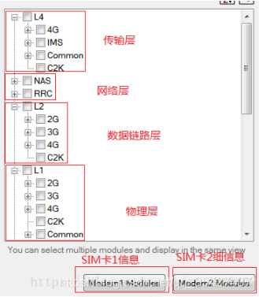

* OTA Messages窗口的筛选：右键 -> View Filter

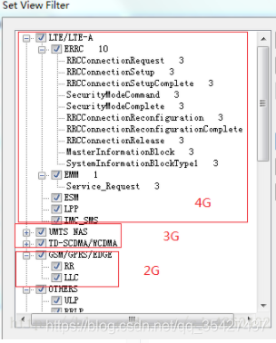

## 信令与协议的区别

* 信令是一种特殊的指令，专门用于控制电路的，常见于电路交换系统。

* 协议是一种泛指，并没有什么明确的或者说具体的说法，说白了就是一种约束力较低的标准。

应用的网络不同，叫法不同；互联网中网元间传送的是协议。而固定电话网与移动核心网内的各局间传送的控制信息则为信令。

智能机的处理器：分为AP和BP。

* AP：Application Processor，即应用处理器，可以把AP看作计算机，AP上运行了操作系统和应用软件，我们平时说的某某手机双核就是指AP。

* BP：Baseband Processor，即基带处理器，可以把BP看作计算机的无线MODEM，这个无线modem通过AT接口（相当于计算机和调制解调器之间的接口，但各厂家都有扩展命令）提供通话、短消息、上网、UIM卡等功能。

> 手机使用的通讯协议主要是TCP/IP，参照osi模型划分，tcp/ip分为五层：

分别从协议和信令角度上看这五层模型：

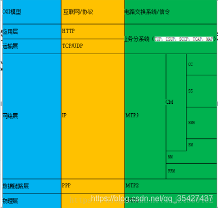

```
MTP1(消息传递部分第一层)：即物理层。
MTP2(消息传递部分第二层)：即数据链路层。
MTP3(消息传递部分第三层)：即网络层。 
SCCP（信令连接控制部分） 
TCAP（事务处理应用部分）
ISUP（ISDN用户部分）
TUP（电话用户部分）
```
- MTP1 
  　　MTP1是SS7协议栈中的最底层，对应于OSI模型中的物理层，这一层定义了数字链路在物理上，电气上及功能上的特性。物理接口的定义包括：E－1，T－1，DS－1，V.35,DS－0，DS －0A（56K）。

- MTP2 
  　　MTP2确保消息在链路上实现精确的端到端传送。MTP2提供流控制，消息序号，差错检查等功能。当传送出错时，出错的消息会被重发。MTP2对应OSI模型中的数据链路层。

- MTP3
  　　MTP3在SS7信令网中提供两个信令点间消息的路由选择功能，消息在依次通过MTP1，MTP2，MTP3层之后，可能会被发送回MTP2再传向别的信令点，也可能会传递给某个应用层，如：SCCP或ISUP层。MTP3还提供一些网管功能的支持，包括：流量控制，路由选择和链路管理。MTP3对应OSI模型中的网络层。

- SCCP（信令连接控制部分）
  　　SCCP位于MTP之上，为MTP提供附加功能，以便通过SS7信令网在信令点之间传递电路相关和非电路相关的消息，提供两类无连接业务和两类面向连接的业务。 无连接业务是指在两个应用实体间，不需要建立逻辑连接就可以传递信令数据。面向连接的业务在数据传递之前应用实体之间必须先建立连接，可以是一般性的连接，也可以是逻辑连接。 SCCP以全局码（GT）的形式扩展SS7协议的寻址能力和路由能力，这些扩展基于被叫号码的寻址信息。

- TCAP（事务处理应用部分）
  　　TCAP允许应用调用远端信令点的一个或多个操作，并返回操作的结果。比如：数据库访问或远端调用处理命令等。使用SCCP无连接业务（基本的或有序的），TCAP 在两个用户应用之间提供事务处理对话。

- ISUP（ISDN用户部分）
  　　ISUP在交换局提供基于电路的连接，它直接和MTP3层通信。 ISUP提供基础电信业务，包括连接建立，监示和释放。

- TUP（电话用户部分）
  　　在ITU－TS标准里，TUP和ISUP功能相似，提供相似的业务（如：呼叫建立和拆除）。TUP提供的业务比ISUP少，不支持ISUP中某些业务类别，比如：非话音业务和补充业务，还有，TUP不传递与电路无关的消息包。

- TUP与ISUP比较
  - 应用范围：TUP主要用于南美洲，墨西哥，亚洲和东欧国家。而ISUP用于其他地方的国家。
  - ISUP比TUP提供更丰富的业务，特别是非话音数字业务。
  - TUP和ISUP都提供快速的呼叫建立和拆除；都在呼叫请求消息里包含主叫号码。

* 手机和基站收发台的协议层的分层结构如下：

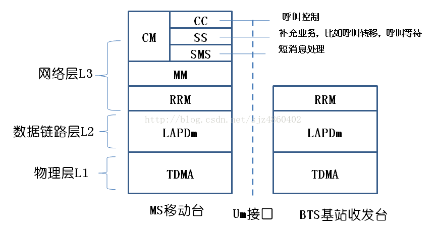

## 信道

在无线领域里，信道也就是常说的“频段（Channel）”


| 信道  | 描述                                                         |
| ----- | ------------------------------------------------------------ |
| PCH   | 寻呼信道（接收短信，接听来电之前，网络会通过此信道寻呼MS）   |
| AGCH  | 允许接入信道                                                 |
| RACH  | 随机接入信道                                                 |
| BCCH  | 广播信道（MS时刻接收此信道的广播，以此获得当前的信号强度，小区识别） |
| SACCH | 慢速随路信道（信道容量稍大，载频消息，也可发送短消息）       |
| SDCCH | 控制信道（信道容量稍大，也可发送短消息）                     |
| TCH   | 语音业务信道（信道容量大，专用信道）                         |

## 系统消息

MS无论是在空闲模式还是专用模式下，都会时刻接收到网络侧（基站）发出的系统广播，根据这些广播的信息得知当前的网络情况。分别为GSM，WCDMA，LTE的系统广播。

### 1.GSM系统消息

* MTK的GSM系统消息打印：解析系统信息

| 消息   | 描述                                                         |
| ------ | ------------------------------------------------------------ |
| NW->MS | RR__SI_1 (ARFCN[23], TC[0])                                  |
| NW->MS | RR__SI_2 (ARFCN[23], TC[1])                                  |
| NW->MS | RR__SI_5TER (ARFCN[23], TC[255])                             |
| NW->MS | RR__SI_2QUATER (ARFCN[23], TC[5]) 涉及小区重选的系统消息     |
| SIB1   | 主要描述了随机接入控制信息(RACH)和小区频点分配表(即CA表)，在BCCH信道上发送。 |
| SIB2   | 主要描述了随机接入控制信息(RACH)、网络色码允许(NCC Permitted)和邻近小区的频点分配表(即BA1表)，在BCCH信道上发送。手机通过读取和解码BA1表可以在空闲模式下(IDLE方式)进行小区重选。 |
| SIB3   | 主要描述了位置区标识、小区标识、随机接入控制信息(RACH)以及和小区选择有关的参数。它是必选的，在BCCH信道上发送，是系统消息中最重要的消息之一。 |
| SIB4   | 主要描述了位置区标识、随机接入控制信息(RACH)、小区选择参数以及可选的CBCH信道信息。它是必选的，在BCCH信道上 |
| SIB5   | 主要描述了BCCH频率列表和相邻小区的相关参数，在SACCH信道上（专用模式） |
| SIB6   | 主要描述了小区标识、位置区标识、单元选项、NCC允许等信息，在SACCH信道上（专用模式） |
| SIB7   | 小区重选信息                                                 |
| SIB8   | 小区重选信息                                                 |

### 2.WCDMA系统消息

* SIB3系统消息：

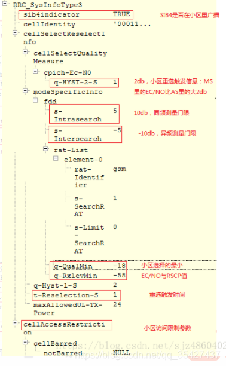

### 3.LTE系统消息

MTK的LTE系统消息打印：解析系统信息

| 方向   | 消息                                                 |
| ------ | ---------------------------------------------------- |
| NW->MS | SystemInformationBlockType1 (EARFCN[1650], PCI[118]) |
| NW->MS | SIB2 (EARFCN[1650], PCI[118])                        |
| NW->MS | SIB3 (EARFCN[1650], PCI[118])                        |
| NW->MS | SIB5 (EARFCN[1650], PCI[118])                        |

SI:SI消息中承载的是SIB2~SIB13，在PDSCH上发送，表现为“RRC_SYS_INFO”。

| SIB1~SIB13 | 描述                                                         |
| ---------- | ------------------------------------------------------------ |
| SIB1       | 广播小区接入与小区选择的相关参数以及SI消息的调度信息（包含了一个或多个SIB2~13消息），在PDSCH上发送，表现为“RRC_SIB_TYPE1”。 |
| SIB2       | 小区内所有UE共用的无线参数配置，其它无线参数基本配置。       |
| SIB3       | 小区重选信息，主要关于服务小区重选参数以及同频小区重选参数。 |
| SIB4       | 同频邻区列表以及每个邻区的重选参数、同频白/黑名单小区列表。（同频的LTE-LTE的重选） |
| SIB5       | 异频相邻频点列表以及每个频点的重选参数、异频相邻小区列表以及每个邻区的重选参数、异频黑名单小区列表。（LTE-LTE） |
| SIB6       | UTRAFDD邻频频点列表以及每个频点的重选参数、UTRA TDD邻频频点列表以及每个频点的重选参数。（WCDMA和TD-SDMA） |
| SIB7       | GERAN邻频频点列表以及每个频点的重选参数。 GSM/EDGE网         |
| SIB8       | CDMA2000的预注册信息、CDMA2000邻频频段列表和每个频段的重选参数、CDMA2000邻频频段的邻区列表。 |

## 接入层与非接入层

MS与基站的交互：

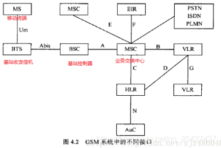

* 接入层：指无线接入层的设备RNC、NodeB需要参与处理的流程。主要包括PLMN 选择、小区选择和无线资源管理流程。比如RRC过程，用于建立信令通路。AS层

* 非接入层：指只有UE和CN（核心网）需要处理的信令流程，例如MM、SM、CC、SMS，也称NAS消息。

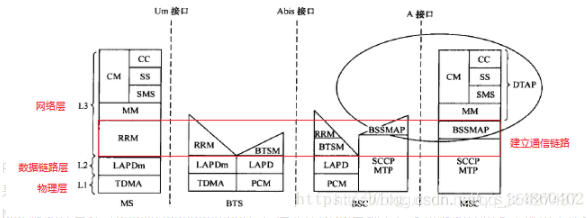

* RRM 无线资源管理（Radio Resource Management），负责信道的分配，传输模式，上下行电平及通信质量的测量，切换的操作。目的是建立，维护和控制通信链路。

* MM 移动性管理（Mobile Management），建立在RRM基础上，负责移动性和安全保密工作。

* CM 连接管理（Connection Management），建立在RRM和CM基础上，完成点对点通信的建立和释放。

PLMN网络分以下几种：优先级从高到低

| PLMN   | 描述                                                         |
| ------ | ------------------------------------------------------------ |
| RPLMN  | Registered PLMN 终端在上次关机或脱网前登记上的PLMN,会临时保存在USIM卡上 |
| HPLMN  | Home PLMN 用户USIM对应IMSI的PLMN                             |
| EHPLMN | EquivalentHome PLMN,HPLMN对应的运营商可能会有不同的号段，例如中国移动有46000、46002、46007 三个号段。 46002相对46000就是EHPLMN;运营商烧卡时写入USIM卡中 |
| EPLMN  | Equivalent PLMN,这个PLMN在MSC 或者MME上配置（ADD PEERPLMN）。既与当前网络HPLMN对等的PLMN；如果用户在归属地那么EPLMN=EHPLMN。如果在漫游地，EPLMN！=EHPLMN。 |
| UPLMN  | User Controlled PLMN ,用户控制PLMN。查了一圈都没有明确说明这个PLMN的含义，讨论了一下合理的解释是UPLMN就是终端在用户手工选网时选择的PLMN，USIM卡会存储下来。 |
| OPLMN  | Operator Controlled PLMN 运营商控制PLMN。相关资料也没有清晰介绍这个含义，合理的解释运营商烧卡时将与该运营商签署了漫游协议的运营商PLMN作为OPLMN写入USIM卡，作为后面用户选网的建议。 |
| FPLMN  | (Forbidden PLMN禁用PLMN）：为被禁止访问的PLMN，通常终端在尝试接入某个PLMN被拒绝以后，会将其加到本列表中。 |

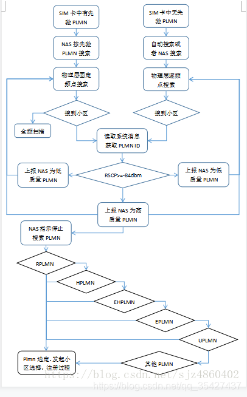

* 手动搜网：PLMN_LIST_REQ/PLMN_LIST_CNF

```
<stat>t, long alphanumeric, short alphanumeric, numeric, lac, act>
<stat>  0  unknown  1  available  2  current 3  forbidden
<Act>  0  GSM   2  UTRAN  7  LTE
```

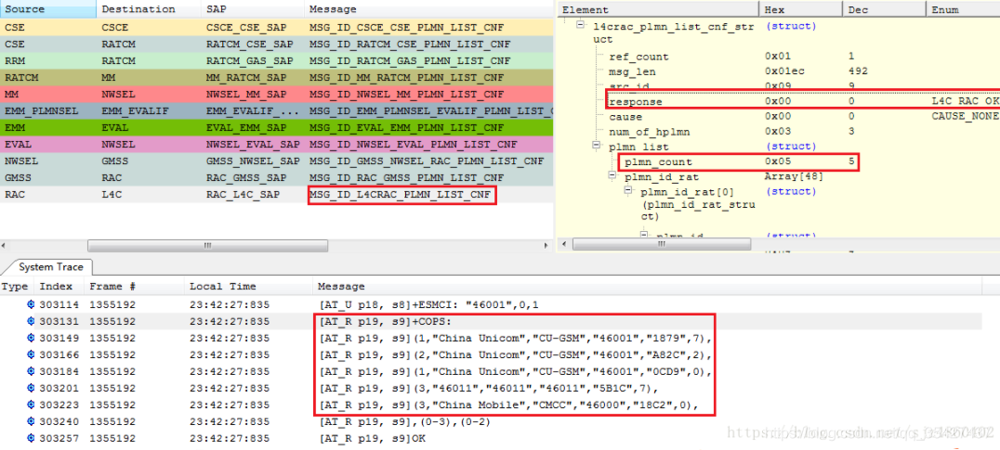


* 自动搜网：PLMN_SEARCH_REQ/PLMN_SEARCH_CNF

* 4G

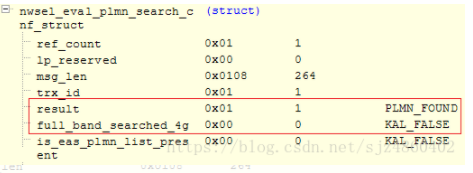

* 3G

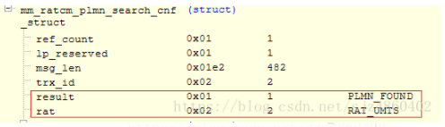

* 2G

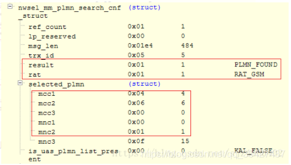

## 2G服务小区/相邻小区

```
ARFCN ：频点，用于GSM
EARFCN：用于LTE
UARFCN：用于WCDMA
2G:
服务小区：
Serv arfcn[23]: RAC[1], C1[176], C2[176]
SERV_IDLE_MEAS/SERV_DEDI_MEAS
相邻小区：RR__SI_2
Nbr arfcn[28]: C1[161], C2[137], GPRS_ind[1], is_the_same_rac_as_serv[1]
NEIGHBOR_MEAS_IND
```

## 3G服务小区/相邻小区

```
服务小区：
[Serving Cell] UARFCN: 10788, PSC: 21
服务小区和相邻小区：
MEASUREMENT_CELL/CELL_MEASUREMENT
相临小区：
RRC_SI_SIB11 系统消息
Intra Freq CELL INFO LIST 同频邻小区列表
Inter Freq CELL INFO LIST 异频邻小区列表
Inter RAT CELL INFO LIST 异系统小区列表
Neighbor cell
Designated cell
MEASUREMENT_CONFIG_CELL_REQ
激活小区：
active 1
MEME: cell_ind on UARFCN
```

## 4G服务小区/相邻小区

```
服务小区：
Serv cell: earfcn[1650] pci[118] srxlev[84], squal[32767], hps[1]
相邻小区：

SystemInformationBlockType1 ：SI消息的调度信息
SIB4 ：同频小区
SIB5 ：异频小区
SIB6 ：3G小区
SIB6 ：2G小区
RADIO_MEASURE
激活小区：
小区选择—-S准则
规则：Srxlev＞0，Squal＞0
Srxlev＞ Qrxlevmeas -（Qrxlevmin + Qrxlevminoffest） -Pcompensation
Srxlev：小区选择的接收电平值（RSRP值，信号强度值）
Qrxlevmeas：测量小区接收的电平值
Qrxlevmin：小区要求的最小接收电平值（sib3）
Qrxlevminoffest:相对于Qrxlevmin的偏移量??
Pcompensation：补偿值(忽略)
Squal = Qqualmeas -（Qqualmin + Qqualminoffest）
Squal：小区选择的信号质量值（RSRQ值）
Qqualmeas ：测量小区接收的信号质量值
Qqualmin ：小区要求的最小信号质量值（sib3）
Qqualminoffest：相对于Qqualmin 的偏移量??
```

## 小区重选

```
小区重选步骤：
高优先级的邻区。
一.UE始终执行小区重选测量
二.重选判断
同频邻区，同优先级的邻区
一.UE根据条件执行小区重选测量
二.重选判断
低优先级的邻区
一.UE根据条件执行小区重选测量
二.重选判断

同频小区测量门限：s-Intrasearch（sib3）
异频小区测量门限：s-Intersearch（sib3）
异系统小区测量门限：s-SearchRAT（sib3）
最小接入电平：q-RxlevMin（sib3）
最小信号质量值:q-QualMin （sib3）
ThreshX-High：高优先级频点的重选门限
ThreshX-Low：低优先级频点的重选门限
threshServingLow：服务频点低优先级重选门限（sib3）
cellReselectionPriority：优先级0~7,7为最高，如果优先级较高，只要临小区信号强度达到门限值，则发起重选。
优先级：在SIB4、SIB5、 SIB6、SIB7和RRC Connection Release消息中指定
3G优先级：sib19
2G优先级：RR__SI_2QUATER
```

## 小区重选测量

```
同频/同优先级小区测量：
若Srxlev > Sintersearch 且 Squal > SintersearchQ，UE不执行同频小区的测量；
若Srxlev<= Sintersearch 或 Squal <= SintersearchQ，UE执行同频小区的测量。
异频/异系统小区测量：
若Srxlev > SNonIntraSearch 且 Squal > SNonIntraSearchQ，UE不执行异频小区的测量；
若Srxlev<= SNonIntraSearch 或 Squal <= SNonIntraSearchQ，UE执行异频小区的测量。

Squal ＝ Qqualmeas － Qqualmin
Srxlev ＝ Qrxlevmeas－Qrxlevmin－Pcompensation

算法一：计算信号强度
RSCP=q-RxlevMin2+1+（s-Intrasearch/s-Intersearch/s-SearchRAT）2+1
RSCQ=q-QualMin2+1+（s-Intrasearch/s-Intersearch/s-SearchRAT）2+1
例：-512+1+102+1 = -80 dbm，当服务小区的RSCP（信号强度）小于-80dbm时，发起小区测量。
算法二：MTK
Squal/4096 。如果当前服务小区的此值小于相应的门限值，则发起相应的小区测量
例22528/4096 = 5.5
```

## 高优先级邻区重选

* 一.周围存在高优先级的邻区时，UE始终对此邻区进行小区测量，不受测量门限的控制。

* 二.重选判断

在Treselection时间内，只要满足以下条件，就重选：

```
EUTRAN or UTRAN RAT/ frequency ： （4G,3G）
Squal > ThreshX-HighQ
GERAN or CDMA2000 RAT/ frequency ： (2G)
Srxlev > ThreshX-HighP

ThreshX-High在sib5，sib6，sib7中
```


同频/同优先级邻区重选—-R准则

* 一.小区重选测量

* 二.重选判断—-R准则

```
服务小区：Rs = Qmeas_s + QHysts
邻小区：Rn = Qmeas_n - Qoffset_n
Qmeas_s 为服务小区接收信号质量测量值
Qhysts为小区重选迟滞(sib3)
Qmeas_n为临小区接收信号质量测量值
Qoffsets_n为两个小区接收信号质量要求的差值(sib11)
注：Qhysts分为q-HYST-1-S和q-Hyst-2-S，Qoffsets分为q-Offset1S-N和q-Offset2S-N。
小区选择与重选测量值采用RSCP时采用q-Hyst-1-S，q-Offset1S-N。
小区选择与重选测量值采用CPICH Ec/No时采用q-Hyst-2-S，q-Offset2S-N。
```

规则：

* 1.UE驻留在当前服务小区超过1S

* 2.在Treselection时间段内，Rn > Rs。（sib3中t-Reselection-S）

## 低优先级邻区重选

* 一.小区重选测量

* 二.重选判断

在Treselection时间内，只要满足以下条件，就重选：

```
EUTRAN or UTRAN RAT/ frequency ： （4G,3G）
服务小区：Srxlev <threshServingLow  (sib3)
目标小区：Srxlev >threshX-LowQ
GERAN or CDMA2000 RAT/ frequency ： (2G)
服务小区：Srxlev <threshServingLow  (sib3)
目标小区：Srxlev >threshX-L
```

### 扫频和小区搜索

* 全频扫描：SEARCH_RF_REQ/CNF

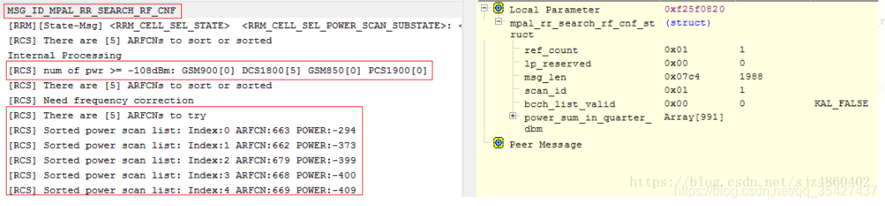

当前只有DCS1800五个频点的信号值大于-108，因此，此次扫频的对象只有5个。

* FREQUENCY_SCAN_START_CNF 频率扫描
* FREQUENCY_SCAN_SUSPEND_REQ 频率扫描暂停

* 小区选择/小区重选

小区重选：接收服务小区的系统消息广播，并根据此系统消息中配置的邻区信息及重选相关的参数自主地进行邻区的测量、评估、重选。

* 条件：手机当前为空闲模式查看连接态还是空闲态：

### 2G:

```
RRM层：
RRM_STATE = RRM_INACTIVE_STATE
```

###  3G:

```
MEME层：
[MEME STATE] MEME_STEADY_INACTIVE to MEME_STEADY_IDLE
```

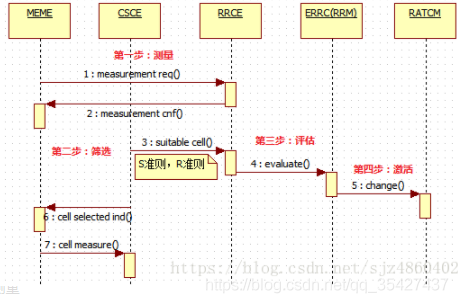

## 小区测量

* 第一步：测量

* 4G:

```
CONFIG_ECELL_MEAS_REQ/CNF
LTE_MEASUREMENT__REQ/CNF
RADIO_MEASURE_REQ/CNF
```

* 3G:

```
CONFIG_UCELL_MEAS_REQ/CNF
CELL_MEASUREMENT_RESULT_IND
```

* 2G:

```
CONFIG_GCELL_MEAS_REQ/CNF
RR_SERV_IDLE_MEAS_IND
RR_SERV_DEDI_MEAS_IND
```

## 小区筛选

* 第二步：筛选

###  S准则

小区选择的测量准则被称为S准则，当某个小区的信道质量满足S准则之后，就可以被选择为驻留小区。

* 2G:

```
GSM Cell (BCCH_ARFCN:27, FREQ_BAND:0, BSIC:14, CellIndex:91), S criteria satisfied, RSSI: -56, RxLevMin: -99
```

* 3G:

```
Squal 为S准则值，大于0则符合S准则。
Designated cell [UARFCN = 10788, PHYSCELLID = 417] S criteria satisfied [Squal = 16384, Srxlev = 100352]
```

* 4G:

```
[APBCR] LTE Cell (EARFCN:1650, PCI:118, CellIndex:0, ApbcrValidity: 3), S criteria satisfied, RSRP: -111, RxLevMin: -128, RSRQ: -12, QaulLevMin: -128
```

### R准则

在同频/同优先级异频小区的重选中使用，主要根据质量高低进行R准则排序，排序最高的为最优小区。筛选规则为：（异频，异系统重选中规则更苛刻）

* 1.在Treselection时间段内，新小区比服务小区排序靠前

* 2.UE驻留在当前服务小区超过1S

```
Found Cell Idx: 76, waiting for incremental TReselection [accumulated: 1960(ms) >= total: 200(ms)]
CSCE R ranking result(descending): CellIndex = 76, R_value = -296960, CellType = SERVING_CELL_Chosen, ChannelFailFlag = 0, Reset Treselection? KAL_FALSE
Best Cell, CellType = INTER_FREQUENCY_CELL_Chosen, R Value = 138240, Idx = 76
MSG_ID_CSCE_RRCE_SUITABLE_CELL_SELECTED_REQ
R_value值换算为db值为：-296960/4096 = 72.5 db
```

## 小区评估

* 第三步：评估

```
EVALUATE_ECELL_REQ/CNF
EVALUATE_UCELL_REQ/CNF
EVALUATE_GCELL_REQ/CNF

评估成功：
ir_cell_eval_status = IR_CELL_RESELECTION_SUCCESS (enum 0)
评估失败：
ir_cell_eval_status = IR_CELL_RESELECTION_FAILURE (enum 0)
评估超时：
ir_cell_eval_status = IR_CELL_RESELECTION_TIMEOUT (enum 0)
```

## 小区激活

* 第四步：激活

* 2/3G之间互切:

```
RATDM_RAT_CHANGE_REQ/CNF
```

* 重选的双方：

```
prev_rat = RATDM_WCDMA_RAT (enum 1)
dst_rat = RATDM_GSM_RAT (enum 2)
如果是小区选择的过程，则：
prev_rat = RATDM_NO_RAT (enum 0)
dst_rat = RATDM_GSM_RAT (enum 2)
```

* 4G与2/3之间互切:

```
RAT_CHANGE_IND/RSP
source_rat = RAT_TYPE_EAS (enum 3)
target_rat = RAT_TYPE_GAS_UAS_TBD (enum 4)
irat_result = IR_RESULT_SUCCESS (enum 0) 状态
```

## 小区切换

手机连接模式下，对小区的选择过程，叫做小区切换。
手机会根据网络的配置来测量一些邻小区的信号情况，并根据网络的配置在测量结果达到某些条件的时候回报给网络，然后网络根据这些回报结果以及网络自身的负载等情况，决定是否发送切换命令，以使手机切换到其他的小区、网络模式上。此过程完全受控于网络。
HANDOVER_COMMAND

* 随机接入与信道释放指令

* 随机接入与信道释放指令

* 2G

| 方向   | 描述                     |
| ------ | ------------------------ |
| MS->NW | RR__CHANNEL_REQUEST      |
| NW->MS | RR__IMMEDIATE_ASSIGNMENT |
| NW->MS | RR__CHANNEL_RELEASE      |

* 3G

| 方向   | 描述                                 |
| ------ | ------------------------------------ |
| MS->NW | RRC__RRC_CONNECTION_REQUEST          |
| NW->MS | RRC__RRC_CONNECTION_SETUP            |
| MS->NW | RRC__RRC_CONNECTION_SETUP_COMPLETE   |
| NW->MS | RRC__RRC_CONNECTION_RELEASE_DCCH     |
| MS->NW | RRC__RRC_CONNECTION_RELEASE_COMPLETE |

* 4G

| 方向   | 描述                                                         |
| ------ | ------------------------------------------------------------ |
| MS->NW | ERRC_RRCConnectionRequest                                    |
| NW->MS | ERRC_RRCConnectionSetup                                      |
| MS->NW | ERRC_RRCConnectionSetupComplete                              |
| NW->MS | ERRC_RRCConnectionRelease(cause:[ReleaseCause_other], redirectInfo:[0]) |

## 寻呼方式

寻呼有两种:

| 方向   | 描述                           |
| ------ | ------------------------------ |
| NW->MS | RRC__PAGING_TYPE1 RRC 空闲状态 |
| MS->NW | MM__PAGING_RESPONSE            |
| NW->MS | RRC__PAGING_TYPE2 RRC连接状态  |
| MS->NW | MM__PAGING_RESPONSE            |

* 传输模式管理

在RRM初始化时的立即支配过程中，由于网络侧不知MS此时要建立什么业务（呼叫，短消息，上网，位置更新），一般会先分配一个小容量信道，进行鉴权等工作，比如SDCCH，等鉴权结束，明确业务需求后，再分配大容量信道（比如TCH语音信道），这个再分配的过程就是传输模式的修改。

无线资源承载，CN根据UE的业务请求分配无线资源承载（若RRC过程已经分配，则重置）

| 方向   | 描述                                       |
| ------ | ------------------------------------------ |
| NW->MS | RRC__RADIO_BEARER_SETUP                    |
| MS->NW | RRC__RADIO_BEARER_SETUP_COMPLETE           |
| NW->MS | RRC__RADIO_BEARER_RECONFIGURATION          |
| MS->NW | RRC__RADIO_BEARER_RECONFIGURATION_COMPLETE |

* 加密模式管理

| 方向   | 描述                        |
| ------ | --------------------------- |
| NW->MS | RRC__SECURITY_MODE_COMMAND  |
| MS->NW | RRC__SECURITY_MODE_COMPLETE |

## 安全性管理

* 鉴权过程

| 方向   | 描述                        |
| ------ | --------------------------- |
| NW->MS | MM__AUTHENTICATION_REQUEST  |
| MS->NW | MM__AUTHENTICATION_RESPONSE |

* 身份请求过程（IMEI,IMSI）

| 方向   | 描述                                       |
| ------ | ------------------------------------------ |
| NW->MS | MM__IDENTITY_REQUEST                       |
| MS->NW | MM__IDENTITY_RESPONSE (Type: MM_IMEI_TYPE) |

* CM业务请求过程

| 方向   | 描述                   |
| ------ | ---------------------- |
| MS->NW | MM__CM_SERVICE_REQUEST |
| NW->MS | MM__CM_SERVICE_ACCEPT  |


* 扩展业务请求：

| 方向   | 描述                                                         |
| ------ | ------------------------------------------------------------ |
| MS->NW | EMM_Extended_Service_Request(service type=”MO_CSFB”, CSFB response=”CSFB_UNUSED”)CSFB：LTE回落到2/3G的标志 |

* 认证加密过程

| 方向   | 描述                                  |
| ------ | ------------------------------------- |
| NW->MS | GMM__AUTHENTICATION_AND_CIPHERING_REQ |
| MS->NW | GMM__AUTHENTICATION_AND_CIPHERING_RSP |

* 注册CS域

| 方向   | 描述                                                  |
| ------ | ----------------------------------------------------- |
| MS->NW | MM__LOCATION_UPDATING_REQUEST (LU type: MM_NORMAL_LU) |
| NW->MS | MM__LOCATION_UPDATING_ACCEPT                          |

* MM的附着过程（注册PS域）

| 方向   | 描述                 |
| ------ | -------------------- |
| MS->NW | GMM__ATTACH_REQUEST  |
| MS->NW | GMM__ATTACH_COMPLETE |
| NW->MS | GMM__ATTACH_REJECT   |

## CC呼叫管理

* 拨号

| 方向   | 描述                    |
| ------ | ----------------------- |
| MS->NW | CC__SETUP               |
| NW->MS | MS CC__CALL_PROCEEDING  |
| NW->MS | CC__ALERTING            |
| NW->MS | CC__CONNECT             |
| MS->NW | CC__CONNECT_ACKNOWLEDGE |
| MS->NW | CC__DISCONNECT          |
| NW->MS | CC__RELEASE             |
| MS->NW | CC__RELEASE_COMPLETE    |

* 接听

| 方向   | 描述                    |
| ------ | ----------------------- |
| NW->MS | RRC__PAGING_TYPE2       |
| MS->NW | MM__PAGING_RESPONSE     |
| NW->MS | CC__SETUP               |
| MS->NW | CC__CALL_CONFIRMED      |
| MS->NW | CC__ALERTING            |
| MS->NW | CC__CONNECT             |
| NW->MS | CC__CONNECT_ACKNOWLEDGE |
| MS->NW | CC__DISCONNECT          |
| NW->MS | CC__RELEASE             |
| MS->NW | CC__RELEASE_COMPLETE    |

## SMS短消息业务

发送短信与接收短信：

| 方向   | 描述                                |
| ------ | ----------------------------------- |
| NW->MS | RRC__PAGING_TYPE2 网络寻呼          |
| MS->NW | MM__PAGING_RESPONSE                 |
| NW->MS | RRC__SECURITY_MODE_COMMAND 安全模式 |
| MS->NW | RRC__SECURITY_MODE_COMPLETE         |
| NW->MS | RRC__RRC_CONNECTION_RELEASE_CCCH    |

### SM会话管理

用于维护连接过程中的链路信息登记，请求服务信息以及数据路由。在PDP上下文流程中进行SM实体的建立，在激活PDP上下文之后，网络侧将给UE分配一个地址，以支持UE与外部网络之间的路由信息。

8 2G/3G:Pdp上下文请求

| 方向   | 描述                             |
| ------ | -------------------------------- |
| MS->NW | SM__ACTIVATE_PDP_CONTEXT_REQUEST |
| NW->MS | SM__ACTIVATE_PDP_CONTEXT_ACCEPT  |

* Pdp上下文修改请求

| 方向   | 描述                              |
| ------ | --------------------------------- |
| NW->MS | SM__MODIFY_PDP_CONTEXT_REQUEST_NW |
| MS->NW | SM__MODIFY_PDP_CONTEXT_ACCEPT_MS  |

## SM会话管理

* 4G：Pdn连接请求

| 方向   | 描述                                                         |
| ------ | ------------------------------------------------------------ |
| MS->NW | ESM_MSG_PDN_CONNECTIVITY_REQUEST (PTI:19, EBI:0)SM信息请求   |
| NW->MS | ESM_MSG_ESM_INFORMATION_REQUEST (PTI:19, EBI:0)              |
| MS->NW | ESM_MSG_ESM_INFORMATION_RESPONSE (PTI:19, EBI:0)PS域的承载上下文请求 |
| NW->MS | ESM_MSG_ACTIVATE_DEFAULT_EPS_BEARER_CONTEXT_REQUEST (PTI:19, EBI:5) |
| MS->NW | ESM_MSG_ACTIVATE_DEFAULT_EPS_BEARER_CONTEXT_ACCEPT (PTI:0, EBI:5)Ps域的承载上下文的修改请求 |
| NW->MS | ESM_MSG_MODIFY_EPS_BEARER_CONTEXT_REQUEST (PTI:0, EBI:5)     |
| MS->NW | ESM_MSG_MODIFY_EPS_BEARER_CONTEXT_ACCEPT (PTI:0, EBI:5)      |

## 实例分析

 * （1）. 打电话正常时Modem LOG分析

    红色字体：MS －> NW，表明是从手机到基站发送信令。

    蓝色字体：NW －> MS，表明是从基站到手机端发送信令。

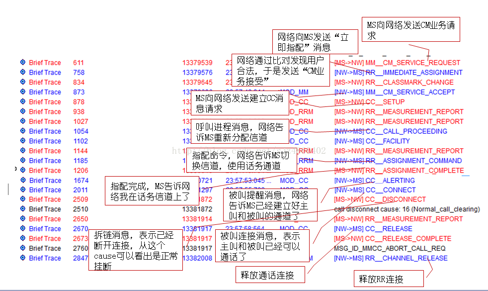

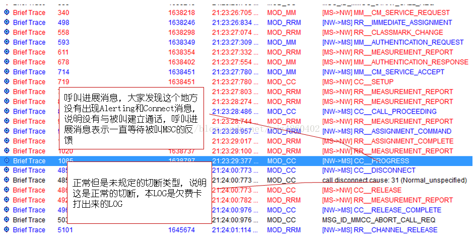

* 2.开机信令流程

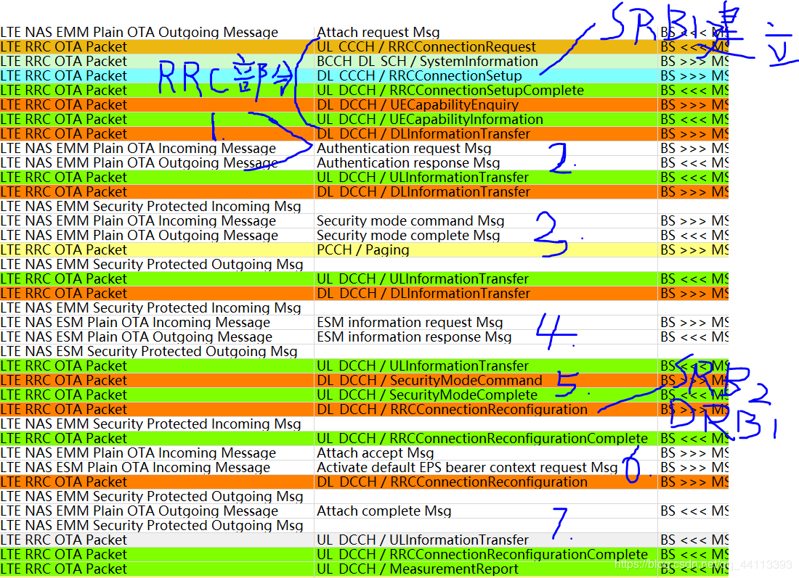

一个典型的开机信令流程中包含接入层RRC的信令和非接入层EMM，ESM的信令。
在第一部分RRC连接建立和UE能力上报（可选流程）后进入NAS层的信令交互。
NAS信令交互顺序如下：

- 1. 身份认证（identity request<->identity response）
   这一步为可选流程，只有在attach request中提供的UE身份标识无法被网络识别时，网络才会触发这一流程。当然，在其他需要UE身份认证的情景下也会触发这一流程。

- 2. 鉴权
   这个过程中利用usim中的K值和算法完成与网络测K值和算法的认证计算过程并生成后续加密和完整性保护锁需要的秘钥。

- 3. NAS层的安全命令流程
   这一步负责协商NAS加密和完整性保护的算法

- 4. ESM信息请求流程
   这一步根据PDN request中的esm info trans flag是否设置而触发，非必选

- 5. RRC安全命令流程
   这一步负责协商AS（PDCP）所用的加密算法

- 6. 注册接收，EPS承载请求

- 7. EPS承载接收，连接建立完成

## USB在线调试

* [CS6001-H7H-TND-V1.0EN_Tools_ELT_Logging_Guide.pdf](refer/CS6001-H7H-TND-V1.0EN_Tools_ELT_Logging_Guide.pdf)

* Step 1. Set USB logging mode on the phone

- 1. Dial *#*#3646633#*#* to enter engineering mode/ Launch MTKLogger
- 2. Press red circle button “STOP” to stop logging
- 3. Press “Setting” at the top right corner
- 4. Press “Modem Log” to enter modem log setting
- 5. Press “Log Mode” and select “USB Mode”
- 6. Start logging by pressing “START” on the main page

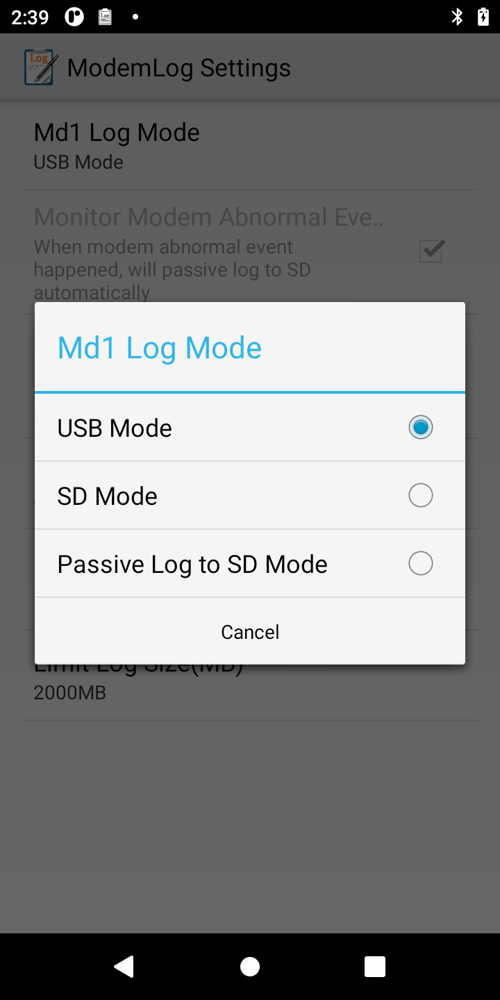

* Step 2. Set up ELT for logging

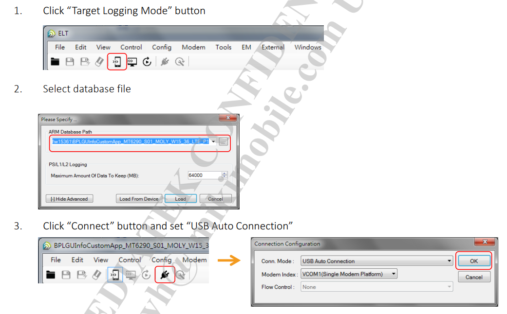

* Step 3. Set up default filter

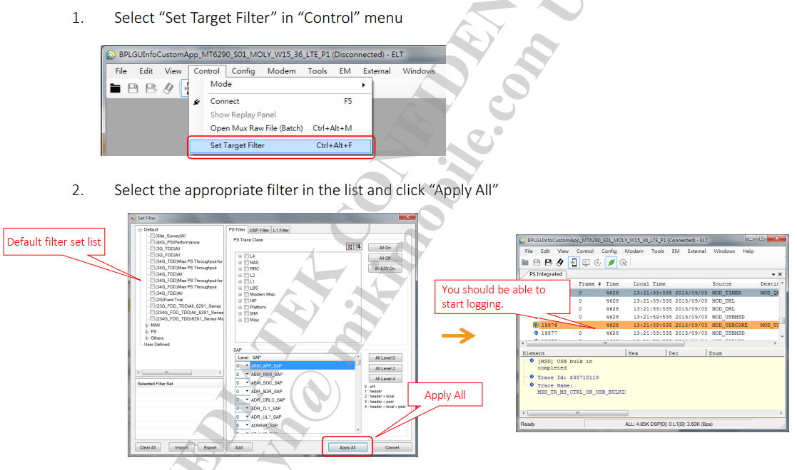

* Step 4. Save log

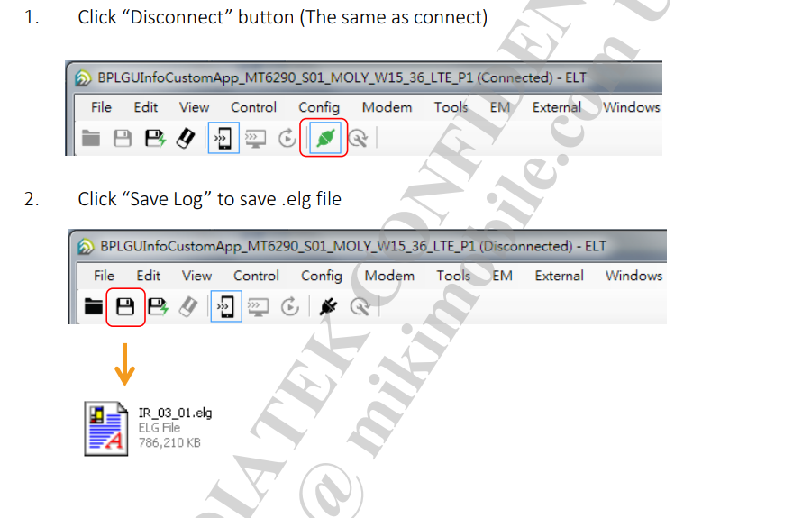

* How to add PID/VID for USB port?

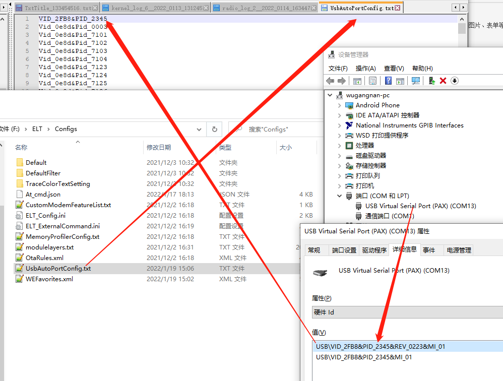