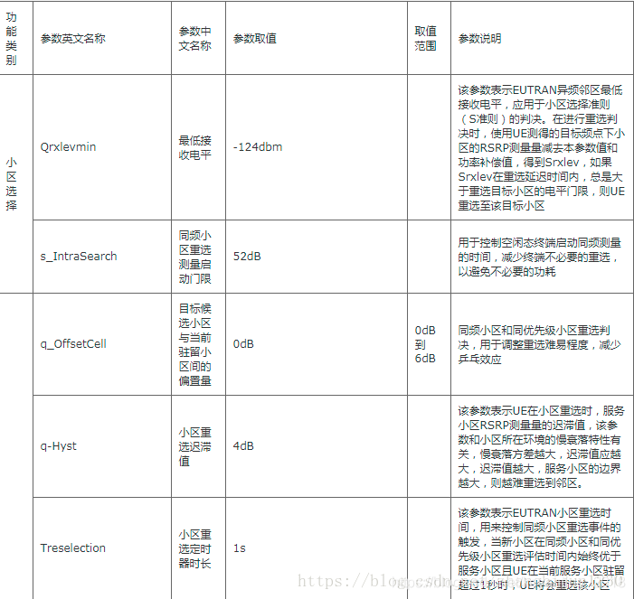
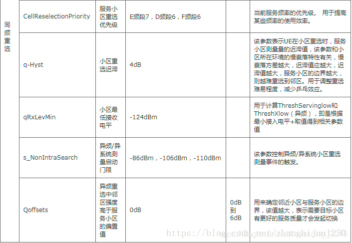
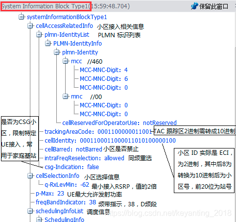
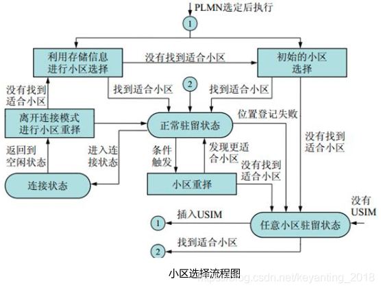

# 概述

LTE中小区选择流程及其S准则详解

## 参考

* [LTE中小区选择流程及其S准则详解](https://blog.csdn.net/keyanting_2018/article/details/89325942)

## 一、小区选择的类型

* 不同场景：初始小区选择、存储信息的小区选择；

* 不同时机：UE 开机、从连接态返回刡空闲态模式、重新迚入服务区；

## 二、UE在进行小区选择时，目标小区需满足以下条件

* 1. 小区所在的PLMN需满足以下条件之一：所选择的PLMN；注册的PLMN；等效PLMN（EPLMN）；

* 2. 小区没有被禁止；

* 3. 小区至少属于一个不被禁止漫游的跟踪区；

* 4. 小区满足S准则，即小区搜索中的接收功率Srxlev> 0 dB且小区搜索中接收的信号质量Squal > 0 dB。

## 三、小区选择S准则

UE将搜索最强的支持S标准，即小区搜索中的接收功率Srxlev> 0 dB且小区搜索中接收的信号质量Squal > 0 dB。LTE一般是测量RSRP。

### 小区搜索中的接收功率：Srxlev> 0 dB

> Srxlev = Qrxlevmeas – (qRxLevMin + qRxLevMinOffset) – pCompensation

* 1. Qrxlevmeas : 测量小区的 RSRP 值。

* 2. qRxLevMin：最低接收电平

该参数表示小区最低接收电平，增加某小区的该值，使得该小区更难符合S规则，更难成为适当小区，UE选择该小区的难度增加，反之亦然。该参数的取值应使得被选定的小区能够提供基础类业务的信号质量要求，界面取值范围，-70~-22，单位2毫瓦分贝（dBm），建议值-64，最低接收电平-128dBm。

* 3.  qRxLevMinOffset：最低接收电平偏置

该参数表示小区最低接收电平偏置，仅当UE驻留在VPLMN且由于周期性的搜索高优先级PLMN而触发的小区选择时，才使用本参数。增加某小区的该值，使得该小区更容易符合S规则，更容易成为适当小区，选择该小区的难度减小，反之亦然。界面取值范围，0~8，单位2分贝（dB），建议值0。

* 4.  pCompensation=max(pMax – puMax, 0) (dB)

用于惩罚达不到小区最大功率的UE，pMax（小区允许UE 的最大上行发射功率）、puMax（UE 能力支撑的最大上行发射功率）。

* （1）当 UE 最大允许发射功率小于等于 UE 能力支持最大发射功率时， pCompensation=0；
* （2）当 UE 最大允许发射功率大于UE 能力支持最大发射功率时， pCompensation =UE最大允许发射功率-UE 能力支持最大发射功率；
* （3）UE 最大允许发射功率：本小区允许 UE 的最大发射功率 UePowerMax，应用于小区选择准则（S 准则）的判决，用于计算功率补偿值。如果该参数不配置，则 UE 的最大发射功率由UE 自己的能力决定。该值在LST CELL 命令中。该参数设置的越大，UE 的发射功率也越大，增强本小区覆盖的同时会增加对邻区的干扰；该参数设置的越小，UE 的发射功率也越小，减少本小区覆盖的同时会减少对邻区的干扰。面取值范围，-30~33，单位1毫瓦分贝（dBm），建议值23。

### 小区搜索中接收的信号质量：Squal > 0 dB

> Squal = Qqualmeas – (qQualMin + qQualMinOffset)

* 1. Qqualmeas：测量小区的 RSRQ 值

* 2. qQualMin：最小接收信号质量

该参数表示EUTRAN异频邻区重选需要的最小接收信号质量，用来控制EUTRAN小区重选的难易程度。该参数在SIB5中下发。增加某小区的该值，使得该小区更难符合S规则，更难成为适合的小区，选择该小区的难度增加，反之亦然。应使得被选定的小区能够提供基础类业务的信号质量要求。界面取值范围，-34~-3，单位1分贝（dB），建议值-18。

* 3. qQualMinOffset：最小接收信号接收质量偏置值

该参数表示小区最小接收信号接收质量偏置，应用于小区选择准则（S准则）公式，仅当UE驻留在VPLMN且由于周期性的搜索高优先级PLMN而触发的小区选择时，才使用本参数。增加某小区的该值，使得该小区更容易符合S规则，更容易成为适当小区，选择该小区的难度减小，反之亦然。若不配置，即空口没下发该参数，UE默认使用0。面取值范围，1~8，单位1分贝（dB），建议值无，缺省值1。

## 四、LTE SIB1系统消息中的小区选择信息

## 五、LTE小区选择流程图

