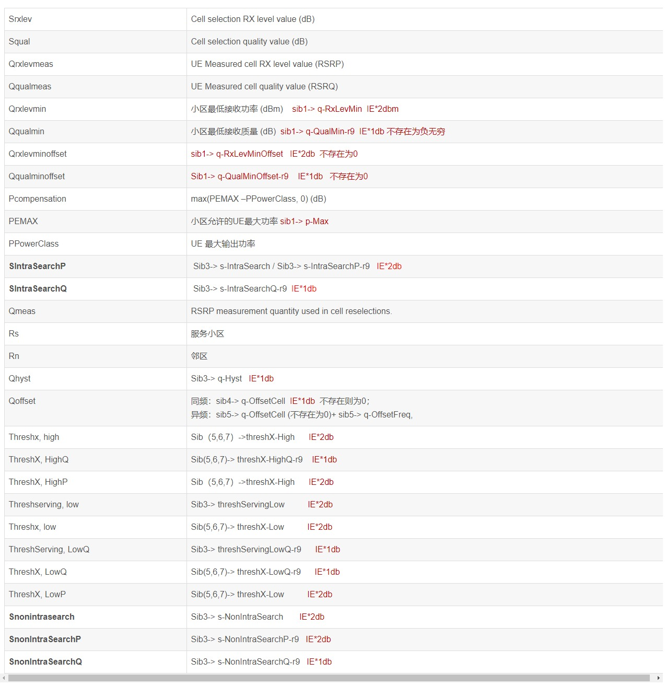
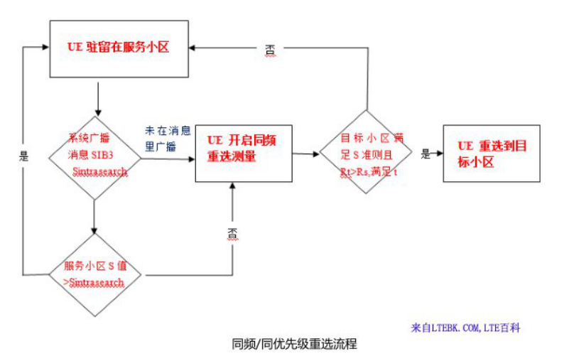
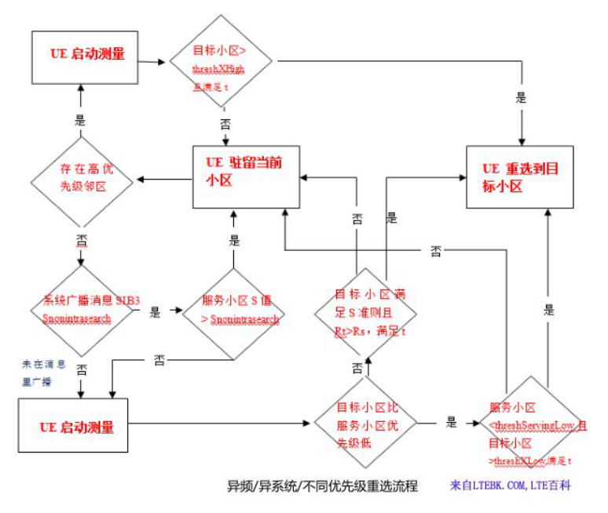
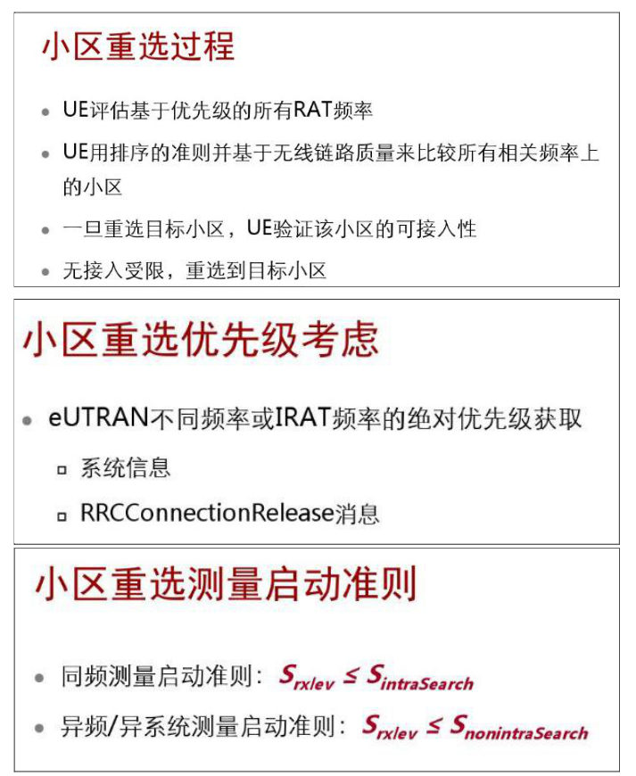

# 概述

LTE小区重选流程详解

LTE小区重选（cell reselection）指 UE 在空闲模式下通过监测邻区和当前小区的信号质量以选择一个最好的小区提供服务信号的过程。当邻区的信号质量及电平满足S准则且满足一定重选判决准则时，终端将接入该小区驻留。

UE 成功驻留后，将持续进行本小区测量。RRC 层根据 RSRP 测量结果计算 Srxlev(S 准则)，并将其与Sintrasearch(同频测量启动门限)和Snonintrasearch(异频/异系统测量启动门限)比较，作为是否启动邻区测量的判决条件。

## 参考

* [LTE中小区选择流程及其S准则详解](https://blog.csdn.net/keyanting_2018/article/details/89325942)

* [LTE小区重选](http://www.doc88.com/p-69616934965987.html)

## 名词解释



## 一、LTE小区重选测量准则

* 1. 对于系统消息指出的优先级高于服务小区时，UE 总是执行对这些高优先级小区的测量；

* 2. 对于同频/同优先级小区，若服务小区小于或等于Sintrasearch（同频测量启动门限），UE执行测量，低于不测量；

* 3. 对于系统消息指出优先级低于服务小区时，若服务小区的S值小于或等于Snonintrasearch（异频/异系统测量启动门限），执行测量，大于不测量；

* 4. 若Snonintrasearch参数没有在系统消息内广播，UE 开启异频小区测量。

注：S值即是小区选择中的Srxlev(S准则)，公式：Srxlev = Qrxlevmeas – (qRxLevMin + qRxLevMinOffset) – pCompensation，S准则=测量小区的RSRP值–｛最低接收电平（通常为0-128dbm）+最低接收电平偏置（通常为0）｝-功率补偿（通常为0）。

## 二、LTE小区重选准则

如果最高优先级上多个邻小区符合条件，则选择最高优先级频率上的最优小区。对于同等优先级频点（或同频），采用同频小区重选的 R 准则。

### 1. 高优先级频点的小区重选，需满足以下条件：

* 1.1 UE 驻留原小区时间超过 1s；

* 1.2 高优先级频率小区的S值大于预设的门限（ThreshXHigh：高优先级重选门限值），且持续时间超过重选时间参数 T；

### 2. 同频或同优先级频点的小区重选，需满足以下条件：

* 2.1 UE 驻留原小区时间超过 1s；

* 2.2 没有高优先级频率的小区符合重选要求条件；

* 2.3 同频或同优先级小区的S值小于等于预设的门限（ Sintrasearch：同频测量启动门限）且在T时间内持续满足R准则（Rt＞Rs）。

### 3. 低优先级频点的小区重选，需满足以下条件：

* 3.1 UE 驻留原小区的时间超过1s；

* 3.2 没有高优先级（或同等优先级）频率的小区符合重选要求条件；

* 3.3 服务小区的S 值小于预设的门限（ThrshServLow：服务频点低优先级重选门限），并且低优先级频率小区的 S 值大于预设的门限（ThreshXLow ：低优先级重选门限值），且持续时间超过重选时间参数值。

## 三、LTE小区重选优先级处理原则

UE 可通过广播消息获取频点的优先级信息（公共优先级），或者通过 RRC 连接释放消息获取。若消息中提供专用优先级，则UE将忽略所有的公共优先级。若系统消息中没有提供 UE 当前驻留小区的优先级信息，UE 将把该小区所在的频点优先级设置为最低。UE 只在系统消息中出现的并提供优先级的频点之间，按照优先级策略进行小区重选。

注：异频小区重选的优先级，在 0 到7 之间取值，其中0 代表优先级最低。通常情况下异系统2G优先级为1，3G为2，4G为3（F频段：38400,38404,38350）、5（D频段：37900,38098）、7（E频段：38950,39148）.。

## 四、同频/同优先级重选流程

同频测量启动准则：Srxlev(S 准则) ≤ Sintrasearch(同频测量启动门限)且在T时间内持续满足R准则（Rt＞Rs）

### 1. Sintrasearch：同频测量启动门限

该参数表示同频小区重选测量启动门限。当RRC 层根据 RSRP 测量结果计算 Srxlev(S 准则)大于该值时，UE无需启动同频测量，小于等于该值时，UE需启动同频测量。界面取值范围范围0~31，单位2分贝，建议值29，缺省值29，即Srxlev(S 准则)＞58（29*2）dB，即在最低接收电平为-128dbm时（其他为0），UE同频测量启动门限RSRP值小于或等于-70dbm（-128dbm+58dB）即启动同频重选测量。

### 2. R 准则（T时间内持续，Rt＞Rs）

对于同频小区或者异频但具有同等优先级的小区，UE 采用 R 准则对小区进行重选排序。R 准则是目标小区在Treselection 时间内（同频和异频的Treselection 可能不同），Rt（目标小区）持续超过 Rs （服务小区），那么 UE 就会重选到目标小区。

```
服务小区：Rs = Qmeas,s + Qhyst
```

#### 2.1 Qmeas,s：测量小区的 RSRP 值

#### 2.2 Qhyst：小区重选迟滞值

同频小区和同优先级小区重选迟滞，用于调整重选难易程度，减少乒乓效应；其它参数一定的情况下，增加迟滞，即增加同频小区或异频同优先级重选的难度，反之亦然。
界面取值范围（0,1,2,3,4,5,6,8,10,12,14,16,18,20,22,24），单位1分贝，建议值DB4_Q_HYST(4dB)，缺省值DB4_Q_HYST(4dB)。

```
目标小区：Rt = Qmeas,t - Qoffset
```

#### 2.3 Qmeas,t：目标小区的RSRP值

#### 2.4 Qoffset：小区偏置

该参数表示本地小区与同频（或异频）邻区之间的小区偏置。用于控制小区重选的难易程度，参数值越大，越难重选到此邻区。当该参数配置为非0dB时，在系统消息SIB4（异频SIB5）中下发；当该参数配置为0dB时，不在系统消息SIB4（异频SIB5）中下发，UE在重选判决时按照该值为0dB处理。

该参数设置的越大，越不容易触发重选；该参数设置的越小，越容易触发重选。该参数设置过大或过小都会降低接入成功率。（对同频只有小区偏置，对于异频还要加一个异频频率偏置，通常为0dB或1dB）.界面取值范围（±：0,1,2,3,4,5,6,8,10,12,14,16,18,20,22,24），单位1分贝，建议值0dB，缺省值0dB。

### 3. 同频/同优先级重选流程图



## 五、异频/异系统/不同优先级重选流程



### 1.Snonintrasearch：异频/异系统测量启动门限

该参数表示异频/异系统小区重选测量启动门限。对于重选优先级大于服务频点的异频/异系统，UE总是启动测量；对于重选优先级小于等于服务频点的异频或者重选优先级小于服务频点的异系统，当RRC 层根据 RSRP 测量结果计算 Srxlev(S 准则)大于该值时，UE无需启动异频/异系统测量；当RRC 层根据 RSRP 测量结果计算 Srxlev(S 准则)小于或等于该值时，UE需启动异频/异系统测量。

界面取值范围0~31，单位2分贝，建议值9，缺省值9，即Srxlev(S 准则)＞18（9*2）dB，即在最低接收电平为-128dbm时（其他为0），UE异频/异系统测量启动门限RSRP值小于或等于-110dbm（-128dbm+18dB）即启动异频/异系统重选测量。

### 2. ThreshXHigh：高优先级重选门限

如果目标小区的优先级比当前服务小区的优先级高，并且目标小区的 S 值在时间ReselectionTimer 内持续超过门限参数 ThreshXHigh（异频频点高优先级重选门限值），那么不管当前小区的S 值是多少，UE都会重选到目标小区。界面取值范围0~31，单位2分贝。

* 2.1 GERAN（2G）建议值7，缺省值7，即在最低接收电平为-128dbm时（其他为0），RSRP大于或等于-114dbm（-128dbm+14dB）即可重选至高优先级小区。

* 2.2 UTRAN（3G）建议值6，缺省值6，即在最低接收电平为-128dbm时（其他为0），RSRP大于或等于-116dbm（-128dbm+12dB）即可重选至高优先级小区。

* 2.3 EUTRAN（4G）建议值11，缺省值11，即在最低接收电平为-128dbm时（其他为0），RSRP大于或等于-106dbm（-128dbm+12dB）即可重选至高优先级小区。

### 3. ThrshServLow：服务频点低优先级重选门限

定义了 UE 在重选优先级较低的小区时，服务小区的测量门限，在此情况下，目标小区也必须满足一定的测量门限（threshXLow ：低优先级重选门限值）。

界面取值范围0~31，单位2分贝，建议值7，缺省值7，即Srxlev(S 准则)＞14（7*2）dB，即在最低接收电平为-128dbm时（其他为0），服务频点低优先级重选启动门限RSRP值小于或等于于-114dbm（-128dbm+14dB）即启动服务频点低优先级重选准备，若目标小区满足ThreshXLow （低优先级重选门限值），即执行重选。

### 4. ThreshXLow ：低优先级重选门限值

如果目标小区的优先级比当前服务小区的低，那么只有服务小区的S 值小于ThrshServLow（服务频点低优先级重选门限，在SIB3 中定义），并且目标小区的S 值大于门限参数ThreshXLow （低优先级重选门限值），而且持续的时间超过ReselectionTimer 后，UE 才会重选到目标小区。

界面取值范围0~31，单位2分贝。

* 3.1 GERAN（2G）建议值7，缺省值7，即Srxlev(S 准则)＞14（7*2）dB，即在最低接收电平为-128dbm时（其他为0），目标小区（2G）低优先级重选启动门限RSRP值大于或等于-114dbm（-128dbm+14dB）且高优先级服务小区已启动低优先级重选测量，即可重选至此低优先级小区。

* 3.2 UTRAN（3G）建议值6，缺省值6，RSRP值大于或等于-116dbm（-128dbm+12dB）且高优先级服务小区已启动低优先级重选测量，即可重选至此低优先级小区。

* 3.3 EUTRAN（4G）建议值11，缺省值11，RSRP值大于或等于-106dbm（-128dbm+22dB）且高优先级服务小区已启动低优先级重选测量，即可重选至此低优先级小区。

### 5. 异频/异系统/不同优先级重选流程图


## 六、案例

若当前服务小区占用D频点，则重选相关参数设置如下：

* 1. 优先级设置：F为3（低），D为5（中），E为7（高）；

* 2. 高优先级重选门限（ThreshXhigh）：-94dBm;

* 3. 启动同频同优先级测量门限：-70dBm；

* 4. 启动低优先级测量门限：-100dBm；

* 5. 服务频点低优先级重选门限：-120dBm；

* 6. 低优先级重选门限：-94dBm。

