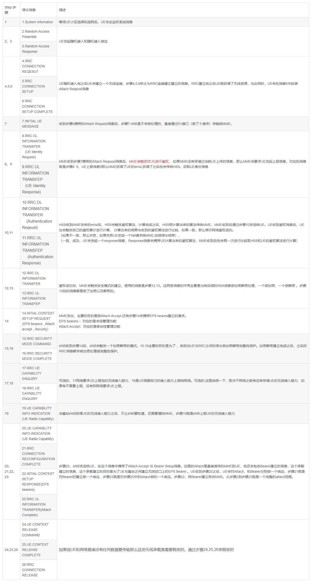

# 概述

LTE ATTACH流程

## 参考

* [LTE ATTACH流程](https://blog.csdn.net/qq_35427437/article/details/117395391?spm=1001.2014.3001.5501)

## Attac功能描述

向EPC注册EPS业务或non-EPS服务；

基站/网络为UE分配IP,建立UE和PDN GW之间的缺省承载（default bearer），使得UE的IP连接永远在线 . （always-on IP connectivity）

还可激活多个专用承载(dedicated bearers);

Attach过程中产生安全上下文，投入使用后，对NAS信令进行安全保护。

* Attach流程图：

* Attach详细描述图：

