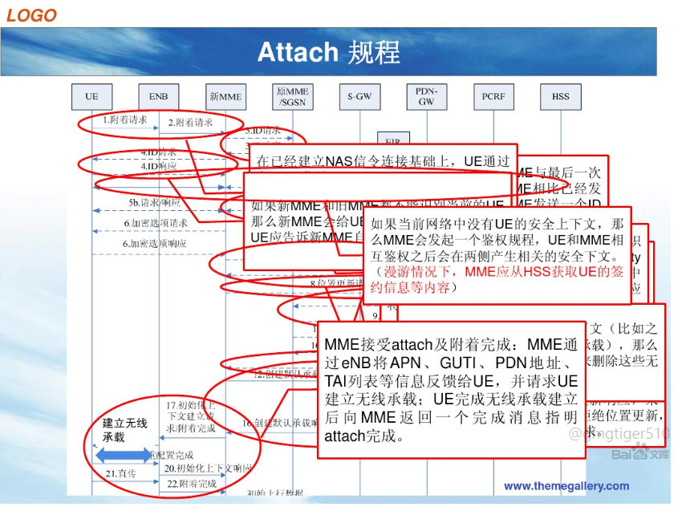

# 概述

LTE ATTACH流程

## 参考

* [LTE ATTACH流程](https://blog.csdn.net/qq_35427437/article/details/117395391?spm=1001.2014.3001.5501)

* [EMM中attach和TAU流程总结](https://wenku.baidu.com/view/fb5474be960590c69ec37678.html)

* [SW > Modem-Protocol > Network Search](https://online.mediatek.com/Pages/eCourse.aspx?001=002&002=002012&003=002012003)

## 流程图

## Attac功能描述

向EPC注册EPS业务或non-EPS服务；

基站/网络为UE分配IP,建立UE和PDN GW之间的缺省承载（default bearer），使得UE的IP连接永远在线 . （always-on IP connectivity）

还可激活多个专用承载(dedicated bearers);

Attach过程中产生安全上下文，投入使用后，对NAS信令进行安全保护。

* Attach流程图：

* Attach详细描述图：

| Step 步骤     | 信令消息                                                     | 描述                                                         |
| ------------- | ------------------------------------------------------------ | ------------------------------------------------------------ |
| 1             | 1.System  Infomation                                         | 等待UE小区选择和选网后，UE会去监听系统消息                   |
| 2，3          | 2.Random  Access Preamble                                    | UE发起随机接入和随机接入响应                                 |
|               | 3.Random Access Response                                     |                                                              |
| 4,5,6         | 4.RRC  CONNECTION REQESUT                                    | UE随机接入完之后UE会建立一个无线连接，步骤4,5,6称之为RRC连接建立建立的消息，RRC建立完之后UE就获得了无线资源，与此同时，UE会在消息6中封装Attach  Reqeust消息 |
|               | 5.RRC CONNECTION SETUP                                       |                                                              |
|               | 6.RRC CONNECTION SETUP  COMPLETE                             |                                                              |
| 7             | 7.INITIAL UE  MESSAGE                                        | 收到步骤6携带的Attach Request消息后，步骤7  eNB是不会做处理的，直接通过S1接口（做了个透传）传输给MME。 |
| 8，9          | 8.RRC DL  INFORMATION TRANSFER (UE Identity Request)         | MME收到步骤7携带的Attach  Reqeust消息后，MME会触发对UE进行鉴权，  如果MME没有存储过当前UE上传的信息，那么MME会要求UE发起上报信息，对应的消息就是步骤8   9，UE上报消息9那么MME获得了UE的emsi,获得了之后他会传给HSS。获取UE身份信息 |
|               | 9.RRC UL  INFORMATION TRANSFEP       (UE Identity Response)  |                                                              |
| 10,11         | 10.RRC DL  INFORMATION TRANSFER(Authentication Reqeust)      | HSS收到MME发来的emsi后，HSS会触发鉴权算法，计算完成之后，HSS吧计算出来的算法传给MME，MME收到后通过步骤10发送给UE。UE收到鉴权消息后，UE也会触发自己的鉴权算计进行计算，  计算出来的结果与收到的鉴权算法进行比较，如果一致，那么表示网络鉴权成功。     （如果不一致，那么失败，如果失败UE发送一个fail请求给MME,后续信令结束），     （一致，成功，UE会发起一个response消息，Response消息会携带UE计算出来的鉴权算法，MME收到后他会再一次进行比较取HSS和UE的鉴权算法进行计算） |
|               | 11.RRC  UL INFORMATION TRANSFEP        (Authentication Response) |                                                              |
| 12,13         | 12.RRC DL  INFORMATION TRANSFER                              | 鉴权成功后，MME会触发安全模式的建立，使用的消息是步骤12,13。这两条消息的作用主要是为给后续的NSA消息做加密解密处理，一个做加密，一个做解密  。步骤13后的消息都是做了加密以及解密的。 |
|               | 13.RRC UL INFORMATION  TRANSFEP                              |                                                              |
| 14            | 14.INTIAL  CONTEXT SETUP REQUEST(EPS bearers , Attach accept , Secunty) | MME发出，主要的目的是做Attach  Accept,还有步骤14会携带EPS beares建立的请求。EPS  bearers ：对应的是会话管理功能     Attach Accept：对应的是移动性管理功能 |
| 15,16         | 15.RRC  SECURITY MODE COMMAND                                | eNB收到步骤14后，eNB会触发一个加密解密的模式。15,16主要的目的是为了 ，来启动UE与RRC之间的信令做加密解密完整性保护。加密解密建立完成之后，之后的RRC消息都会被加密处理或完整性保护。 |
|               | 16.RRC SECURITY MODE COMPLETE                                |                                                              |
| 17,18         | 17.RRC UE  CAPABILITY ENQUIRY                                | 可选的，17网络要求UE上报他的无线接入能力，18是UE根据自己的接入能力上报给网络。可选的,这里说明一下，取决于网络之前有没有存储UE的无线接入能力，如果有不需要上报，没有则网络要求UE上报。 |
|               | 18.RRC UE CAPABILITY ENQUIRY                                 |                                                              |
| 19            | 19.UE  CAPABILITY INFO INDICATION (UE Radio Capatility)      | 当基站eNB获得UE的无线接入能力之后，不止eNB要知道，还需要通知MME，步骤19就是eNB上报UE的无线接入能力 |
| 20，21,22，23 | 20.UE  CAPABILITY INFO INDICATION (UE Radio Capatility)      | 步骤20，eNB发送给UE，在这个消息中携带了Attach  Accept 与 Bearer  Setup消息。这里的Attach是直接透传的MME到UE，他还会包含Bearer建立的信息，这个承载建立的信息，这个承载建立的目的是为了UE与基站之间建立无线空口上的EPS  Bearer  。UE收到步骤20之后，UE会对Attach，和Bearer分别做一个响应，步骤21就是对Bearer的建立做一个响应，步骤23就是对步骤20中的Attach做的一个响应。步骤22，将Bearer建立告诉MME。从步骤2到步骤23就是一个完整的attach流程。 |
|               | 21.RRC  CONNECTION RECONFIGURATION COMPLETE                  |                                                              |
|               | 22.INTIAL  CONTEXT SETUP RESPONSE(EPS bearers)               |                                                              |
|               | 23.RRC UL  INFORMATION TRANSFER(Attach Complete)             |                                                              |
| 24,25,26      | 24.UE CONTEXT RELEASE COMMAND                                | 如果说UE和网络直接没有任何数据要传输那么这些无线承载是需要释放的。通过步骤24,25,26来释放的 |
|               | 25.UE CONTEXT  RELEASE COMPLETE                              |                                                              |
|               | 26.RRC CONNECTION RELEASE                                    |                                                              |