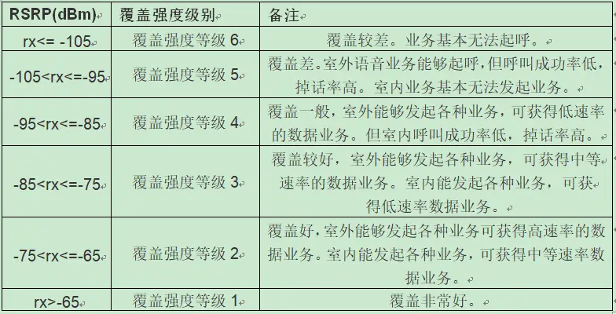

# 概述

安卓手机中关于网络信号的测量有多个名词，这里统一解释一下。

## 参考

* [RSRP RSRQ RSSI SNR的定义](https://www.jianshu.com/p/1dc26435e022)

## RSRP

RSRP (Reference Signal Receiving Power，参考信号接收功率) 是LTE网络中可以代表无线信号强度的关键参数以及[物理层](https://baike.baidu.com/item/物理层)测量需求之一，是在某个符号内承载参考信号的所有RE(资源粒子)上接收到的信号功率的平均值。通俗得理解，RSRP的功率值 代表了每个子载波的功率值
 用处和规范都等同于WCDMA中的RSCP（Received Signal Code Power）接收信号码功率。

- 取值范围：-44~-140dBm,值越大越好
- 衡量标准

## RSRQ

RSRQ（Reference Signal Receiving Quality）表示LTE参考信号接收质量，这种度量主要是根据信号质量来对不同LTE候选小区进行排序。这种测量用作切换和小区重选决定的输入。
 RSRQ被定义为N*RSRP/(LTE载波RSSI）之比，其中N是LTE载波RSSI测量带宽的资源块（RB）个数。RSRQ实现了一种有效的方式报告信号强度和干扰相结合的效果。反映和指示当前信道质量的信噪比和干扰水平。为了使测量得到的RSRQ为负值，与RSRP保持一致，因此RSRP定义的是单个RE上的信号功率，RSSI定义的是一个OFDM符号上所有RE的总接收功率。
 *取值范围：-3~-19.5 ，值越大越好

## RSSI

RSSI（Received Signal StrengthIndicator接收信号强度指示)：UE探测带宽内一个OFDM符号所有RE上的总接收功率（若是20M的系统带宽，当没有下行数据时，则为200个导频RE上接收功率总和，当有下行数据时，则为1200个RE上接收功率总和），包括服务小区和非服务小区信号、相邻信道干扰，系统内部热噪声等。即为总功率S+I+N，其中I为干扰功率，N为噪声功率。反映当前信道的接收信号强度和干扰程度。
 rssi在无线网络中表示信号的强度,它随距离的增大而衰减,通常为负值,该值越接近零说明信号强度越高。
 RSSI持续过低，说明基站收到的上行信号太弱，可能导致解调失败。 RSSI持续过高，说明收到的上行信号太强，相互之间的干扰太大，也影响信号解调。

## SNR

SNR是signal to noise ratio的缩写，即信噪比，它指规定条件下测得的有用信号电平与电磁噪声电平之间的比值。在任意点上有用信号的幅度与同一点上噪声信号的幅度之比，并用分贝(dB)表示。峰值与脉冲噪声相联系，有效值则与随机噪声相联系。
 一般是越大越好。

 ## ECIO

 Ec/Io这个值类似于信噪比，值越小信号越好，反映了手机在当前接收到的导频信号的水平（即信号质量的好坏，不是信号强度）。正常范围＞-12dB。

 ### MTK信号强度定义

 [MTK_Android11各制式信号格数判断标准.pdf](refer/MTK_Android11各制式信号格数判断标准.pdf)