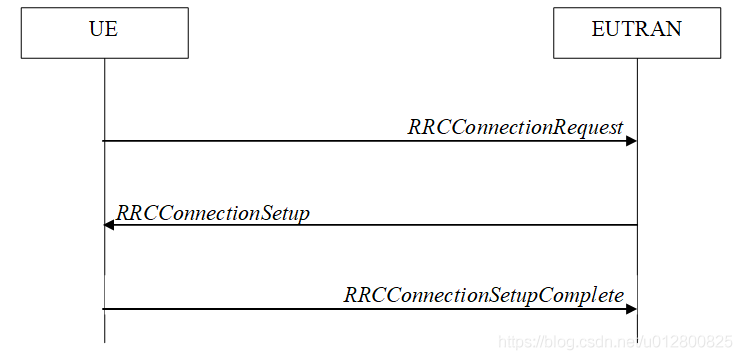
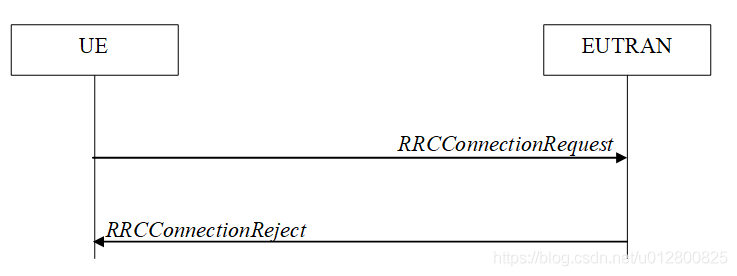
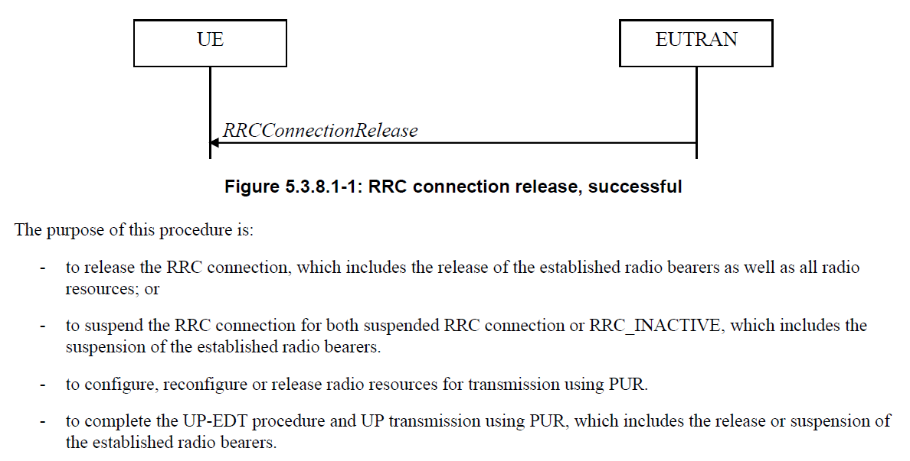
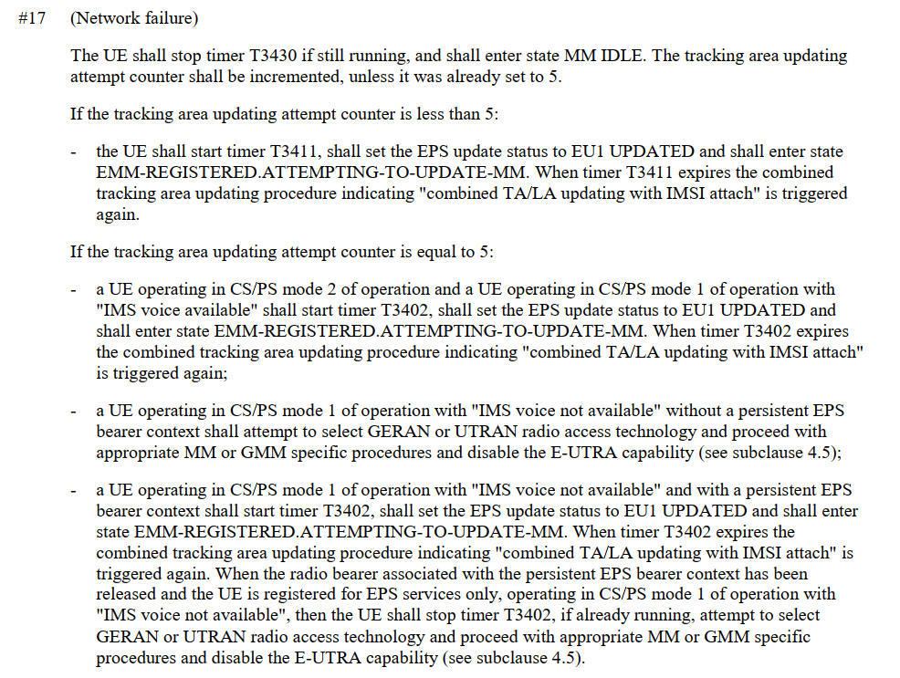

# 概述

第一次开启Vsim功能，偶发性驻网慢问题分析

## 参考

* [LTE学习笔记 ——RRC连接建立](https://blog.csdn.net/u012800825/article/details/84451057)

* [以高通为例解码UECapabilityInformation](http://blog.sina.com.cn/s/blog_c458a9a30102yora.html)

* [小区重选优先级_小区重选时的PLMN选择](https://blog.csdn.net/weixin_29230649/article/details/112827865)

* spec下载地址：https://www.etsi.org/

* [MTK推荐MD处理流程Spec_ts_124301v160800p.pdf](refer/ts_124301v160800p.pdf)

## 问题描述
我们设备第一次开启Vsim功能，偶发性驻网慢，请帮忙看一下什么原因？时间点如下：

```
9.08.28 有空格信号出现 
9.10.38 信号满格，但是不能上网
9.11.26 信号满格，能上网

最终驻网：
band 3
PCI:376
EARFCN:1300
```

## 基础

* RRC连接建立成功过程



* RRC连接建立失败过程



## log分析过程

### 1.驻网`EARFCN[100], PCI[37]`

```
1.开始驻网
这一步为可选流程，只有在attach request中提供的UE身份标识无法被网络识别时，网络才会触发这一流程。当然，在其他需要UE身份认证的情景下也会触发这一流程。
[MS->NW] ERRC_RRCConnectionRequest(EARFCN[100], PCI[37])
[NW->MS] ERRC_RRCConnectionSetup(EARFCN[100], PCI[37])

2.向EPC注册EPS业务或non-EPS服务
注册接收，EPS承载请求
[MS->NW] EMM_Attach_Request(cipher="KAL_FALSE", EPS attach type="EMM_ATTACH_TYPE_COMBINED_ATTACH")


[MS->NW] ERRC_RRCConnectionSetupComplete(EARFCN[100], PCI[37])

3.鉴权过程：
这个过程中利用usim中的K值和算法完成与网络测K值和算法的认证计算过程并生成后续加密和完整性保护锁需要的秘钥。
[NW->MS] EMM_Authentication_Request(cipher="KAL_FALSE")
[MS->NW] EMM_Authentication_Response(cipher="KAL_FALSE")

4.这一步负责协商AS（PDCP）所用的加密算法
[NW->MS] EMM_Security_Mode_Command(cipher="KAL_FALSE", integrity algorithm="INT_128_EIA2", ciphering algorithm="ENC_128_EEA2")
[MS->NW] EMM_Security_Mode_Complete(cipher="KAL_TRUE")

5.切换过程中发生protocol error，网络就会直接释放
[NW->MS] ERRC_RRCConnectionRelease(EARFCN[100], PCI[37])(cause:[ReleaseCause_other], redirectInfo:[0])
[NW->MS] EMM_Attach_Reject(cipher="KAL_TRUE", EMM cause="EMM_CAUSE_PROTOCOL_ERROR")

6.masterinformationblock 的作用是说明RRC连接没有建立就进入了空闲状态
[NW->MS] SystemInformationBlockType1 (EARFCN[1650], PCI[445])
```

### 2.小区重选`EARFCN[1650], PCI[445]`

当在nas层reject当前连接后，当接收到第一次attach request时候，发送attach reject，cause 17；ue接收后，会触发基站发送rrcconnectionrelease给UE，此时UE会对rrcconnectionrelease包进行解析，因为本身也是连接出现问题才会触发rrcconnectionrelease，即有可能是就是基站层丢失了一开始注册入网的key等信息。



```log
1.捕获系统消息，关于小区EARFCN[1650], PCI[445]

[NW->MS] SystemInformationBlockType1 (EARFCN[1650], PCI[445])
[NW->MS] MasterInformationBlock (EARFCN[1650], PCI[445])
[NW->MS] MasterInformationBlock (EARFCN[1650], PCI[445])
[NW->MS] SystemInformationBlockType1 (EARFCN[1650], PCI[445])
[NW->MS] SystemInformation (EARFCN[1650], PCI[445])
[NW->MS] SIB2 (EARFCN[1650], PCI[445]) ACB信息, 公共无线资源的配置, 上行带宽.
[NW->MS] SystemInformation (EARFCN[1650], PCI[445])
[NW->MS] SIB3 (EARFCN[1650], PCI[445]) 小区重选信息
[NW->MS] SIB5 (EARFCN[1650], PCI[445]) 相邻小区信息

2.小区切换流程
[MS->NW] ERRC_RRCConnectionRequest(EARFCN[1650], PCI[445])
[NW->MS] ERRC_RRCConnectionSetup(EARFCN[1650], PCI[445])
[MS->NW] EMM_Attach_Request(cipher="KAL_FALSE", EPS attach type="EMM_ATTACH_TYPE_COMBINED_ATTACH")
[MS->NW] ERRC_RRCConnectionSetupComplete(EARFCN[1650], PCI[445])

3.eNB查询UE能力，UE返回UECapabilityInformation，使用SRB1承载，对应逻辑信道为UL-DCCH，返回各个RAT能力。
[NW->MS] UECapabilityEnquiry (EARFCN[1650], PCI[445])(EUTRA[1], UTRA[0], GERAN-CS[1], GERAN-PS[1], C2K-1xRTT[1])
[MS->NW] UECapabilityInformation (EARFCN[1650], PCI[445])(EUTRA[1], UTRA[0], GERAN-CS[1], GERAN-PS[1], C2K-1xRTT[0])

4.小区重选信息
[NW->MS] SIB6 (EARFCN[1650], PCI[445])
[NW->MS] SIB7 (EARFCN[1650], PCI[445])
[NW->MS] SIB8 (EARFCN[1650], PCI[445])

5.鉴权过程：
[NW->MS] EMM_Authentication_Request(cipher="KAL_FALSE")
[MS->NW] EMM_Authentication_Response(cipher="KAL_FALSE")

6.这一步负责协商AS（PDCP）所用的加密算法
[NW->MS] EMM_Security_Mode_Command(cipher="KAL_FALSE", integrity algorithm="INT_128_EIA2", ciphering algorithm="ENC_128_EEA2")
[MS->NW] EMM_Security_Mode_Complete(cipher="KAL_TRUE")

7.切换过程中发生EMM_CAUSE_NW_FAILURE，网络就会直接释放
[NW->MS] EMM_Attach_Reject(cipher="KAL_TRUE", EMM cause="EMM_CAUSE_NW_FAILURE")
[NW->MS] ERRC_RRCConnectionRelease(EARFCN[1650], PCI[445])(cause:[ReleaseCause_other], redirectInfo:[0])

8.解析EMM_Attach_Reject错误原因，Network failure，如下：
Non-Access-Stratum (NAS)PDU

    0000 .... = Security header type: Plain NAS message, not security protected (0)

    .... 0111 = Protocol discriminator: EPS mobility management messages (0x7)

    NAS EPS Mobility Management Message Type: Attach reject (0x44)

    EMM cause

        Cause: Network failure (17)

attach reject选用cause 17，network failure，比较“弱”的一个cause。
```

### 2分钟都在该小区重选

* 原因都是一样，`EMM_CAUSE_NW_FAILURE`:

```log
199460, 247033, 3537278, 09:09:31:268 2022/01/18, MOD_EMM_NASMSG, , TRACE_PEER, [NW->MS] EMM_Attach_Reject(cipher="KAL_TRUE", EMM cause="EMM_CAUSE_NW_FAILURE")
320571, 249671, 3909438, 09:09:55:156 2022/01/18, MOD_EMM_NASMSG, , TRACE_PEER, [NW->MS] EMM_Attach_Reject(cipher="KAL_TRUE", EMM cause="EMM_CAUSE_NW_FAILURE")
441130, 252988, 4279786, 09:10:18:888 2022/01/18, MOD_EMM_NASMSG, , TRACE_PEER, [NW->MS] EMM_Attach_Reject(cipher="KAL_TRUE", EMM cause="EMM_CAUSE_NW_FAILURE")
553491, 413888, 4650837, 09:10:42:567 2022/01/18, MOD_EMM_NASMSG, , TRACE_PEER, [NW->MS] EMM_Attach_Reject(cipher="KAL_TRUE", EMM cause="EMM_CAUSE_NW_FAILURE")
658385, 264714, 5023010, 09:11:06:316 2022/01/18, MOD_EMM_NASMSG, , TRACE_PEER, [NW->MS] EMM_Attach_Reject(cipher="KAL_TRUE", EMM cause="EMM_CAUSE_NW_FAILURE")
```

* 整个驻网如下，`(EARFCN[3590], PCI[367])`可以上网，但是`(EARFCN[1300], PCI[376])`小区信号更好最后还是切到`(EARFCN[1300], PCI[376])`了：

```log
68872, 29935, 3320180, 09:09:17:467 2022/01/18, MOD_ERRC_CONN, , TRACE_PEER, [MS->NW] ERRC_RRCConnectionRequest(EARFCN[1650], PCI[445])
229920, 35110, 3694092, 09:09:41:356 2022/01/18, MOD_ERRC_CONN, , TRACE_PEER, [MS->NW] ERRC_RRCConnectionRequest(EARFCN[1650], PCI[445])
349504, 40236, 4066250, 09:10:05:086 2022/01/18, MOD_ERRC_CONN, , TRACE_PEER, [MS->NW] ERRC_RRCConnectionRequest(EARFCN[1650], PCI[445])
464076, 199915, 4436864, 09:10:28:966 2022/01/18, MOD_ERRC_CONN, , TRACE_PEER, [MS->NW] ERRC_RRCConnectionRequest(EARFCN[1650], PCI[445])
565918, 50592, 4807961, 09:10:52:714 2022/01/18, MOD_ERRC_CONN, , TRACE_PEER, [MS->NW] ERRC_RRCConnectionRequest(EARFCN[1650], PCI[445])
675288, 59977, 5034797, 09:11:07:117 2022/01/18, MOD_ERRC_CONN, , TRACE_PEER, [MS->NW] ERRC_RRCConnectionRequest(EARFCN[1650], PCI[445])
785554, 278310, 5260228, 09:11:21:531 2022/01/18, MOD_ERRC_CONN, , TRACE_PEER, [MS->NW] ERRC_RRCConnectionRequest(EARFCN[3590], PCI[367])  该小区能上网
1279976, 67543, 6050733, 09:12:12:092 2022/01/18, MOD_ERRC_CONN, , TRACE_PEER, [MS->NW] ERRC_RRCConnectionRequest(EARFCN[3590], PCI[367])
1410867, 68869, 6145156, 09:12:18:148 2022/01/18, MOD_ERRC_CONN, , TRACE_PEER, [MS->NW] ERRC_RRCConnectionRequest(EARFCN[1300], PCI[376])
```

## 分析结论

### [Analysis of logs with log prints]

```log
Type	Index	Time	Local Time	Module	TraceType	Message	Comment	Time Differences
PS	42844	24048237	16:31:32:610	SIM - GMSS		MSG_ID_SIM_GMSS_READY_IND	[Association IMSI: 234500016618620]
   Mobile Country Code (MCC): United Kingdom (234)
   Mobile Network Code (MNC): Jersey Telecom (50)	
PS	46257	24048872	16:31:32:610	NWSEL - EVAL		MSG_ID_NWSEL_EVAL_PLMN_SEARCH_REQ		
PS	58693	24054199	16:31:33:011	EVAL - NWSEL		MSG_ID_NWSEL_EVAL_PLMN_FOUND_IND		
PS	58815	24054220	16:31:33:011	NWSEL - EVAL		MSG_ID_NWSEL_EVAL_PLMN_SEARCH_REQ	46011	
PS	66181	24058360	16:31:33:214	EVAL - NWSEL		MSG_ID_NWSEL_EVAL_PLMN_SEARCH_CNF		
OTA	74748	24062763	16:31:33:622	EMM_NASMSG		[MS->NW] EMM_Attach_Request(cipher="KAL_FALSE", EPS attach type="EMM_ATTACH_TYPE_COMBINED_ATTACH")		
OTA	209340	24280411	16:31:47:423	EMM_NASMSG		[NW->MS] EMM_Attach_Reject(cipher="KAL_TRUE", EMM cause="EMM_CAUSE_PROTOCOL_ERROR")		
PS	210685	24280679	16:31:47:623	NWSEL		[NWSEL Context][Disable EUTRAN] PLMN 46011f is in EUTRAN disabled list, cause: CS - NWSEL_REJ_CAUSE_CS_ABNORMAL; PS - NWSEL_REJ_CAUSE_PS_ABNORMAL		
PS	210712	24280690	16:31:47:623	NWSEL		NWSEL_EUTRAN_DISABLE_TIMER_ID Timer starts, period = 720 seconds		
PS	219144	24285641	16:31:47:826	NWSEL - EVAL		MSG_ID_NWSEL_EVAL_PLMN_SEARCH_REQ	46001	
OTA	226414	24290600	16:31:48:228	EMM_NASMSG		[MS->NW] EMM_Attach_Request(cipher="KAL_FALSE", EPS attach type="EMM_ATTACH_TYPE_COMBINED_ATTACH")		
OTA	321070	24503967	16:32:01:828	EMM_NASMSG		[NW->MS] EMM_Attach_Reject(cipher="KAL_TRUE", EMM cause="EMM_CAUSE_NW_FAILURE")		
OTA	334278	24530099	16:32:03:579	ERRC_SYS		[NW->MS] SystemInformationBlockType1 (EARFCN[1506], PCI[84])	46001	
OTA	353337	24661499	16:32:11:873	EMM_NASMSG		[MS->NW] EMM_Attach_Request(cipher="KAL_FALSE", EPS attach type="EMM_ATTACH_TYPE_COMBINED_ATTACH")		
OTA	444542	24878048	16:32:25:674	EMM_NASMSG		[NW->MS] EMM_Attach_Reject(cipher="KAL_TRUE", EMM cause="EMM_CAUSE_NW_FAILURE")		
OTA	447333	24878634	16:32:25:874	ERRC_SYS		[NW->MS] SystemInformationBlockType1 (EARFCN[1650], PCI[445])	46001	
OTA	475298	25035570	16:32:35:801	EMM_NASMSG		[MS->NW] EMM_Attach_Request(cipher="KAL_FALSE", EPS attach type="EMM_ATTACH_TYPE_COMBINED_ATTACH")		
OTA	566134	25248553	16:32:49:402	EMM_NASMSG		[NW->MS] EMM_Attach_Reject(cipher="KAL_TRUE", EMM cause="EMM_CAUSE_NW_FAILURE")		
OTA	569390	25249262	16:32:49:602	ERRC_SYS		[NW->MS] SystemInformationBlockType1 (EARFCN[1650], PCI[445])	46001	
OTA	593781	25406381	16:32:59:589	EMM_NASMSG		[MS->NW] EMM_Attach_Request(cipher="KAL_FALSE", EPS attach type="EMM_ATTACH_TYPE_COMBINED_ATTACH")		
OTA	690049	25620540	16:33:13:189	EMM_NASMSG		[NW->MS] EMM_Attach_Reject(cipher="KAL_TRUE", EMM cause="EMM_CAUSE_NW_FAILURE")		
OTA	692802	25621149	16:33:13:389	ERRC_SYS		[NW->MS] SystemInformationBlockType1 (EARFCN[1650], PCI[445])	46001	
OTA	703507	25778379	16:33:23:396	EMM_NASMSG		[MS->NW] EMM_Attach_Request(cipher="KAL_FALSE", EPS attach type="EMM_ATTACH_TYPE_COMBINED_ATTACH")		
OTA	796959	25992385	16:33:36:996	EMM_NASMSG		[NW->MS] EMM_Attach_Reject(cipher="KAL_TRUE", EMM cause="EMM_CAUSE_NW_FAILURE")		
PS	798542	25992714	16:33:36:996	NWSEL - EVAL		MSG_ID_NWSEL_EVAL_PLMN_SEARCH_REQ		
PS	807213	26000539	16:33:37:601	EVAL - NWSEL		MSG_ID_NWSEL_EVAL_PLMN_FOUND_IND		
PS	807294	26000559	16:33:37:601	NWSEL - EVAL		MSG_ID_NWSEL_EVAL_PLMN_SEARCH_REQ	46000	
OTA	809378	26003547	16:33:37:803	ERRC_SYS		[NW->MS] SystemInformationBlockType1 (EARFCN[3590], PCI[367])	46000	
OTA	815333	26006966	16:33:38:003	EMM_NASMSG		[MS->NW] EMM_Attach_Request(cipher="KAL_FALSE", EPS attach type="EMM_ATTACH_TYPE_COMBINED_ATTACH")		
OTA	879409	26103785	16:33:44:204	EMM_NASMSG		[NW->MS] EMM_Attach_Accept(cipher="KAL_TRUE", EPS attach result="EMM_ATTACH_RESULT_COMBINED_ATTACHED")	
```

* logcat打印：

```log
PAYPHONEM50:/ $ logcat -b radio | grep EOPS
01-19 14:38:05.296  1125  1156 I AT      : [0] AT> AT+EOPS? (RIL_CMD_RT_7 tid:503998483648
)
01-19 14:38:05.300  1125  1155 I AT      : [0] AT< +EOPS: 0,2,"46001",1 (RIL_CMD_RT_7, tid
:503999524032)
01-19 14:38:08.957  1125  1156 I AT      : [0] AT> AT+EOPS? (RIL_CMD_RT_7 tid:503998483648
)
01-19 14:38:08.961  1125  1155 I AT      : [0] AT< +EOPS: 0,2,"46001",1 (RIL_CMD_RT_7, tid
:503999524032)
01-19 14:38:18.796  1125  1154 I AT      : [0] AT> AT+EOPS? (RIL_ATCI_READER tid:504000564
416)
01-19 14:38:18.796  1125  1146 I AT      : [0] AT> AT+EOPS? (RIL_CMD_READER_1 tid:50404244
1920)
01-19 14:38:18.805  1125  1153 I AT      : [0] AT< +EOPS: 0,2,"46001",1 (RIL_ATCI_READER,
tid:504001604800)
01-19 14:38:18.805  1125  1145 I AT      : [0] AT< +EOPS: 0,2,"46001",1 (RIL_CMD_READER_1,
 tid:504043482304)
01-19 14:38:18.806  1125  1146 I AT      : [0] AT> AT+EOPS? (RIL_CMD_READER_1 tid:50404244
1920)
01-19 14:38:18.812  1125  1145 I AT      : [0] AT< +EOPS: 0,2,"46001",1 (RIL_CMD_READER_1,
 tid:504043482304)
01-19 14:39:53.749  1125  1146 I AT      : [0] AT> AT+EOPS? (RIL_CMD_READER_1 tid:50404244
1920)
01-19 14:39:53.758  1125  1145 I AT      : [0] AT< +EOPS: 0,2,"46001",1 (RIL_CMD_READER_1,
 tid:504043482304)
01-19 14:39:53.769  1125  1156 I AT      : [0] AT> AT+EOPS? (RIL_CMD_RT_7 tid:503998483648
)
01-19 14:39:53.773  1125  1155 I AT      : [0] AT< +EOPS: 0,2,"46001",1 (RIL_CMD_RT_7, tid
:503999524032)
01-19 14:40:01.084  1125  1154 I AT      : [0] AT> AT+EOPS? (RIL_ATCI_READER tid:504000564
416)
01-19 14:40:01.103  1125  1153 I AT      : [0] AT< +EOPS: 0,2,"46000",4096 (RIL_ATCI_READE
R, tid:504001604800)
```


### [Root Cause / Suspected Root Cause]

当前使用的是Guernsey JT的卡，在联通和电信上注册时被网络拒绝。联通运营商拒绝时使用了原因EMM_CAUSE_NW_FAILURE，所以根据spec，UE会重新尝试，5次失败之后会找下一个plmn去尝试，

最终在移动上注册成功。


### [Next Action]

综上分析，UE行为没有异常。

## 实验

* 但是使用bandmode工具锁定band41，后发现驻网很快：

```log
76791, 4173, 3829951, 16:02:26:404 2022/01/18, MOD_ERRC_SYS, , TRACE_PEER, [NW->MS] MasterInformationBlock (EARFCN[40936], PCI[299])
76952, 4251, 3830029, 16:02:26:404 2022/01/18, MOD_ERRC_SYS, , TRACE_PEER, [NW->MS] SystemInformationBlockType1 (EARFCN[40936], PCI[299])
82850, 6987, 3832765, 16:02:26:899 2022/01/18, MOD_ERRC_SYS, , TRACE_PEER, [NW->MS] MasterInformationBlock (EARFCN[40936], PCI[299])
83177, 7064, 3832842, 16:02:26:899 2022/01/18, MOD_ERRC_SYS, , TRACE_PEER, [NW->MS] SystemInformationBlockType1 (EARFCN[40936], PCI[299])
84049, 7361, 3833139, 16:02:26:899 2022/01/18, MOD_ERRC_SYS, , TRACE_PEER, [NW->MS] SystemInformation (EARFCN[40936], PCI[299])
84050, 7361, 3833139, 16:02:26:899 2022/01/18, MOD_ERRC_SYS, , TRACE_PEER, [NW->MS] SIB5 (EARFCN[40936], PCI[299])
84333, 7502, 3833280, 16:02:26:899 2022/01/18, MOD_ERRC_SYS, , TRACE_PEER, [NW->MS] SystemInformation (EARFCN[40936], PCI[299])
84334, 7502, 3833280, 16:02:26:899 2022/01/18, MOD_ERRC_SYS, , TRACE_PEER, [NW->MS] SIB5 (EARFCN[40936], PCI[299])
84434, 7673, 3833451, 16:02:26:899 2022/01/18, MOD_ERRC_SYS, , TRACE_PEER, [NW->MS] SystemInformation (EARFCN[40936], PCI[299])
84435, 7674, 3833452, 16:02:26:899 2022/01/18, MOD_ERRC_SYS, , TRACE_PEER, [NW->MS] SIB5 (EARFCN[40936], PCI[299])
84464, 7846, 3833624, 16:02:26:899 2022/01/18, MOD_ERRC_SYS, , TRACE_PEER, [NW->MS] SystemInformation (EARFCN[40936], PCI[299])
84465, 7846, 3833624, 16:02:26:899 2022/01/18, MOD_ERRC_SYS, , TRACE_PEER, [NW->MS] SIB5 (EARFCN[40936], PCI[299])
85852, 9237, 3835015, 16:02:26:899 2022/01/18, MOD_ERRC_SYS, , TRACE_PEER, [NW->MS] SystemInformation (EARFCN[40936], PCI[299])
85853, 9237, 3835015, 16:02:26:899 2022/01/18, MOD_ERRC_SYS, , TRACE_PEER, [NW->MS] SIB2 (EARFCN[40936], PCI[299])
85854, 9237, 3835015, 16:02:26:899 2022/01/18, MOD_ERRC_SYS, , TRACE_PEER, [NW->MS] SIB3 (EARFCN[40936], PCI[299])
92686, 12809, 3838587, 16:02:26:899 2022/01/18, MOD_ESM, , TRACE_PEER, [MS->NW] ESM_MSG_PDN_CONNECTIVITY_REQUEST (PTI:1, EBI:0)
94017, 383, 3838999, 16:02:26:899 2022/01/18, MOD_ERRC_CONN, , TRACE_PEER, [MS->NW] ERRC_RRCConnectionRequest(EARFCN[40936], PCI[299])
94428, 830, 3839446, 16:02:26:899 2022/01/18, MOD_ERRC_CONN, , TRACE_PEER, [NW->MS] ERRC_RRCConnectionSetup(EARFCN[40936], PCI[299])
95268, 1094, 3839710, 16:02:26:899 2022/01/18, MOD_EMM_NASMSG, , TRACE_PEER, [MS->NW] EMM_Attach_Request(cipher="KAL_FALSE", EPS attach type="EMM_ATTACH_TYPE_COMBINED_ATTACH")
95319, 1108, 3839724, 16:02:26:899 2022/01/18, MOD_ERRC_CONN, , TRACE_PEER, [MS->NW] ERRC_RRCConnectionSetupComplete(EARFCN[40936], PCI[299])
102809, 7571, 3846187, 16:02:27:395 2022/01/18, MOD_ERRC_CONN, , TRACE_PEER, [NW->MS] ERRC_DLInformationTransfer(EARFCN[40936], PCI[299])
102842, 7579, 3846195, 16:02:27:395 2022/01/18, MOD_EMM_NASMSG, , TRACE_PEER, [NW->MS] EMM_Authentication_Request(cipher="KAL_FALSE")
109602, 14948, 3853564, 16:02:27:904 2022/01/18, MOD_EMM_NASMSG, , TRACE_PEER, [MS->NW] EMM_Authentication_Response(cipher="KAL_FALSE")
109627, 14955, 3853571, 16:02:27:904 2022/01/18, MOD_ERRC_CONN, , TRACE_PEER, [MS->NW] ERRC_ULInformationTransfer(EARFCN[40936], PCI[299])
110445, 15805, 3854421, 16:02:27:904 2022/01/18, MOD_ERRC_CONN, , TRACE_PEER, [NW->MS] ERRC_DLInformationTransfer(EARFCN[40936], PCI[299])
110473, 15813, 3854429, 16:02:27:904 2022/01/18, MOD_EMM_NASMSG, , TRACE_PEER, [NW->MS] EMM_Security_Mode_Command(cipher="KAL_FALSE", integrity algorithm="INT_128_EIA2", ciphering algorithm="ENC_EEA0")
110607, 15844, 3854460, 16:02:27:904 2022/01/18, MOD_EMM_NASMSG, , TRACE_PEER, [MS->NW] EMM_Security_Mode_Complete(cipher="KAL_TRUE")
110644, 15854, 3854470, 16:02:27:904 2022/01/18, MOD_ERRC_CONN, , TRACE_PEER, [MS->NW] ERRC_ULInformationTransfer(EARFCN[40936], PCI[299])
111417, 16384, 3855000, 16:02:27:904 2022/01/18, MOD_ERRC_CONN, , TRACE_PEER, [NW->MS] ERRC_DLInformationTransfer(EARFCN[40936], PCI[299])
111498, 16400, 3855016, 16:02:27:904 2022/01/18, MOD_ESM, , TRACE_PEER, [NW->MS] ESM_MSG_ESM_INFORMATION_REQUEST (PTI:1, EBI:0)
111541, 16408, 3855024, 16:02:27:904 2022/01/18, MOD_ESM, , TRACE_PEER, [MS->NW] ESM_MSG_ESM_INFORMATION_RESPONSE (PTI:1, EBI:0)
111649, 16437, 3855053, 16:02:27:904 2022/01/18, MOD_ERRC_CONN, , TRACE_PEER, [MS->NW] ERRC_ULInformationTransfer(EARFCN[40936], PCI[299])
193215, 112383, 3950999, 16:02:34:406 2022/01/18, MOD_ERRC_RCM, , TRACE_PEER, [NW->MS] UECapabilityEnquiry (EARFCN[40936], PCI[299])(EUTRA[1], UTRA[1], GERAN-CS[1], GERAN-PS[1], C2K-1xRTT[1])
193322, 112408, 3951024, 16:02:34:406 2022/01/18, MOD_MRS, , TRACE_PEER, [MS->NW] RRC__INTERRAT_HANDOVER_INFO
193325, 112409, 3951025, 16:02:34:406 2022/01/18, MOD_ERRC_RCM, , TRACE_PEER, [MS->NW] UECapabilityInformation (EARFCN[40936], PCI[299])(EUTRA[1], UTRA[1], GERAN-CS[0], GERAN-PS[0], C2K-1xRTT[0])
193760, 112882, 3951498, 16:02:34:406 2022/01/18, MOD_ERRC_CONN, , TRACE_PEER, [NW->MS] ERRC_SecurityModeCommand(EARFCN[40936], PCI[299])(Cipher Algo:[CipheringAlgorithm_r12_eea2],Integrity Algo:[SecurityAlgorithmConfig_integrityProtAlgorithm_eia2])
193838, 112907, 3951523, 16:02:34:406 2022/01/18, MOD_ERRC_CONN, , TRACE_PEER, [MS->NW] ERRC_SecurityModeComplete(EARFCN[40936], PCI[299])
193876, 112917, 3951533, 16:02:34:406 2022/01/18, MOD_ERRC_CONN, , TRACE_PEER, [NW->MS] ERRC_RRCConnectionReconfiguration(EARFCN[40936], PCI[299])(measCfg:[0],mobCtrlInfo:[0],dedInfoNASList:[1],radioresCfgDed:[1],secCfgHO:[0])
194198, 113029, 3951645, 16:02:34:406 2022/01/18, MOD_ERRC_CONN, , TRACE_PEER, [MS->NW] ERRC_RRCConnectionReconfigurationComplete(EARFCN[40936], PCI[299])
194285, 113042, 3951658, 16:02:34:406 2022/01/18, MOD_EMM_NASMSG, , TRACE_PEER, [NW->MS] EMM_Attach_Accept(cipher="KAL_TRUE", EPS attach result="EMM_ATTACH_RESULT_COMBINED_ATTACHED")
194630, 11, 3951727, 16:02:34:406 2022/01/18, MOD_ESM, , TRACE_PEER, [NW->MS] ESM_MSG_ACTIVATE_DEFAULT_EPS_BEARER_CONTEXT_REQUEST (PTI:1, EBI:5)
194873, 50, 3951766, 16:02:34:406 2022/01/18, MOD_ESM, , TRACE_PEER, [MS->NW] ESM_MSG_ACTIVATE_DEFAULT_EPS_BEARER_CONTEXT_ACCEPT (PTI:0, EBI:5)
194962, 65, 3951781, 16:02:34:406 2022/01/18, MOD_EMM_NASMSG, , TRACE_PEER, [MS->NW] EMM_Attach_Complete(cipher="KAL_TRUE")
```

## 结论

### 1.首先了解一下PLMN入网机制：

23122协议规定的小区重选PLMN选择顺序

At switch on or recovery from lack of coverarge(第一次开机或者恢复出厂设置)，用户首先尝试选择的是RPLMN(registeredPLMN)，选择失败后按照如下顺序选择：

- 1. HPLMN(如果EHPLMN列表不存在或为空)或最高优先级的EHPLMN(如果EHPLMN列表存在)；

- 2. 在SIM卡数据中按照UPLMN优先级顺序选择；(User Controlled PLMN Selector with Access Technology)

- 3. 在SIM卡数据中按照OPLMN优先级顺序选择；(Operator Controlled PLMN Selector with Access Technology)

- 4. 随机选择RSCP值大于-84dBm(足够强度信号质量)形成的PLMN接入技术组合；

- 5. 当信号强度不够时，根据接收信号强度递减排序选择其他所有PLMN。

注：一般大部分SIM卡不写入EHPLMN或者OPLMN，当然有些恶劣的运营商为了国际漫游用户选择自己的网络干了些不该干的事情，这里就不点名了。


### 2.分析结论

```log
分析结论：
UE行为没有异常。

当前使用的是Guernsey JT的卡，在联通EARFCN[1650], PCI[445]和电信上注册时被网络拒绝。联通运营商拒绝时使用了原因EMM_CAUSE_NW_FAILURE，所以根据spec，UE会重新尝试，5次失败之后会找下一个plmn去尝试，

最终在移动上注册成功。

建议：
由于UE随机选择RSCP值大于-84dBm(足够强度信号质量)形成的PLMN优先级注册，在公司这边排序是电信>联通>移动，但是电信和移动都无法驻网，我们尝试直接设置RPLMN为46000(移动)，发现第一次驻网会很快。无需修改，因为就算第一次找网慢，后续也会根据RPLMN驻网，不会影响后续驻网的速度。
```

* spec如下解释fail原因，有点看不懂：



## log汇总

```log
4754, 0, 2343733, 09:08:14:986 2022/01/18, MOD_ADR_FDD, , TRACE_PEER, [NW->MS] FDD_RRC__PAGING_TYPE1
59145, 32174, 3316374, 09:09:17:259 2022/01/18, MOD_ERRC_SYS, , TRACE_PEER, [NW->MS] MasterInformationBlock (EARFCN[1650], PCI[445])
59286, 32252, 3316452, 09:09:17:259 2022/01/18, MOD_ERRC_SYS, , TRACE_PEER, [NW->MS] SystemInformationBlockType1 (EARFCN[1650], PCI[445])
63931, 29932, 3318327, 09:09:17:259 2022/01/18, MOD_ERRC_SYS, , TRACE_PEER, [NW->MS] SystemInformationBlockType1 (EARFCN[1650], PCI[445])
64079, 30011, 3318406, 09:09:17:259 2022/01/18, MOD_ERRC_SYS, , TRACE_PEER, [NW->MS] MasterInformationBlock (EARFCN[1650], PCI[445])
64798, 30480, 3318875, 09:09:17:259 2022/01/18, MOD_ERRC_SYS, , TRACE_PEER, [NW->MS] SystemInformation (EARFCN[1650], PCI[445])
64799, 30480, 3318875, 09:09:17:259 2022/01/18, MOD_ERRC_SYS, , TRACE_PEER, [NW->MS] SIB6 (EARFCN[1650], PCI[445])
64800, 30480, 3318875, 09:09:17:259 2022/01/18, MOD_ERRC_SYS, , TRACE_PEER, [NW->MS] SIB7 (EARFCN[1650], PCI[445])
64801, 30480, 3318875, 09:09:17:259 2022/01/18, MOD_ERRC_SYS, , TRACE_PEER, [NW->MS] SIB8 (EARFCN[1650], PCI[445])
65155, 31105, 3319500, 09:09:17:467 2022/01/18, MOD_ERRC_SYS, , TRACE_PEER, [NW->MS] SystemInformation (EARFCN[1650], PCI[445])
65156, 31105, 3319500, 09:09:17:467 2022/01/18, MOD_ERRC_SYS, , TRACE_PEER, [NW->MS] SIB2 (EARFCN[1650], PCI[445])
67399, 29717, 3319802, 09:09:17:467 2022/01/18, MOD_ESM, , TRACE_PEER, [MS->NW] ESM_MSG_PDN_CONNECTIVITY_REQUEST (PTI:1, EBI:0)
68872, 29935, 3320180, 09:09:17:467 2022/01/18, MOD_ERRC_CONN, , TRACE_PEER, [MS->NW] ERRC_RRCConnectionRequest(EARFCN[1650], PCI[445])
69050, 30389, 3320634, 09:09:17:467 2022/01/18, MOD_ERRC_CONN, , TRACE_PEER, [NW->MS] ERRC_RRCConnectionSetup(EARFCN[1650], PCI[445])
69864, 30625, 3320870, 09:09:17:467 2022/01/18, MOD_EMM_NASMSG, , TRACE_PEER, [MS->NW] EMM_Attach_Request(cipher="KAL_FALSE", EPS attach type="EMM_ATTACH_TYPE_COMBINED_ATTACH")
69901, 30637, 3320882, 09:09:17:467 2022/01/18, MOD_ERRC_CONN, , TRACE_PEER, [MS->NW] ERRC_RRCConnectionSetupComplete(EARFCN[1650], PCI[445])
70419, 30819, 3321064, 09:09:17:467 2022/01/18, MOD_ERRC_SYS, , TRACE_PEER, [NW->MS] SystemInformation (EARFCN[1650], PCI[445])
70420, 30819, 3321064, 09:09:17:467 2022/01/18, MOD_ERRC_SYS, , TRACE_PEER, [NW->MS] SIB3 (EARFCN[1650], PCI[445])
70421, 30819, 3321064, 09:09:17:467 2022/01/18, MOD_ERRC_SYS, , TRACE_PEER, [NW->MS] SIB5 (EARFCN[1650], PCI[445])
71323, 31022, 3321267, 09:09:17:467 2022/01/18, MOD_ERRC_RCM, , TRACE_PEER, [NW->MS] UECapabilityEnquiry (EARFCN[1650], PCI[445])(EUTRA[1], UTRA[0], GERAN-CS[1], GERAN-PS[1], C2K-1xRTT[1])
71524, 31075, 3321320, 09:09:17:467 2022/01/18, MOD_ERRC_RCM, , TRACE_PEER, [MS->NW] UECapabilityInformation (EARFCN[1650], PCI[445])(EUTRA[1], UTRA[0], GERAN-CS[1], GERAN-PS[1], C2K-1xRTT[0])
76936, 36553, 3326798, 09:09:17:868 2022/01/18, MOD_ERRC_CONN, , TRACE_PEER, [NW->MS] ERRC_DLInformationTransfer(EARFCN[1650], PCI[445])
76976, 36560, 3326805, 09:09:17:868 2022/01/18, MOD_EMM_NASMSG, , TRACE_PEER, [NW->MS] EMM_Authentication_Request(cipher="KAL_FALSE")
83143, 42922, 3333167, 09:09:18:268 2022/01/18, MOD_EMM_NASMSG, , TRACE_PEER, [MS->NW] EMM_Authentication_Response(cipher="KAL_FALSE")
83170, 42933, 3333178, 09:09:18:268 2022/01/18, MOD_ERRC_CONN, , TRACE_PEER, [MS->NW] ERRC_ULInformationTransfer(EARFCN[1650], PCI[445])
83756, 43412, 3333657, 09:09:18:268 2022/01/18, MOD_ERRC_CONN, , TRACE_PEER, [NW->MS] ERRC_DLInformationTransfer(EARFCN[1650], PCI[445])
83783, 43418, 3333663, 09:09:18:268 2022/01/18, MOD_EMM_NASMSG, , TRACE_PEER, [NW->MS] EMM_Security_Mode_Command(cipher="KAL_FALSE", integrity algorithm="INT_128_EIA2", ciphering algorithm="ENC_128_EEA2")
83927, 43450, 3333695, 09:09:18:268 2022/01/18, MOD_EMM_NASMSG, , TRACE_PEER, [MS->NW] EMM_Security_Mode_Complete(cipher="KAL_TRUE")
83965, 43459, 3333704, 09:09:18:268 2022/01/18, MOD_ERRC_CONN, , TRACE_PEER, [MS->NW] ERRC_ULInformationTransfer(EARFCN[1650], PCI[445])
199411, 247024, 3537269, 09:09:31:268 2022/01/18, MOD_ERRC_CONN, , TRACE_PEER, [NW->MS] ERRC_DLInformationTransfer(EARFCN[1650], PCI[445])
199460, 247033, 3537278, 09:09:31:268 2022/01/18, MOD_EMM_NASMSG, , TRACE_PEER, [NW->MS] EMM_Attach_Reject(cipher="KAL_TRUE", EMM cause="EMM_CAUSE_NW_FAILURE")
199469, 247039, 3537284, 09:09:31:268 2022/01/18, MOD_ERRC_CONN, , TRACE_PEER, [NW->MS] ERRC_RRCConnectionRelease(EARFCN[1650], PCI[445])(cause:[ReleaseCause_other], redirectInfo:[0])
202264, 247548, 3537793, 09:09:31:268 2022/01/18, MOD_ERRC_SYS, , TRACE_PEER, [NW->MS] MasterInformationBlock (EARFCN[1650], PCI[445])
203306, 247775, 3538020, 09:09:31:468 2022/01/18, MOD_ERRC_SYS, , TRACE_PEER, [NW->MS] SystemInformationBlockType1 (EARFCN[1650], PCI[445])
209526, 267369, 3557614, 09:09:32:642 2022/01/18, MOD_ERRC_SYS, , TRACE_PEER, [NW->MS] SystemInformationBlockType1 (EARFCN[3740], PCI[150])
209642, 267445, 3557690, 09:09:32:642 2022/01/18, MOD_ERRC_SYS, , TRACE_PEER, [NW->MS] MasterInformationBlock (EARFCN[3740], PCI[150])
210438, 268931, 3559176, 09:09:32:642 2022/01/18, MOD_ERRC_SYS, , TRACE_PEER, [NW->MS] SystemInformationBlockType1 (EARFCN[1850], PCI[213])
210554, 269007, 3559252, 09:09:32:642 2022/01/18, MOD_ERRC_SYS, , TRACE_PEER, [NW->MS] MasterInformationBlock (EARFCN[1850], PCI[213])
211169, 269870, 3560115, 09:09:32:847 2022/01/18, MOD_ERRC_SYS, , TRACE_PEER, [NW->MS] SystemInformationBlockType1 (EARFCN[1825], PCI[197])
211285, 269945, 3560190, 09:09:32:847 2022/01/18, MOD_ERRC_SYS, , TRACE_PEER, [NW->MS] MasterInformationBlock (EARFCN[1825], PCI[197])
212036, 271431, 3561676, 09:09:32:847 2022/01/18, MOD_ERRC_SYS, , TRACE_PEER, [NW->MS] SystemInformationBlockType1 (EARFCN[100], PCI[326])
212152, 271507, 3561752, 09:09:32:847 2022/01/18, MOD_ERRC_SYS, , TRACE_PEER, [NW->MS] MasterInformationBlock (EARFCN[100], PCI[326])
212763, 272369, 3562614, 09:09:32:847 2022/01/18, MOD_ERRC_SYS, , TRACE_PEER, [NW->MS] SystemInformationBlockType1 (EARFCN[1506], PCI[84])
212879, 272444, 3562689, 09:09:33:049 2022/01/18, MOD_ERRC_SYS, , TRACE_PEER, [NW->MS] MasterInformationBlock (EARFCN[1506], PCI[84])
224875, 378934, 3669179, 09:09:39:730 2022/01/18, MOD_ERRC_SYS, , TRACE_PEER, [NW->MS] SystemInformationBlockType1 (EARFCN[3590], PCI[367])
224993, 379008, 3669253, 09:09:39:730 2022/01/18, MOD_ERRC_SYS, , TRACE_PEER, [NW->MS] MasterInformationBlock (EARFCN[3590], PCI[367])
228582, 403437, 3693682, 09:09:41:356 2022/01/18, MOD_ESM, , TRACE_PEER, [MS->NW] ESM_MSG_PDN_CONNECTIVITY_REQUEST (PTI:2, EBI:0)
229920, 35110, 3694092, 09:09:41:356 2022/01/18, MOD_ERRC_CONN, , TRACE_PEER, [MS->NW] ERRC_RRCConnectionRequest(EARFCN[1650], PCI[445])
230141, 35530, 3694512, 09:09:41:356 2022/01/18, MOD_ERRC_CONN, , TRACE_PEER, [NW->MS] ERRC_RRCConnectionSetup(EARFCN[1650], PCI[445])
230949, 35012, 3694779, 09:09:41:356 2022/01/18, MOD_EMM_NASMSG, , TRACE_PEER, [MS->NW] EMM_Attach_Request(cipher="KAL_FALSE", EPS attach type="EMM_ATTACH_TYPE_COMBINED_ATTACH")
231009, 35026, 3694793, 09:09:41:356 2022/01/18, MOD_ERRC_CONN, , TRACE_PEER, [MS->NW] ERRC_RRCConnectionSetupComplete(EARFCN[1650], PCI[445])
231579, 35426, 3695193, 09:09:41:356 2022/01/18, MOD_ERRC_RCM, , TRACE_PEER, [NW->MS] UECapabilityEnquiry (EARFCN[1650], PCI[445])(EUTRA[1], UTRA[0], GERAN-CS[1], GERAN-PS[1], C2K-1xRTT[1])
231751, 35475, 3695242, 09:09:41:356 2022/01/18, MOD_ERRC_RCM, , TRACE_PEER, [MS->NW] UECapabilityInformation (EARFCN[1650], PCI[445])(EUTRA[1], UTRA[0], GERAN-CS[1], GERAN-PS[1], C2K-1xRTT[0])
234885, 43034, 3702801, 09:09:41:956 2022/01/18, MOD_ERRC_CONN, , TRACE_PEER, [NW->MS] ERRC_DLInformationTransfer(EARFCN[1650], PCI[445])
234918, 43042, 3702809, 09:09:41:956 2022/01/18, MOD_EMM_NASMSG, , TRACE_PEER, [NW->MS] EMM_Authentication_Request(cipher="KAL_FALSE")
236414, 45721, 3705488, 09:09:42:156 2022/01/18, MOD_EMM_NASMSG, , TRACE_PEER, [MS->NW] EMM_Authentication_Response(cipher="KAL_FALSE")
236511, 45730, 3705497, 09:09:42:156 2022/01/18, MOD_ERRC_CONN, , TRACE_PEER, [MS->NW] ERRC_ULInformationTransfer(EARFCN[1650], PCI[445])
236875, 46145, 3705912, 09:09:42:156 2022/01/18, MOD_ERRC_CONN, , TRACE_PEER, [NW->MS] ERRC_DLInformationTransfer(EARFCN[1650], PCI[445])
236902, 46151, 3705918, 09:09:42:156 2022/01/18, MOD_EMM_NASMSG, , TRACE_PEER, [NW->MS] EMM_Security_Mode_Command(cipher="KAL_FALSE", integrity algorithm="INT_128_EIA2", ciphering algorithm="ENC_128_EEA2")
237047, 46184, 3705951, 09:09:42:156 2022/01/18, MOD_EMM_NASMSG, , TRACE_PEER, [MS->NW] EMM_Security_Mode_Complete(cipher="KAL_TRUE")
237076, 46195, 3705962, 09:09:42:156 2022/01/18, MOD_ERRC_CONN, , TRACE_PEER, [MS->NW] ERRC_ULInformationTransfer(EARFCN[1650], PCI[445])
320522, 249662, 3909429, 09:09:55:156 2022/01/18, MOD_ERRC_CONN, , TRACE_PEER, [NW->MS] ERRC_DLInformationTransfer(EARFCN[1650], PCI[445])
320571, 249671, 3909438, 09:09:55:156 2022/01/18, MOD_EMM_NASMSG, , TRACE_PEER, [NW->MS] EMM_Attach_Reject(cipher="KAL_TRUE", EMM cause="EMM_CAUSE_NW_FAILURE")
320581, 249677, 3909444, 09:09:55:156 2022/01/18, MOD_ERRC_CONN, , TRACE_PEER, [NW->MS] ERRC_RRCConnectionRelease(EARFCN[1650], PCI[445])(cause:[ReleaseCause_other], redirectInfo:[0])
322415, 37897, 3909827, 09:09:55:156 2022/01/18, MOD_ERRC_SYS, , TRACE_PEER, [NW->MS] MasterInformationBlock (EARFCN[1650], PCI[445])
322874, 37974, 3909904, 09:09:55:156 2022/01/18, MOD_ERRC_SYS, , TRACE_PEER, [NW->MS] SystemInformationBlockType1 (EARFCN[1650], PCI[445])
326833, 40296, 3912226, 09:09:55:363 2022/01/18, MOD_ERRC_SYS, , TRACE_PEER, [NW->MS] MasterInformationBlock (EARFCN[1650], PCI[150])
326964, 40373, 3912303, 09:09:55:363 2022/01/18, MOD_ERRC_SYS, , TRACE_PEER, [NW->MS] SystemInformationBlockType1 (EARFCN[1650], PCI[150])
328060, 41858, 3913788, 09:09:55:363 2022/01/18, MOD_ERRC_SYS, , TRACE_PEER, [NW->MS] MasterInformationBlock (EARFCN[3740], PCI[150])
328193, 41936, 3913866, 09:09:55:363 2022/01/18, MOD_ERRC_SYS, , TRACE_PEER, [NW->MS] SystemInformationBlockType1 (EARFCN[3740], PCI[150])
329030, 43187, 3915117, 09:09:55:567 2022/01/18, MOD_ERRC_SYS, , TRACE_PEER, [NW->MS] SystemInformationBlockType1 (EARFCN[3590], PCI[367])
329148, 43263, 3915193, 09:09:55:567 2022/01/18, MOD_ERRC_SYS, , TRACE_PEER, [NW->MS] MasterInformationBlock (EARFCN[3590], PCI[367])
330114, 44200, 3916130, 09:09:55:567 2022/01/18, MOD_ERRC_SYS, , TRACE_PEER, [NW->MS] MasterInformationBlock (EARFCN[1825], PCI[197])
330249, 44436, 3916366, 09:09:55:567 2022/01/18, MOD_ERRC_SYS, , TRACE_PEER, [NW->MS] SystemInformationBlockType1 (EARFCN[1825], PCI[197])
330991, 45296, 3917226, 09:09:55:567 2022/01/18, MOD_ERRC_SYS, , TRACE_PEER, [NW->MS] MasterInformationBlock (EARFCN[1850], PCI[213])
331236, 45686, 3917616, 09:09:55:567 2022/01/18, MOD_ERRC_SYS, , TRACE_PEER, [NW->MS] SystemInformationBlockType1 (EARFCN[1850], PCI[213])
331911, 46546, 3918476, 09:09:55:767 2022/01/18, MOD_ERRC_SYS, , TRACE_PEER, [NW->MS] MasterInformationBlock (EARFCN[100], PCI[326])
332042, 46623, 3918553, 09:09:55:767 2022/01/18, MOD_ERRC_SYS, , TRACE_PEER, [NW->MS] SystemInformationBlockType1 (EARFCN[100], PCI[326])
332644, 47483, 3919413, 09:09:55:767 2022/01/18, MOD_ERRC_SYS, , TRACE_PEER, [NW->MS] MasterInformationBlock (EARFCN[1506], PCI[151])
332775, 47561, 3919491, 09:09:55:767 2022/01/18, MOD_ERRC_SYS, , TRACE_PEER, [NW->MS] SystemInformationBlockType1 (EARFCN[1506], PCI[151])
342411, 133422, 4005352, 09:10:01:251 2022/01/18, MOD_ERRC_SYS, , TRACE_PEER, [NW->MS] MasterInformationBlock (EARFCN[1300], PCI[376])
342546, 133500, 4005430, 09:10:01:251 2022/01/18, MOD_ERRC_SYS, , TRACE_PEER, [NW->MS] SystemInformationBlockType1 (EARFCN[1300], PCI[376])
348200, 193909, 4065839, 09:10:05:086 2022/01/18, MOD_ESM, , TRACE_PEER, [MS->NW] ESM_MSG_PDN_CONNECTIVITY_REQUEST (PTI:3, EBI:0)
349504, 40236, 4066250, 09:10:05:086 2022/01/18, MOD_ERRC_CONN, , TRACE_PEER, [MS->NW] ERRC_RRCConnectionRequest(EARFCN[1650], PCI[445])
349794, 40707, 4066721, 09:10:05:287 2022/01/18, MOD_ERRC_CONN, , TRACE_PEER, [NW->MS] ERRC_RRCConnectionSetup(EARFCN[1650], PCI[445])
350577, 40188, 4066986, 09:10:05:287 2022/01/18, MOD_EMM_NASMSG, , TRACE_PEER, [MS->NW] EMM_Attach_Request(cipher="KAL_FALSE", EPS attach type="EMM_ATTACH_TYPE_COMBINED_ATTACH")
350640, 40203, 4067001, 09:10:05:287 2022/01/18, MOD_ERRC_CONN, , TRACE_PEER, [MS->NW] ERRC_RRCConnectionSetupComplete(EARFCN[1650], PCI[445])
351328, 40649, 4067447, 09:10:05:287 2022/01/18, MOD_ERRC_RCM, , TRACE_PEER, [NW->MS] UECapabilityEnquiry (EARFCN[1650], PCI[445])(EUTRA[1], UTRA[0], GERAN-CS[1], GERAN-PS[1], C2K-1xRTT[1])
351494, 40688, 4067486, 09:10:05:287 2022/01/18, MOD_ERRC_RCM, , TRACE_PEER, [MS->NW] UECapabilityInformation (EARFCN[1650], PCI[445])(EUTRA[1], UTRA[0], GERAN-CS[1], GERAN-PS[1], C2K-1xRTT[0])
353987, 46465, 4073263, 09:10:05:687 2022/01/18, MOD_ERRC_CONN, , TRACE_PEER, [NW->MS] ERRC_DLInformationTransfer(EARFCN[1650], PCI[445])
354020, 46471, 4073269, 09:10:05:687 2022/01/18, MOD_EMM_NASMSG, , TRACE_PEER, [NW->MS] EMM_Authentication_Request(cipher="KAL_FALSE")
355490, 48830, 4075628, 09:10:05:687 2022/01/18, MOD_EMM_NASMSG, , TRACE_PEER, [MS->NW] EMM_Authentication_Response(cipher="KAL_FALSE")
355517, 48842, 4075640, 09:10:05:687 2022/01/18, MOD_ERRC_CONN, , TRACE_PEER, [MS->NW] ERRC_ULInformationTransfer(EARFCN[1650], PCI[445])
355843, 49353, 4076151, 09:10:05:887 2022/01/18, MOD_ERRC_CONN, , TRACE_PEER, [NW->MS] ERRC_DLInformationTransfer(EARFCN[1650], PCI[445])
355870, 49360, 4076158, 09:10:05:887 2022/01/18, MOD_EMM_NASMSG, , TRACE_PEER, [NW->MS] EMM_Security_Mode_Command(cipher="KAL_FALSE", integrity algorithm="INT_128_EIA2", ciphering algorithm="ENC_128_EEA2")
356018, 49398, 4076196, 09:10:05:887 2022/01/18, MOD_EMM_NASMSG, , TRACE_PEER, [MS->NW] EMM_Security_Mode_Complete(cipher="KAL_TRUE")
356043, 49406, 4076204, 09:10:05:887 2022/01/18, MOD_ERRC_CONN, , TRACE_PEER, [MS->NW] ERRC_ULInformationTransfer(EARFCN[1650], PCI[445])
441081, 252979, 4279777, 09:10:18:888 2022/01/18, MOD_ERRC_CONN, , TRACE_PEER, [NW->MS] ERRC_DLInformationTransfer(EARFCN[1650], PCI[445])
441130, 252988, 4279786, 09:10:18:888 2022/01/18, MOD_EMM_NASMSG, , TRACE_PEER, [NW->MS] EMM_Attach_Reject(cipher="KAL_TRUE", EMM cause="EMM_CAUSE_NW_FAILURE")
441138, 252994, 4279792, 09:10:18:888 2022/01/18, MOD_ERRC_CONN, , TRACE_PEER, [NW->MS] ERRC_RRCConnectionRelease(EARFCN[1650], PCI[445])(cause:[ReleaseCause_other], redirectInfo:[0])
443604, 43345, 4280294, 09:10:18:888 2022/01/18, MOD_ERRC_SYS, , TRACE_PEER, [NW->MS] MasterInformationBlock (EARFCN[1650], PCI[445])
444346, 43578, 4280527, 09:10:18:888 2022/01/18, MOD_ERRC_SYS, , TRACE_PEER, [NW->MS] SystemInformationBlockType1 (EARFCN[1650], PCI[445])
447982, 45671, 4282620, 09:10:19:089 2022/01/18, MOD_ERRC_SYS, , TRACE_PEER, [NW->MS] SystemInformationBlockType1 (EARFCN[3740], PCI[150])
448098, 45748, 4282697, 09:10:19:089 2022/01/18, MOD_ERRC_SYS, , TRACE_PEER, [NW->MS] MasterInformationBlock (EARFCN[3740], PCI[150])
448685, 46610, 4283559, 09:10:19:089 2022/01/18, MOD_ERRC_SYS, , TRACE_PEER, [NW->MS] SystemInformationBlockType1 (EARFCN[3590], PCI[367])
448803, 46686, 4283635, 09:10:19:089 2022/01/18, MOD_ERRC_SYS, , TRACE_PEER, [NW->MS] MasterInformationBlock (EARFCN[3590], PCI[367])
449413, 47548, 4284497, 09:10:19:089 2022/01/18, MOD_ERRC_SYS, , TRACE_PEER, [NW->MS] SystemInformationBlockType1 (EARFCN[1300], PCI[376])
449531, 47623, 4284572, 09:10:19:089 2022/01/18, MOD_ERRC_SYS, , TRACE_PEER, [NW->MS] MasterInformationBlock (EARFCN[1300], PCI[376])
450224, 48796, 4285745, 09:10:19:290 2022/01/18, MOD_ERRC_SYS, , TRACE_PEER, [NW->MS] SystemInformationBlockType1 (EARFCN[1650], PCI[150])
450340, 48873, 4285822, 09:10:19:290 2022/01/18, MOD_ERRC_SYS, , TRACE_PEER, [NW->MS] MasterInformationBlock (EARFCN[1650], PCI[150])
450939, 49734, 4286683, 09:10:19:290 2022/01/18, MOD_ERRC_SYS, , TRACE_PEER, [NW->MS] SystemInformationBlockType1 (EARFCN[1850], PCI[326])
451055, 49811, 4286760, 09:10:19:290 2022/01/18, MOD_ERRC_SYS, , TRACE_PEER, [NW->MS] MasterInformationBlock (EARFCN[1850], PCI[326])
451683, 50671, 4287620, 09:10:19:290 2022/01/18, MOD_ERRC_SYS, , TRACE_PEER, [NW->MS] SystemInformationBlockType1 (EARFCN[100], PCI[213])
451802, 50748, 4287697, 09:10:19:290 2022/01/18, MOD_ERRC_SYS, , TRACE_PEER, [NW->MS] MasterInformationBlock (EARFCN[100], PCI[213])
452432, 51609, 4288558, 09:10:19:490 2022/01/18, MOD_ERRC_SYS, , TRACE_PEER, [NW->MS] SystemInformationBlockType1 (EARFCN[1506], PCI[151])
452548, 51686, 4288635, 09:10:19:490 2022/01/18, MOD_ERRC_SYS, , TRACE_PEER, [NW->MS] MasterInformationBlock (EARFCN[1506], PCI[151])
457936, 86298, 4323247, 09:10:21:721 2022/01/18, MOD_ERRC_SYS, , TRACE_PEER, [NW->MS] SystemInformationBlockType1 (EARFCN[300], PCI[218])
458054, 86374, 4323323, 09:10:21:721 2022/01/18, MOD_ERRC_SYS, , TRACE_PEER, [NW->MS] MasterInformationBlock (EARFCN[300], PCI[218])
462872, 199531, 4436480, 09:10:28:966 2022/01/18, MOD_ESM, , TRACE_PEER, [MS->NW] ESM_MSG_PDN_CONNECTIVITY_REQUEST (PTI:4, EBI:0)
464076, 199915, 4436864, 09:10:28:966 2022/01/18, MOD_ERRC_CONN, , TRACE_PEER, [MS->NW] ERRC_RRCConnectionRequest(EARFCN[1650], PCI[445])
464384, 200392, 4437341, 09:10:28:966 2022/01/18, MOD_ERRC_CONN, , TRACE_PEER, [NW->MS] ERRC_RRCConnectionSetup(EARFCN[1650], PCI[445])
465136, 200647, 4437596, 09:10:28:966 2022/01/18, MOD_EMM_NASMSG, , TRACE_PEER, [MS->NW] EMM_Attach_Request(cipher="KAL_FALSE", EPS attach type="EMM_ATTACH_TYPE_COMBINED_ATTACH")
465195, 200662, 4437611, 09:10:28:966 2022/01/18, MOD_ERRC_CONN, , TRACE_PEER, [MS->NW] ERRC_RRCConnectionSetupComplete(EARFCN[1650], PCI[445])
465769, 201109, 4438058, 09:10:28:966 2022/01/18, MOD_ERRC_RCM, , TRACE_PEER, [NW->MS] UECapabilityEnquiry (EARFCN[1650], PCI[445])(EUTRA[1], UTRA[0], GERAN-CS[1], GERAN-PS[1], C2K-1xRTT[1])
465937, 201155, 4438104, 09:10:28:966 2022/01/18, MOD_ERRC_RCM, , TRACE_PEER, [MS->NW] UECapabilityInformation (EARFCN[1650], PCI[445])(EUTRA[1], UTRA[0], GERAN-CS[1], GERAN-PS[1], C2K-1xRTT[0])
468564, 207250, 4444199, 09:10:29:366 2022/01/18, MOD_ERRC_CONN, , TRACE_PEER, [NW->MS] ERRC_DLInformationTransfer(EARFCN[1650], PCI[445])
468597, 207257, 4444206, 09:10:29:366 2022/01/18, MOD_EMM_NASMSG, , TRACE_PEER, [NW->MS] EMM_Authentication_Request(cipher="KAL_FALSE")
470050, 209937, 4446886, 09:10:29:566 2022/01/18, MOD_EMM_NASMSG, , TRACE_PEER, [MS->NW] EMM_Authentication_Response(cipher="KAL_FALSE")
470077, 209946, 4446895, 09:10:29:566 2022/01/18, MOD_ERRC_CONN, , TRACE_PEER, [MS->NW] ERRC_ULInformationTransfer(EARFCN[1650], PCI[445])
470446, 210562, 4447511, 09:10:29:566 2022/01/18, MOD_ERRC_CONN, , TRACE_PEER, [NW->MS] ERRC_DLInformationTransfer(EARFCN[1650], PCI[445])
470473, 210569, 4447518, 09:10:29:566 2022/01/18, MOD_EMM_NASMSG, , TRACE_PEER, [NW->MS] EMM_Security_Mode_Command(cipher="KAL_FALSE", integrity algorithm="INT_128_EIA2", ciphering algorithm="ENC_128_EEA2")
470623, 210603, 4447552, 09:10:29:566 2022/01/18, MOD_EMM_NASMSG, , TRACE_PEER, [MS->NW] EMM_Security_Mode_Complete(cipher="KAL_TRUE")
470650, 210615, 4447564, 09:10:29:566 2022/01/18, MOD_ERRC_CONN, , TRACE_PEER, [MS->NW] ERRC_ULInformationTransfer(EARFCN[1650], PCI[445])
553441, 413878, 4650827, 09:10:42:567 2022/01/18, MOD_ERRC_CONN, , TRACE_PEER, [NW->MS] ERRC_DLInformationTransfer(EARFCN[1650], PCI[445])
553491, 413888, 4650837, 09:10:42:567 2022/01/18, MOD_EMM_NASMSG, , TRACE_PEER, [NW->MS] EMM_Attach_Reject(cipher="KAL_TRUE", EMM cause="EMM_CAUSE_NW_FAILURE")
553496, 413893, 4650842, 09:10:42:567 2022/01/18, MOD_ERRC_CONN, , TRACE_PEER, [NW->MS] ERRC_RRCConnectionRelease(EARFCN[1650], PCI[445])(cause:[ReleaseCause_other], redirectInfo:[0])
556051, 48284, 4651393, 09:10:42:567 2022/01/18, MOD_ERRC_SYS, , TRACE_PEER, [NW->MS] MasterInformationBlock (EARFCN[1650], PCI[445])
556350, 48360, 4651469, 09:10:42:567 2022/01/18, MOD_ERRC_SYS, , TRACE_PEER, [NW->MS] SystemInformationBlockType1 (EARFCN[1650], PCI[445])
564704, 204436, 4807545, 09:10:52:714 2022/01/18, MOD_ESM, , TRACE_PEER, [MS->NW] ESM_MSG_PDN_CONNECTIVITY_REQUEST (PTI:5, EBI:0)
565918, 50592, 4807961, 09:10:52:714 2022/01/18, MOD_ERRC_CONN, , TRACE_PEER, [MS->NW] ERRC_RRCConnectionRequest(EARFCN[1650], PCI[445])
566217, 50285, 4808452, 09:10:52:714 2022/01/18, MOD_ERRC_CONN, , TRACE_PEER, [NW->MS] ERRC_RRCConnectionSetup(EARFCN[1650], PCI[445])
566969, 50413, 4808709, 09:10:52:714 2022/01/18, MOD_EMM_NASMSG, , TRACE_PEER, [MS->NW] EMM_Attach_Request(cipher="KAL_FALSE", EPS attach type="EMM_ATTACH_TYPE_COMBINED_ATTACH")
567033, 50429, 4808725, 09:10:52:714 2022/01/18, MOD_ERRC_CONN, , TRACE_PEER, [MS->NW] ERRC_RRCConnectionSetupComplete(EARFCN[1650], PCI[445])
567586, 50812, 4809108, 09:10:52:714 2022/01/18, MOD_ERRC_RCM, , TRACE_PEER, [NW->MS] UECapabilityEnquiry (EARFCN[1650], PCI[445])(EUTRA[1], UTRA[0], GERAN-CS[1], GERAN-PS[1], C2K-1xRTT[1])
567759, 50861, 4809157, 09:10:52:714 2022/01/18, MOD_ERRC_RCM, , TRACE_PEER, [MS->NW] UECapabilityInformation (EARFCN[1650], PCI[445])(EUTRA[1], UTRA[0], GERAN-CS[1], GERAN-PS[1], C2K-1xRTT[0])
570868, 58125, 4816421, 09:10:53:115 2022/01/18, MOD_ERRC_CONN, , TRACE_PEER, [NW->MS] ERRC_DLInformationTransfer(EARFCN[1650], PCI[445])
570901, 58132, 4816428, 09:10:53:115 2022/01/18, MOD_EMM_NASMSG, , TRACE_PEER, [NW->MS] EMM_Authentication_Request(cipher="KAL_FALSE")
572404, 60865, 4819161, 09:10:53:315 2022/01/18, MOD_EMM_NASMSG, , TRACE_PEER, [MS->NW] EMM_Authentication_Response(cipher="KAL_FALSE")
572430, 60874, 4819170, 09:10:53:315 2022/01/18, MOD_ERRC_CONN, , TRACE_PEER, [MS->NW] ERRC_ULInformationTransfer(EARFCN[1650], PCI[445])
572735, 61344, 4819640, 09:10:53:315 2022/01/18, MOD_ERRC_CONN, , TRACE_PEER, [NW->MS] ERRC_DLInformationTransfer(EARFCN[1650], PCI[445])
572762, 61350, 4819646, 09:10:53:315 2022/01/18, MOD_EMM_NASMSG, , TRACE_PEER, [NW->MS] EMM_Security_Mode_Command(cipher="KAL_FALSE", integrity algorithm="INT_128_EIA2", ciphering algorithm="ENC_128_EEA2")
572922, 61383, 4819679, 09:10:53:315 2022/01/18, MOD_EMM_NASMSG, , TRACE_PEER, [MS->NW] EMM_Security_Mode_Complete(cipher="KAL_TRUE")
572951, 61393, 4819689, 09:10:53:315 2022/01/18, MOD_ERRC_CONN, , TRACE_PEER, [MS->NW] ERRC_ULInformationTransfer(EARFCN[1650], PCI[445])
658336, 264704, 5023000, 09:11:06:316 2022/01/18, MOD_ERRC_CONN, , TRACE_PEER, [NW->MS] ERRC_DLInformationTransfer(EARFCN[1650], PCI[445])
658385, 264714, 5023010, 09:11:06:316 2022/01/18, MOD_EMM_NASMSG, , TRACE_PEER, [NW->MS] EMM_Attach_Reject(cipher="KAL_TRUE", EMM cause="EMM_CAUSE_NW_FAILURE")
658394, 264720, 5023016, 09:11:06:316 2022/01/18, MOD_ERRC_CONN, , TRACE_PEER, [NW->MS] ERRC_RRCConnectionRelease(EARFCN[1650], PCI[445])(cause:[ReleaseCause_other], redirectInfo:[0])
660405, 265152, 5023448, 09:11:06:516 2022/01/18, MOD_ERRC_SYS, , TRACE_PEER, [NW->MS] MasterInformationBlock (EARFCN[1650], PCI[445])
666721, 269560, 5027856, 09:11:06:716 2022/01/18, MOD_ERRC_SYS, , TRACE_PEER, [NW->MS] MasterInformationBlock (EARFCN[3740], PCI[150])
666891, 269639, 5027935, 09:11:06:716 2022/01/18, MOD_ERRC_SYS, , TRACE_PEER, [NW->MS] SystemInformationBlockType1 (EARFCN[3740], PCI[150])
668149, 54775, 5029595, 09:11:06:916 2022/01/18, MOD_ERRC_SYS, , TRACE_PEER, [NW->MS] SystemInformationBlockType1 (EARFCN[1650], PCI[445])
668298, 54851, 5029671, 09:11:06:916 2022/01/18, MOD_ERRC_SYS, , TRACE_PEER, [NW->MS] MasterInformationBlock (EARFCN[1650], PCI[445])
670914, 59070, 5033890, 09:11:07:117 2022/01/18, MOD_ERRC_SYS, , TRACE_PEER, [NW->MS] MasterInformationBlock (EARFCN[1650], PCI[445])
671084, 59150, 5033970, 09:11:07:117 2022/01/18, MOD_ERRC_SYS, , TRACE_PEER, [NW->MS] SystemInformationBlockType1 (EARFCN[1650], PCI[445])
674072, 59592, 5034412, 09:11:07:117 2022/01/18, MOD_ESM, , TRACE_PEER, [MS->NW] ESM_MSG_PDN_CONNECTIVITY_REQUEST (PTI:6, EBI:0)
675288, 59977, 5034797, 09:11:07:117 2022/01/18, MOD_ERRC_CONN, , TRACE_PEER, [MS->NW] ERRC_RRCConnectionRequest(EARFCN[1650], PCI[445])
675545, 60394, 5035214, 09:11:07:117 2022/01/18, MOD_ERRC_CONN, , TRACE_PEER, [NW->MS] ERRC_RRCConnectionSetup(EARFCN[1650], PCI[445])
676317, 53559, 5035477, 09:11:07:117 2022/01/18, MOD_EMM_NASMSG, , TRACE_PEER, [MS->NW] EMM_Attach_Request(cipher="KAL_FALSE", EPS attach type="EMM_ATTACH_TYPE_COMBINED_ATTACH")
676355, 53570, 5035488, 09:11:07:117 2022/01/18, MOD_ERRC_CONN, , TRACE_PEER, [MS->NW] ERRC_RRCConnectionSetupComplete(EARFCN[1650], PCI[445])
676912, 54022, 5035940, 09:11:07:317 2022/01/18, MOD_ERRC_RCM, , TRACE_PEER, [NW->MS] UECapabilityEnquiry (EARFCN[1650], PCI[445])(EUTRA[1], UTRA[0], GERAN-CS[1], GERAN-PS[1], C2K-1xRTT[1])
677078, 54069, 5035987, 09:11:07:317 2022/01/18, MOD_ERRC_RCM, , TRACE_PEER, [MS->NW] UECapabilityInformation (EARFCN[1650], PCI[445])(EUTRA[1], UTRA[0], GERAN-CS[1], GERAN-PS[1], C2K-1xRTT[0])
679670, 60082, 5042000, 09:11:07:718 2022/01/18, MOD_ERRC_CONN, , TRACE_PEER, [NW->MS] ERRC_DLInformationTransfer(EARFCN[1650], PCI[445])
679705, 60089, 5042007, 09:11:07:718 2022/01/18, MOD_EMM_NASMSG, , TRACE_PEER, [NW->MS] EMM_Authentication_Request(cipher="KAL_FALSE")
681179, 62823, 5044741, 09:11:07:718 2022/01/18, MOD_EMM_NASMSG, , TRACE_PEER, [MS->NW] EMM_Authentication_Response(cipher="KAL_FALSE")
681205, 62832, 5044750, 09:11:07:718 2022/01/18, MOD_ERRC_CONN, , TRACE_PEER, [MS->NW] ERRC_ULInformationTransfer(EARFCN[1650], PCI[445])
681583, 63426, 5045344, 09:11:07:918 2022/01/18, MOD_ERRC_CONN, , TRACE_PEER, [NW->MS] ERRC_DLInformationTransfer(EARFCN[1650], PCI[445])
681611, 63433, 5045351, 09:11:07:918 2022/01/18, MOD_EMM_NASMSG, , TRACE_PEER, [NW->MS] EMM_Security_Mode_Command(cipher="KAL_FALSE", integrity algorithm="INT_128_EIA2", ciphering algorithm="ENC_128_EEA2")
681752, 63467, 5045385, 09:11:07:918 2022/01/18, MOD_EMM_NASMSG, , TRACE_PEER, [MS->NW] EMM_Security_Mode_Complete(cipher="KAL_TRUE")
681782, 63478, 5045396, 09:11:07:918 2022/01/18, MOD_ERRC_CONN, , TRACE_PEER, [MS->NW] ERRC_ULInformationTransfer(EARFCN[1650], PCI[445])
770611, 266820, 5248738, 09:11:20:920 2022/01/18, MOD_ERRC_CONN, , TRACE_PEER, [NW->MS] ERRC_DLInformationTransfer(EARFCN[1650], PCI[445])
770660, 266829, 5248747, 09:11:20:920 2022/01/18, MOD_EMM_NASMSG, , TRACE_PEER, [NW->MS] EMM_Attach_Reject(cipher="KAL_TRUE", EMM cause="EMM_CAUSE_PROTOCOL_ERROR")
770758, 266851, 5248769, 09:11:20:920 2022/01/18, MOD_ERRC_CONN, , TRACE_PEER, [NW->MS] ERRC_RRCConnectionRelease(EARFCN[1650], PCI[445])(cause:[ReleaseCause_other], redirectInfo:[0])
772915, 267293, 5249211, 09:11:20:920 2022/01/18, MOD_ERRC_SYS, , TRACE_PEER, [NW->MS] MasterInformationBlock (EARFCN[1650], PCI[445])
773414, 267375, 5249293, 09:11:20:920 2022/01/18, MOD_ERRC_SYS, , TRACE_PEER, [NW->MS] SystemInformationBlockType1 (EARFCN[1650], PCI[445])
777492, 271644, 5253562, 09:11:21:126 2022/01/18, MOD_ERRC_SYS, , TRACE_PEER, [NW->MS] SystemInformationBlockType1 (EARFCN[3740], PCI[150])
777641, 271721, 5253639, 09:11:21:126 2022/01/18, MOD_ERRC_SYS, , TRACE_PEER, [NW->MS] MasterInformationBlock (EARFCN[3740], PCI[150])
778861, 273441, 5255359, 09:11:21:330 2022/01/18, MOD_ERRC_SYS, , TRACE_PEER, [NW->MS] MasterInformationBlock (EARFCN[3590], PCI[367])
779021, 273520, 5255438, 09:11:21:330 2022/01/18, MOD_ERRC_SYS, , TRACE_PEER, [NW->MS] SystemInformationBlockType1 (EARFCN[3590], PCI[367])
781443, 276644, 5258562, 09:11:21:531 2022/01/18, MOD_ERRC_SYS, , TRACE_PEER, [NW->MS] SystemInformationBlockType1 (EARFCN[3590], PCI[367])
781592, 276721, 5258639, 09:11:21:531 2022/01/18, MOD_ERRC_SYS, , TRACE_PEER, [NW->MS] MasterInformationBlock (EARFCN[3590], PCI[367])
782170, 277535, 5259453, 09:11:21:531 2022/01/18, MOD_ERRC_SYS, , TRACE_PEER, [NW->MS] SystemInformation (EARFCN[3590], PCI[367])
782171, 277535, 5259453, 09:11:21:531 2022/01/18, MOD_ERRC_SYS, , TRACE_PEER, [NW->MS] SIB2 (EARFCN[3590], PCI[367])
782172, 277535, 5259453, 09:11:21:531 2022/01/18, MOD_ERRC_SYS, , TRACE_PEER, [NW->MS] SIB3 (EARFCN[3590], PCI[367])
784346, 277902, 5259820, 09:11:21:531 2022/01/18, MOD_ESM, , TRACE_PEER, [MS->NW] ESM_MSG_PDN_CONNECTIVITY_REQUEST (PTI:7, EBI:0)
785554, 278310, 5260228, 09:11:21:531 2022/01/18, MOD_ERRC_CONN, , TRACE_PEER, [MS->NW] ERRC_RRCConnectionRequest(EARFCN[3590], PCI[367])
785754, 278748, 5260666, 09:11:21:531 2022/01/18, MOD_ERRC_CONN, , TRACE_PEER, [NW->MS] ERRC_RRCConnectionSetup(EARFCN[3590], PCI[367])
786529, 279011, 5260929, 09:11:21:731 2022/01/18, MOD_EMM_NASMSG, , TRACE_PEER, [MS->NW] EMM_Attach_Request(cipher="KAL_FALSE", EPS attach type="EMM_ATTACH_TYPE_COMBINED_ATTACH")
786566, 279022, 5260940, 09:11:21:731 2022/01/18, MOD_ERRC_CONN, , TRACE_PEER, [MS->NW] ERRC_RRCConnectionSetupComplete(EARFCN[3590], PCI[367])
787716, 280662, 5262580, 09:11:21:731 2022/01/18, MOD_ERRC_SYS, , TRACE_PEER, [NW->MS] SystemInformation (EARFCN[3590], PCI[367])
787717, 280662, 5262580, 09:11:21:731 2022/01/18, MOD_ERRC_SYS, , TRACE_PEER, [NW->MS] SIB5 (EARFCN[3590], PCI[367])
787806, 280739, 5262657, 09:11:21:731 2022/01/18, MOD_ERRC_SYS, , TRACE_PEER, [NW->MS] SystemInformation (EARFCN[3590], PCI[367])
787807, 280739, 5262657, 09:11:21:731 2022/01/18, MOD_ERRC_SYS, , TRACE_PEER, [NW->MS] SIB5 (EARFCN[3590], PCI[367])
787857, 280817, 5262735, 09:11:21:731 2022/01/18, MOD_ERRC_SYS, , TRACE_PEER, [NW->MS] SystemInformation (EARFCN[3590], PCI[367])
787858, 280817, 5262735, 09:11:21:731 2022/01/18, MOD_ERRC_SYS, , TRACE_PEER, [NW->MS] SIB5 (EARFCN[3590], PCI[367])
787900, 280895, 5262813, 09:11:21:731 2022/01/18, MOD_ERRC_SYS, , TRACE_PEER, [NW->MS] SystemInformation (EARFCN[3590], PCI[367])
787901, 280895, 5262813, 09:11:21:731 2022/01/18, MOD_ERRC_SYS, , TRACE_PEER, [NW->MS] SIB5 (EARFCN[3590], PCI[367])
788077, 280993, 5262911, 09:11:21:731 2022/01/18, MOD_ERRC_SYS, , TRACE_PEER, [NW->MS] SystemInformation (EARFCN[3590], PCI[367])
788078, 280994, 5262912, 09:11:21:731 2022/01/18, MOD_ERRC_SYS, , TRACE_PEER, [NW->MS] SIB5 (EARFCN[3590], PCI[367])
788134, 281051, 5262969, 09:11:21:731 2022/01/18, MOD_ERRC_SYS, , TRACE_PEER, [NW->MS] SystemInformation (EARFCN[3590], PCI[367])
788135, 281051, 5262969, 09:11:21:731 2022/01/18, MOD_ERRC_SYS, , TRACE_PEER, [NW->MS] SIB5 (EARFCN[3590], PCI[367])
788188, 281144, 5263062, 09:11:21:731 2022/01/18, MOD_ERRC_SYS, , TRACE_PEER, [NW->MS] SystemInformation (EARFCN[3590], PCI[367])
788189, 281144, 5263062, 09:11:21:731 2022/01/18, MOD_ERRC_SYS, , TRACE_PEER, [NW->MS] SIB5 (EARFCN[3590], PCI[367])
788221, 281207, 5263125, 09:11:21:731 2022/01/18, MOD_ERRC_SYS, , TRACE_PEER, [NW->MS] SystemInformation (EARFCN[3590], PCI[367])
788222, 281207, 5263125, 09:11:21:731 2022/01/18, MOD_ERRC_SYS, , TRACE_PEER, [NW->MS] SIB5 (EARFCN[3590], PCI[367])
790093, 285662, 5267580, 09:11:22:132 2022/01/18, MOD_ERRC_SYS, , TRACE_PEER, [NW->MS] SystemInformation (EARFCN[3590], PCI[367])
790094, 285663, 5267581, 09:11:22:132 2022/01/18, MOD_ERRC_SYS, , TRACE_PEER, [NW->MS] SIB5 (EARFCN[3590], PCI[367])
790137, 285739, 5267657, 09:11:22:132 2022/01/18, MOD_ERRC_SYS, , TRACE_PEER, [NW->MS] SystemInformation (EARFCN[3590], PCI[367])
790138, 285739, 5267657, 09:11:22:132 2022/01/18, MOD_ERRC_SYS, , TRACE_PEER, [NW->MS] SIB5 (EARFCN[3590], PCI[367])
790189, 285817, 5267735, 09:11:22:132 2022/01/18, MOD_ERRC_SYS, , TRACE_PEER, [NW->MS] SystemInformation (EARFCN[3590], PCI[367])
790190, 285817, 5267735, 09:11:22:132 2022/01/18, MOD_ERRC_SYS, , TRACE_PEER, [NW->MS] SIB5 (EARFCN[3590], PCI[367])
790248, 285895, 5267813, 09:11:22:132 2022/01/18, MOD_ERRC_SYS, , TRACE_PEER, [NW->MS] SystemInformation (EARFCN[3590], PCI[367])
790249, 285895, 5267813, 09:11:22:132 2022/01/18, MOD_ERRC_SYS, , TRACE_PEER, [NW->MS] SIB5 (EARFCN[3590], PCI[367])
790427, 285994, 5267912, 09:11:22:132 2022/01/18, MOD_ERRC_SYS, , TRACE_PEER, [NW->MS] SystemInformation (EARFCN[3590], PCI[367])
790428, 285994, 5267912, 09:11:22:132 2022/01/18, MOD_ERRC_SYS, , TRACE_PEER, [NW->MS] SIB5 (EARFCN[3590], PCI[367])
790496, 286051, 5267969, 09:11:22:132 2022/01/18, MOD_ERRC_SYS, , TRACE_PEER, [NW->MS] SystemInformation (EARFCN[3590], PCI[367])
790497, 286051, 5267969, 09:11:22:132 2022/01/18, MOD_ERRC_SYS, , TRACE_PEER, [NW->MS] SIB5 (EARFCN[3590], PCI[367])
790551, 286145, 5268063, 09:11:22:132 2022/01/18, MOD_ERRC_SYS, , TRACE_PEER, [NW->MS] SystemInformation (EARFCN[3590], PCI[367])
790552, 286145, 5268063, 09:11:22:132 2022/01/18, MOD_ERRC_SYS, , TRACE_PEER, [NW->MS] SIB5 (EARFCN[3590], PCI[367])
790584, 286207, 5268125, 09:11:22:132 2022/01/18, MOD_ERRC_SYS, , TRACE_PEER, [NW->MS] SystemInformation (EARFCN[3590], PCI[367])
790585, 286207, 5268125, 09:11:22:132 2022/01/18, MOD_ERRC_SYS, , TRACE_PEER, [NW->MS] SIB5 (EARFCN[3590], PCI[367])
790636, 286286, 5268204, 09:11:22:132 2022/01/18, MOD_ERRC_SYS, , TRACE_PEER, [NW->MS] SystemInformation (EARFCN[3590], PCI[367])
790637, 286286, 5268204, 09:11:22:132 2022/01/18, MOD_ERRC_SYS, , TRACE_PEER, [NW->MS] SIB7 (EARFCN[3590], PCI[367])
791286, 56805, 5268535, 09:11:22:132 2022/01/18, MOD_ERRC_CONN, , TRACE_PEER, [NW->MS] ERRC_DLInformationTransfer(EARFCN[3590], PCI[367])
791344, 56824, 5268554, 09:11:22:132 2022/01/18, MOD_EMM_NASMSG, , TRACE_PEER, [NW->MS] EMM_Authentication_Request(cipher="KAL_FALSE")
792892, 59498, 5271228, 09:11:22:332 2022/01/18, MOD_EMM_NASMSG, , TRACE_PEER, [MS->NW] EMM_Authentication_Response(cipher="KAL_FALSE")
792919, 59509, 5271239, 09:11:22:332 2022/01/18, MOD_ERRC_CONN, , TRACE_PEER, [MS->NW] ERRC_ULInformationTransfer(EARFCN[3590], PCI[367])
793569, 60676, 5272406, 09:11:22:332 2022/01/18, MOD_ERRC_CONN, , TRACE_PEER, [NW->MS] ERRC_DLInformationTransfer(EARFCN[3590], PCI[367])
793596, 60683, 5272413, 09:11:22:332 2022/01/18, MOD_EMM_NASMSG, , TRACE_PEER, [NW->MS] EMM_Security_Mode_Command(cipher="KAL_FALSE", integrity algorithm="INT_128_EIA2", ciphering algorithm="ENC_EEA0")
793739, 60717, 5272447, 09:11:22:332 2022/01/18, MOD_EMM_NASMSG, , TRACE_PEER, [MS->NW] EMM_Security_Mode_Complete(cipher="KAL_TRUE")
793766, 60729, 5272459, 09:11:22:332 2022/01/18, MOD_ERRC_CONN, , TRACE_PEER, [MS->NW] ERRC_ULInformationTransfer(EARFCN[3590], PCI[367])
794205, 61410, 5273140, 09:11:22:332 2022/01/18, MOD_ERRC_CONN, , TRACE_PEER, [NW->MS] ERRC_DLInformationTransfer(EARFCN[3590], PCI[367])
794280, 61427, 5273157, 09:11:22:332 2022/01/18, MOD_ESM, , TRACE_PEER, [NW->MS] ESM_MSG_ESM_INFORMATION_REQUEST (PTI:7, EBI:0)
794322, 61435, 5273165, 09:11:22:332 2022/01/18, MOD_ESM, , TRACE_PEER, [MS->NW] ESM_MSG_ESM_INFORMATION_RESPONSE (PTI:7, EBI:0)
794429, 61465, 5273195, 09:11:22:332 2022/01/18, MOD_ERRC_CONN, , TRACE_PEER, [MS->NW] ERRC_ULInformationTransfer(EARFCN[3590], PCI[367])
831936, 144036, 5355766, 09:11:27:732 2022/01/18, MOD_ERRC_RCM, , TRACE_PEER, [NW->MS] UECapabilityEnquiry (EARFCN[3590], PCI[367])(EUTRA[1], UTRA[1], GERAN-CS[1], GERAN-PS[1], C2K-1xRTT[1])
832060, 144069, 5355799, 09:11:27:732 2022/01/18, MOD_MRS, , TRACE_PEER, [MS->NW] RRC__INTERRAT_HANDOVER_INFO
832132, 144083, 5355813, 09:11:27:732 2022/01/18, MOD_ERRC_RCM, , TRACE_PEER, [MS->NW] UECapabilityInformation (EARFCN[3590], PCI[367])(EUTRA[1], UTRA[1], GERAN-CS[1], GERAN-PS[1], C2K-1xRTT[0])
832417, 144802, 5356532, 09:11:27:732 2022/01/18, MOD_ERRC_CONN, , TRACE_PEER, [NW->MS] ERRC_SecurityModeCommand(EARFCN[3590], PCI[367])(Cipher Algo:[CipheringAlgorithm_r12_eea2],Integrity Algo:[SecurityAlgorithmConfig_integrityProtAlgorithm_eia2])
832489, 144827, 5356557, 09:11:27:732 2022/01/18, MOD_ERRC_CONN, , TRACE_PEER, [MS->NW] ERRC_SecurityModeComplete(EARFCN[3590], PCI[367])
832531, 144841, 5356571, 09:11:27:732 2022/01/18, MOD_ERRC_CONN, , TRACE_PEER, [NW->MS] ERRC_RRCConnectionReconfiguration(EARFCN[3590], PCI[367])(measCfg:[0],mobCtrlInfo:[0],dedInfoNASList:[1],radioresCfgDed:[1],secCfgHO:[0])
833060, 145067, 5356797, 09:11:27:732 2022/01/18, MOD_ERRC_CONN, , TRACE_PEER, [MS->NW] ERRC_RRCConnectionReconfigurationComplete(EARFCN[3590], PCI[367])
833147, 145088, 5356818, 09:11:27:732 2022/01/18, MOD_EMM_NASMSG, , TRACE_PEER, [NW->MS] EMM_Attach_Accept(cipher="KAL_TRUE", EPS attach result="EMM_ATTACH_RESULT_COMBINED_ATTACHED")
833469, 145162, 5356892, 09:11:27:732 2022/01/18, MOD_ESM, , TRACE_PEER, [NW->MS] ESM_MSG_ACTIVATE_DEFAULT_EPS_BEARER_CONTEXT_REQUEST (PTI:7, EBI:5)
833703, 145198, 5356928, 09:11:27:732 2022/01/18, MOD_ESM, , TRACE_PEER, [MS->NW] ESM_MSG_ACTIVATE_DEFAULT_EPS_BEARER_CONTEXT_ACCEPT (PTI:0, EBI:5)
833816, 145218, 5356948, 09:11:27:732 2022/01/18, MOD_EMM_NASMSG, , TRACE_PEER, [MS->NW] EMM_Attach_Complete(cipher="KAL_TRUE")
833847, 145230, 5356960, 09:11:27:732 2022/01/18, MOD_ERRC_CONN, , TRACE_PEER, [MS->NW] ERRC_ULInformationTransfer(EARFCN[3590], PCI[367])
834843, 145528, 5357258, 09:11:27:732 2022/01/18, MOD_ERRC_CONN, , TRACE_PEER, [NW->MS] ERRC_RRCConnectionReconfiguration(EARFCN[3590], PCI[367])(measCfg:[1],mobCtrlInfo:[0],dedInfoNASList:[0],radioresCfgDed:[0],secCfgHO:[0])
836064, 145761, 5357491, 09:11:27:732 2022/01/18, MOD_ERRC_CONN, , TRACE_PEER, [MS->NW] ERRC_RRCConnectionReconfigurationComplete(EARFCN[3590], PCI[367])
836699, 145889, 5357619, 09:11:27:732 2022/01/18, MOD_ERRC_MOB, , TRACE_PEER, [MS->NW] ERRC_MeasurementReport (EARFCN[3590], PCI[367]) (measID[7] periodic earfcn[1300])
836715, 145895, 5357625, 09:11:27:732 2022/01/18, MOD_ERRC_MOB, , TRACE_PEER, [MS->NW] ERRC_MeasurementReport (EARFCN[3590], PCI[367]) (measID[8] periodic earfcn[1650])
836727, 145898, 5357628, 09:11:27:732 2022/01/18, MOD_ERRC_MOB, , TRACE_PEER, [MS->NW] ERRC_MeasurementReport (EARFCN[3590], PCI[367]) (measID[9] periodic earfcn[3740])
836745, 145902, 5357632, 09:11:27:732 2022/01/18, MOD_ERRC_MOB, , TRACE_PEER, [MS->NW] ERRC_MeasurementReport (EARFCN[3590], PCI[367]) (measID[10] periodic earfcn[375])
836759, 145904, 5357634, 09:11:27:732 2022/01/18, MOD_ERRC_MOB, , TRACE_PEER, [MS->NW] ERRC_MeasurementReport (EARFCN[3590], PCI[367]) (measID[11] periodic earfcn[350])
836771, 145912, 5357642, 09:11:27:732 2022/01/18, MOD_ERRC_MOB, , TRACE_PEER, [MS->NW] ERRC_MeasurementReport (EARFCN[3590], PCI[367]) (measID[12] periodic earfcn[3590])
836812, 145933, 5357663, 09:11:27:732 2022/01/18, MOD_ERRC_CONN, , TRACE_PEER, [NW->MS] ERRC_DLInformationTransfer(EARFCN[3590], PCI[367])
836882, 145943, 5357673, 09:11:27:732 2022/01/18, MOD_EMM_NASMSG, , TRACE_PEER, [NW->MS] EMM_EMM_Information(cipher="KAL_TRUE")
850959, 155889, 5367619, 09:11:28:566 2022/01/18, MOD_ERRC_MOB, , TRACE_PEER, [MS->NW] ERRC_MeasurementReport (EARFCN[3590], PCI[367]) (measID[3] eventA2 pcell[3590/367] rslt[-375][-36])
850972, 155893, 5367623, 09:11:28:566 2022/01/18, MOD_ERRC_MOB, , TRACE_PEER, [MS->NW] ERRC_MeasurementReport (EARFCN[3590], PCI[367]) (measID[4] eventA1 pcell[3590/367] rslt[-375][-36])
851205, 156490, 5368220, 09:11:28:566 2022/01/18, MOD_ERRC_CONN, , TRACE_PEER, [NW->MS] ERRC_RRCConnectionReconfiguration(EARFCN[3590], PCI[367])(measCfg:[1],mobCtrlInfo:[0],dedInfoNASList:[0],radioresCfgDed:[0],secCfgHO:[0])
851582, 156569, 5368299, 09:11:28:566 2022/01/18, MOD_ERRC_CONN, , TRACE_PEER, [MS->NW] ERRC_RRCConnectionReconfigurationComplete(EARFCN[3590], PCI[367])
851801, 156668, 5368398, 09:11:28:566 2022/01/18, MOD_ERRC_MOB, , TRACE_PEER, [MS->NW] ERRC_MeasurementReport (EARFCN[3590], PCI[367]) (measID[7] periodic earfcn[1300])
856039, 162919, 5374649, 09:11:28:967 2022/01/18, MOD_ERRC_MOB, , TRACE_PEER, [MS->NW] ERRC_MeasurementReport (EARFCN[3590], PCI[367]) (measID[13] eventA4 ncell[1300/376] rslt[-390][-33])
856820, 163666, 5375396, 09:11:28:967 2022/01/18, MOD_ERRC_CONN, , TRACE_PEER, [NW->MS] ERRC_RRCConnectionReconfiguration(EARFCN[3590], PCI[367])(measCfg:[0],mobCtrlInfo:[1],dedInfoNASList:[0],radioresCfgDed:[1],secCfgHO:[1])
858188, 164049, 5375779, 09:11:28:967 2022/01/18, MOD_ERRC_CONN, , TRACE_PEER, [MS->NW] ERRC_RRCConnectionReconfigurationComplete(EARFCN[1300], PCI[376])
858950, 164412, 5376142, 09:11:28:967 2022/01/18, MOD_ERRC_SYS, , TRACE_PEER, [NW->MS] MasterInformationBlock (EARFCN[1300], PCI[376])
859327, 164647, 5376377, 09:11:28:967 2022/01/18, MOD_ERRC_SYS, , TRACE_PEER, [NW->MS] SystemInformationBlockType1 (EARFCN[1300], PCI[376])
860258, 165195, 5376925, 09:11:28:967 2022/01/18, MOD_ERRC_SYS, , TRACE_PEER, [NW->MS] SystemInformation (EARFCN[1300], PCI[376])
860259, 165196, 5376926, 09:11:28:967 2022/01/18, MOD_ERRC_SYS, , TRACE_PEER, [NW->MS] SIB2 (EARFCN[1300], PCI[376])
860260, 165196, 5376926, 09:11:28:967 2022/01/18, MOD_ERRC_SYS, , TRACE_PEER, [NW->MS] SIB3 (EARFCN[1300], PCI[376])
860492, 165238, 5376968, 09:11:28:967 2022/01/18, MOD_ERRC_SYS, , TRACE_PEER, [NW->MS] SystemInformation (EARFCN[1300], PCI[376])
860493, 165238, 5376968, 09:11:28:967 2022/01/18, MOD_ERRC_SYS, , TRACE_PEER, [NW->MS] SIB2 (EARFCN[1300], PCI[376])
860494, 165238, 5376968, 09:11:28:967 2022/01/18, MOD_ERRC_SYS, , TRACE_PEER, [NW->MS] SIB3 (EARFCN[1300], PCI[376])
862346, 58434, 5377549, 09:11:29:167 2022/01/18, MOD_ERRC_SYS, , TRACE_PEER, [NW->MS] SystemInformation (EARFCN[1300], PCI[376])
862347, 58434, 5377549, 09:11:29:167 2022/01/18, MOD_ERRC_SYS, , TRACE_PEER, [NW->MS] SIB5 (EARFCN[1300], PCI[376])
862700, 58489, 5377604, 09:11:29:167 2022/01/18, MOD_ERRC_SYS, , TRACE_PEER, [NW->MS] SystemInformation (EARFCN[1300], PCI[376])
862701, 58489, 5377604, 09:11:29:167 2022/01/18, MOD_ERRC_SYS, , TRACE_PEER, [NW->MS] SIB5 (EARFCN[1300], PCI[376])
862724, 58496, 5377611, 09:11:29:167 2022/01/18, MOD_ERRC_SYS, , TRACE_PEER, [NW->MS] SystemInformation (EARFCN[1300], PCI[376])
862725, 58496, 5377611, 09:11:29:167 2022/01/18, MOD_ERRC_SYS, , TRACE_PEER, [NW->MS] SIB5 (EARFCN[1300], PCI[376])
867250, 62637, 5381752, 09:11:29:367 2022/01/18, MOD_ERRC_CONN, , TRACE_PEER, [NW->MS] ERRC_RRCConnectionReconfiguration(EARFCN[1300], PCI[376])(measCfg:[0],mobCtrlInfo:[0],dedInfoNASList:[0],radioresCfgDed:[1],secCfgHO:[0])
867793, 58215, 5381976, 09:11:29:367 2022/01/18, MOD_ERRC_CONN, , TRACE_PEER, [MS->NW] ERRC_RRCConnectionReconfigurationComplete(EARFCN[1300], PCI[376])
868127, 58634, 5382395, 09:11:29:367 2022/01/18, MOD_ERRC_CONN, , TRACE_PEER, [NW->MS] ERRC_RRCConnectionReconfiguration(EARFCN[1300], PCI[376])(measCfg:[1],mobCtrlInfo:[0],dedInfoNASList:[0],radioresCfgDed:[0],secCfgHO:[0])
869080, 58872, 5382633, 09:11:29:367 2022/01/18, MOD_ERRC_CONN, , TRACE_PEER, [MS->NW] ERRC_RRCConnectionReconfigurationComplete(EARFCN[1300], PCI[376])
869301, 59113, 5382874, 09:11:29:367 2022/01/18, MOD_ERRC_MOB, , TRACE_PEER, [MS->NW] ERRC_MeasurementReport (EARFCN[1300], PCI[376]) (measID[19] periodic earfcn[3590])
869315, 59118, 5382879, 09:11:29:367 2022/01/18, MOD_ERRC_MOB, , TRACE_PEER, [MS->NW] ERRC_MeasurementReport (EARFCN[1300], PCI[376]) (measID[20] periodic earfcn[1275])
869322, 59121, 5382882, 09:11:29:367 2022/01/18, MOD_ERRC_MOB, , TRACE_PEER, [MS->NW] ERRC_MeasurementReport (EARFCN[1300], PCI[376]) (measID[21] periodic earfcn[1650])
869329, 59123, 5382884, 09:11:29:367 2022/01/18, MOD_ERRC_MOB, , TRACE_PEER, [MS->NW] ERRC_MeasurementReport (EARFCN[1300], PCI[376]) (measID[22] periodic earfcn[3740])
869336, 59124, 5382885, 09:11:29:367 2022/01/18, MOD_ERRC_MOB, , TRACE_PEER, [MS->NW] ERRC_MeasurementReport (EARFCN[1300], PCI[376]) (measID[23] periodic earfcn[375])
869345, 59132, 5382893, 09:11:29:367 2022/01/18, MOD_ERRC_MOB, , TRACE_PEER, [MS->NW] ERRC_MeasurementReport (EARFCN[1300], PCI[376]) (measID[24] periodic earfcn[350])
869352, 59135, 5382896, 09:11:29:367 2022/01/18, MOD_ERRC_MOB, , TRACE_PEER, [MS->NW] ERRC_MeasurementReport (EARFCN[1300], PCI[376]) (measID[25] periodic earfcn[1300])
903780, 110583, 5434344, 09:11:32:836 2022/01/18, MOD_ERRC_MOB, , TRACE_PEER, [MS->NW] ERRC_MeasurementReport (EARFCN[1300], PCI[376]) (measID[18] eventA2 pcell[1300/376] rslt[-397][-39])
904322, 111272, 5435033, 09:11:32:836 2022/01/18, MOD_ERRC_CONN, , TRACE_PEER, [NW->MS] ERRC_RRCConnectionReconfiguration(EARFCN[1300], PCI[376])(measCfg:[1],mobCtrlInfo:[0],dedInfoNASList:[0],radioresCfgDed:[0],secCfgHO:[0])
904752, 111354, 5435115, 09:11:32:836 2022/01/18, MOD_ERRC_CONN, , TRACE_PEER, [MS->NW] ERRC_RRCConnectionReconfigurationComplete(EARFCN[1300], PCI[376])
904903, 111543, 5435304, 09:11:32:836 2022/01/18, MOD_ERRC_MOB, , TRACE_PEER, [MS->NW] ERRC_MeasurementReport (EARFCN[1300], PCI[376]) (measID[20] periodic earfcn[1275])
921607, 139131, 5462892, 09:11:34:523 2022/01/18, MOD_ERRC_MOB, , TRACE_PEER, [MS->NW] ERRC_MeasurementReport (EARFCN[1300], PCI[376]) (measID[19] periodic earfcn[3590])
921618, 139134, 5462895, 09:11:34:523 2022/01/18, MOD_ERRC_MOB, , TRACE_PEER, [MS->NW] ERRC_MeasurementReport (EARFCN[1300], PCI[376]) (measID[21] periodic earfcn[1650])
921627, 139137, 5462898, 09:11:34:523 2022/01/18, MOD_ERRC_MOB, , TRACE_PEER, [MS->NW] ERRC_MeasurementReport (EARFCN[1300], PCI[376]) (measID[22] periodic earfcn[3740])
921634, 139139, 5462900, 09:11:34:523 2022/01/18, MOD_ERRC_MOB, , TRACE_PEER, [MS->NW] ERRC_MeasurementReport (EARFCN[1300], PCI[376]) (measID[23] periodic earfcn[375])
921641, 139140, 5462901, 09:11:34:523 2022/01/18, MOD_ERRC_MOB, , TRACE_PEER, [MS->NW] ERRC_MeasurementReport (EARFCN[1300], PCI[376]) (measID[24] periodic earfcn[350])
921654, 139146, 5462907, 09:11:34:523 2022/01/18, MOD_ERRC_MOB, , TRACE_PEER, [MS->NW] ERRC_MeasurementReport (EARFCN[1300], PCI[376]) (measID[25] periodic earfcn[1300])
954719, 189665, 5513426, 09:11:37:779 2022/01/18, MOD_ERRC_MOB, , TRACE_PEER, [MS->NW] ERRC_MeasurementReport (EARFCN[1300], PCI[376]) (measID[15] eventA1 pcell[1300/376] rslt[-390][-36])
956315, 191562, 5515323, 09:11:37:979 2022/01/18, MOD_ERRC_MOB, , TRACE_PEER, [MS->NW] ERRC_MeasurementReport (EARFCN[1300], PCI[376]) (measID[20] periodic earfcn[1275])
975762, 219148, 5542909, 09:11:39:600 2022/01/18, MOD_ERRC_MOB, , TRACE_PEER, [MS->NW] ERRC_MeasurementReport (EARFCN[1300], PCI[376]) (measID[19] periodic earfcn[3590])
975774, 219150, 5542911, 09:11:39:600 2022/01/18, MOD_ERRC_MOB, , TRACE_PEER, [MS->NW] ERRC_MeasurementReport (EARFCN[1300], PCI[376]) (measID[21] periodic earfcn[1650])
975783, 219152, 5542913, 09:11:39:600 2022/01/18, MOD_ERRC_MOB, , TRACE_PEER, [MS->NW] ERRC_MeasurementReport (EARFCN[1300], PCI[376]) (measID[22] periodic earfcn[3740])
975792, 219154, 5542915, 09:11:39:600 2022/01/18, MOD_ERRC_MOB, , TRACE_PEER, [MS->NW] ERRC_MeasurementReport (EARFCN[1300], PCI[376]) (measID[23] periodic earfcn[375])
975799, 219156, 5542917, 09:11:39:600 2022/01/18, MOD_ERRC_MOB, , TRACE_PEER, [MS->NW] ERRC_MeasurementReport (EARFCN[1300], PCI[376]) (measID[24] periodic earfcn[350])
975810, 219158, 5542919, 09:11:39:600 2022/01/18, MOD_ERRC_MOB, , TRACE_PEER, [MS->NW] ERRC_MeasurementReport (EARFCN[1300], PCI[376]) (measID[25] periodic earfcn[1300])
1008885, 271572, 5595333, 09:11:43:043 2022/01/18, MOD_ERRC_MOB, , TRACE_PEER, [MS->NW] ERRC_MeasurementReport (EARFCN[1300], PCI[376]) (measID[20] periodic earfcn[1275])
1027722, 299169, 5622930, 09:11:44:899 2022/01/18, MOD_ERRC_MOB, , TRACE_PEER, [MS->NW] ERRC_MeasurementReport (EARFCN[1300], PCI[376]) (measID[19] periodic earfcn[3590])
1027734, 299172, 5622933, 09:11:44:899 2022/01/18, MOD_ERRC_MOB, , TRACE_PEER, [MS->NW] ERRC_MeasurementReport (EARFCN[1300], PCI[376]) (measID[21] periodic earfcn[1650])
1027743, 299174, 5622935, 09:11:44:899 2022/01/18, MOD_ERRC_MOB, , TRACE_PEER, [MS->NW] ERRC_MeasurementReport (EARFCN[1300], PCI[376]) (measID[22] periodic earfcn[3740])
1027752, 299178, 5622939, 09:11:44:899 2022/01/18, MOD_ERRC_MOB, , TRACE_PEER, [MS->NW] ERRC_MeasurementReport (EARFCN[1300], PCI[376]) (measID[23] periodic earfcn[375])
1027759, 299181, 5622942, 09:11:44:899 2022/01/18, MOD_ERRC_MOB, , TRACE_PEER, [MS->NW] ERRC_MeasurementReport (EARFCN[1300], PCI[376]) (measID[24] periodic earfcn[350])
1027773, 299185, 5622946, 09:11:44:899 2022/01/18, MOD_ERRC_MOB, , TRACE_PEER, [MS->NW] ERRC_MeasurementReport (EARFCN[1300], PCI[376]) (measID[25] periodic earfcn[1300])
1058024, 339052, 5662813, 09:11:47:402 2022/01/18, MOD_ERRC_MOB, , TRACE_PEER, [MS->NW] ERRC_MeasurementReport (EARFCN[1300], PCI[376]) (measID[15] eventA1 pcell[1300/376] rslt[-391][-38])
1064612, 351587, 5675348, 09:11:48:257 2022/01/18, MOD_ERRC_MOB, , TRACE_PEER, [MS->NW] ERRC_MeasurementReport (EARFCN[1300], PCI[376]) (measID[20] periodic earfcn[1275])
1079775, 379178, 5702939, 09:11:49:962 2022/01/18, MOD_ERRC_MOB, , TRACE_PEER, [MS->NW] ERRC_MeasurementReport (EARFCN[1300], PCI[376]) (measID[19] periodic earfcn[3590])
1079785, 379180, 5702941, 09:11:49:962 2022/01/18, MOD_ERRC_MOB, , TRACE_PEER, [MS->NW] ERRC_MeasurementReport (EARFCN[1300], PCI[376]) (measID[21] periodic earfcn[1650])
1079794, 379182, 5702943, 09:11:49:962 2022/01/18, MOD_ERRC_MOB, , TRACE_PEER, [MS->NW] ERRC_MeasurementReport (EARFCN[1300], PCI[376]) (measID[22] periodic earfcn[3740])
1079803, 379185, 5702946, 09:11:49:962 2022/01/18, MOD_ERRC_MOB, , TRACE_PEER, [MS->NW] ERRC_MeasurementReport (EARFCN[1300], PCI[376]) (measID[23] periodic earfcn[375])
1079810, 379186, 5702947, 09:11:49:962 2022/01/18, MOD_ERRC_MOB, , TRACE_PEER, [MS->NW] ERRC_MeasurementReport (EARFCN[1300], PCI[376]) (measID[24] periodic earfcn[350])
1079821, 379188, 5702949, 09:11:49:962 2022/01/18, MOD_ERRC_MOB, , TRACE_PEER, [MS->NW] ERRC_MeasurementReport (EARFCN[1300], PCI[376]) (measID[25] periodic earfcn[1300])
1087370, 391517, 5715278, 09:11:50:767 2022/01/18, MOD_ERRC_MOB, , TRACE_PEER, [MS->NW] ERRC_MeasurementReport (EARFCN[1300], PCI[376]) (measID[18] eventA2 pcell[1300/376] rslt[-398][-38])
1101579, 420915, 5744676, 09:11:52:683 2022/01/18, MOD_ERRC_MOB, , TRACE_PEER, [MS->NW] ERRC_MeasurementReport (EARFCN[1300], PCI[376]) (measID[15] eventA1 pcell[1300/376] rslt[-390][-35])
1106417, 431605, 5755366, 09:11:53:362 2022/01/18, MOD_ERRC_MOB, , TRACE_PEER, [MS->NW] ERRC_MeasurementReport (EARFCN[1300], PCI[376]) (measID[20] periodic earfcn[1275])
1118486, 459196, 5782957, 09:11:55:045 2022/01/18, MOD_ERRC_MOB, , TRACE_PEER, [MS->NW] ERRC_MeasurementReport (EARFCN[1300], PCI[376]) (measID[19] periodic earfcn[3590])
1118497, 459199, 5782960, 09:11:55:045 2022/01/18, MOD_ERRC_MOB, , TRACE_PEER, [MS->NW] ERRC_MeasurementReport (EARFCN[1300], PCI[376]) (measID[21] periodic earfcn[1650])
1118506, 459201, 5782962, 09:11:55:045 2022/01/18, MOD_ERRC_MOB, , TRACE_PEER, [MS->NW] ERRC_MeasurementReport (EARFCN[1300], PCI[376]) (measID[22] periodic earfcn[3740])
1118515, 459204, 5782965, 09:11:55:045 2022/01/18, MOD_ERRC_MOB, , TRACE_PEER, [MS->NW] ERRC_MeasurementReport (EARFCN[1300], PCI[376]) (measID[23] periodic earfcn[375])
1118522, 459205, 5782966, 09:11:55:045 2022/01/18, MOD_ERRC_MOB, , TRACE_PEER, [MS->NW] ERRC_MeasurementReport (EARFCN[1300], PCI[376]) (measID[24] periodic earfcn[350])
1118535, 459208, 5782969, 09:11:55:045 2022/01/18, MOD_ERRC_MOB, , TRACE_PEER, [MS->NW] ERRC_MeasurementReport (EARFCN[1300], PCI[376]) (measID[25] periodic earfcn[1300])
1141571, 511619, 5835380, 09:11:58:483 2022/01/18, MOD_ERRC_MOB, , TRACE_PEER, [MS->NW] ERRC_MeasurementReport (EARFCN[1300], PCI[376]) (measID[20] periodic earfcn[1275])
1148965, 530922, 5854683, 09:11:59:563 2022/01/18, MOD_ERRC_MOB, , TRACE_PEER, [MS->NW] ERRC_MeasurementReport (EARFCN[1300], PCI[376]) (measID[15] eventA1 pcell[1300/376] rslt[-391][-36])
1152742, 539211, 5862972, 09:12:00:163 2022/01/18, MOD_ERRC_MOB, , TRACE_PEER, [MS->NW] ERRC_MeasurementReport (EARFCN[1300], PCI[376]) (measID[19] periodic earfcn[3590])
1152752, 539214, 5862975, 09:12:00:163 2022/01/18, MOD_ERRC_MOB, , TRACE_PEER, [MS->NW] ERRC_MeasurementReport (EARFCN[1300], PCI[376]) (measID[21] periodic earfcn[1650])
1152761, 539216, 5862977, 09:12:00:163 2022/01/18, MOD_ERRC_MOB, , TRACE_PEER, [MS->NW] ERRC_MeasurementReport (EARFCN[1300], PCI[376]) (measID[22] periodic earfcn[3740])
1152770, 539219, 5862980, 09:12:00:163 2022/01/18, MOD_ERRC_MOB, , TRACE_PEER, [MS->NW] ERRC_MeasurementReport (EARFCN[1300], PCI[376]) (measID[23] periodic earfcn[375])
1152777, 539222, 5862983, 09:12:00:163 2022/01/18, MOD_ERRC_MOB, , TRACE_PEER, [MS->NW] ERRC_MeasurementReport (EARFCN[1300], PCI[376]) (measID[24] periodic earfcn[350])
1152788, 539224, 5862985, 09:12:00:163 2022/01/18, MOD_ERRC_MOB, , TRACE_PEER, [MS->NW] ERRC_MeasurementReport (EARFCN[1300], PCI[376]) (measID[25] periodic earfcn[1300])
1165211, 573420, 5897181, 09:12:02:311 2022/01/18, MOD_ERRC_MOB, , TRACE_PEER, [MS->NW] ERRC_MeasurementReport (EARFCN[1300], PCI[376]) (measID[18] eventA2 pcell[1300/376] rslt[-398][-37])
1172309, 591634, 5915395, 09:12:03:617 2022/01/18, MOD_ERRC_MOB, , TRACE_PEER, [MS->NW] ERRC_MeasurementReport (EARFCN[1300], PCI[376]) (measID[20] periodic earfcn[1275])
1178683, 608424, 5932185, 09:12:04:523 2022/01/18, MOD_ERRC_MOB, , TRACE_PEER, [MS->NW] ERRC_MeasurementReport (EARFCN[1300], PCI[376]) (measID[15] eventA1 pcell[1300/376] rslt[-391][-37])
1183984, 619244, 5943005, 09:12:05:390 2022/01/18, MOD_ERRC_MOB, , TRACE_PEER, [MS->NW] ERRC_MeasurementReport (EARFCN[1300], PCI[376]) (measID[19] periodic earfcn[3590])
1183994, 619246, 5943007, 09:12:05:390 2022/01/18, MOD_ERRC_MOB, , TRACE_PEER, [MS->NW] ERRC_MeasurementReport (EARFCN[1300], PCI[376]) (measID[21] periodic earfcn[1650])
1184003, 619248, 5943009, 09:12:05:390 2022/01/18, MOD_ERRC_MOB, , TRACE_PEER, [MS->NW] ERRC_MeasurementReport (EARFCN[1300], PCI[376]) (measID[22] periodic earfcn[3740])
1184012, 619251, 5943012, 09:12:05:390 2022/01/18, MOD_ERRC_MOB, , TRACE_PEER, [MS->NW] ERRC_MeasurementReport (EARFCN[1300], PCI[376]) (measID[23] periodic earfcn[375])
1184019, 619253, 5943014, 09:12:05:390 2022/01/18, MOD_ERRC_MOB, , TRACE_PEER, [MS->NW] ERRC_MeasurementReport (EARFCN[1300], PCI[376]) (measID[24] periodic earfcn[350])
1184032, 619255, 5943016, 09:12:05:390 2022/01/18, MOD_ERRC_MOB, , TRACE_PEER, [MS->NW] ERRC_MeasurementReport (EARFCN[1300], PCI[376]) (measID[25] periodic earfcn[1300])
1205733, 665804, 5989565, 09:12:08:326 2022/01/18, MOD_EMM_NASMSG, , TRACE_PEER, [MS->NW] EMM_Detach_Request(cipher="KAL_TRUE", Detach type="MO_COMBINED_EPS_IMSI_DETACH", switch-off="KAL_FALSE")
1205775, 665812, 5989573, 09:12:08:326 2022/01/18, MOD_ERRC_CONN, , TRACE_PEER, [MS->NW] ERRC_ULInformationTransfer(EARFCN[1300], PCI[376])
1214378, 671653, 5995414, 09:12:08:726 2022/01/18, MOD_ERRC_MOB, , TRACE_PEER, [MS->NW] ERRC_MeasurementReport (EARFCN[1300], PCI[376]) (measID[20] periodic earfcn[1275])
1214953, 672308, 5996069, 09:12:08:726 2022/01/18, MOD_ERRC_CONN, , TRACE_PEER, [NW->MS] ERRC_RRCConnectionRelease(EARFCN[1300], PCI[376])(cause:[ReleaseCause_other], redirectInfo:[0])
1214984, 672314, 5996075, 09:12:08:726 2022/01/18, MOD_ERRC_CONN, , TRACE_PEER, [NW->MS] ERRC_DLInformationTransfer(EARFCN[1300], PCI[376])
1215060, 672325, 5996086, 09:12:08:726 2022/01/18, MOD_EMM_NASMSG, , TRACE_PEER, [NW->MS] EMM_Detach_Accept(cipher="KAL_TRUE")
1227937, 80877, 6011088, 09:12:09:599 2022/01/18, MOD_SIBE_FDD, , TRACE_PEER, [NW->MS] RRC_SI_MIB (UARFCN:[10763], PSC:[303])
1268505, 71172, 6045052, 09:12:11:885 2022/01/18, MOD_ERRC_SYS, , TRACE_PEER, [NW->MS] MasterInformationBlock (EARFCN[3740], PCI[150])
1268674, 71251, 6045131, 09:12:11:885 2022/01/18, MOD_ERRC_SYS, , TRACE_PEER, [NW->MS] SystemInformationBlockType1 (EARFCN[3740], PCI[150])
1269893, 67922, 6045854, 09:12:11:885 2022/01/18, MOD_ERRC_SYS, , TRACE_PEER, [NW->MS] SystemInformationBlockType1 (EARFCN[1650], PCI[445])
1270080, 67999, 6045931, 09:12:11:885 2022/01/18, MOD_ERRC_SYS, , TRACE_PEER, [NW->MS] MasterInformationBlock (EARFCN[1650], PCI[445])
1271552, 67833, 6046694, 09:12:11:885 2022/01/18, MOD_ERRC_SYS, , TRACE_PEER, [NW->MS] SystemInformationBlockType1 (EARFCN[3590], PCI[367])
1271701, 67909, 6046770, 09:12:11:885 2022/01/18, MOD_ERRC_SYS, , TRACE_PEER, [NW->MS] MasterInformationBlock (EARFCN[3590], PCI[367])
1278585, 71477, 6050338, 09:12:12:092 2022/01/18, MOD_ESM, , TRACE_PEER, [MS->NW] ESM_MSG_PDN_CONNECTIVITY_REQUEST (PTI:8, EBI:0)
1279976, 67543, 6050733, 09:12:12:092 2022/01/18, MOD_ERRC_CONN, , TRACE_PEER, [MS->NW] ERRC_RRCConnectionRequest(EARFCN[3590], PCI[367])
1280407, 67512, 6051157, 09:12:12:292 2022/01/18, MOD_ERRC_CONN, , TRACE_PEER, [NW->MS] ERRC_RRCConnectionSetup(EARFCN[3590], PCI[367])
1281573, 67759, 6051404, 09:12:12:292 2022/01/18, MOD_EMM_NASMSG, , TRACE_PEER, [MS->NW] EMM_Attach_Request(cipher="KAL_FALSE", EPS attach type="EMM_ATTACH_TYPE_COMBINED_ATTACH")
1281625, 67769, 6051414, 09:12:12:292 2022/01/18, MOD_ERRC_CONN, , TRACE_PEER, [MS->NW] ERRC_RRCConnectionSetupComplete(EARFCN[3590], PCI[367])
1285206, 70504, 6054149, 09:12:12:492 2022/01/18, MOD_ERRC_CONN, , TRACE_PEER, [NW->MS] ERRC_DLInformationTransfer(EARFCN[3590], PCI[367])
1285259, 70511, 6054156, 09:12:12:492 2022/01/18, MOD_EMM_NASMSG, , TRACE_PEER, [NW->MS] EMM_Authentication_Request(cipher="KAL_FALSE")
1289371, 74712, 6058357, 09:12:12:692 2022/01/18, MOD_EMM_NASMSG, , TRACE_PEER, [MS->NW] EMM_Authentication_Response(cipher="KAL_FALSE")
1289420, 74725, 6058370, 09:12:12:692 2022/01/18, MOD_ERRC_CONN, , TRACE_PEER, [MS->NW] ERRC_ULInformationTransfer(EARFCN[3590], PCI[367])
1290246, 75392, 6059037, 09:12:12:692 2022/01/18, MOD_ERRC_CONN, , TRACE_PEER, [NW->MS] ERRC_DLInformationTransfer(EARFCN[3590], PCI[367])
1290273, 75398, 6059043, 09:12:12:692 2022/01/18, MOD_EMM_NASMSG, , TRACE_PEER, [NW->MS] EMM_Security_Mode_Command(cipher="KAL_FALSE", integrity algorithm="INT_128_EIA2", ciphering algorithm="ENC_EEA0")
1290443, 75430, 6059075, 09:12:12:692 2022/01/18, MOD_EMM_NASMSG, , TRACE_PEER, [MS->NW] EMM_Security_Mode_Complete(cipher="KAL_TRUE")
1290482, 75440, 6059085, 09:12:12:692 2022/01/18, MOD_ERRC_CONN, , TRACE_PEER, [MS->NW] ERRC_ULInformationTransfer(EARFCN[3590], PCI[367])
1291369, 76049, 6059694, 09:12:12:692 2022/01/18, MOD_ERRC_CONN, , TRACE_PEER, [NW->MS] ERRC_DLInformationTransfer(EARFCN[3590], PCI[367])
1291437, 76065, 6059710, 09:12:12:692 2022/01/18, MOD_ESM, , TRACE_PEER, [NW->MS] ESM_MSG_ESM_INFORMATION_REQUEST (PTI:8, EBI:0)
1291478, 76072, 6059717, 09:12:12:692 2022/01/18, MOD_ESM, , TRACE_PEER, [MS->NW] ESM_MSG_ESM_INFORMATION_RESPONSE (PTI:8, EBI:0)
1291589, 76097, 6059742, 09:12:12:692 2022/01/18, MOD_ERRC_CONN, , TRACE_PEER, [MS->NW] ERRC_ULInformationTransfer(EARFCN[3590], PCI[367])
1309018, 85940, 6069585, 09:12:13:492 2022/01/18, MOD_ERRC_RCM, , TRACE_PEER, [NW->MS] UECapabilityEnquiry (EARFCN[3590], PCI[367])(EUTRA[1], UTRA[1], GERAN-CS[1], GERAN-PS[1], C2K-1xRTT[1])
1309281, 85979, 6069624, 09:12:13:492 2022/01/18, MOD_MRS, , TRACE_PEER, [MS->NW] RRC__INTERRAT_HANDOVER_INFO
1309373, 85995, 6069640, 09:12:13:492 2022/01/18, MOD_ERRC_RCM, , TRACE_PEER, [MS->NW] UECapabilityInformation (EARFCN[3590], PCI[367])(EUTRA[1], UTRA[1], GERAN-CS[1], GERAN-PS[1], C2K-1xRTT[0])
1309820, 86408, 6070053, 09:12:13:492 2022/01/18, MOD_ERRC_CONN, , TRACE_PEER, [NW->MS] ERRC_SecurityModeCommand(EARFCN[3590], PCI[367])(Cipher Algo:[CipheringAlgorithm_r12_eea2],Integrity Algo:[SecurityAlgorithmConfig_integrityProtAlgorithm_eia2])
1309933, 86432, 6070077, 09:12:13:492 2022/01/18, MOD_ERRC_CONN, , TRACE_PEER, [MS->NW] ERRC_SecurityModeComplete(EARFCN[3590], PCI[367])
1309987, 86446, 6070091, 09:12:13:492 2022/01/18, MOD_ERRC_CONN, , TRACE_PEER, [NW->MS] ERRC_RRCConnectionReconfiguration(EARFCN[3590], PCI[367])(measCfg:[0],mobCtrlInfo:[0],dedInfoNASList:[1],radioresCfgDed:[1],secCfgHO:[0])
1310744, 67562, 6070319, 09:12:13:492 2022/01/18, MOD_ERRC_CONN, , TRACE_PEER, [MS->NW] ERRC_RRCConnectionReconfigurationComplete(EARFCN[3590], PCI[367])
1310848, 67582, 6070339, 09:12:13:492 2022/01/18, MOD_EMM_NASMSG, , TRACE_PEER, [NW->MS] EMM_Attach_Accept(cipher="KAL_TRUE", EPS attach result="EMM_ATTACH_RESULT_COMBINED_ATTACHED")
1311239, 67656, 6070413, 09:12:13:492 2022/01/18, MOD_ESM, , TRACE_PEER, [NW->MS] ESM_MSG_ACTIVATE_DEFAULT_EPS_BEARER_CONTEXT_REQUEST (PTI:8, EBI:5)
1311411, 67679, 6070436, 09:12:13:492 2022/01/18, MOD_ESM, , TRACE_PEER, [MS->NW] ESM_MSG_ACTIVATE_DEFAULT_EPS_BEARER_CONTEXT_ACCEPT (PTI:0, EBI:5)
1311565, 67709, 6070466, 09:12:13:492 2022/01/18, MOD_EMM_NASMSG, , TRACE_PEER, [MS->NW] EMM_Attach_Complete(cipher="KAL_TRUE")
1311620, 67720, 6070477, 09:12:13:492 2022/01/18, MOD_ERRC_CONN, , TRACE_PEER, [MS->NW] ERRC_ULInformationTransfer(EARFCN[3590], PCI[367])
1313018, 68022, 6070779, 09:12:13:492 2022/01/18, MOD_ERRC_CONN, , TRACE_PEER, [NW->MS] ERRC_RRCConnectionReconfiguration(EARFCN[3590], PCI[367])(measCfg:[1],mobCtrlInfo:[0],dedInfoNASList:[0],radioresCfgDed:[0],secCfgHO:[0])
1314469, 68243, 6071000, 09:12:13:492 2022/01/18, MOD_ERRC_CONN, , TRACE_PEER, [MS->NW] ERRC_RRCConnectionReconfigurationComplete(EARFCN[3590], PCI[367])
1315295, 68406, 6071163, 09:12:13:492 2022/01/18, MOD_ERRC_CONN, , TRACE_PEER, [NW->MS] ERRC_DLInformationTransfer(EARFCN[3590], PCI[367])
1315361, 68414, 6071171, 09:12:13:492 2022/01/18, MOD_EMM_NASMSG, , TRACE_PEER, [NW->MS] EMM_EMM_Information(cipher="KAL_TRUE")
1315587, 68457, 6071214, 09:12:13:492 2022/01/18, MOD_ERRC_MOB, , TRACE_PEER, [MS->NW] ERRC_MeasurementReport (EARFCN[3590], PCI[367]) (measID[7] periodic earfcn[1300])
1315601, 68459, 6071216, 09:12:13:492 2022/01/18, MOD_ERRC_MOB, , TRACE_PEER, [MS->NW] ERRC_MeasurementReport (EARFCN[3590], PCI[367]) (measID[8] periodic earfcn[3740])
1315611, 68461, 6071218, 09:12:13:492 2022/01/18, MOD_ERRC_MOB, , TRACE_PEER, [MS->NW] ERRC_MeasurementReport (EARFCN[3590], PCI[367]) (measID[9] periodic earfcn[1650])
1315630, 68468, 6071225, 09:12:13:492 2022/01/18, MOD_ERRC_MOB, , TRACE_PEER, [MS->NW] ERRC_MeasurementReport (EARFCN[3590], PCI[367]) (measID[10] periodic earfcn[375])
1315640, 68471, 6071228, 09:12:13:492 2022/01/18, MOD_ERRC_MOB, , TRACE_PEER, [MS->NW] ERRC_MeasurementReport (EARFCN[3590], PCI[367]) (measID[11] periodic earfcn[350])
1315649, 68474, 6071231, 09:12:13:492 2022/01/18, MOD_ERRC_MOB, , TRACE_PEER, [MS->NW] ERRC_MeasurementReport (EARFCN[3590], PCI[367]) (measID[12] periodic earfcn[3590])
1333286, 78455, 6081212, 09:12:14:100 2022/01/18, MOD_ERRC_MOB, , TRACE_PEER, [MS->NW] ERRC_MeasurementReport (EARFCN[3590], PCI[367]) (measID[3] eventA2 pcell[3590/367] rslt[-370][-45])
1333299, 78460, 6081217, 09:12:14:100 2022/01/18, MOD_ERRC_MOB, , TRACE_PEER, [MS->NW] ERRC_MeasurementReport (EARFCN[3590], PCI[367]) (measID[4] eventA1 pcell[3590/367] rslt[-370][-45])
1333692, 78923, 6081680, 09:12:14:100 2022/01/18, MOD_ERRC_CONN, , TRACE_PEER, [NW->MS] ERRC_RRCConnectionReconfiguration(EARFCN[3590], PCI[367])(measCfg:[1],mobCtrlInfo:[0],dedInfoNASList:[0],radioresCfgDed:[0],secCfgHO:[0])
1334055, 78993, 6081750, 09:12:14:100 2022/01/18, MOD_ERRC_CONN, , TRACE_PEER, [MS->NW] ERRC_RRCConnectionReconfigurationComplete(EARFCN[3590], PCI[367])
1334427, 79163, 6081920, 09:12:14:100 2022/01/18, MOD_ERRC_MOB, , TRACE_PEER, [MS->NW] ERRC_MeasurementReport (EARFCN[3590], PCI[367]) (measID[7] periodic earfcn[1300])
1338689, 89149, 6091906, 09:12:14:748 2022/01/18, MOD_ERRC_MOB, , TRACE_PEER, [MS->NW] ERRC_MeasurementReport (EARFCN[3590], PCI[367]) (measID[13] eventA4 ncell[1300/376] rslt[-393][-37])
1339136, 89783, 6092540, 09:12:14:948 2022/01/18, MOD_ERRC_CONN, , TRACE_PEER, [NW->MS] ERRC_RRCConnectionReconfiguration(EARFCN[3590], PCI[367])(measCfg:[0],mobCtrlInfo:[1],dedInfoNASList:[0],radioresCfgDed:[1],secCfgHO:[1])
1340272, 67956, 6092910, 09:12:14:948 2022/01/18, MOD_ERRC_CONN, , TRACE_PEER, [MS->NW] ERRC_RRCConnectionReconfigurationComplete(EARFCN[1300], PCI[376])
1340817, 68225, 6093179, 09:12:14:948 2022/01/18, MOD_ERRC_SYS, , TRACE_PEER, [NW->MS] MasterInformationBlock (EARFCN[1300], PCI[376])
1341181, 68349, 6093303, 09:12:14:948 2022/01/18, MOD_ERRC_SYS, , TRACE_PEER, [NW->MS] SystemInformationBlockType1 (EARFCN[1300], PCI[376])
1344125, 68918, 6094430, 09:12:14:948 2022/01/18, MOD_ERRC_CONN, , TRACE_PEER, [NW->MS] ERRC_RRCConnectionReconfiguration(EARFCN[1300], PCI[376])(measCfg:[0],mobCtrlInfo:[0],dedInfoNASList:[0],radioresCfgDed:[1],secCfgHO:[0])
1344639, 69154, 6094666, 09:12:14:948 2022/01/18, MOD_ERRC_CONN, , TRACE_PEER, [MS->NW] ERRC_RRCConnectionReconfigurationComplete(EARFCN[1300], PCI[376])
1344861, 69406, 6094918, 09:12:14:948 2022/01/18, MOD_ERRC_CONN, , TRACE_PEER, [NW->MS] ERRC_RRCConnectionReconfiguration(EARFCN[1300], PCI[376])(measCfg:[1],mobCtrlInfo:[0],dedInfoNASList:[0],radioresCfgDed:[0],secCfgHO:[0])
1345812, 69642, 6095154, 09:12:14:948 2022/01/18, MOD_ERRC_CONN, , TRACE_PEER, [MS->NW] ERRC_RRCConnectionReconfigurationComplete(EARFCN[1300], PCI[376])
1346015, 69813, 6095325, 09:12:14:948 2022/01/18, MOD_ERRC_MOB, , TRACE_PEER, [MS->NW] ERRC_MeasurementReport (EARFCN[1300], PCI[376]) (measID[19] periodic earfcn[3590])
1346023, 69815, 6095327, 09:12:14:948 2022/01/18, MOD_ERRC_MOB, , TRACE_PEER, [MS->NW] ERRC_MeasurementReport (EARFCN[1300], PCI[376]) (measID[20] periodic earfcn[1275])
1346030, 69817, 6095329, 09:12:14:948 2022/01/18, MOD_ERRC_MOB, , TRACE_PEER, [MS->NW] ERRC_MeasurementReport (EARFCN[1300], PCI[376]) (measID[21] periodic earfcn[1650])
1346039, 69823, 6095335, 09:12:14:948 2022/01/18, MOD_ERRC_MOB, , TRACE_PEER, [MS->NW] ERRC_MeasurementReport (EARFCN[1300], PCI[376]) (measID[22] periodic earfcn[3740])
1346046, 69827, 6095339, 09:12:14:948 2022/01/18, MOD_ERRC_MOB, , TRACE_PEER, [MS->NW] ERRC_MeasurementReport (EARFCN[1300], PCI[376]) (measID[23] periodic earfcn[350])
1346053, 69829, 6095341, 09:12:14:948 2022/01/18, MOD_ERRC_MOB, , TRACE_PEER, [MS->NW] ERRC_MeasurementReport (EARFCN[1300], PCI[376]) (measID[24] periodic earfcn[375])
1346060, 69831, 6095343, 09:12:14:948 2022/01/18, MOD_ERRC_MOB, , TRACE_PEER, [MS->NW] ERRC_MeasurementReport (EARFCN[1300], PCI[376]) (measID[25] periodic earfcn[1300])
1351590, 74816, 6100328, 09:12:15:348 2022/01/18, MOD_ERRC_MOB, , TRACE_PEER, [MS->NW] ERRC_MeasurementReport (EARFCN[1300], PCI[376]) (measID[15] eventA1 pcell[1300/376] rslt[-388][-36])
1400679, 116940, 6142452, 09:12:18:148 2022/01/18, MOD_EMM_NASMSG, , TRACE_PEER, [MS->NW] EMM_Detach_Request(cipher="KAL_TRUE", Detach type="MO_EPS_DETACH", switch-off="KAL_FALSE")
1400720, 116951, 6142463, 09:12:18:148 2022/01/18, MOD_ERRC_CONN, , TRACE_PEER, [MS->NW] ERRC_ULInformationTransfer(EARFCN[1300], PCI[376])
1401701, 117980, 6143492, 09:12:18:148 2022/01/18, MOD_ERRC_CONN, , TRACE_PEER, [NW->MS] ERRC_DLInformationTransfer(EARFCN[1300], PCI[376])
1401749, 117988, 6143500, 09:12:18:148 2022/01/18, MOD_EMM_NASMSG, , TRACE_PEER, [NW->MS] EMM_Detach_Accept(cipher="KAL_TRUE")
1401766, 117997, 6143509, 09:12:18:148 2022/01/18, MOD_ERRC_CONN, , TRACE_PEER, [NW->MS] ERRC_RRCConnectionRelease(EARFCN[1300], PCI[376])(cause:[ReleaseCause_other], redirectInfo:[0])
1405387, 68238, 6144123, 09:12:18:148 2022/01/18, MOD_ERRC_SYS, , TRACE_PEER, [NW->MS] MasterInformationBlock (EARFCN[1300], PCI[376])
1405847, 68312, 6144197, 09:12:18:148 2022/01/18, MOD_ERRC_SYS, , TRACE_PEER, [NW->MS] SystemInformationBlockType1 (EARFCN[1300], PCI[376])
1407547, 68905, 6144498, 09:12:18:148 2022/01/18, MOD_ERRC_SYS, , TRACE_PEER, [NW->MS] SystemInformation (EARFCN[1300], PCI[376])
1407549, 68905, 6144498, 09:12:18:148 2022/01/18, MOD_ERRC_SYS, , TRACE_PEER, [NW->MS] SIB2 (EARFCN[1300], PCI[376])
1407551, 68905, 6144498, 09:12:18:148 2022/01/18, MOD_ERRC_SYS, , TRACE_PEER, [NW->MS] SIB3 (EARFCN[1300], PCI[376])
1409610, 69163, 6144756, 09:12:18:148 2022/01/18, MOD_ESM, , TRACE_PEER, [MS->NW] ESM_MSG_PDN_CONNECTIVITY_REQUEST (PTI:9, EBI:0)
1410867, 68869, 6145156, 09:12:18:148 2022/01/18, MOD_ERRC_CONN, , TRACE_PEER, [MS->NW] ERRC_RRCConnectionRequest(EARFCN[1300], PCI[376])
1411268, 69464, 6145751, 09:12:18:348 2022/01/18, MOD_ERRC_CONN, , TRACE_PEER, [NW->MS] ERRC_RRCConnectionSetup(EARFCN[1300], PCI[376])
1412107, 69682, 6145969, 09:12:18:348 2022/01/18, MOD_EMM_NASMSG, , TRACE_PEER, [MS->NW] EMM_Attach_Request(cipher="KAL_FALSE", EPS attach type="EMM_ATTACH_TYPE_COMBINED_ATTACH")
1412176, 69698, 6145985, 09:12:18:348 2022/01/18, MOD_ERRC_CONN, , TRACE_PEER, [MS->NW] ERRC_RRCConnectionSetupComplete(EARFCN[1300], PCI[376])
1412955, 70345, 6146632, 09:12:18:348 2022/01/18, MOD_ERRC_CONN, , TRACE_PEER, [NW->MS] ERRC_DLInformationTransfer(EARFCN[1300], PCI[376])
1413023, 70361, 6146648, 09:12:18:348 2022/01/18, MOD_ESM, , TRACE_PEER, [NW->MS] ESM_MSG_ESM_INFORMATION_REQUEST (PTI:9, EBI:0)
1413064, 70368, 6146655, 09:12:18:348 2022/01/18, MOD_ESM, , TRACE_PEER, [MS->NW] ESM_MSG_ESM_INFORMATION_RESPONSE (PTI:9, EBI:0)
1413232, 70410, 6146697, 09:12:18:348 2022/01/18, MOD_ERRC_CONN, , TRACE_PEER, [MS->NW] ERRC_ULInformationTransfer(EARFCN[1300], PCI[376])
1414288, 71923, 6148210, 09:12:18:348 2022/01/18, MOD_ERRC_SYS, , TRACE_PEER, [NW->MS] SystemInformation (EARFCN[1300], PCI[376])
1414289, 71923, 6148210, 09:12:18:348 2022/01/18, MOD_ERRC_SYS, , TRACE_PEER, [NW->MS] SIB7 (EARFCN[1300], PCI[376])
1415855, 69769, 6149257, 09:12:18:548 2022/01/18, MOD_ERRC_RCM, , TRACE_PEER, [NW->MS] UECapabilityEnquiry (EARFCN[1300], PCI[376])(EUTRA[1], UTRA[1], GERAN-CS[1], GERAN-PS[1], C2K-1xRTT[1])
1415983, 69799, 6149287, 09:12:18:548 2022/01/18, MOD_MRS, , TRACE_PEER, [MS->NW] RRC__INTERRAT_HANDOVER_INFO
1416038, 69809, 6149297, 09:12:18:548 2022/01/18, MOD_ERRC_RCM, , TRACE_PEER, [MS->NW] UECapabilityInformation (EARFCN[1300], PCI[376])(EUTRA[1], UTRA[1], GERAN-CS[1], GERAN-PS[1], C2K-1xRTT[0])
1416429, 70317, 6149805, 09:12:18:548 2022/01/18, MOD_ERRC_CONN, , TRACE_PEER, [NW->MS] ERRC_SecurityModeCommand(EARFCN[1300], PCI[376])(Cipher Algo:[CipheringAlgorithm_r12_eea2],Integrity Algo:[SecurityAlgorithmConfig_integrityProtAlgorithm_eia2])
1416653, 70349, 6149837, 09:12:18:548 2022/01/18, MOD_ERRC_CONN, , TRACE_PEER, [MS->NW] ERRC_SecurityModeComplete(EARFCN[1300], PCI[376])
1416688, 70357, 6149845, 09:12:18:548 2022/01/18, MOD_ERRC_CONN, , TRACE_PEER, [NW->MS] ERRC_RRCConnectionReconfiguration(EARFCN[1300], PCI[376])(measCfg:[0],mobCtrlInfo:[0],dedInfoNASList:[1],radioresCfgDed:[1],secCfgHO:[0])
1417303, 70583, 6150071, 09:12:18:548 2022/01/18, MOD_ERRC_CONN, , TRACE_PEER, [MS->NW] ERRC_RRCConnectionReconfigurationComplete(EARFCN[1300], PCI[376])
1417389, 70603, 6150091, 09:12:18:548 2022/01/18, MOD_EMM_NASMSG, , TRACE_PEER, [NW->MS] EMM_Attach_Accept(cipher="KAL_TRUE", EPS attach result="EMM_ATTACH_RESULT_COMBINED_ATTACHED")
1417622, 70659, 6150147, 09:12:18:548 2022/01/18, MOD_ESM, , TRACE_PEER, [NW->MS] ESM_MSG_ACTIVATE_DEFAULT_EPS_BEARER_CONTEXT_REQUEST (PTI:9, EBI:5)
1417775, 70681, 6150169, 09:12:18:548 2022/01/18, MOD_ESM, , TRACE_PEER, [MS->NW] ESM_MSG_ACTIVATE_DEFAULT_EPS_BEARER_CONTEXT_ACCEPT (PTI:0, EBI:5)
1417846, 70698, 6150186, 09:12:18:548 2022/01/18, MOD_EMM_NASMSG, , TRACE_PEER, [MS->NW] EMM_Attach_Complete(cipher="KAL_TRUE")
1417885, 70709, 6150197, 09:12:18:548 2022/01/18, MOD_ERRC_CONN, , TRACE_PEER, [MS->NW] ERRC_ULInformationTransfer(EARFCN[1300], PCI[376])
1419473, 68924, 6150761, 09:12:18:548 2022/01/18, MOD_ERRC_CONN, , TRACE_PEER, [NW->MS] ERRC_RRCConnectionReconfiguration(EARFCN[1300], PCI[376])(measCfg:[1],mobCtrlInfo:[0],dedInfoNASList:[0],radioresCfgDed:[0],secCfgHO:[0])
1420848, 69157, 6150994, 09:12:18:548 2022/01/18, MOD_ERRC_CONN, , TRACE_PEER, [MS->NW] ERRC_RRCConnectionReconfigurationComplete(EARFCN[1300], PCI[376])
1421232, 69222, 6151059, 09:12:18:548 2022/01/18, MOD_ERRC_MOB, , TRACE_PEER, [MS->NW] ERRC_MeasurementReport (EARFCN[1300], PCI[376]) (measID[6] periodic earfcn[3590])
1421264, 69224, 6151061, 09:12:18:548 2022/01/18, MOD_ERRC_MOB, , TRACE_PEER, [MS->NW] ERRC_MeasurementReport (EARFCN[1300], PCI[376]) (measID[7] periodic earfcn[1275])
1421287, 69226, 6151063, 09:12:18:548 2022/01/18, MOD_ERRC_MOB, , TRACE_PEER, [MS->NW] ERRC_MeasurementReport (EARFCN[1300], PCI[376]) (measID[8] periodic earfcn[1650])
1421302, 69227, 6151064, 09:12:18:548 2022/01/18, MOD_ERRC_MOB, , TRACE_PEER, [MS->NW] ERRC_MeasurementReport (EARFCN[1300], PCI[376]) (measID[9] periodic earfcn[3740])
1421319, 69235, 6151072, 09:12:18:548 2022/01/18, MOD_ERRC_MOB, , TRACE_PEER, [MS->NW] ERRC_MeasurementReport (EARFCN[1300], PCI[376]) (measID[10] periodic earfcn[375])
1421333, 69238, 6151075, 09:12:18:548 2022/01/18, MOD_ERRC_MOB, , TRACE_PEER, [MS->NW] ERRC_MeasurementReport (EARFCN[1300], PCI[376]) (measID[11] periodic earfcn[350])
1421346, 69240, 6151077, 09:12:18:548 2022/01/18, MOD_ERRC_MOB, , TRACE_PEER, [MS->NW] ERRC_MeasurementReport (EARFCN[1300], PCI[376]) (measID[12] periodic earfcn[1300])
1421926, 69358, 6151195, 09:12:18:548 2022/01/18, MOD_ERRC_CONN, , TRACE_PEER, [NW->MS] ERRC_DLInformationTransfer(EARFCN[1300], PCI[376])
1421995, 69366, 6151203, 09:12:18:548 2022/01/18, MOD_EMM_NASMSG, , TRACE_PEER, [NW->MS] EMM_EMM_Information(cipher="KAL_TRUE")
1428396, 74226, 6156063, 09:12:18:949 2022/01/18, MOD_ERRC_MOB, , TRACE_PEER, [MS->NW] ERRC_MeasurementReport (EARFCN[1300], PCI[376]) (measID[2] eventA1 pcell[1300/376] rslt[-389][-36])
1495247, 149227, 6231064, 09:12:23:795 2022/01/18, MOD_ERRC_MOB, , TRACE_PEER, [MS->NW] ERRC_MeasurementReport (EARFCN[1300], PCI[376]) (measID[6] periodic earfcn[3590])
1495255, 149229, 6231066, 09:12:23:795 2022/01/18, MOD_ERRC_MOB, , TRACE_PEER, [MS->NW] ERRC_MeasurementReport (EARFCN[1300], PCI[376]) (measID[7] periodic earfcn[1275])
1495266, 149231, 6231068, 09:12:23:795 2022/01/18, MOD_ERRC_MOB, , TRACE_PEER, [MS->NW] ERRC_MeasurementReport (EARFCN[1300], PCI[376]) (measID[8] periodic earfcn[1650])
1495277, 149233, 6231070, 09:12:23:795 2022/01/18, MOD_ERRC_MOB, , TRACE_PEER, [MS->NW] ERRC_MeasurementReport (EARFCN[1300], PCI[376]) (measID[9] periodic earfcn[3740])
1495284, 149235, 6231072, 09:12:23:795 2022/01/18, MOD_ERRC_MOB, , TRACE_PEER, [MS->NW] ERRC_MeasurementReport (EARFCN[1300], PCI[376]) (measID[10] periodic earfcn[375])
1495291, 149236, 6231073, 09:12:23:795 2022/01/18, MOD_ERRC_MOB, , TRACE_PEER, [MS->NW] ERRC_MeasurementReport (EARFCN[1300], PCI[376]) (measID[11] periodic earfcn[350])
1495303, 149238, 6231075, 09:12:23:795 2022/01/18, MOD_ERRC_MOB, , TRACE_PEER, [MS->NW] ERRC_MeasurementReport (EARFCN[1300], PCI[376]) (measID[12] periodic earfcn[1300])
1514506, 175810, 6257647, 09:12:25:411 2022/01/18, MOD_ERRC_MOB, , TRACE_PEER, [MS->NW] ERRC_MeasurementReport (EARFCN[1300], PCI[376]) (measID[2] eventA1 pcell[1300/376] rslt[-391][-37])
1550540, 220193, 6302030, 09:12:28:212 2022/01/18, MOD_ERRC_MOB, , TRACE_PEER, [MS->NW] ERRC_MeasurementReport (EARFCN[1300], PCI[376]) (measID[5] eventA2 pcell[1300/376] rslt[-399][-40])
1551463, 220719, 6302556, 09:12:28:212 2022/01/18, MOD_ERRC_CONN, , TRACE_PEER, [NW->MS] ERRC_RRCConnectionReconfiguration(EARFCN[1300], PCI[376])(measCfg:[1],mobCtrlInfo:[0],dedInfoNASList:[0],radioresCfgDed:[0],secCfgHO:[0])
1551814, 220789, 6302626, 09:12:28:212 2022/01/18, MOD_ERRC_CONN, , TRACE_PEER, [MS->NW] ERRC_RRCConnectionReconfigurationComplete(EARFCN[1300], PCI[376])
1551928, 220819, 6302656, 09:12:28:212 2022/01/18, MOD_ERRC_MOB, , TRACE_PEER, [MS->NW] ERRC_MeasurementReport (EARFCN[1300], PCI[376]) (measID[7] periodic earfcn[1275])
1560451, 229245, 6311082, 09:12:28:812 2022/01/18, MOD_ERRC_MOB, , TRACE_PEER, [MS->NW] ERRC_MeasurementReport (EARFCN[1300], PCI[376]) (measID[6] periodic earfcn[3590])
1560468, 229254, 6311091, 09:12:28:812 2022/01/18, MOD_ERRC_MOB, , TRACE_PEER, [MS->NW] ERRC_MeasurementReport (EARFCN[1300], PCI[376]) (measID[8] periodic earfcn[1650])
1560477, 229257, 6311094, 09:12:28:812 2022/01/18, MOD_ERRC_MOB, , TRACE_PEER, [MS->NW] ERRC_MeasurementReport (EARFCN[1300], PCI[376]) (measID[9] periodic earfcn[3740])
1560484, 229259, 6311096, 09:12:28:812 2022/01/18, MOD_ERRC_MOB, , TRACE_PEER, [MS->NW] ERRC_MeasurementReport (EARFCN[1300], PCI[376]) (measID[10] periodic earfcn[375])
1560497, 229266, 6311103, 09:12:28:812 2022/01/18, MOD_ERRC_MOB, , TRACE_PEER, [MS->NW] ERRC_MeasurementReport (EARFCN[1300], PCI[376]) (measID[11] periodic earfcn[350])
1560509, 229269, 6311106, 09:12:28:812 2022/01/18, MOD_ERRC_MOB, , TRACE_PEER, [MS->NW] ERRC_MeasurementReport (EARFCN[1300], PCI[376]) (measID[12] periodic earfcn[1300])
```