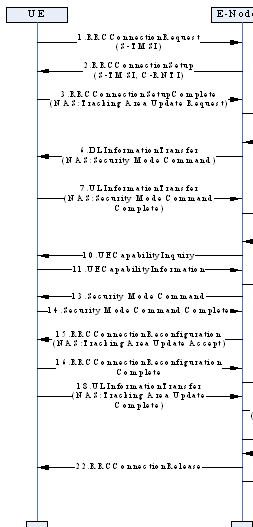
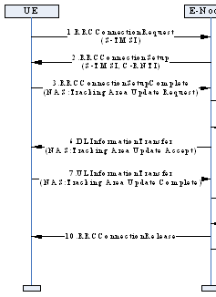
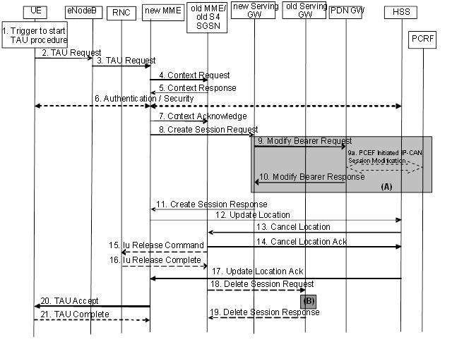

# 概述

重要LTE基本信令流程记录

## 参考

* [重要LTE基本信令流程](http://www.doczj.com/doc/359d90256c175f0e7cd13741.html)

* [重要LTE基本信令流程](http://www.doc88.com/p-7008049548366.html)

## 内容

### 1、附着信令流程

#### Attach附着信令流程（统计时延：红色的为开始和结束信令）

==Attach request==

Unknown(0x0734)（未知的）

rrcConnectionRequest

rrcConnectionSetup

rrcConnectionSetupComplete

rrcConnectionReconfiguration(测量配置) 
dlInformationTransfer(信息传递) 
rrcConnectionReconfigurationComplete

Security(安全) protected (受保护)NAS message Authentication(鉴定和证明) request

Authentication response（回复相应）

Unknown(0x077B)

ulInformationTransfer（转移，调任）

dlInformationTransfer

Security(网络安全技术协议) protected （保护什

么安全）NAS message

Security mode(方式，风格) command（命令指挥）

Security mode complete

Unknown(0x0790)

ulInformationTransfer（转移）

ueCapabilityEnquiry（询问能力）

ueCapabilityInformation（通知能力）securityModeCommand

rrcConnectionReconfiguration（重新配置）

rrcConnectionReconfigurationComplete（完整的，圆满地）

Security protected NAS message

Attach （附着）accept

Activate 激活default默认 EPS bearer搬运

context背景 request

Activate default EPS bearer context accept（接受）

==Attach complete==

Unknown(0x072D)

ulInformationTransfer

rrcConnectionReconfiguration rrcConnectionReconfigurationComplete

#### Detach去附着信令流程（统计时延：红色的为开始和结束信令）

==Detach request==

Unknown(0x0734)

ulInformationTransfer

dlInformationTransfer

Security protected NAS message

==Detach accept==

rrcConnectionRelease(释放)

PDN connectivity (联接能力)request

## 2、呼叫业务信令流程

#### UE主叫信令流程（统计时延：红色的为开始和结束信令）

==Extended(扩展,扩大) service request rrcConnectionRequest==

rrcConnectionSetup

==rrcConnectionSetupComplete rrcConnectionReconfiguration(重新配置)==
rrcConnectionReconfigurationComplete securityModeCommand

rrcConnectionReconfiguration rrcConnectionReconfigurationComplete rrcConnectionReconfiguration rrcConnectionReconfigurationComplete rrcConnectionRelease

#### UE被叫信令流程（统计时延：红色的为开始和结束信令）（不含鉴权信令流程）

systemInformationBlock（阻止）Type（类型）1 systemInformationBlockType1

==Paging（分页，寻呼）==

Extended （延伸的）service request rrcConnectionRequest

rrcConnectionSetup

rrcConnectionSetupComplete rrcConnectionReconfiguration rrcConnectionReconfigurationComplete securityModeCommand

==rrcConnectionReconfiguration rrcConnectionReconfiguration（重新配置）==

Complete

rrcConnectionReconfiguration rrcConnectionReconfigurationComplete

（含鉴权信令流程）

systemInformationBlockType1

==Paging==

Extended service request

rrcConnectionRequest

rrcConnectionSetup

rrcConnectionSetupComplete

rrcConnectionReconfiguration 

rrcConnectionReconfigurationComplete

dlInformationTransfer

Security protected NAS message

Authentication（身份验证） request

Authentication response（响应）

Unknown(0x077B)

ulInformationTransfer

dlInformationTransfer

Security protected NAS message

Security mode command

Security mode complete

Unknown(0x0790)

ulInformationTransfer

securityModeCommand

rrcConnectionReconfiguration 
==rrcConnectionReconfigurationComplete==
rrcConnectionReconfiguration 
rrcConnectionReconfigurationComplete

## 3、重选与切换信令流程（重要）

* 小区重选信令流程

systemInformationBlock（切断阻止）Type1

systemInformation

systemInformationBlockType1

systemInformationBlockType1

systemInformation

systemInformationBlockType1

systemInformationBlockType1

systemInformationBlockType1

* 基站内同频切换信令流程（统计时延：红色的为开始和结束信令）

Measurement（测量）Report（报告）
rrcConnectionReconfiguration（重新配子）rrcConnectionReconfigurationComplete rrcConnectionReconfiguration rrcConnectionReconfigurationComplete systemInformationBlockType1

systemInformationBlockType1

systemInformationBlockType1

systemInformationBlockType1

systemInformation

* 基站间同频切换信令流程（统计时延：红色的为开始和结束信令）

measurementReport

rrcConnectionReconfiguration 
rrcConnectionReconfigurationComplete 
systemInformationBlockType1

rrcConnectionReconfiguration 
rrcConnectionReconfigurationComplete

## 4、跟踪区域更新信令流程

新小区所属跟踪区域不在终端跟踪区域列表中信令流程

周期性跟踪区域更新信令流程

Reestablish(恢复重建)attempt企图reject拒绝驳回

tracking area update简称TAU(不是很懂)

当手机在GPRS网络或E-UTRAN网络中完成附着后，如果出现如下情况，会触发Tracking Area Update过程。

- 手机发现进入到了一个新的TA，并且这TA不在TAIs 列表中。

- 到了TA更新的周期

- 当手机从UTRAN通过重选进入E-UTRAN时期状态为PMM_Connected。

- 手机重选E-UTRAN时，其状态为GPRS READY

- 手机重选到E-UTRAN时TIN为"P-TMSI"

- RRC连接释放时，释放原因load re-balancing TAU required"

- 手机的RRC层通知UE的NAS层，RRC连接失败

- 手机如下参数发生变化：

UE Network Capability

MS Network Capability

UE Specific DRX Parameters

MS Radio Access capability

- 对于有SR-VCC 的手机，MS Classmark 2，MS Classmark 3 或Supported Codecs 参数发生了变化。

Tracking Area Update 根据不同的情况也有几种不同的流程与其对应

这里先整理出第一种

Tracking Area Update procedure with Serving GW change

