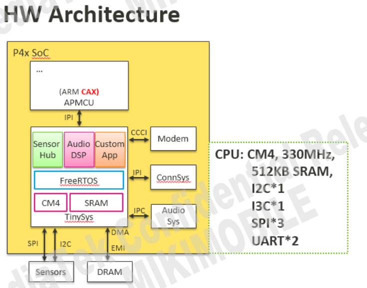
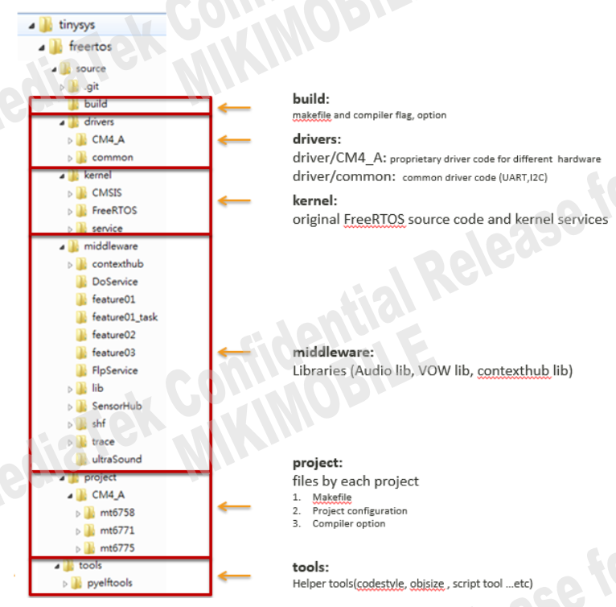
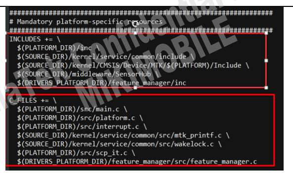
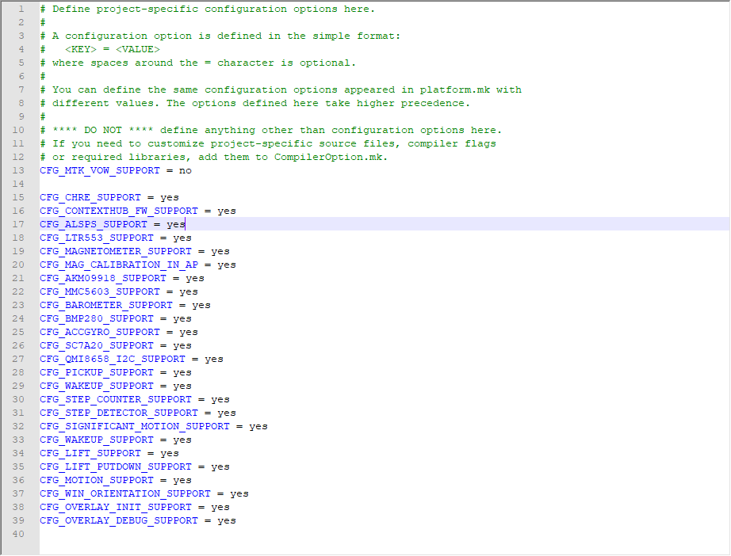
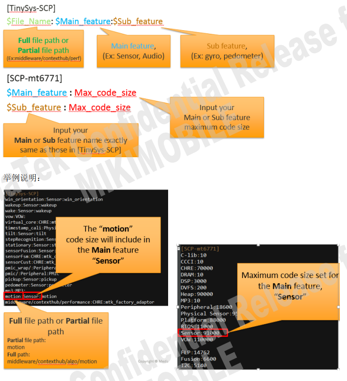
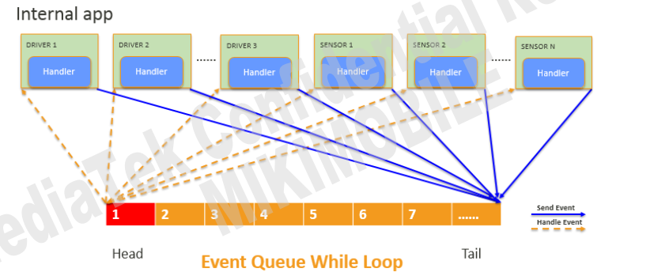
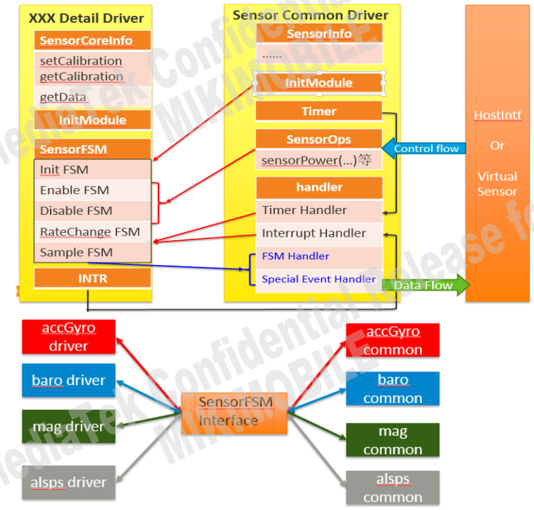
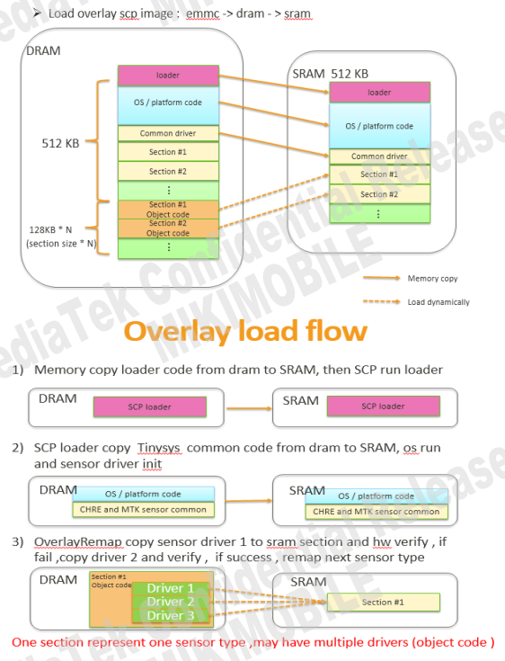

# Android Sensor Hub

Sensor Hub，中文名：传感器控制中心。

1. 在CPU休眠的情况下，实现对传感器的实时控制，从而达到降低功耗的功能。

2. 将不同类型Sensor的数据进行融合，实现多种sensor数据结合才能实现的功能。

## 参考

* [Sensor Hub](https://www.pianshen.com/article/54461100687/)

* [[FAQ22932] [VTS10R3]VtsHalSensorsV2_0Target#SensorsHidlTest.FlushSensor(default)_32bit fail](https://online.mediatek.com/FAQ#/SW/FAQ22932)

* [[MT6771][Q0]BMI160 sensorhub驱动代码申请](https://eservice.mediatek.com/eservice-portal/issue_manager/update/85663815)

* [[FAQ13856] [sensorhub]MT6752/32平台sensor hub介绍](https://online.mediatek.com/FAQ#/SW/FAQ13856)

* [MT6762平台 R版本accgyro sensorhub调试问题](https://eservice.mediatek.com/eservice-portal/issue_manager/update/98358431)

## 应用场景

而概括地看，Sensor Hub可以执行以下操作：

　　1. 手势识别：感测人的手势，如：翻转手机，敲打手机，摇晃手机，拿起手机等手势。

　　可实现案例：翻转静音，拒接电话，摇晃切换背景图片以及拿起接听电话等功能。

　　2. 设备状态识别：感测设备的状态，如：手机面朝上/朝下， 手机在桌子上，还是在口袋里，还是在人手里。

　　可实现案例：手机在口袋里时，自动将来电铃声放至最大；而在桌子上的时候，调至静音震动模式。

　　3.用户状态识别：感测用户的状态，如：跑步，走路，站立，坐下等。

　　实现功能： 在走路/跑步时，自动打开记步功能，而站立和坐下后，暂停相关功能

　　4.用户交通行为判断：感测用户乘坐交通时的状态，如：开车，坐火车，坐电梯等。

　　实现功能： 在开车状态，自动蓝牙连接；而在火车上接电话，开启消噪功能。

　　5.室内定位/室内导航：室外定位目前主要是GPS+AGPS。AGPS是通过手机附近的基站获取GPS辅助信息（包含GPS的星历和方位俯仰角等），从而帮助GPS快速，准确定位。在GPS信号不强的情况下，手机也可以通过多个手机基站进行定位。


* 如何实时打印scp log。

```
ADB logcat is able to output SCP log directly from ADB or UART console.
 Usage:
1. Make sure SCP Log in MTK Logger is disabled (as shown in Figure 7-3.)
2. Enter shell and enter command “echo 1 > /sys/class/misc/scp/scp_mobile_log”
3. Enter command: “while true; do cat /dev/scp;done” and the log output directly
```

- 1.先关闭mtklogger记录：

- 2.输入`echo 1 > /sys/class/misc/scp/scp_mobile_log`.

- 3.while true; do cat /dev/scp;done

## SCP介绍

SCP （ Tinysys） 协处理器，负责 sensor ， audio 的相关 feature，以及可以扩客户私有的 feature。
MTK SCP 的 系统选用的是 FreeRTOS， 其中 CHRE 是 FreeRTOS 的一个 Task 专门处理 Sensor 相关
数据。 Audio feature 直接基于 FreeRTOS 进行实作。



### 1.Folder Structure



* 1. Platform Configuration file

> Required LDFLAGS, headers or C files of the platform Default configurations of the platform

路径： project/$(PROCESSOR)/$(PLATFORM)/platform/platform.mk
如下图：



* 2. Project Configuration file

> ProjectConfig.mk will overwriting options in platform.mk



### 2.SCP code size 限制机制

* Setting.ini 格式说明



* `project/CM4_A/mt6765/platform/Setting.ini`含义就是`Physical Sensor`是sensor所有的size大小，其中包括alsps、accGyro、auto_cali、barometer、magnetometer这几个的总和:

```
magnetometer:Physical Sensor:magnetometer
baro:Physical Sensor:barometer
auto_cali:Physical Sensor:auto_cali
alsps:Physical Sensor:alsps
accelerometer:Physical Sensor:accGyro
accGyro:Physical Sensor:accGyro

Physical Sensor:95000

alsps:18000
accGyro:27000
auto_cali:19400
barometer:14500
magnetometer:30000
```

### 3.CHRE sensors introduction

SCP 下面的， MTK sensor hub feature 基于 Google CHRE 架构实现.
CHRE (Context Hub Runtime Environment) 是一个事件驱动的架构，也可以作为独立的 OS。
黄色部分是 Event Queue， CHRE 只有一个 while 去处理排在头部的 Event Queue，这里没有优先级的
概念， Event Queue 的处理是先来先服务， 只有 interrupt 可以打断当前的 Event Queue 处理。 CHRE
默认有 512 个 Event Queue。 设计的目的是实时，且轻量级，所以 EventQueue 内部代码必须很快跑
完。
CHRE 内部实现的 driver，即用来处理事件的代码 Google 称之为 nano hub app。后面讲详细解释如何
写一个 nano hub app
CHRE 消息机制简要做如下图示：



### 4.MTK CHRE Sensors Common Layer

为避免客户 porting 时间过长，已经出现 bug 不好查找， MTK 将物理 sensor 的逻辑部分抽出了单独的
一层叫做 sensorFSM。 和硬件相关的部分单独写成一份代码，提供给 sensorFSM 调用。 框架如下：



* 拆出 common 层后，客户需要实现的是：
    - Init 相关（加载客制化， auto detect 等)
    - 实现有限个 sensorFSM
    - 实现 SensorCoreInfo

### 5.Sensor driver overlay

Purpose: 客户开案需要二供料件。 同一个类型的 sensor 会选择两家厂商的供货， 如果同时在 SCP 写两个 driver 进行 auto detect 会占用 SCP 的 SRAM，因此选择将所有支持的driver 先放在 DRAM 中，当匹配上ID后，开机启动SCP时，将从DRAM->SRAM load.



### 6.common driver及alsps driver软件流程分析

每种类型的sensor都是一个标准的`CHRE APP`，包括初始化中的`overlayremap`和消息处理函数`handleEvent`，以alsps为例：

```C++
alsps.c:

* INTERNAL_APP_INIT(APP_ID_MAKE(APP_ID_VENDOR_MTK, MTK_APP_ID_WRAP(SENS_TYPE_ALS, 0, 0)), 0, startTask, endTask,handleEvent);
  * alspsOverlayRemap();
    * ltr553Init(void)
      * mTask.deviceId == 0x92
      * registerAlsPsDriverFsm(ltr553Fsm, ARRAY_SIZE(ltr553Fsm));
        * osEnqueuePrivateEvt(EVT_APP_START, NULL, NULL, mTask.id);
          * handleEvent(uint32_t evtType, const void* evtData)
            * sensorFsmRunState(NULL, &mTask.fsm, (const void *)CHIP_RESET, &i2cCallback, &spiCallback);  //重要，运行CHIP_RESET FSM函数。
```

* 具体流程：

```C++
1.开始任务，overlay哪个sensor，另外注意ltr553Init是无法在scp里面打印出来的，可能是因为在DRAM里面跑的：
static bool startTask(uint32_t taskId)
{
    alspsOverlayRemap();
    alspsSecondaryOverlayRemap();  这里是两个传感器哈
}

参考0001_Android_SCP.md可以知道就是根据Projectconfig.mk里面配置的型号去map,比如定义了553就会跑ltr553Init函数：
MODULE_DECLARE(ltr553, SENS_TYPE_ALS, ltr553Init);

2.ltr553Init函数主要是匹配ID，填充mSensorInfo和mSensorOps包括sensorPower、sensorSetRate、sensorFlush、sensorCalibrate、sensorCfgData等接口，供上层调用：
static int ltr553Init(void) {

    mTask.txBuf[0] = LTR553_PART_ID;
    ret = i2cMasterTxRxSync(mTask.hw->i2c_num, mTask.i2c_addr, mTask.txBuf, 1,
                            &mTask.deviceId, 1, NULL, NULL);

	if (mTask.deviceId == 0x92) {  // ltr553 device id is fixed
        goto success_out;
    } else {
        i2cMasterRelease(mTask.hw->i2c_num);
        osLog(LOG_ERROR, "ltr553: read id fail!!!\n");
        ret = -1;
        goto err_out;
    }

success_out:
    osLog(LOG_INFO, "ltr553: auto detect success:0x%x\n", mTask.deviceId);
    alsSensorRegister();
      * sensorRegister(&mSensorInfo[ALS], &mSensorOps[ALS], NULL, false);
    psSensorRegister();
    registerAlsPsDriverFsm(ltr553Fsm, ARRAY_SIZE(ltr553Fsm));
}

3.注册完FSM函数列表后，发送EVT_APP_START event时间处理：
void registerAlsPsDriverFsm(struct sensorFsm *mSensorFsm, uint8_t size)
{
    mTask.fsm.moduleName = "alsps";
    mTask.fsm.mSensorFsm = mSensorFsm;
    mTask.fsm.mSensorFsmSize = size;
    osEnqueuePrivateEvt(EVT_APP_START, NULL, NULL, mTask.id);
}
static void handleEvent(uint32_t evtType, const void* evtData)
{
    struct transferDataInfo dataInfo;

    switch (evtType) {
        case EVT_APP_START: {
        sensorFsmRunState(NULL, &mTask.fsm, (const void *)CHIP_RESET, &i2cCallback, &spiCallback);
        }
}

4.执行运行CHIP_RESET FSM函数，这里将会都跑一遍。
    /* init state */
    sensorFsmCmd(STATE_RESET, STATE_SET_SW_RST, ltr553_set_sw_reset),
    sensorFsmCmd(STATE_SET_SW_RST, STATE_SET_ALSPS_SETTING, ltr553_set_alsps_setting),
	sensorFsmCmd(STATE_SET_ALSPS_SETTING, STATE_SET_INT_CFG, ltr553_set_int_cfg),
	sensorFsmCmd(STATE_SET_INT_CFG, STATE_SET_INT_PERSIST, ltr553_set_int_persist),
    sensorFsmCmd(STATE_SET_INT_PERSIST, STATE_SET_PS_THDH, ltr553_set_alsps_ctrl),
    sensorFsmCmd(STATE_SET_PS_THDH, STATE_SET_PS_THDL, ltr553_set_ps_thdh),
    sensorFsmCmd(STATE_SET_PS_THDL, STATE_SETUP_EINT, ltr553_set_ps_thdl),
    sensorFsmCmd(STATE_SETUP_EINT, STATE_CORE, ltr553_setup_eint),
    sensorFsmCmd(STATE_CORE, STATE_INIT_DONE, ltr553_register_core),

5.最后执行STATE_INIT_DONE函数
* handleSensorEvent(const void *state)
  * case CHIP_INIT_DONE: 
  * processPendingEvt();
    * mSensorOps[handle].sensorCfgData(mTask.mSensorPerUnit[handle].pendCaliCfg,(void *)handle);

这里主要执行了sensorCfgPs函数：
```

* 所有打印：
```log
[0.019]alsps: app start
[0.019]ltr553_set_alsps_setting =====>
[0.030]ltr553_set_int_cfg =====>

[0.030]ltr553_set_int_persist =====>
[0.030]ltr553_set_alsps_ctrl =====>
[0.031]ltr553_set_ps_thdh =====>
[0.031]ltr553_set_ps_thdl =====>
[0.031]ltr553_setup_eint =====>
[0.031]ltr553_register_core =====>
[0.031]alsPs: init done

[7.749]sensorCfgPs [high, low]: [0, 0]

[7.749]ltr553_ps_cfg =====>
[7.749]ltr553_ps_cfg, [high, low]: [0, 0]

[7.749]ltr553_ps_set_threshold =====>
[7.749]ps: cfg done
```