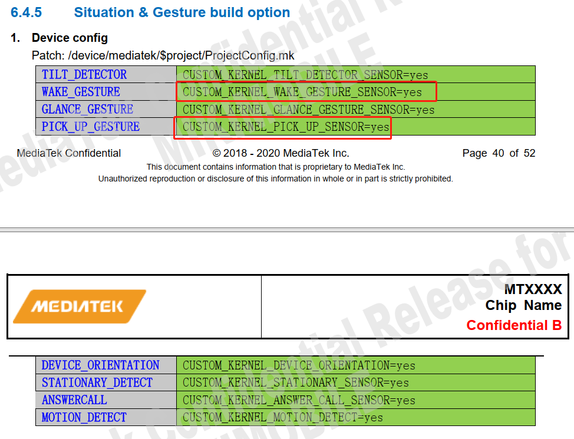

# Android Sensor Hub

Sensor Hub，中文名：传感器控制中心。

1. 在CPU休眠的情况下，实现对传感器的实时控制，从而达到降低功耗的功能。

2. 将不同类型Sensor的数据进行融合，实现多种sensor数据结合才能实现的功能。

## 参考

* [Sensor Hub](https://www.pianshen.com/article/54461100687/)

* [[FAQ22932] [VTS10R3]VtsHalSensorsV2_0Target#SensorsHidlTest.FlushSensor(default)_32bit fail](https://online.mediatek.com/FAQ#/SW/FAQ22932)

* [[MT6771][Q0]BMI160 sensorhub驱动代码申请](https://eservice.mediatek.com/eservice-portal/issue_manager/update/85663815)

* [[FAQ13856] [sensorhub]MT6752/32平台sensor hub介绍](https://online.mediatek.com/FAQ#/SW/FAQ13856)

* [MT6762平台 R版本accgyro sensorhub调试问题](https://eservice.mediatek.com/eservice-portal/issue_manager/update/98358431)

## 应用场景

而概括地看，Sensor Hub可以执行以下操作：

　　1. 手势识别：感测人的手势，如：翻转手机，敲打手机，摇晃手机，拿起手机等手势。

　　可实现案例：翻转静音，拒接电话，摇晃切换背景图片以及拿起接听电话等功能。

　　2. 设备状态识别：感测设备的状态，如：手机面朝上/朝下， 手机在桌子上，还是在口袋里，还是在人手里。

　　可实现案例：手机在口袋里时，自动将来电铃声放至最大；而在桌子上的时候，调至静音震动模式。

　　3.用户状态识别：感测用户的状态，如：跑步，走路，站立，坐下等。

　　实现功能： 在走路/跑步时，自动打开记步功能，而站立和坐下后，暂停相关功能

　　4.用户交通行为判断：感测用户乘坐交通时的状态，如：开车，坐火车，坐电梯等。

　　实现功能： 在开车状态，自动蓝牙连接；而在火车上接电话，开启消噪功能。

　　5.室内定位/室内导航：室外定位目前主要是GPS+AGPS。AGPS是通过手机附近的基站获取GPS辅助信息（包含GPS的星历和方位俯仰角等），从而帮助GPS快速，准确定位。在GPS信号不强的情况下，手机也可以通过多个手机基站进行定位。

## debug调试

* sensorhub调通后，scp打印如下：

```log
----- timezone:Asia/Shanghai
8 overlay remap fail

[0.017]contexthub_fw_start tid: 268

[0.017]accGyro: app start

[0.017]sc7a20ResetRead

[0.017]alsps: app start

[0.017]initSensors:   not ready!

[0.017]LIFT EVT_APP_START

[0.017]TILT EVT_APP_START

[0.017]STEP_RECOGNITION EVT_APP_START

[0.017]alsPs: init done

[0.017]read before sc7a20ResetWrite

[0.028]sc7a20DeviceId

[0.028]sc7a20 acc reso: 0, sensitivity: 1024

[0.028]sc7a20RegisterCore deviceId 0x11


[0.028]accGyro: init done

[0.518]initSensors: alloc blocks number:219

[0.520]get dram phy addr=0x8d000000,size=1048520, maxEventNumber:23830

[0.520]get dram phy rp=0,wp=0

[2.029]frequency request: 65535 MHz => 250 MHz

[2.829]sync time scp:2829537083, ap:4316042615, offset:1486968532

[8.765]hostintf: 8765761097, chreType:1, rate:0, latency:0, cmd:3!

[8.765]sensorCfgAcc:

[8.765]bias: 0.000000, 0.000000, 0.000000

[8.765]cali: 0, 0, 0

[8.765][MPEKlib]: MPE_CAL_A_VER_18082801

[8.765]sc7a20AccCfgCali: cfgData[0]:0, cfgData[1]:0, cfgData[2]:0

[8.765]acc: cfg done

```

* 如何实时打印scp log。

```
ADB logcat is able to output SCP log directly from ADB or UART console.
 Usage:
1. Make sure SCP Log in MTK Logger is disabled (as shown in Figure 7-3.)
2. Enter shell and enter command “echo 1 > /sys/class/misc/scp/scp_mobile_log”
3. Enter command: “while true; do cat /dev/scp;done” and the log output directly
```

- 1.先关闭mtklogger记录：



- 2.输入`echo 1 > /sys/class/misc/scp/scp_mobile_log`.

- 3.while true; do cat /dev/scp;done


### 抬起亮屏功能调试

