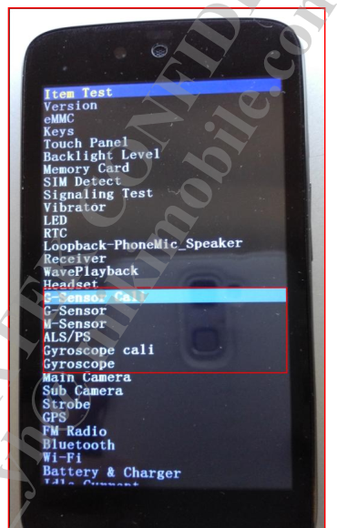
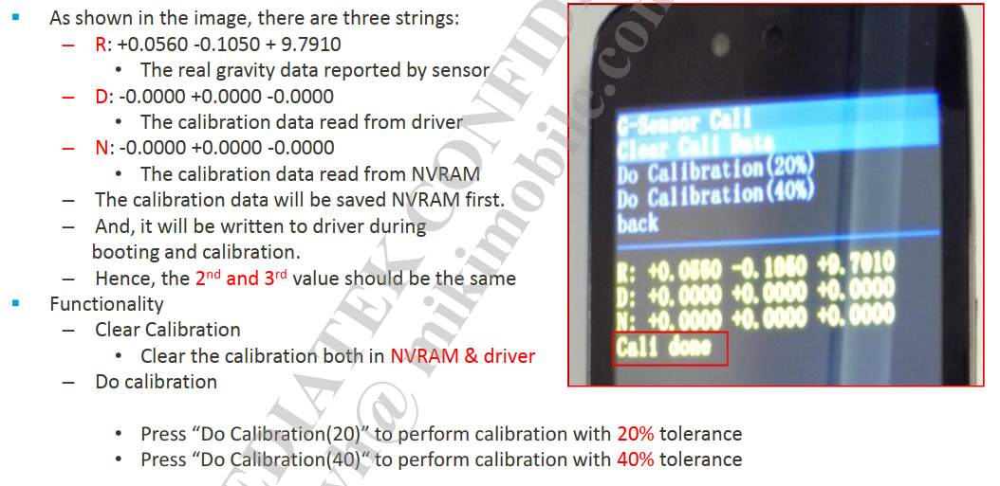
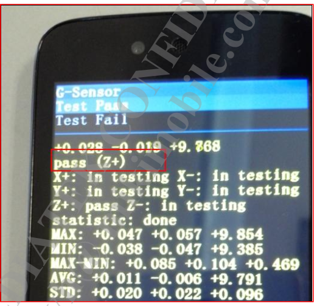
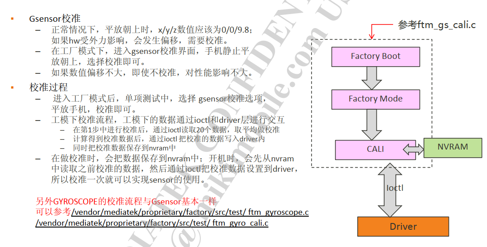

# Accel Sensor 分析

Accel Sensor 驱动分析


## 参考

* [sensor_all_in_one.pdf](refer/sensor_all_in_one.pdf)

* [CS6853-BD9D-PGD-V1.7EN_MT6853_SCP_Development_Guide.pdf](CS6853-BD9D-PGD-V1.7EN_MT6853_SCP_Development_Guide.pdf refer/CS6853-BD9D-PGD-V1.7EN_MT6853_SCP_Development_Guide.pdf)

## 代码分析

* dts：

```
accel sensor:
&cust_accel_sc7a20 {
		i2c_num					= <1>;
		i2c_addr				= <0x18 0 0 0>;
		direction				= <7>;
		power_id				= <0xffff>;
		power_vol				= <0>;
		firlen					= <0>;
		is_batch_supported			= <0>;
};

&i2c1 {
	gsensor_sc7a20@18 {
		compatible = "mediatek,gsensor_sc7a20";
		reg = <0x18>;
		status = "okay";
	};
}
```

## debug调试

* acc sensorhub调通后，scp打印如下：

```log
----- timezone:Asia/Shanghai
8 overlay remap fail

[0.017]contexthub_fw_start tid: 268

[0.017]accGyro: app start

[0.017]sc7a20ResetRead

[0.017]alsps: app start

[0.017]initSensors:   not ready!

[0.017]LIFT EVT_APP_START

[0.017]TILT EVT_APP_START

[0.017]STEP_RECOGNITION EVT_APP_START

[0.017]alsPs: init done

[0.017]read before sc7a20ResetWrite

[0.028]sc7a20DeviceId

[0.028]sc7a20 acc reso: 0, sensitivity: 1024

[0.028]sc7a20RegisterCore deviceId 0x11


[0.028]accGyro: init done

[0.518]initSensors: alloc blocks number:219

[0.520]get dram phy addr=0x8d000000,size=1048520, maxEventNumber:23830

[0.520]get dram phy rp=0,wp=0

[2.029]frequency request: 65535 MHz => 250 MHz

[2.829]sync time scp:2829537083, ap:4316042615, offset:1486968532

[8.765]hostintf: 8765761097, chreType:1, rate:0, latency:0, cmd:3!

[8.765]sensorCfgAcc:

[8.765]bias: 0.000000, 0.000000, 0.000000

[8.765]cali: 0, 0, 0

[8.765][MPEKlib]: MPE_CAL_A_VER_18082801

[8.765]sc7a20AccCfgCali: cfgData[0]:0, cfgData[1]:0, cfgData[2]:0

[8.765]acc: cfg done

```

## 初始化流程

* 首先看初始化流程：

```C++
int sc7a20Init(void)
{
    if (mTask.deviceId != SC7A20_WHO_AM_I_WIA_ID) {  匹配ID
        osLog(LOG_ERROR, "sc7a20: auto detect error wai 0x%x\n", mTask.deviceId);
        ret = -1;
        goto err_out;
    }

    osLog(LOG_INFO, "sc7a20: auto detect success wai 0x%x\n", mTask.deviceId);
    accSensorRegister();
	配置数据上传类型：
	ACC_GYRO_FIFO_UNINTERRUPTIBLE  FIFO型
	ACC_GYRO_FIFO_INTERRUPTIBLE   中断FIFO
	GYRO_ONLY_FIFO_INTERRUPTIBLE 只有陀螺仪FIFO中断
    registerAccGyroInterruptMode(ACC_GYRO_FIFO_UNINTERRUPTIBLE);  
	注册FSM函数
    * registerAccGyroDriverFsm(sc7a20Fsm, ARRAY_SIZE(sc7a20Fsm));
	  * osEnqueuePrivateEvt(EVT_APP_START, NULL, NULL, mTask.id);
	    * sensorFsmRunState(&dataInfo, &mTask.fsm, (const void *)CHIP_RESET, &i2cCallback, &spiCallback);
	    /* init state */
    	  * sensorFsmCmd(STATE_RESET_R, STATE_RESET_W, sc7a20ResetRead),
    	  * sensorFsmCmd(STATE_RESET_W, STATE_DEVID, sc7a20ResetWrite),
    	  * sensorFsmCmd(STATE_DEVID, STATE_CALC_RESO, sc7a20DeviceId),
    	  * sensorFsmCmd(STATE_CALC_RESO, STATE_CORE, sc7a20CalcReso),
    	  * sensorFsmCmd(STATE_CORE, STATE_INIT_DONE, sc7a20RegisterCore),
		    * handleSensorEvent(const void *state) //接下来跑STATE_INIT_DONE
			  * case CHIP_INIT_DONE: {
			    * processPendingEvt();
				  * mSensorOps[handle].sensorCalibrate((void *)handle);  //校准流程
				    * sensorCaliAcc(void *cookie) //校准acc
					  * sc7a20AccCali()  //sc7a20.c
					    * accFactoryCalibrateInit(&mTask.accFactoryCal);
					* sensorCaliGyro(void *cookie) //不支持校准gyro
				  * mSensorOps[handle].sensorCfgData(mTask.mSensorPerUnit[handle].pendCaliCfg,  //cfgdata流程
				    * sensorCfgAcc() 
					  * sc7a20AccCfgCali() //sc7a20.c
					    * mTask.staticCali[AXIS_X] = (float)caliCfgPacket.caliCfgData[0] / 1000;  //赋值一下cali数据，没实际操作
					* sensorCfgGyro()  //不支持Cfggyro
					  * setGyroHwCaliCfg(&values[3]);
					    * sensorFsmRunState(&dataInfo, &mTask.fsm, (const void *)CHIP_GYRO_CFG, &i2cCallback, &spiCallback) //没定义CHIP_GYRO_CFG，也就是说没有陀螺仪校准
				  * mSensorOps[handle].sensorSelfTest((void *)handle);  //自测
				    * sensorSelfTestAcc(void *data)
					  * sensorFsmRunState(&dataInfo, &mTask.fsm, (const void *)CHIP_ACC_SELFTEST, &i2cCallback, &spiCallback)  //没定义CHIP_ACC_SELFTEST,不做
	注册timer callback函数，无
    * registerAccGyroTimerCbk(sc7a20TimerCbkF);	
}

OVERLAY_DECLARE(sc7a20, OVERLAY_WORK_00, sc7a20Init);
```

## 校准流程

* 根据打印，因为只有acc校准，所以只做了acc的`sensorCaliAcc`函数，其他的都未执行，先了解一下acc校准方法：

1.点击Item Test进入如下界面， 按音量下键选择相应的sensor测试类型，即可对相应sensor进行校准测试：



2.例如选择G-sensor Cali，首先clear cali data，然后做20%或者40%测试，若显示Cali done则表示校准成功：



3.选择G-sensor 测试项测试，看校准后数据是否OK，若为pass则表示通过：



4.校准流程：



* 开机读取校准数据logcat 打印如下：

```log
02-17 13:03:49.250078   724   724 D Accelerometer: misc path =/sys/class/sensor/m_acc_misc/
02-17 13:03:49.250491   724   724 I Accelerometer: read div buf(/sys/class/sensor/m_acc_misc/accactive), mdiv 1000
02-17 13:03:49.268059   724   724 I Accelerometer: read bias: [0.000000, 0.000000, 0.000000]
02-17 13:03:49.268944   724   724 I Accelerometer: read cali: [240, -111, 199]
```

* 校准数据读取节点：
```log
130|PAYPHONEM50:/ # cat /mnt/vendor/nvcfg/sensor/gyro_temp.json
{
  "gyro_temp": [
      0,
      0,
      0,
      0,
      0,
      0
    ]
```

* 工厂模式校准失败，根据错误打印`gsensor_get_cali: get_cali err: -1`，看看是哪个文件权限有问题：

```log
02-19 17:10:08.501   460   570 D HWMLIB  : ----------------------------------------------------------------
02-19 17:10:08.501   460   570 D HWMLIB  :                          Calibration Data
02-19 17:10:08.502   460   570 D HWMLIB  : ----------------------------------------------------------------
02-19 17:10:08.502   460   570 D HWMLIB  : maxdiff =   +3.9227
02-19 17:10:08.502   460   570 D HWMLIB  : average =   +0.4361,   +0.0192   +9.4192
02-19 17:10:08.502   460   570 D HWMLIB  : ----------------------------------------------------------------
02-19 17:10:08.502   460   570 D HWMLIB  : [  317275] (  +0.4330,   +0.0350,   +9.3640)
02-19 17:10:08.502   460   570 D HWMLIB  : [  317326] (  +0.4420,   +0.0070,   +9.3950)
02-19 17:10:08.502   460   570 D HWMLIB  : [  317378] (  +0.4380,   +0.0330,   +9.4330)
02-19 17:10:08.502   460   570 D HWMLIB  : [  317430] (  +0.4420,   -0.0070,   +9.4330)
02-19 17:10:08.502   460   570 D HWMLIB  : [  317481] (  +0.4020,   +0.0450,   +9.3800)
02-19 17:10:08.502   460   570 D HWMLIB  : [  317532] (  +0.4570,   +0.0040,   +9.4710)
02-19 17:10:08.503   460   570 D HWMLIB  : [  317584] (  +0.4140,   +0.0260,   +9.3880)
02-19 17:10:08.503   460   570 D HWMLIB  : [  317636] (  +0.4230,   +0.0380,   +9.3970)
02-19 17:10:08.503   460   570 D HWMLIB  : [  317687] (  +0.4350,   +0.0040,   +9.4260)
02-19 17:10:08.503   460   570 D HWMLIB  : [  317739] (  +0.4710,   +0.0070,   +9.3970)
02-19 17:10:08.503   460   570 D HWMLIB  : [  317789] (  +0.4540,   +0.0830,   +9.4520)
02-19 17:10:08.503   460   570 D HWMLIB  : [  317840] (  +0.4350,   +0.0000,   +9.4140)
02-19 17:10:08.503   460   570 D HWMLIB  : [  317891] (  +0.4330,   +0.0040,   +9.4500)
02-19 17:10:08.503   460   570 D HWMLIB  : [  317943] (  +0.4280,   +0.0280,   +9.4160)
02-19 17:10:08.503   460   570 D HWMLIB  : [  317994] (  +0.4230,   +0.0160,   +9.4570)
02-19 17:10:08.503   460   570 D HWMLIB  : [  318045] (  +0.4380,   -0.0310,   +9.3880)
02-19 17:10:08.503   460   570 D HWMLIB  : [  318095] (  +0.4620,   +0.0280,   +9.4090)
02-19 17:10:08.503   460   570 D HWMLIB  : [  318146] (  +0.4420,   +0.0040,   +9.4620)
02-19 17:10:08.503   460   570 D HWMLIB  : [  318198] (  +0.4380,   +0.0090,   +9.4500)
02-19 17:10:08.504   460   570 D HWMLIB  : [  318249] (  +0.4110,   +0.0500,   +9.4020)
02-19 17:10:08.505   460   570 D HWMLIB  : ----------------------------------------------------------------
02-19 17:10:08.505   460   570 D HWMLIB  : X-Axis: min/avg/max = (  +0.4020,   +0.4361,   +0.4710), diverse =   -0.0035 ~   +0.0036, std =    0.0165
02-19 17:10:08.505   460   570 D HWMLIB  : Y-Axis: min/avg/max = (  -0.0310,   +0.0192,   +0.0830), diverse =   -0.0051 ~   +0.0065, std =    0.0241
02-19 17:10:08.505   460   570 D HWMLIB  : Z-Axis: min/avg/max = (  +9.3640,   +9.4192,   +9.4710), diverse =   -0.0056 ~   +0.0053, std =    0.0299
02-19 17:10:08.505   460   570 D HWMLIB  : ----------------------------------------------------------------
02-19 17:10:08.506   460   570 D HWMLIB  : calculateStandardCalibration (  -0.4361,   -0.0192,    0.3875)
02-19 17:10:08.506   460   570 D HWMLIB  : [WD]   -0.4361   -0.0192    0.3875 =>  -436   -19   387
02-19 17:10:11.701   460   570 E HWMLIB  : gsensor_get_cali: get_cali err: -1
02-19 17:10:11.702   460   570 E FTM     : gs_cali_update_iv_thread [  296]: get calibration fail: (Invalid argument) -1
02-19 17:10:11.702   460   570 D NVRAM   : fail to open /sys/class/BOOT/BOOT/boot/boot_mode:
02-19 17:10:11.702   460   570 D NVRAM   : NVM_GetFileDesc: Open /mnt/vendor/nvdata/APCFG/APRDCL/HWMON_ACC,LID:12
02-19 17:10:11.702   460   570 D NVRAM   : NVM_CmpFileVerNo 12
02-19 17:10:11.702   460   570 D NVRAM   : Load File Version: 000, NvRam File Version: 000
02-19 17:10:11.702   460   570 D NVRAM   : NVM_ProtectDataFile : 12 ++
02-19 17:10:11.703   460   570 D NVRAM   : NVM_ProtectUserData:Check Success
02-19 17:10:11.703   460   570 D HWMLIB  : [RN]    0.0000    0.0000    0.0000 =>     0     0     0
02-19 17:10:11.705   460   570 D NVRAM   : NVM_CloseFileDesc: Open by Readonly, no need to check when close
02-19 17:10:14.773   460   570 E HWMLIB  : gsensor_get_cali: get_cali err: -1
02-19 17:10:14.773   460   570 E FTM     : gs_cali_update_info [  161]: get calibration: 22(Invalid argument)
02-19 17:10:14.913   460   570 E FTM     : MTK_LCM_PHYSICAL_ROTATION + 0
02-19 17:10:14.916   460   570 E FTM     : set_active_framebuffer +
02-19 17:10:14.933   460   570 E FTM     : gr_flip done
02-19 17:10:14.933   460   570 D FTM     : [GSC] op: 0
02-19 17:10:14.933   460   570 D NVRAM   : fail to open /sys/class/BOOT/BOOT/boot/boot_mode:
02-19 17:10:14.933   460   570 D NVRAM   : NVM_GetFileDesc: Open /mnt/vendor/nvdata/APCFG/APRDCL/HWMON_ACC,LID:12
02-19 17:10:14.933   460   570 D NVRAM   : NVM_CmpFileVerNo 12
02-19 17:10:14.934   460   570 D NVRAM   : Load File Version: 000, NvRam File Version: 000
02-19 17:10:14.934   460   570 D NVRAM   : NVM_ProtectDataFile : 12 ++
02-19 17:10:14.934   460   570 D NVRAM   : NVM_ProtectUserData:Check Success
02-19 17:10:14.934   460   570 D HWMLIB  : [RN]    0.0000    0.0000    0.0000 =>     0     0     0
02-19 17:10:14.934   460   570 D NVRAM   : NVM_CloseFileDesc: Open by Readonly, no need to check when close
```

## 数据上报流程