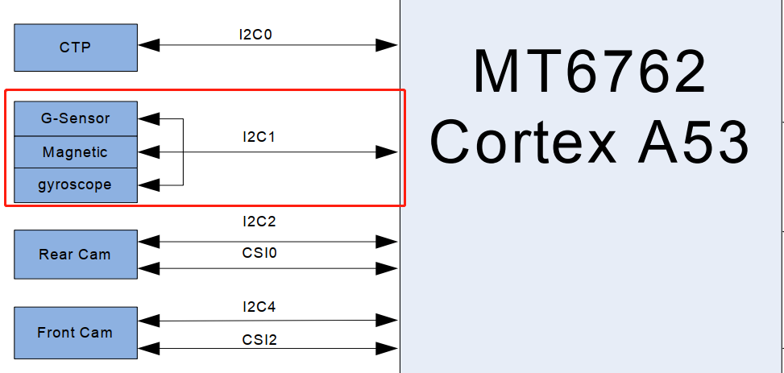
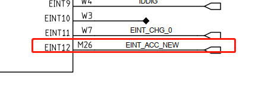
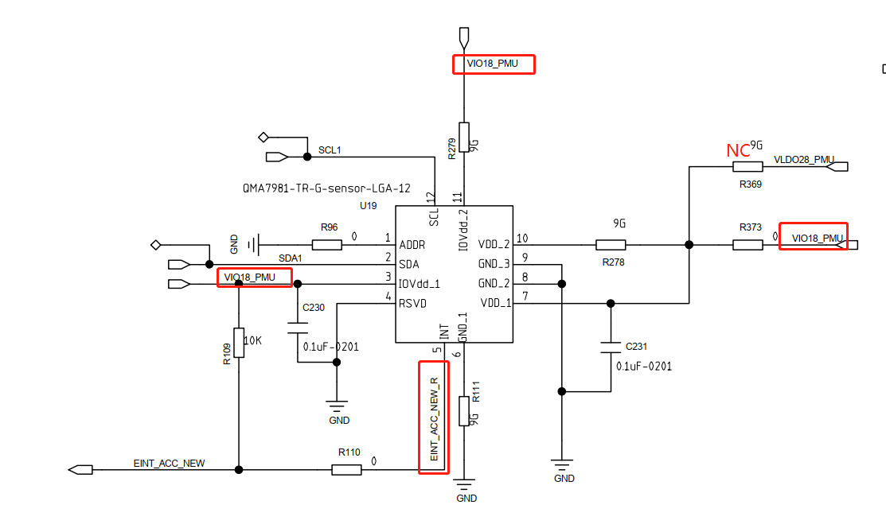
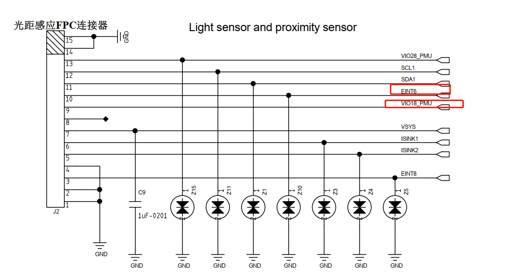
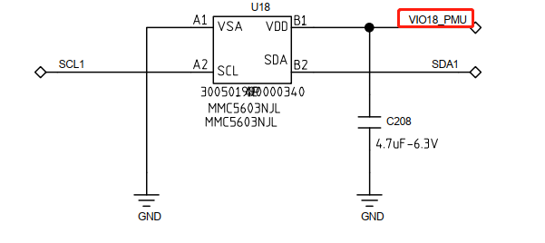

# 概述

Sensor型号汇总

## 型号

| ITEM         | M8         | M50                          |
| ------------ | ---------- | ---------------------------- |
| ACCGYRO      | sc7a20     | 一供：BMI160  二供：qmi8658c |
| ALSPS        | LTR-553ALS     | ltr559                       |
| MAGNETOMETER | MMC5603NJL | MMC5603NJL                   |

## 硬件

### 1.ACCGYRO

| ITEM         | sc7a20         | qmi8658c                          |
| ------------ | ---------- | ---------------------------- |
| I2C总线及地址     | i2c1 0x18     | i2c1 0x68 |
| eint_num中断号        | EINT12     | EINT12                       |
| 供电 | VIO18_PUM | VIO18_PUM                   |

### 2.ALSPS

| ITEM         | LTR-553ALS        |
| ------------ | ---------- |
| I2C总线及地址     | i2c1 0x23 |
| eint_num中断号        | EINT6    |
| 供电 | VIO18_PUM |

### 3.MAGNETOMETER

| ITEM         | MMC5603NJL        |
| ------------ | ---------- |
| I2C总线及地址     | i2c1 0x30 |
| 供电 | VIO18_PUM |

## 规格书

* [0005_地磁MMC5603.pdf](refers/0005_地磁MMC5603.pdf)

* [0005_LTR-553ALS-01_DS_V1.2_300501990000169.pdf](refers/0005_LTR-553ALS-01_DS_V1.2_300501990000169.pdf)

* [0005_SC7A20TR_士兰微.pdf](refers/0005_SC7A20TR_士兰微.pdf)
