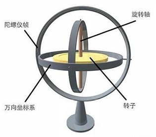
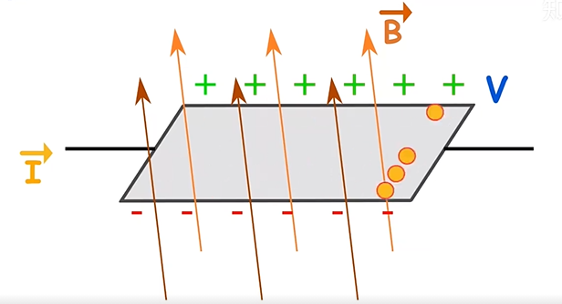

# 传感器原理

介绍传感器原理

## 参考

* [Android Manager之SensorManager(传感器)—基础知识](https://blog.csdn.net/weixin_37730482/article/details/80570268)

* [Android Sensor 传感器总结](https://aiethan.blog.csdn.net/article/details/106949028?spm=1001.2101.3001.6650.1&utm_medium=distribute.pc_relevant.none-task-blog-2%7Edefault%7ECTRLIST%7ERate-1.pc_relevant_paycolumn_v3&depth_1-utm_source=distribute.pc_relevant.none-task-blog-2%7Edefault%7ECTRLIST%7ERate-1.pc_relevant_paycolumn_v3&utm_relevant_index=2)

## 一、传感器概览

Android平台支持三个大类的传感器

- Motion sensors（运动传感器）
  这些传感器测量加速力，并沿三个轴的旋转力。此类别包括加速度计，重力感应器， 陀螺仪和旋转矢量传感器。
- Environmental sensors （环境传感器）
  这些传感器测量各种环境参数，例如环境空气温度和压力，照明和湿度。此类别包括气压计，光度计，和温度计。
- Position sensors （位置传感器）
  这些传感器测量设备的物理位置。这个类别包括方向传感器和磁力计。

手机上搭载的常见传感器

* 1.方向传感器(Orientation sensor)

* 2.加速感应器（Accelerometer sensor）

* 3.陀螺仪传感器(Gyroscope sensor)

* 4.磁场传感器(Magnetic field sensor)

* 5.距离传感器(Proximity sensor)

* 6.光线传感器(Light sensor)

* 7.气压传感器(Pressure sensor)

* 8.温度传感器（Temperature sensor）

* 9.重力感应器（Gravity sensor，Android 2.3引入）

* 10.线性加速感应器（Linear acceleration sensor ，Android 2.3引入）

* 11.旋转矢量传感器（Rotation vector sensor，Android 2.3引入）

* 12.相对湿度传感器（Relative humidity sensor，Android 4.0引入）

* 13.近场通信（NFC）传感器（Android 2.3引入），NFC和其他不一样，具有读写功能。

| Sensor                     | Type                 | Description                                                  | Common Uses                                           |
  | :------------------------- | :------------------- | :----------------------------------------------------------- | :---------------------------------------------------- |
  | `TYPE_ACCELEROMETER`       | Hardware             | Measures the acceleration force in m/s2 that is applied to a device on all three physical axes (x, y, and z), including the force of gravity. | Motion detection (shake, tilt, etc.).                 |
  | `TYPE_AMBIENT_TEMPERATURE` | Hardware             | Measures the ambient room temperature in degrees Celsius (°C). See note below. | Monitoring air temperatures.                          |
  | `TYPE_GRAVITY`             | Software or Hardware | Measures the force of gravity in m/s2 that is applied to a device on all three physical axes (x, y, z). | Motion detection (shake, tilt, etc.).                 |
  | `TYPE_GYROSCOPE`           | Hardware             | Measures a device's rate of rotation in rad/s around each of the three physical axes (x, y, and z). | Rotation detection (spin, turn, etc.).                |
  | `TYPE_LIGHT`               | Hardware             | Measures the ambient light level (illumination) in lx.       | Controlling screen brightness.                        |
  | `TYPE_LINEAR_ACCELERATION` | Software or Hardware | Measures the acceleration force in m/s2 that is applied to a device on all three physical axes (x, y, and z), excluding the force of gravity. | Monitoring acceleration along a single axis.          |
  | `TYPE_MAGNETIC_FIELD`      | Hardware             | Measures the ambient geomagnetic field for all three physical axes (x, y, z) in μT. | Creating a compass.                                   |
  | `TYPE_ORIENTATION`         | Software             | Measures degrees of rotation that a device makes around all three physical axes (x, y, z). As of API level 3 you can obtain the inclination matrix and rotation matrix for a device by using the gravity sensor and the geomagnetic field sensor in conjunction with the `getRotationMatrix()` method. | Determining device position.                          |
  | `TYPE_PRESSURE`            | Hardware             | Measures the ambient air pressure in hPa or mbar.            | Monitoring air pressure changes.                      |
  | `TYPE_PROXIMITY`           | Hardware             | Measures the proximity of an object in cm relative to the view screen of a device. This sensor is typically used to determine whether a handset is being held up to a person's ear. | Phone position during a call.                         |
  | `TYPE_RELATIVE_HUMIDITY`   | Hardware             | Measures the relative ambient humidity in percent (%).       | Monitoring dewpoint, absolute, and relative humidity. |
  | `TYPE_ROTATION_VECTOR`     | Software or Hardware | Measures the orientation of a device by providing the three elements of the device's rotation vector. | Motion detection and rotation detection.              |
  | `TYPE_TEMPERATURE`         | Hardware             | Measures the temperature of the device in degrees Celsius (°C). This sensor implementation varies across devices and this sensor was replaced with the `TYPE_AMBIENT_TEMPERATURE` sensor in API Level 14 | Monitoring temperatures.                              | 

## APP读取sensor数据

### 1.获取当前设备传感器列表

```java
import android.view.View;
import android.view.Menu;
import android.view.MenuItem;
import android.content.Intent;
import android.hardware.Sensor;
import android.hardware.SensorEvent;
import android.hardware.SensorEventListener;
import android.hardware.SensorManager;
import android.os.Bundle;
import android.util.Log;
import android.view.View;
import android.widget.Button;
import android.widget.Switch;
import android.widget.TextView;

 public class MainActivity extends AppCompatActivity {

    private SensorManager sensorManager;
    List<Sensor> allSensors;
    public void get_sensorlist() {

        StringBuilder sb = new StringBuilder();
        sb.append("当前设备支持传感器数：" + allSensors.size() + "   分别是：\n\n");
        for(Sensor s:allSensors){
            switch (s.getType()){
                case Sensor.TYPE_ACCELEROMETER:
                    sb.append("加速度传感器(Accelerometer sensor)" + "\n");
                    break;
                case Sensor.TYPE_GYROSCOPE:
                    sb.append("陀螺仪传感器(Gyroscope sensor)" + "\n");
                    break;
                case Sensor.TYPE_LIGHT:
                    sb.append("光线传感器(Light sensor)" + "\n");
                    break;
                case Sensor.TYPE_MAGNETIC_FIELD:
                    sb.append("磁场传感器(Magnetic field sensor)" + "\n");
                    break;
                case Sensor.TYPE_ORIENTATION:
                    sb.append("方向传感器(Orientation sensor)" + "\n");
                    break;
                case Sensor.TYPE_PRESSURE:
                    sb.append("气压传感器(Pressure sensor)" + "\n");
                    break;
                case Sensor.TYPE_PROXIMITY:
                    sb.append("距离传感器(Proximity sensor)" + "\n");
                    break;
                case Sensor.TYPE_TEMPERATURE:
                    sb.append("温度传感器(Temperature sensor)" + "\n");
                    break;
                default:
                    sb.append("其他传感器" + "\n");
                    break;
            }
            sb.append("设备名称：" + s.getName() + "\n 设备版本：" + s.getVersion() + "\n 供应商："
                    + s.getVendor() + "\n\n");
        }
        Log.d("TAG","sb.toString()----:"+sb.toString());
    }

    @Override
    protected void onCreate(Bundle savedInstanceState) {
        super.onCreate(savedInstanceState);
        setContentView(R.layout.activity_main);
        Toolbar toolbar = findViewById(R.id.toolbar);
        setSupportActionBar(toolbar);
        //获取SensorManager实例
        sensorManager= (SensorManager) getSystemService(Context.SENSOR_SERVICE);
        //获取当前设备支持的传感器列表
        allSensors = sensorManager.getSensorList(Sensor.TYPE_ALL);

        FloatingActionButton fab = findViewById(R.id.fab);
        fab.setOnClickListener(new View.OnClickListener() {
            @Override
            public void onClick(View view) {
                Snackbar.make(view, "Replace with your own action", Snackbar.LENGTH_LONG)
                        .setAction("Action", null).show();
                get_sensorlist();
            }
        });
    }
}
```
* M8打印如下：

```
hardware acceleration = true , fakeHwAccelerated = false, sRendererDisabled = false, forceHwAccelerated = false, sSystemRendererDisabled = false
```

### 2.获取sensor数据

* 常用api

  * SensorManager：可以通过这个类去创建一个传感器服务的实例，这个类提供的各种方法可以访问传感器列表、注册或解除注册传感器事件监听、获取方位信息等。

  * Sensor：用于创建一个特定的传感器实例，这个类提供的方法可以让你决定一个传感器的功能。

  * SensorEvent：系统会通过这个类创建一个传感器事件对象，提供了一个传感器的事件信息，包含一下内容，原生的传感器数据、触发传感器的事件类型、精确的数据以及事件发生的时间。

  * SensorEventListener：可以通过这个接口创建两个回调用法来接收传感器的事件通知，比如当传感器的值发生变化时。

* 使用方式

  * 第一步：获取SensorManager对象

  * 第二步：获取Sensor对象

  * 第三步：注册Sensor对象

  * 第四步：重写onAccuracyChanged，onSensorChanged这两个方法

  * 第五步：注销Sensor对象

```java

public class SensorActivity extends Activity implements SensorEventListener {
  private SensorManager mSensorManager;
  private Sensor mSensor;
  @Override
  public final void onCreate(Bundle savedInstanceState) {
    super.onCreate(savedInstanceState);
    setContentView(R.layout.main);
    //第一步：通过getSystemService获得SensorManager实例对象
    mSensorManager = (SensorManager) getSystemService(Context.SENSOR_SERVICE);
    //第二步：通过SensorManager实例对象获得想要的传感器对象:参数决定获取哪个传感器
    mSensor = mSensorManager.getDefaultSensor(Sensor.TYPE_LIGHT);
  }
  //第四步：必须重写的两个方法：onAccuracyChanged，onSensorChanged
  /**
   * 传感器精度发生改变的回调接口
   */
  @Override
  public final void onAccuracyChanged(Sensor sensor, int accuracy) {
    //TODO 在传感器精度发生改变时做些操作，accuracy为当前传感器精度
  }
  /**
   * 传感器事件值改变时的回调接口：执行此方法的频率与注册传感器时的频率有关
   */
  @Override
  public final void onSensorChanged(SensorEvent event) {
    // 大部分传感器会返回三个轴方向x,y,x的event值，值的意义因传感器而异
    float x = event.values[0];
    float y = event.values[1];
    float z = event.values[2];
    //TODO 利用获得的三个float传感器值做些操作
  }
  /**
   * 第三步：在获得焦点时注册传感器并让本类实现SensorEventListener接口
   */
  @Override
  protected void onResume() {
    super.onResume();
    /*
     *第一个参数：SensorEventListener接口的实例对象
     *第二个参数：需要注册的传感器实例
     *第三个参数：传感器获取传感器事件event值频率：
   *              SensorManager.SENSOR_DELAY_FASTEST = 0：对应0微秒的更新间隔，最快，1微秒 = 1 % 1000000秒
   *              SensorManager.SENSOR_DELAY_GAME = 1：对应20000微秒的更新间隔，游戏中常用
   *              SensorManager.SENSOR_DELAY_UI = 2：对应60000微秒的更新间隔
   *              SensorManager.SENSOR_DELAY_NORMAL = 3：对应200000微秒的更新间隔
   *              键入自定义的int值x时：对应x微秒的更新间隔
     *
     */
    mSensorManager.registerListener(this, mSensor, SensorManager.SENSOR_DELAY_NORMAL);
  }
  /**
   * 第五步：在失去焦点时注销传感器
   */
  @Override
  protected void onPause() {
    super.onPause();
    mSensorManager.unregisterListener(this);
  }
}
```
注意，设备不一定支持你需要的sensor，使用前可以先判断下可用性
```java
private SensorManager mSensorManager;
...
mSensorManager = (SensorManager) getSystemService(Context.SENSOR_SERVICE);
if (mSensorManager.getDefaultSensor(Sensor.TYPE_MAGNETIC_FIELD) != null){
    // Success! There's a magnetometer.
} else {
    // Failure! No magnetometer.
}
 
//或者
List<Sensor> deviceSensors = mSensorManager.getSensorList(Sensor.TYPE_ALL);
```

## 二、加速度传感器（accelerometer）

加速度传感器又叫G-sensor，返回x、y、z三轴的加速度数值。

* 加速度是描述物体运动变化快慢的物理量，以m/s²为单位。加速度传感器就是一种能够测量加速度大小的物理设备。
* 当物体移动时，加速度传感器受振，使得加速度传感器内部质量块加在压电晶体上的力发生变化，当被测振动频率远远低于加速度计的固有频率时，被测加速度的变化与力的变化成正比，因此可通过力的大小判断加速度的大小。由于正压电效应，使得其变形的同时也产生电场，两个相对表面上出现正负相反电荷，产生电压，因此可将加速度转化成电压输出。
* 加速度传感器的传感器事件值在相对于设备静止的特定坐标系中表示，我们以手机为例：  
  
* 当手机竖直静止时，重力作用在y轴，横立在x轴，平方在z轴。加速度传感器可以测量设备沿三个坐标轴的加速度，测量的结果为设备的加速度减去沿是三个传感器坐标轴的重力加速度。根据传感器输出的三个坐标的值，结合手机的空间坐标和重力的作用原理就可以判断当前手机的运行状态。
* 示例：
  * 当设备垂直自由落体时，(x, y, z) 的数值接近于0。
  * 当设备平放在桌子上并从其左侧向右推动时，x 轴加速度值为正。
  * 当设备平放在桌子上时，z 轴上的加速度值为 +9.81，相当于设备的加速度 (0m/s^2) 减去重力加速度 (-9.81 m/s²)
  * 当设备平放在桌子上并向上抬起时，z轴加速度值大于 +9.81，相当于设备的加速度 (+A m/s²) 减去重力加速度 (-9.81 m/s²)

## 三、陀螺仪（gyroscope）

* 手机陀螺仪又称为角速度传感器，区别于上面介绍的加速度传感器(线性加速度)，陀螺仪测量的是当物体发生偏转或者倾斜时的旋转角速度。
通俗的陀螺仪是这样的：




* 而我们手机上的陀螺仪的工作原理是陀螺仪内部有一些金属框架和滑块，滑块在交变电压的作用下以一定的频率做往复直线运动，当传感器沿轴线发生偏移时，直线运动的滑块会在科里奥利力的作用下发生偏移，而直线运动的滑块一旦发生偏移，就会产生电容变化，滑块的偏移值与对应的电容值成正比，也与所受的科里奥利力成正比，而科里奥利力与偏转的角速度成正比，所以电容值与偏转的角速度成正比，将变化的电容值转化成数字信号，经过dsp，我们软件上就能去处理。

* 基本应用：

  * GPS导航
  * 射击游戏通过陀螺仪压枪
  * 拍照防抖功能

[知乎-陀螺仪工作原理](https://www.zhihu.com/question/27216244)

## 四、地磁传感器（magnetometer）
磁力传感器简称为M-sensor，返回x、y、z三轴的环境磁场数据。

该数值的单位是微特斯拉（micro-Tesla），用uT表示。 单位也可以是高斯（Gauss），1Tesla=10000Gauss。1Gauss = 100uT,硬件上一般没有独立的磁力传感器，磁力数据由电子罗盘传感器提供（E-compass）。

电子罗盘传感器同时提供下文的方向传感器数据。

* 地磁传感器可以用来检测物体附近的磁场大小，通过分析磁场进而确定方位，这样我们就可以理解，为什么手机内部放置了地磁传感器，就可以检测出方位和定位；
* 智能手机是一种电子设备，通过和传感器检测到的一些变量进行通信，比如电压或者电流，所以需要将地磁传感器检测到的磁场值，以电压或电流的方式输出，以便测量磁场。

那么怎么去获得这个电流或者电压呢？

* 根据霍尔效应的原理，当电流垂直于外磁场通过半导体时，会导致半导体内部电子密度分布不均匀，垂直于电流和磁场的方向会产生电场，从而会在半导体两端产生电势差，通过改变磁场的大小或者磁场的方向，会导致里的向量发生改变，当力的值(大小和方向)发生改变时，就可以推倒出磁场的大小的方向了。



## 五、光线传感器（ambient light sensor）

* 器件内部光敏材料接收到不同强度的光线时，会产生强弱不等的电流，从而感知环境光亮度的变化；
* 基本应用：手机的自动调节背光功能。

## 六、距离传感器（proximity sensor）

* 距离传感器通过向被测物体发射超声波/红外/激光等并被被测物体反射，通过计算超声波/红外从发射到反射回来的时间，来计算与被测物体之间的距离；
* 基本应用：当用户在接听电话时，将手机靠近头部，距离传感器测出两者的距离从而关闭背光，当手机拿开时，重新打开背光。

## 七、方向传感器(Orientation sensor)
方向传感器简称为O-sensor，返回三轴的角度数据，方向数据的单位是角度。

为了得到精确的角度数据，E-compass(电子罗盘传感器)需要获取G-sensor(加速度传感器)的数据， 经过计算生产O-sensor数据，否则只能获取水平方向的角度。

* 方向传感器提供三个数据，分别为azimuth、pitch和roll。

  * azimuth：方位，返回水平时磁北极和Y轴的夹角，范围为0°至360°。 0°=北，90°=东，180°=南，270°=西。

  * pitch：x轴和水平面的夹角，范围为-180°至180°。 当z轴向y轴转动时，角度为正值。

  * roll：y轴和水平面的夹角，由于历史原因，范围为-90°至90°。 当x轴向z轴移动时，角度为正值。

电子罗盘在获取正确的数据前需要进行校准，通常可用8字校准法。 8字校准法要求用户使用需要校准的设备在空中做8字晃动， 原则上尽量多的让设备法线方向指向空间的所有8个象限。

## 八、Barometer Sensor (气)压力传感器
压力传感器返回当前的压强，单位是百帕斯卡hectopascal（hPa）。

## 九、Temperature Sensor 温度传感器
温度传感器返回当前的温度。

## 十、Gravity 重力传感器
重力传感器简称GV-sensor，输出重力数据。

在地球上，重力数值为9.8，单位是m/s^2。 坐标系统与加速度传感器相同。 当设备复位时，重力传感器的输出与加速度传感器相同。

## 十一、Linear Acceleration 线性加速度传感器
线性加速度传感器简称LA-sensor。

线性加速度传感器是加速度传感器减去重力影响获取的数据。 单位是m/s^2，坐标系统与加速度传感器相同。

加速度传感器、重力传感器和线性加速度传感器的计算公式如下： 加速度 = 重力 + 线性加速度

## 十二、Rotation Vector 旋转矢量传感器
旋转矢量传感器简称RV-sensor。

旋转矢量代表设备的方向，是一个将坐标轴和角度混合计算得到的数据。

RV-sensor输出三个数据： xsin(theta/2) ysin(theta/2) z*sin(theta/2) sin(theta/2)是RV的数量级。

RV的方向与轴旋转的方向相同。 RV的三个数值，与cos(theta/2)组成一个四元组。 RV的数据没有单位，使用的坐标系与加速度相同。

举例：
```
sensors_event_t.data[0] = x*sin(theta/2)

sensors_event_t.data[1] = ysin(theta/2)

sensors_event_t.data[2] = z*sin(theta/2)

sensors_event_t.data[3] = cos(theta/2)
```

## 其他传感器

```
Step Detector 步数探测器
Step Counter 计步器
Significant Motion Detector 运动检测器
Game Rotation Vector 游戏旋转矢量
Geomagnetic Rotation Vector 地磁旋转矢量
Basic Gestures 基本手势
Motion Accel 运动加速度
```

## sensor特色功能

| 快捷键/手势                |                                                        |
| -------------------------- | ------------------------------------------------------ |
| 单击/双击唤醒              |                                                        |
| 三只下拉截屏               |                                                        |
| 双击电源键进入相机         |                                                        |
| 长按电源键0.5s进入小爱同学 |                                                        |
| 单手模式                   | 将屏显示尺寸缩小，方便单手操作                         |
| **sensor新特性**           |                                                        |
| 口袋模式                   | 主要是关屏/亮屏状态下利用距感                          |
| 保护套锁定/解锁            | 主要是关屏/亮屏状态下利用距感                          |
| 抬起亮屏                   | 主要是关屏状态下利用gsensor                            |
| 睡眠监测                   | 能识别何时入睡及起床，深睡及浅睡时间                   |
| 运动检测                   | 在计步的同时能够识别运动模式，包括自行车、跑步、步行等 |
|                            |                                                        |

