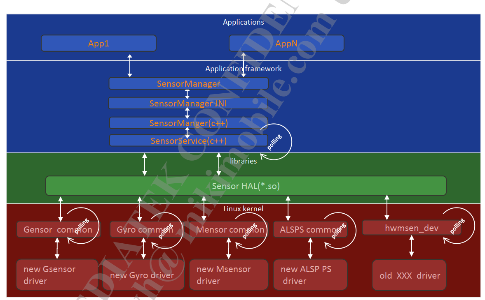
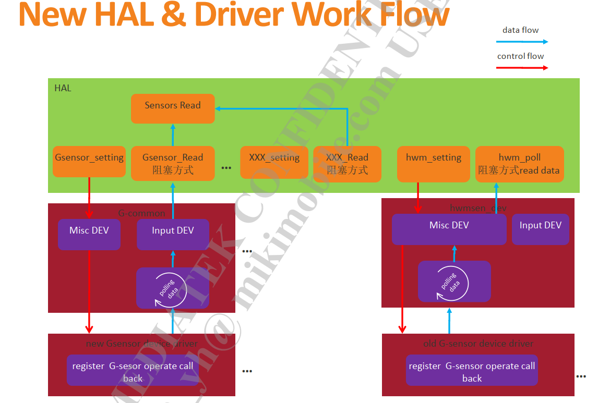
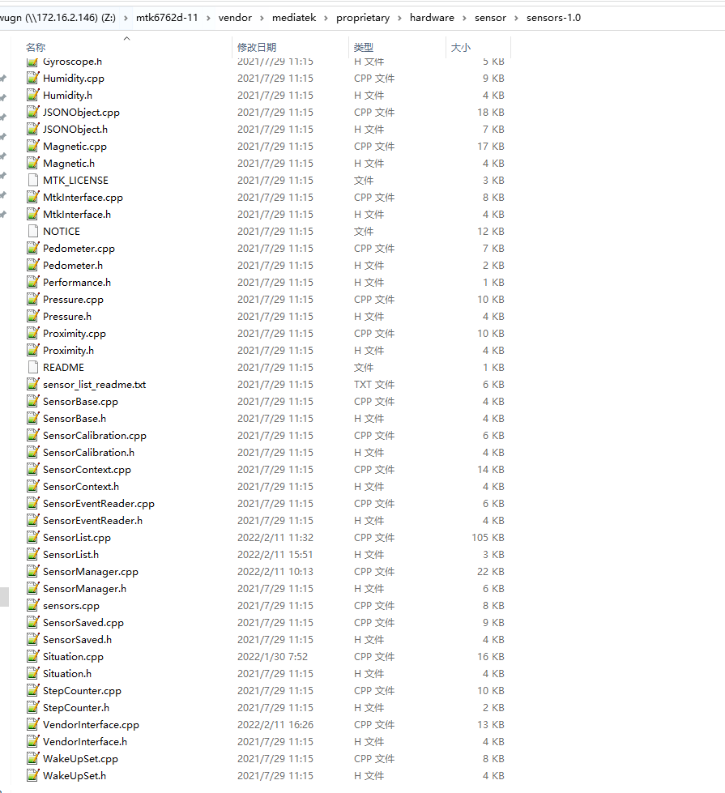
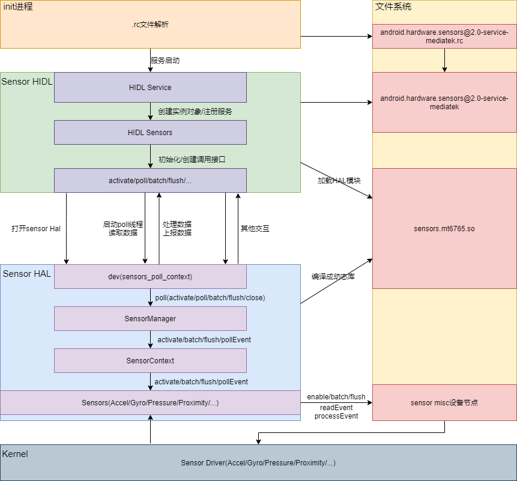
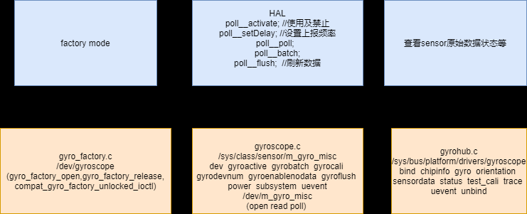
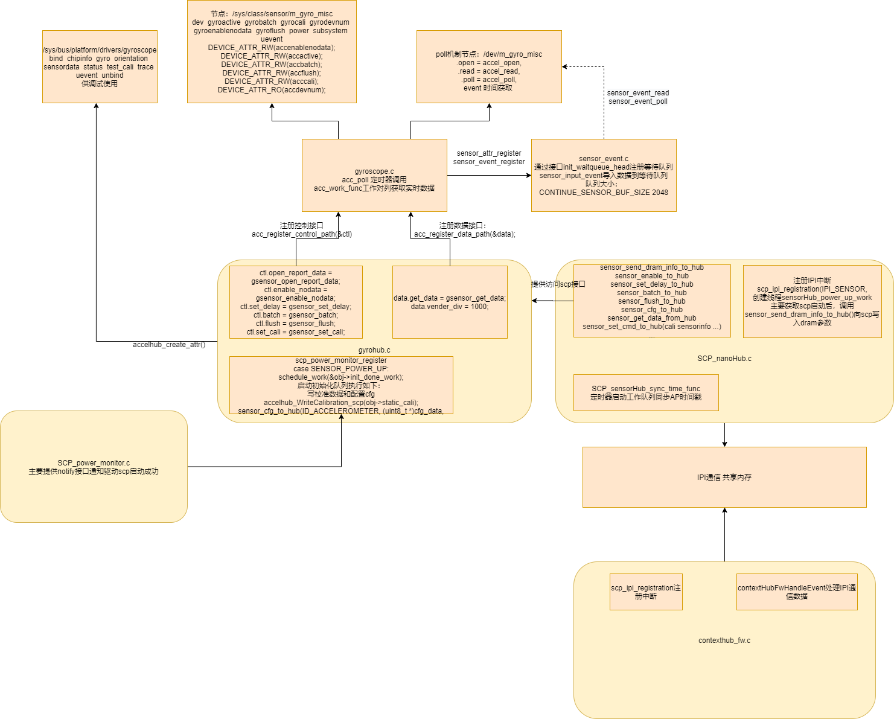

# 传感器原理

Sensor架构介绍

## 参考

* [0007_sensor_all_in_one.pdf](refers/sensor_all_in_one.pdf)

* [嵌入式Linux驱动开发（五）——poll机制原理以及驱动实现](https://www.jianshu.com/p/8cd91b71709a)

## 软件架构图





新架构中的每个sensor都对应于一个CPP file：



## HIDL层架构



### 平台与相关文件

* 平台：M8 MT6765 Android11 sensor-1.0
* 相关文件:
  * vendor\mediatek\proprietary\hardware\sensor\sensors-1.0，最终编译成vendor/lib64/hw/sensors.mt6765.so，不同硬件平台可能保存的名称和路径不一致
  * vendor\mediatek\proprietary\hardware\sensor\hidl\2.0，最终编译成vendor/bin/hw/android.hardware.sensors@2.0-service-mediatek
  * hardware\interfaces\sensors\2.0\ISensors.hal，google HIDL接口定义

### 相关编译配置

* HIDL 编译配置

* `vendor\mediatek\proprietary\hardware\sensor\hidl\2.0\Android.mk`:

```Makefile
LOCAL_PATH:= $(call my-dir)

include $(CLEAR_VARS)
LOCAL_MODULE := android.hardware.sensors@2.0-service-mediatek
LOCAL_INIT_RC := android.hardware.sensors@2.0-service-mediatek.rc
LOCAL_PROPRIETARY_MODULE := true
LOCAL_MODULE_RELATIVE_PATH := hw
LOCAL_MODULE_OWNER := mtk
LOCAL_SRC_FILES := \
    Sensors.cpp \
    service.cpp 

LOCAL_SHARED_LIBRARIES := \
    liblog \
    libcutils \
    libhardware \
    libhwbinder \
    libbase \
    libutils \
    libhidlbase \
    libhidltransport \
    android.hardware.sensors@1.0 \
    android.hardware.sensors@2.0 \
    libfmq \
    libpower 

LOCAL_STATIC_LIBRARIES := \
    android.hardware.sensors@1.0-convert \
    multihal 

LOCAL_REQUIRED_MODULES += \
    sensors.$(TARGET_BOARD_PLATFORM) 

include $(BUILD_EXECUTABLE)
```

* `device/mediatek/vendor/common/device.mk`:

```
PRODUCT_PACKAGES += \
        android.hardware.sensors@2.0-service-mediatek
```

* `device/mediatek/vendor/common/project_manifest/manifest_sensor_hidl_v2.xml`:
```xml
<manifest version="1.0" type="device">
    <hal format="hidl">
        <name>android.hardware.sensors</name>
        <transport>hwbinder</transport>
        <impl level="generic"></impl>
        <version>2.0</version>
        <interface>
            <name>ISensors</name>
            <instance>default</instance>
        </interface>
    </hal>
</manifest>
``` 

* device目录下相关宏配置

主要是device/mediateksample/$project/ProjectConfig.mk文件

```log
device/mediateksample/k62v1_64_pax/ProjectConfig.mk
MTK_SENSOR_ARCHITECTURE = 1.0
MTK_SENSORS_1_0 = yes
```

* hal层SensorList对应传感器类型添加

### HIDL启动流程

* `vendor/mediatek/proprietary/hardware/sensor/hidl/2.0/android.hardware.sensors@2.0-service-mediatek.rc`系统起来后init进程会加载vendor/etc/init里的rc文件:
```
启动详情请参考：
https://www.jianshu.com/p/769c58285c22?utm_source=oschina-app

文件系统地址：
vendor/etc/init/android.hardware.sensors@2.0-service-mediatek.rc

service vendor.sensors-hal-2-0 /vendor/bin/hw/android.hardware.sensors@2.0-service-mediatek
    class main
    user system
    group system
    rlimit rtprio 10 10
```

#### 1.sensor数据流poll机制

```
* vendor\mediatek\proprietary\hardware\sensor\hidl\2.0\service.cpp
  * main()
    * android::sp<ISensors> sensors = new Sensors()          //进入HIDL Seneors.cpp中的构造函数
      * Sensors::Sensors()                                 //构造函数
        * //hw_get_module会通过SENSORS_HARDWARE_MODULE_ID找到对应HAL模块sensors-1.0/sensor.cpp  ->  /vendor/lib64/hw/sensors.mt6765.so
          * hw_get_module(SENSORS_HARDWARE_MODULE_ID,(hw_module_t const **)&mSensorModule)
            * sensors_open_1()                           //打开sensor,调用Hal层sensors-1.0/sensors.cpp里面的open_sensors()函数，这里就从HIDL层进入到snesor Hal层
              * mRunThread = std::thread(startThread, this)    //启动poll线程(这里可以知道其实sensor还没有打开，poll线程就已经启动在源源不断获取数据)
                * Sensors::startThread()
                  * Sensors::poll()
                    * while(mRunThreadEnable.load())     //while()循环持续得去获取Hal层传递上来的数据 
                      * mSensorDevice->poll            //进入Hal层调用sensors.cpp里面的poll__poll函数去获取数据
                      * convertFromSensorEvents()
                      * postEvents()
                        * while (1)                                       
                          * mEventQueue->writeBlocking()//通过while死循环将event数据源源不断写入到FMQ(快速消息队列)
    * sensors->registerAsService()       //注册sensor service
```

* `hardware/interfaces/sensors/1.0/ISensors.hal`:其他关键方法：

```
Sensors::initialize()
Sensors::getSensorsList()       //获取sensor列表，通过mSensorModule->get_sensors_list()进入Hal层的sensors.cpp->sensors__get_sensors_list()方法
Sensors::batch(int32_t sensor_handle, int64_t sampling_period_ns, int64_t max_report_latency_ns)    //通过mSensorDevice->batch进入Hal层sensors.cpp->poll__batch()方法
Sensors::activate(int32_t sensor_handle, bool enabled)      //通过mSensorDevice->activate进入Hal层sensors.cpp->poll__activate()方法
Sensors::flush(int32_t sensor_handle)                       //通过mSensorDevice->flush进入Hal层sensors.cpp->poll__flush()方法
```

### 2.open_sensors()函数了解open工作流程

* 流程分析：

```C++
//由上面HIDL层工作流程分析中的sensors_open_1()可知，会调用Hal层sensors.cpp  .open = open_sensors, 由此入口正式进入到Hal层
* open = open_sensors
    * open_sensors()
        * init_sensors()
            * mSensorList = SensorList::getInstance();
                * SensorList *mInterface = new SensorList
                    * SensorList::SensorList()
                        * SensorList::initSensorList()         //初始化sensor列表，这里通过相关宏配置来实现是否需要添加对应传感器到SensorList
            * mSensorList->getSensorList(&list)
                * SensorList::getSensorList
            * dev = sensors_poll_context_t::getInstance()                   //获取sensors_poll_context_t实例，sensors_poll_context_t的作用是统一相关操作snesor的接口
                * getInstance()--->new sensors_poll_context_t               //SensorContext.cpp,创建sensors_poll_context_t对象
                    * sensors_poll_context_t::sensors_poll_context_t()      //开始创建各个sensor的实例对象
                        * mSensors[accel] = new AccelerationSensor();
                            * AccelerationSensor::AccelerationSensor()      //Acceleration.cpp

            * dev->device.activate        = poll__activate; //使用及禁止
            * dev->device.setDelay        = poll__setDelay; //设置上报频率，这里是设置poll delay值
            * dev->device.poll            = poll__poll;                     //HIDL层进入到Hal层 mSensorDevice相关调用接口 poll数据
            * dev->device.batch           = poll__batch;  //
            * dev->device.flush           = poll__flush;  //刷新数据

            * mSensorManager = SensorManager::getInstance();                //获取SensorManager实例对象
                * SensorManager *sensors = new SensorManager
                    * SensorManager::SensorManager()
            * mSensorManager->addSensorsList(list, count);                  //将获取到的sensor列表添加到mSensorList容器里面
                * SensorManager::addSensorsList()
            * mNativeConnection = mSensorManager->createSensorConnection(numFds);
                * SensorManager::createSensorConnection()
            * mSensorManager->setNativeConnection(mNativeConnection);       //将本地sensor连接保存到SensorManager
                * SensorManager::setNativeConnection()
            * mSensorManager->setSensorContext(dev);
                * SensorManager::setSensorContext()                         //设置sensor上下文
            * mVendorInterface = VendorInterface::getInstance();            //这些应该是进入校正库的相关调用接口
                * VendorInterface *mInterface = new VendorInterface
                    * VendorInterface::VendorInterface()
                        * fd = TEMP_FAILURE_RETRY(open("/sys/class/sensor/m_mag_misc/maglibinfo", O_RDWR))  //通过maglibinfo节点绑定的fops去找到校正库
                        * len = TEMP_FAILURE_RETRY(read(fd, &libinfo, sizeof(struct mag_libinfo_t)))
            * mMtkInterface = MtkInterface::getInstance();
            * mSensorCalibration = SensorCalibration::getInstance();        //sensor校正相关
            * mDirectChannelManager = DirectChannelManager::getInstance();
                            
//思考：sensors.cpp只是定义了poll__batch()函数，那么是在哪里调用的？？？
//--->framework-native-services-sensorservice-SensorService.cpp:  SensorService::enable()  sensor->batch()会通过hidl调用到Hal层的poll__batch() 
sensors.cpp：
* poll__batch()                          
    * SensorManager::batch()
        * sensors_poll_context_t::batch()
            * AccelerationSensor::batch()    //操作/sys/class/sensor/m_acc_misc/accbatch节点,进入到内核空间调用驱动accel.c->accbatch_store()函数

//--->framework-native-services-sensorservice-SensorService.cpp:  SensorService::enable()  sensor->activate()会通过hidl调用到Hal层的poll__activate()
sensors.cpp：                     
* poll__activate()                           //sensor使能函数
    * SensorManager::activate()
        * sensors_poll_context_t::activate()
            * AccelerationSensor::enable()   //操作/sys/class/sensor/m_acc_misc/accactive节点，进入到内核空间调用驱动accel.c->accactive_store()函数

//启动poll线程后就一直在循环读取数据
sensors.cpp                     
* poll__poll()           //AccelerationSensor::enable打开加速度传感器后，上层就一直在循环调用poll__poll()获取传感器数据
    * SensorManager::pollEvent()
        * sensors_poll_context_t::pollEvent()                       //轮询事件,启动轮询机制，监听sensorlist[]中文件描述符，等待事件上报 
            * AccelerationSensor::readEvents()                      //读取事件
                * SensorEventCircularReader::fill()                 //将下方read(mReadFd,..)读取到的数据保存在mBuffer
                    * read(mReadFd,..)   //mReadFd就是/dev/m_acc_misc文件描述符，m_acc_misc设备节点绑定了fops,通过read()进入到内核空间调用驱动accel_read()
                * SensorEventCircularReader::readEvent()    //将上面mBuffer里面的数据保存在 *event
            * AccelerationSensor::processEvent()                //事件处理与校正，上面获取到的*event数据,将(sensor_event *event)转换成(sensors_event_t mPendingEvent)
                * SensorEventCircularReader::next()             //获取下一次的数据

poll__setDelay:  //HIDL
  * poll__setDelay()
    * mSensorManager->batch(mNativeConnection, handle - ID_OFFSET, ns, 0);
      * SensorManager::batch(SensorConnection *connection, int32_t sensor_handle, //Sensor.cpp
        * mSensorContext->batch(sensor_handle,0, info.bestBatchParams.batchDelay, info.bestBatchParams.batchTimeout); //SensorManager.cpp
          * sensors_poll_context_t::batch(int handle, int flags,
            * mSensors[index]->batch(handle, flags, samplingPeriodNs, maxBatchReportLatencyNs);//SensorContext.cpp
              * strlcpy(&input_sysfs_path[input_sysfs_path_len], "gyrobatch", sizeof(input_sysfs_path) - input_sysfs_path_len); //Gyroscope.cpp从input_sysfs_path数组中匹配gyrobatch的节点
              * int err = TEMP_FAILURE_RETRY(write(fd, buf, sizeof(buf))); //write sys节点
                * DEVICE_ATTR_RW(gyrobatch);  //kernel节点
                  * static ssize_t gyrobatch_store(struct device *dev,   //store函数
                    * #ifdef CONFIG_NANOHUB //Gyrpscope.c 开启sensorhub
                      * err = cxt->gyro_ctl.batch(0, cxt->delay_ns, cxt->latency_ns); 
                        * static int gyrohub_batch(int flag, int64_t samplingPeriodNs, //gyrohub.c gyrohub_probe中定义ctl.batch = gyrohub_batch;
                          * sensor_batch_to_hub(ID_GYROSCOPE,flag, samplingPeriodNs, maxBatchReportLatencyNs); 
                            * SCP_sensorHub_batch(handle,flag, samplingPeriodNs, maxBatchReportLatencyNs); //SCP_nanoHub.c
                              * nanohub_external_write((const uint8_t *)&cmd, //IPI通信
                                * static bool sensorRateAcc(uint32_t rate, uint64_t latency, void *cookie) //sensorhub  accgyro.c
                                  * accRateCalculate(rate, latency);
                                    * setAccHwRate(rate, waterMark, latency);
                                      * sensorFsmRunState(&dataInfo, &mTask.fsm, (const void *)CHIP_ACC_RATECHG, &i2cCallback, &spiCallback); //执行FSM驱动CHIP_ACC_RATECHG函数
                                        * sc7a20gRate(I2cCallbackF i2cCallBack, SpiCbkF spiCallBack, void *next_state, // sc7a20.c
                    * gyro_enable_and_batch(); //非sensorhub驱动
                      * cxt->gyro_ctl.batch(0, cxt->delay_ns,cxt->latency_ns); //调用真实driver里面的batch函数
                        * static int sc7a20_batch(int flag, int64_t samplingPeriodNs, int64_t maxBatchReportLaten
                          * SC7A20_SetBWRate(obj_i2c_data->client, sample_delay); //操作真实sensor i2c
                      * atomic_set(&cxt->delay, mdelay); //同时设置timer延时，因为sensor工作队列中INIT_WORK(&obj->report, gyro_work_func);定义了startTimer(&cxt->hrTimer, atomic_read(&cxt->delay), false);
```

### sensors_event_t数据格式

```C++
//上面分析到AccelerationSensor::processEvent()数据处理过程中会将(sensor_event *event)转换成(sensors_event_t mPendingEvent)，我们可以看看sensors_event_t类型的数据是什么样的？
// hardware/libhardware/include/hardware/sensors.h

/**
 * Union of the various types of sensor data
 * that can be returned.
 */
typedef struct sensors_event_t {
    /* must be sizeof(struct sensors_event_t) */
    int32_t version;

    /* sensor identifier */
    int32_t sensor;

    /* sensor type */
    int32_t type;

    /* reserved */
    int32_t reserved0;

    /* time is in nanosecond */
    int64_t timestamp;

    union {
        union {
            float           data[16];

            /* acceleration values are in meter per second per second (m/s^2) */
            sensors_vec_t   acceleration;

            /* magnetic vector values are in micro-Tesla (uT) */
            sensors_vec_t   magnetic;

            /* orientation values are in degrees */
            sensors_vec_t   orientation;

            /* gyroscope values are in rad/s */
            sensors_vec_t   gyro;

            /* temperature is in degrees centigrade (Celsius) */
            float           temperature;

            /* distance in centimeters */
            float           distance;

            /* light in SI lux units */
            float           light;

            /* pressure in hectopascal (hPa) */
            float           pressure;

            /* relative humidity in percent */
            float           relative_humidity;

            /* uncalibrated gyroscope values are in rad/s */
            uncalibrated_event_t uncalibrated_gyro;

            /* uncalibrated magnetometer values are in micro-Teslas */
            uncalibrated_event_t uncalibrated_magnetic;

            /* uncalibrated accelerometer values are in  meter per second per second (m/s^2) */
            uncalibrated_event_t uncalibrated_accelerometer;

            /* heart rate data containing value in bpm and status */
            heart_rate_event_t heart_rate;

            /* this is a special event. see SENSOR_TYPE_META_DATA above.
             * sensors_meta_data_event_t events are all reported with a type of
             * SENSOR_TYPE_META_DATA. The handle is ignored and must be zero.
             */
            meta_data_event_t meta_data;

            /* dynamic sensor meta event. See SENSOR_TYPE_DYNAMIC_SENSOR_META type for details */
            dynamic_sensor_meta_event_t dynamic_sensor_meta;

            /*
             * special additional sensor information frame, see
             * SENSOR_TYPE_ADDITIONAL_INFO for details.
             */
            additional_info_event_t additional_info;
        };

        union {
            uint64_t        data[8];

            /* step-counter */
            uint64_t        step_counter;
        } u64;
    };

    /* Reserved flags for internal use. Set to zero. */
    uint32_t flags;

    uint32_t reserved1[3];
} sensors_event_t;
```

### 上层的传下来的sensor_handle与对应传感器的转换关系

```C++
private:
    enum {
        accel,
        magnetic,
        gyro,
        light,
        proximity,
        pressure,
        humidity,
        stepcounter,
        pedometer,
        activity,
        situation,
        fusion,
        bio,
        numFds,
    };

    int handleToDriver(int handle) const {
        switch (handle) {
            case ID_ACCELEROMETER:
                 return accel;
            case ID_MAGNETIC:
                 return magnetic;
            case ID_PROXIMITY:
                 return proximity;
            case ID_LIGHT:
            case ID_RGBW:
                 return light;
            case ID_GYROSCOPE:
                 return gyro;
            case ID_PRESSURE:
                 return pressure;
            case ID_RELATIVE_HUMIDITY:
                 return humidity;
            case ID_STEP_COUNTER:
            case ID_STEP_DETECTOR:
            case ID_SIGNIFICANT_MOTION:
            case ID_FLOOR_COUNTER:
                 return stepcounter;
            case ID_PEDOMETER:
                 return pedometer;
            case ID_ACTIVITY:
                 return activity;
            case ID_LINEAR_ACCELERATION:
            case ID_ROTATION_VECTOR:
            case ID_GAME_ROTATION_VECTOR:
            case ID_GRAVITY:
            case ID_GEOMAGNETIC_ROTATION_VECTOR:
            case ID_ORIENTATION:
            case ID_PDR:
            case ID_GYROSCOPE_UNCALIBRATED:
            case ID_MAGNETIC_UNCALIBRATED:
                 return fusion;
            case ID_FACE_DOWN:
            case ID_SHAKE:
            case ID_ANSWER_CALL:
            case ID_IN_POCKET:
            case ID_STATIONARY_DETECT:
            case ID_MOTION_DETECT:
            case ID_DEVICE_ORIENTATION:
            case ID_WAKE_GESTURE:
            case ID_PICK_UP_GESTURE:
            case ID_GLANCE_GESTURE:
            case ID_TILT_DETECTOR:
                  return situation;
            case ID_EKG:
            case ID_PPG1:
            case ID_PPG2:
                  return bio;
            default:
                break;
        }
        return -EINVAL;
    }

//vendor\mediatek\proprietary\hardware\sensor\sensors-1.0\SensorContext.cpp
int sensors_poll_context_t::activate(int handle, int enabled) {
    int err = 0;
    int index = handleToDriver(handle);

    if ((index >= numFds) || (index < 0)) {
        ALOGE("activate error index = %d\n", index);
        return -1;
    }
    if (NULL != mSensors[index])
        err = mSensors[index]->enable(handle, enabled);
    return err;
}
```

## kernel hub层架构

* kernel文件节点关系：



* 驱动架构图



### 驱动获取物理sensor数据流程分析

每个sensor都会在驱动层创建工作队列和定时器，当上层需要数据时，将启动定时器去循环调用工作队列获取数据。且注册一个等待队列的buffer，大小是2048byte，通过poll读取。poll机制每次只有当一个进程写入了一个数据之后本进程或其它进程才可以读取该数据，否则一直阻塞。

```C++
accel.c->*late_initcall(acc_init);
* acc_init
  * acc_probe
    * acc_context_alloc_object()     //函数返回一个accel 驱动上下文对象
      * INIT_WORK(&obj->report, acc_work_func);    //初始化工作队列
        * initTimer(&obj->hrTimer, acc_poll)     //初始化定时器，并指定超时回调函数为acc_poll

                    //由上面的i2c driver probe流程可知，probe时创建了misc设备节点以及相关的sysfs接口
                    //用户层操作sys/class/sensor/m_acc_misc/accbatch和accactive接口进入以下流程:
   
```

* 由上面的driver probe流程可知，probe时创建了misc设备节点以及相关的sysfs接口，用户层操作sys/class/sensor/m_acc_misc/accbatch和accactive接口进入以下流程:

* accactive_store流程：
```C++
* accactive_store
    * acc_enable_and_batch           //第二次进入这个函数，accel已经完成上电且采样率?发生变化后，才会启动定时器
    * startTimer                 //第一次启动定时器，调acc_poll函数
        * acc_poll
        * queue_work(obj->accel_workqueue, &obj->report);         //将acc_work_func任务提交到工作队列,并唤醒工作队列处理线程进行处理
            *acc_work_func//主要工作是调用获取sensor数据的接口，将数据转换成acc_date,并将数据上报，同时如果poll已运行，则重新启动启动定时器开始循环读取数据
            *cxt->acc_data.get_data(&x, &y, &z, &status);
                *bmi160_acc.c->bmi160_acc_get_data()
                *bmi160_acc_read_sensor_data
                    *bmi160_acc_read_data
                    *bma_i2c_read_block
                        *i2c_transfer                   //正式进入到驱动通过i2c总线往sensor硬件读取指定寄存器原始数据的流程
                        *acc_data_report            //sensor数据上报
                            *sensor_input_event     //将传进来的sensor_event保存在对应event_obj->client->buffer[]下等待用户读取
```

* accbatch_store流程：
```C++
* accbatch_store
  * cxt->acc_ctl.batch(0, cxt->delay_ns, cxt->latency_ns);       
    * gsensor_batch(int flag, int64_t samplingPeriodNs, //Accelhub.c
      * sensor_batch_to_hub(ID_ACCELEROMETER, flag, samplingPeriodNs,  
```

* accel_read流程

```C++
* accel_rea
  * sensor_event_read(acc_context_obj->mdev.minor, file, buffer,
    * copy_to_user(buffer + read, &event, sizeof(struct sensor_event)) // poll机制读取
```

* accel_poll流程

```C++
* accel_poll
  * sensor_event_poll(acc_context_obj->mdev.minor, file, wait);
    * poll_wait(file, &client->wait, wait); // poll机制读取
```

* poll简单应用历程,程序不会一直阻塞，而是阻塞一段时间，如果没有变化就先让它返回，不要一直阻塞在那里。：

```C++
main() {
    //循环查询
    while(1)  
    {
    //  int poll(struct pollfd *fds, nfds_t nfds, int timeout); 
    /*  
            fds：struct pollfd 数组，其中管理了文件描述以及输入参数
            ndfs: 需要通过 poll 机制管理的文件描述符数量
            timeout：超时时间，单位为毫秒
        */
                //调用 poll 函数
        ret = poll(fds, 1, 5000);

                //如果返回值为0，打印超时
        if(!ret)
                        printf("timeout.....%d\n\n", ret);
        else{
                        //返回值不为0，说明有数据可以读取，通过 read 来读取数据并打印
            read(fd, &value, 1);
            printf("value: %x\t ret: %d\n", value, ret);
        }
    }
}
```