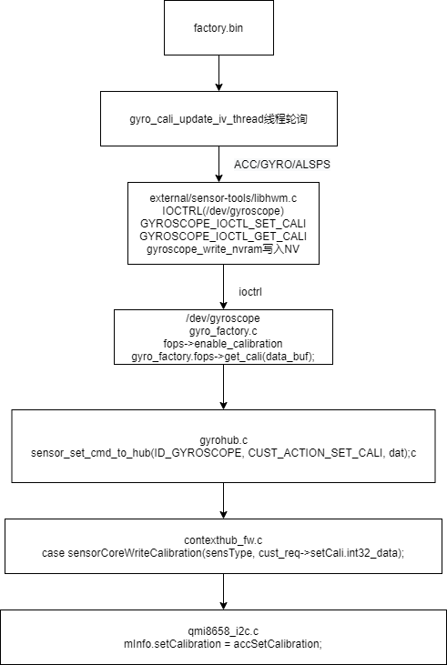

# 概述

SensorHub工厂模式下校准流程分析。

## 原理


* 重力传感器acc：

* 平放取20次平均，（{0,0,9.8}-平均值）=校准值 (float型)

  * 写入Driver：校准值×1000         //JNI再IOCTL  Driver中的GSENSOR_IOCTL_SET_CALI，只写nvram而不写入driver的话需要重启后才能生效。开机过程中的nvram_daemon会去读取nvram中的值写入driver，从而生效

  * 写入Nvram：校准值×65536/9.80665   （ 有做round处理，所以可能写进去的和读出来的稍微不一样，小数点被舍掉了）

  * 所以上层APK读取和写入Nvram的值时都需要处理

* 陀螺仪gyro:

  * 平放取20次平均，（{0,0,0}-平均值）=校准值  (float型)
  
  * 写入Driver：校准值       //JNI再IOCTL  Driver中的GYROSCOPE_IOCTL_SET_CALI，只写nvram而不写入driver的话需要重启后才能生效。开机过程中的nvram_daemon会去读取nvram中的值写入driver，从而生效
  
  * 写入Nvram：校准值×1000

  * 所以上层APK读取和写入Nvram的值时都需要处理
 
 
注：写入Nvram的校准值都是3个INT型的，重力传感器和陀螺仪都是

## 参考

```log
陀螺仪选型相关参数
陀螺仪选型需要主要两个主要的参数，一个是角度随机游走，另外一个是零偏不稳定性。
陀螺仪手册说明：
（1）Initial Zero Rate Output Tolerance: +/-40 °/s
当陀螺仪静止的时候，陀螺会给出在−40∘/s到+40∘/s之间的一个输出值，也就是初始的零漂值，值得注意的是每次启动的零漂值是不相同的。
（2）ZRO Variation Over Temperature
陀螺的零漂对于温度的敏感性
（3）Power-Supply Sensitivity
电磁的正弦信号的影响对于陀螺零偏的影响
（4）Linear Acceleration Sensitivity
线性加速度对于陀螺角速度的影响
（5）RMS噪声
多次采集的数据的均方根误差，相关的频率是低通滤波的频率，大小和采集的频率也有关系
（6）Rate Noise Spectral Density
速率噪声密度谱，感觉是角度随机游走相关的参数
```

## 校准流程

* 根据打印，因为只有acc校准，所以只做了acc的`sensorCaliAcc`函数，其他的都未执行，先了解一下acc校准方法：

1.点击Item Test进入如下界面， 按音量下键选择相应的sensor测试类型，即可对相应sensor进行校准测试：


2.例如选择G-sensor Cali，首先clear cali data，然后做20%或者40%测试，若显示Cali done则表示校准成功：


3.选择G-sensor 测试项测试，看校准后数据是否OK，若为pass则表示通过：


4.校准流程：


* 开机读取校准数据logcat 打印如下：

```log
02-17 13:03:49.250078   724   724 D Accelerometer: misc path =/sys/class/sensor/m_acc_misc/
02-17 13:03:49.250491   724   724 I Accelerometer: read div buf(/sys/class/sensor/m_acc_misc/accactive), mdiv 1000
02-17 13:03:49.268059   724   724 I Accelerometer: read bias: [0.000000, 0.000000, 0.000000]
02-17 13:03:49.268944   724   724 I Accelerometer: read cali: [240, -111, 199]
```

* 校准数据读取节点：
```log
130|PAYPHONEM50:/ # cat /mnt/vendor/nvcfg/sensor/gyro_temp.json
{
  "gyro_temp": [
      0,
      0,
      0,
      0,
      0,
      0
    ]
```

## 流程图

* 简易流程图如下：



## 程序流程图

* `factory/src/test/ftm_gyro_cali.c`以陀螺仪为例:
```C++
参数说明：
校准显示界面有20%和40%，以下是两种的参数配置：
       case ITEM_DO20:
            pthread_mutex_lock(&dat->gyroc.evtmutex);
            dat->gyroc.pending_op = GYRO_OP_CALI_PRE;
            dat->gyroc.cali_delay = 50;   //每次采样延时
            dat->gyroc.cali_num   = 20; //20次采样
            dat->gyroc.cali_tolerance = 20*10; //
            GSCLOGD("chosen DO20\n");
            pthread_mutex_unlock(&dat->gyroc.evtmutex);
            break;
        case ITEM_DO40:
            pthread_mutex_lock(&dat->gyroc.evtmutex);
            dat->gyroc.pending_op = GYRO_OP_CALI_PRE;
            dat->gyroc.cali_delay = 50;
            dat->gyroc.cali_num   = 20;
            dat->gyroc.cali_tolerance = 40*10;
            GSCLOGD("chosen DO40\n");
            pthread_mutex_unlock(&dat->gyroc.evtmutex);


pthread_create(&dat->update_thd, NULL, gyro_cali_update_iv_thread, priv);
```

```C++
* 程序流程
  * gyroscope_calibration(gyroc->fd, dat->gyroc.cali_delay, dat->gyroc.cali_num,dat->gyroc.cali_tolerance, &cali) //执行校准
    * external/sensor-tools/libhwm.c
    * gyroscope_read(fd, &dat); //手机放平，读取20次xyz数据平均值
    * checkGyroscopeData(item, count, &avg, tolerance) //检测是否符合宽容度要求，应该是偏差不能太大
  * gyroscope_set_cali(gyroc->fd, &cali) //设置校准参数
    * kernel-4.19/drivers/misc/mediatek/sensors-1.0/gyroscope/gyro_factory.c
    *  gyro_factory_unlocked_ioctl(struct file *file, unsigned int cmd, // /dev/gyroscope节点GYROSCOPE_IOCTL_SET_CALI指令
      * gyro_factory.fops->set_cali(data_buf);
        * gyrohub.c //.set_cali = gyrohub_factory_set_cali, 
        * gyrohub_WriteCalibration(data);
          * gyrohub_WriteCalibration_scp(dat);
            * sensor_set_cmd_to_hub(ID_GYROSCOPE, CUST_ACTION_SET_CALI, dat);
              * req.set_cust_req.setCali.action = CUST_ACTION_SET_CALI; //IPI通信数据类型
              * offsetof(struct SCP_SENSOR_HUB_SET_CUST_REQ,custData) + sizeof(req.set_cust_req.setCali); //将校准数据填充到SCP_SENSOR_HUB_SET_CUST_REQ数据结构custData[11]成员
                * scp_sensorHub_req_send(&req, &len, 1); //kernel IPI通信统一发送接口
                * contextHubHandleIpiRxEvent(); //scp IPI统一接收处理接口
                  * contextHubFindCmd(mTask.ipi_req.action);
                    * CONTEXTHUB_CMD(SENSOR_HUB_SET_CUST,contextHubFwSetCust, contextHubFwSetCustAck), //此条是SENSOR_HUB_SET_CUST数据格式
                      * contextHubDispatchCust(mtkTypeToChreType(mtkType), set_cust_req); //寻找SENSOR_HUB_SET_CUST action执行操作
                        * case CUST_ACTION_SET_CALI:
                        * sensorCoreWriteCalibration(sensType, cust_req->setCali.int32_data);
                          * mCoreInfo->setCalibration(cali_sw, AXES_NUM); //调用具体实例驱动setCalibration函数
                            * mInfo.setCalibration = accSetCalibration; //qmi8656_i2c.c
                              * mQmi8658.accSwCali[AXIS_X] = cali[AXIS_X];
        * qmi8658gy.c //kernel驱动方式 .set_cali = qmi8658gy_factory_set_cali,
        * qmi8658gy_factory_set_cali(int32_t data[3])  
          * qmi8658gy_WriteCalibration(qmi8658gy_i2c_client, cali);
            * obj->cali_sw[QMI8658_AXIS_X] = obj->cvt.sign[QMI8658_AXIS_X]*(cali[obj->cvt.map[QMI8658_AXIS_X]]);  //赋值驱动cali数组
  * gyroscope_get_cali(gyroc->fd, &cali) //读回并显示
  * gyroscope_write_nvram(&cali) //写入NV
  * dat->gyroc.pending_op = GYRO_OP_NONE;
```

* log打印：
```log
sensorhub acc:
[286.720][qmi8658]: accGetCalibration cali x:-6, y:-181, z:165
[286.720]read calibration (-6, -181, 165) (-5, -6, -5)
[286.720]sensitivity:4096.000000, gain:9807
[286.720]read calibration2 (-183, 4, 163) (-1, 1, 1)
[286.721]write calibration (-4, -183, 163)
[286.721][qmi8658]: accSetCalibration cali x:-4, y:-183, z:163
[286.721]scp_ipi_send failed, enable a oneshot timer
[286.724][qmi8658]: Qmi8658Sample status 0x1
[286.725][qmi8658]: Qmi8658Convert
[286.725][qmi8658]: accGetCalibration cali x:-4, y:-183, z:163
```


## 问题分习

### 1.sensorhub方式无法进行校准

* 工厂模式校准失败，根据错误打印`gsensor_get_cali: get_cali err: -1`，看看是什么问题：

```log
kernel打印：
<3>[   37.370284] .(1)[570:factory][GYRO] gyrohub_factory_get_cali fail!
<3>[   37.370320] .(1)[570:factory]<GYRO_FAC> GYROSCOPE_IOCTL_GET_CALI FAIL!

main log：
02-19 17:10:08.501   460   570 D HWMLIB  : ----------------------------------------------------------------
02-19 17:10:08.501   460   570 D HWMLIB  :                          Calibration Data
02-19 17:10:08.502   460   570 D HWMLIB  : ----------------------------------------------------------------
02-19 17:10:08.502   460   570 D HWMLIB  : maxdiff =   +3.9227
02-19 17:10:08.502   460   570 D HWMLIB  : average =   +0.4361,   +0.0192   +9.4192
02-19 17:10:08.502   460   570 D HWMLIB  : ----------------------------------------------------------------
02-19 17:10:08.502   460   570 D HWMLIB  : [  317275] (  +0.4330,   +0.0350,   +9.3640)
02-19 17:10:08.502   460   570 D HWMLIB  : [  317326] (  +0.4420,   +0.0070,   +9.3950)
02-19 17:10:08.502   460   570 D HWMLIB  : [  317378] (  +0.4380,   +0.0330,   +9.4330)
02-19 17:10:08.502   460   570 D HWMLIB  : [  317430] (  +0.4420,   -0.0070,   +9.4330)
02-19 17:10:08.502   460   570 D HWMLIB  : [  317481] (  +0.4020,   +0.0450,   +9.3800)
02-19 17:10:08.502   460   570 D HWMLIB  : [  317532] (  +0.4570,   +0.0040,   +9.4710)
02-19 17:10:08.503   460   570 D HWMLIB  : [  317584] (  +0.4140,   +0.0260,   +9.3880)
02-19 17:10:08.503   460   570 D HWMLIB  : [  317636] (  +0.4230,   +0.0380,   +9.3970)
02-19 17:10:08.503   460   570 D HWMLIB  : [  317687] (  +0.4350,   +0.0040,   +9.4260)
02-19 17:10:08.503   460   570 D HWMLIB  : [  317739] (  +0.4710,   +0.0070,   +9.3970)
02-19 17:10:08.503   460   570 D HWMLIB  : [  317789] (  +0.4540,   +0.0830,   +9.4520)
02-19 17:10:08.503   460   570 D HWMLIB  : [  317840] (  +0.4350,   +0.0000,   +9.4140)
02-19 17:10:08.503   460   570 D HWMLIB  : [  317891] (  +0.4330,   +0.0040,   +9.4500)
02-19 17:10:08.503   460   570 D HWMLIB  : [  317943] (  +0.4280,   +0.0280,   +9.4160)
02-19 17:10:08.503   460   570 D HWMLIB  : [  317994] (  +0.4230,   +0.0160,   +9.4570)
02-19 17:10:08.503   460   570 D HWMLIB  : [  318045] (  +0.4380,   -0.0310,   +9.3880)
02-19 17:10:08.503   460   570 D HWMLIB  : [  318095] (  +0.4620,   +0.0280,   +9.4090)
02-19 17:10:08.503   460   570 D HWMLIB  : [  318146] (  +0.4420,   +0.0040,   +9.4620)
02-19 17:10:08.503   460   570 D HWMLIB  : [  318198] (  +0.4380,   +0.0090,   +9.4500)
02-19 17:10:08.504   460   570 D HWMLIB  : [  318249] (  +0.4110,   +0.0500,   +9.4020)
02-19 17:10:08.505   460   570 D HWMLIB  : ----------------------------------------------------------------
02-19 17:10:08.505   460   570 D HWMLIB  : X-Axis: min/avg/max = (  +0.4020,   +0.4361,   +0.4710), diverse =   -0.0035 ~   +0.0036, std =    0.0165
02-19 17:10:08.505   460   570 D HWMLIB  : Y-Axis: min/avg/max = (  -0.0310,   +0.0192,   +0.0830), diverse =   -0.0051 ~   +0.0065, std =    0.0241
02-19 17:10:08.505   460   570 D HWMLIB  : Z-Axis: min/avg/max = (  +9.3640,   +9.4192,   +9.4710), diverse =   -0.0056 ~   +0.0053, std =    0.0299
02-19 17:10:08.505   460   570 D HWMLIB  : ----------------------------------------------------------------
02-19 17:10:08.506   460   570 D HWMLIB  : calculateStandardCalibration (  -0.4361,   -0.0192,    0.3875)
02-19 17:10:08.506   460   570 D HWMLIB  : [WD]   -0.4361   -0.0192    0.3875 =>  -436   -19   387
02-19 17:10:11.701   460   570 E HWMLIB  : gsensor_get_cali: get_cali err: -1
02-19 17:10:11.702   460   570 E FTM     : gs_cali_update_iv_thread [  296]: get calibration fail: (Invalid argument) -1
02-19 17:10:11.702   460   570 D NVRAM   : fail to open /sys/class/BOOT/BOOT/boot/boot_mode:
02-19 17:10:11.702   460   570 D NVRAM   : NVM_GetFileDesc: Open /mnt/vendor/nvdata/APCFG/APRDCL/HWMON_ACC,LID:12
02-19 17:10:11.702   460   570 D NVRAM   : NVM_CmpFileVerNo 12
02-19 17:10:11.702   460   570 D NVRAM   : Load File Version: 000, NvRam File Version: 000
02-19 17:10:11.702   460   570 D NVRAM   : NVM_ProtectDataFile : 12 ++
02-19 17:10:11.703   460   570 D NVRAM   : NVM_ProtectUserData:Check Success
02-19 17:10:11.703   460   570 D HWMLIB  : [RN]    0.0000    0.0000    0.0000 =>     0     0     0
02-19 17:10:11.705   460   570 D NVRAM   : NVM_CloseFileDesc: Open by Readonly, no need to check when close
02-19 17:10:14.773   460   570 E HWMLIB  : gsensor_get_cali: get_cali err: -1
02-19 17:10:14.773   460   570 E FTM     : gs_cali_update_info [  161]: get calibration: 22(Invalid argument)
02-19 17:10:14.913   460   570 E FTM     : MTK_LCM_PHYSICAL_ROTATION + 0
02-19 17:10:14.916   460   570 E FTM     : set_active_framebuffer +
02-19 17:10:14.933   460   570 E FTM     : gr_flip done
02-19 17:10:14.933   460   570 D FTM     : [GSC] op: 0
02-19 17:10:14.933   460   570 D NVRAM   : fail to open /sys/class/BOOT/BOOT/boot/boot_mode:
02-19 17:10:14.933   460   570 D NVRAM   : NVM_GetFileDesc: Open /mnt/vendor/nvdata/APCFG/APRDCL/HWMON_ACC,LID:12
02-19 17:10:14.933   460   570 D NVRAM   : NVM_CmpFileVerNo 12
02-19 17:10:14.934   460   570 D NVRAM   : Load File Version: 000, NvRam File Version: 000
02-19 17:10:14.934   460   570 D NVRAM   : NVM_ProtectDataFile : 12 ++
02-19 17:10:14.934   460   570 D NVRAM   : NVM_ProtectUserData:Check Success
02-19 17:10:14.934   460   570 D HWMLIB  : [RN]    0.0000    0.0000    0.0000 =>     0     0     0
02-19 17:10:14.934   460   570 D NVRAM   : NVM_CloseFileDesc: Open by Readonly, no need to check when close
```

* 结论

```diff
MTK_OLD_FACTORY_CALIBRATION宏未打开，gyrohub_WriteCalibration函数不生效。

static int gyrohub_factory_set_cali(int32_t data[3])
{
#ifdef MTK_OLD_FACTORY_CALIBRATION
	int err = 0;

	pr_err("%swugn test gyrohub\n", __func__);
	err = gyrohub_WriteCalibration(data);
	if (err) {
		pr_err("gyrohub_WriteCalibration failed!\n");
		return -1;
	}
#endif
	pr_err("%swugn test 11111gyrohub\n", __func__);

	return 0;
}

--- a/kernel-4.19/drivers/misc/mediatek/sensors-1.0/accelerometer/accelhub/accelhub.h
+++ b/kernel-4.19/drivers/misc/mediatek/sensors-1.0/accelerometer/accelhub/accelhub.h
@@ -10,5 +10,6 @@

 #define ACCELHUB_BUFSIZE 256
 #define ACCELHUB_AXES_NUM 3
+#define MTK_OLD_FACTORY_CALIBRATION
```

### 2.gyro校准数据都是0

* 打印如下：

```log
屏幕显示，这个屏幕打印是累加的，建议做之前clean以下数据：
526 -496 40

factory 打印：
02-25 03:37:15.165   458  2652 D FTM     : [GYRO] op: 3
02-25 03:37:16.190   458  2652 D HWMLIB  : ----------------------------------------------------------------
02-25 03:37:16.190   458  2652 D HWMLIB  :                          Calibration Data
02-25 03:37:16.190   458  2652 D HWMLIB  : ----------------------------------------------------------------
02-25 03:37:16.191   458  2652 D HWMLIB  : maxdiff = +200.0000
02-25 03:37:16.191   458  2652 D HWMLIB  : average = -525.5500, +495.8000  -39.6500
02-25 03:37:16.191   458  2652 D HWMLIB  : ----------------------------------------------------------------
02-25 03:37:16.191   458  2652 D HWMLIB  : [ 8912945] (-532.0000, +483.0000,  -36.0000)
02-25 03:37:16.191   458  2652 D HWMLIB  : [ 8912996] (-519.0000, +491.0000,  -32.0000)
02-25 03:37:16.191   458  2652 D HWMLIB  : [ 8913047] (-528.0000, +487.0000,  -28.0000)
02-25 03:37:16.191   458  2652 D HWMLIB  : [ 8913099] (-532.0000, +495.0000,  -40.0000)
02-25 03:37:16.191   458  2652 D HWMLIB  : [ 8913150] (-515.0000, +499.0000,  -49.0000)
02-25 03:37:16.191   458  2652 D HWMLIB  : [ 8913202] (-519.0000, +483.0000,  -40.0000)
02-25 03:37:16.191   458  2652 D HWMLIB  : [ 8913253] (-524.0000, +511.0000,  -36.0000)
02-25 03:37:16.191   458  2652 D HWMLIB  : [ 8913304] (-519.0000, +499.0000,  -32.0000)
02-25 03:37:16.191   458  2652 D HWMLIB  : [ 8913356] (-528.0000, +495.0000,  -36.0000)
02-25 03:37:16.191   458  2652 D HWMLIB  : [ 8913407] (-540.0000, +528.0000,  -53.0000)
02-25 03:37:16.191   458  2652 D HWMLIB  : [ 8913458] (-540.0000, +491.0000,  -36.0000)
02-25 03:37:16.191   458  2652 D HWMLIB  : [ 8913509] (-515.0000, +487.0000,  -45.0000)
02-25 03:37:16.191   458  2652 D HWMLIB  : [ 8913561] (-519.0000, +511.0000,  -40.0000)
02-25 03:37:16.191   458  2652 D HWMLIB  : [ 8913612] (-524.0000, +495.0000,  -57.0000)
02-25 03:37:16.191   458  2652 D HWMLIB  : [ 8913663] (-532.0000, +507.0000,  -40.0000)
02-25 03:37:16.191   458  2652 D HWMLIB  : [ 8913714] (-540.0000, +499.0000,  -45.0000)
02-25 03:37:16.191   458  2652 D HWMLIB  : [ 8913765] (-519.0000, +491.0000,  -40.0000)
02-25 03:37:16.191   458  2652 D HWMLIB  : [ 8913817] (-536.0000, +499.0000,  -36.0000)
02-25 03:37:16.191   458  2652 D HWMLIB  : [ 8913868] (-511.0000, +466.0000,  -36.0000)
02-25 03:37:16.191   458  2652 D HWMLIB  : [ 8913918] (-519.0000, +499.0000,  -36.0000)
02-25 03:37:16.191   458  2652 D HWMLIB  : ----------------------------------------------------------------
02-25 03:37:16.191   458  2652 D HWMLIB  : X-Axis: min/avg/max = (-540.0000, -525.5500, -511.0000), diverse =  -14.4500 ~  +14.5500, std
=    8.8571
02-25 03:37:16.191   458  2652 D HWMLIB  : Y-Axis: min/avg/max = (+466.0000, +495.8000, +528.0000), diverse =  -29.8000 ~  +32.2000, std
=   12.4844
02-25 03:37:16.191   458  2652 D HWMLIB  : Z-Axis: min/avg/max = ( -57.0000,  -39.6500,  -28.0000), diverse =  -17.3500 ~  +11.6500, std
=    6.9662
02-25 03:37:16.191   458  2652 D HWMLIB  : ----------------------------------------------------------------
02-25 03:37:16.191   458  2652 D HWMLIB  : [WD]  525.5500 -495.8000   39.6500 =>   526  -496    40
02-25 03:37:16.192   458  2652 D HWMLIB  : [RD]  526.0000 -496.0000   40.0000 =>   526  -496    40
02-25 03:37:16.193   458  2652 D NVRAM   : fail to open /sys/class/BOOT/BOOT/boot/boot_mode:
02-25 03:37:16.193   458  2652 D NVRAM   : NVM_GetFileDesc: Open /mnt/vendor/nvdata/APCFG/APRDCL/HWMON_GYRO,LID:13
02-25 03:37:16.193   458  2652 D NVRAM   : NVM_CmpFileVerNo 13
02-25 03:37:16.193   458  2652 D NVRAM   : Load File Version: 000, NvRam File Version: 000
02-25 03:37:16.193   458  2652 D NVRAM   : NVM_ProtectDataFile : 13 ++
02-25 03:37:16.193   458  2652 D NVRAM   : NVM_ProtectUserData:Check Success
02-25 03:37:16.193   458  2652 D HWMLIB  : [WN]  526.0000 -496.0000   40.0000 => 526000 -496000 40000


kernel 打印：
[Fri Feb 25 03:37:14 2022] .(7)[2652:factory]GYROSCOPE_IOCTL_SET_CALI: (526, -496, 40)!
[Fri Feb 25 03:37:14 2022] .(7)[2652:factory][GYRO] gyrohub_factory_set_caliwugn test gyrohub
[Fri Feb 25 03:37:15 2022] .(7)[2652:factory][GYRO] gyrohub_factory_set_caliwugn test 11111gyrohub
[Fri Feb 25 03:37:15 2022] .(7)[2652:factory][GYRO] gyrohub_factory_get_cali gyrohub
[Fri Feb 25 03:37:15 2022] .(7)[2652:factory]GYROSCOPE_IOCTL_GET_CALI: (526, -496, 40)!


scp打印：
[8912.544][qmi8658]: gyroGetCalibration cali x:0, y:0, z:0
[8912.545][qmi8658]: gyroGetCalibration cali x:0, y:0, z:0
[8912.545]read calibration (0, 0, 0) (526, -496, 40)
[8912.545]sensitivity:32.000000, gain:131000
[8912.545]read calibration2 (0, 0, 0) (-1, 1, 1)
[8912.545]write calibration (0, 0, 0)
[8912.545][qmi8658]: gyroSetCalibration cali x:0, y:0, z:0
[8912.549][qmi8658]: Qmi8658Sample status 0x3
[8912.549][qmi8658]: Qmi8658Convert
[8912.549][qmi8658]: accGetCalibration cali x:-4, y:-183, z:163
[8912.549][qmi8658]: gyroGetCalibration cali x:0, y:0, z:0
```

* 根据以下代码得知：

```C++
mCoreInfo->getCalibration(cali_sw, AXES_NUM);
cali_sw: 0 0 0 
data:(526, -600, 32)

mCoreInfo->sensitivity = (1 << 5)
mCoreInfo->gain = 131000

int sensorCoreWriteCalibration(uint8_t sensType, int32_t *data)
{
    int32_t cali[AXES_NUM], cali_sw[AXES_NUM];
    struct sensorCoreInfo *mCoreInfo;
    int8_t handle = mSensorCoreList[sensType];
    memset(cali, 0, sizeof(cali));
    memset(cali_sw, 0, sizeof(cali_sw));

    if (!atomicBitsetGetBit(mSensorCoreUsed, handle))
        return -1;
    mCoreInfo = &mInfoCoreList[handle];
    if (!mCoreInfo->getCalibration)
        return -1;
        mCoreInfo->getCalibration(cali_sw, AXES_NUM);
    osLog(LOG_INFO, "read calibration (%ld, %ld, %ld) (%ld, %ld, %ld)\n",
          cali_sw[AXIS_X], cali_sw[AXIS_Y], cali_sw[AXIS_Z], data[AXIS_X], data[AXIS_Y], data[AXIS_Z]);
    osLog(LOG_INFO, "sensitivity:%f, gain:%lu\n", (double)mCoreInfo->sensitivity, mCoreInfo->gain);
    data[AXIS_X] = data[AXIS_X] * mCoreInfo->sensitivity / mCoreInfo->gain;
    data[AXIS_Y] = data[AXIS_Y] * mCoreInfo->sensitivity / mCoreInfo->gain;
    data[AXIS_Z] = data[AXIS_Z] * mCoreInfo->sensitivity / mCoreInfo->gain;
    //这里由于gain值很大，导致data直接变为0，例如data[AXIS_X] = 526*32/131000 = 0.1284 整形直接四舍五入为0

    cali[mCoreInfo->cvt.map[AXIS_X]] = mCoreInfo->cvt.sign[AXIS_X] * cali_sw[AXIS_X];
    cali[mCoreInfo->cvt.map[AXIS_Y]] = mCoreInfo->cvt.sign[AXIS_Y] * cali_sw[AXIS_Y];
    cali[mCoreInfo->cvt.map[AXIS_Z]] = mCoreInfo->cvt.sign[AXIS_Z] * cali_sw[AXIS_Z];

    cali[AXIS_X] += data[AXIS_X];
    cali[AXIS_Y] += data[AXIS_Y];
    cali[AXIS_Z] += data[AXIS_Z];

	osLog(LOG_INFO, "read calibration2 (%ld, %ld, %ld) (%ld, %ld, %ld)\n",
			  cali[AXIS_X], cali[AXIS_Y], cali[AXIS_Z], mCoreInfo->cvt.sign[AXIS_X], mCoreInfo->cvt.sign[AXIS_Y], mCoreInfo->cvt.sign[AXIS_Z]);

    cali_sw[AXIS_X] = mCoreInfo->cvt.sign[AXIS_X] * cali[mCoreInfo->cvt.map[AXIS_X]];
    cali_sw[AXIS_Y] = mCoreInfo->cvt.sign[AXIS_Y] * cali[mCoreInfo->cvt.map[AXIS_Y]];
    cali_sw[AXIS_Z] = mCoreInfo->cvt.sign[AXIS_Z] * cali[mCoreInfo->cvt.map[AXIS_Z]];

    osLog(LOG_INFO, "write calibration (%ld, %ld, %ld)\n",
          cali_sw[AXIS_X], cali_sw[AXIS_Y], cali_sw[AXIS_Z]);
    if (!mCoreInfo->setCalibration)
        return -1;
        mCoreInfo->setCalibration(cali_sw, AXES_NUM);

    return 0;
}

kernel计算方式：
DEFREE_SCALE 1024
qmi8658gy->resolution = (1 << 5)

static int qmi8658gy_factory_set_cali(int32_t data[3])
{
	qmi8658gy_t *obj = qmi8658gy;
	int err = 0;
	int cali[QMI8658_AXIS_NUM] = { 0 };
	//[BUGFIX]-Modify-BEGIN by (huling@paxsz.com), 2022/1/20, number:0039353
	int32_t DEFAULT_CALI_DATA[3] = {3616, -5120, 488}; /*get 40 groups sensor data, take the average*/

	err = qmi8658gy_config_gyr(qmi8658gy->range, qmi8658gy->odr, Qmi8658Lpf_Disable, Qmi8658St_Disable);
	if (err < 0) {
		QMI8658GY_ERR("set gyroscope range failed.\n");
		return err;
	}
	if((data[0] == 0) && (data[1] == 0) && (data[2] == 0)) {
		QMI8658GY_LOG("not do factory cali, use default cali data");
		data[0] = DEFAULT_CALI_DATA[0];
		data[1] = DEFAULT_CALI_DATA[1];
		data[2] = DEFAULT_CALI_DATA[2];
	}
	//QMI8658GY_LOG("data[] = [%d,%d,%d]",data[0], data[1], data[2]);
	//[BUGFIX]-Modify-END by (huling@paxsz.com), 2022/1/20, number:0039353
	cali[QMI8658_AXIS_X] = data[0]*obj->resolution/DEFREE_SCALE;
	cali[QMI8658_AXIS_Y] = data[1]*obj->resolution/DEFREE_SCALE;
	cali[QMI8658_AXIS_Z] = data[2]*obj->resolution/DEFREE_SCALE;
	err = qmi8658gy_WriteCalibration(qmi8658gy_i2c_client, cali);
	if (err) {
		QMI8658GY_ERR("qmi8658gy_WriteCalibration failed!\n");
		return -1;
	}
	return 0;
}
```

* 从qmi5608 scp驱动这端获取参数如下：

```C++
static int Qmi8658SwReset(I2cCallbackF i2cCallBack, SpiCbkF spiCallBack, void *next_state,
				void *inBuf, uint8_t inSize, uint8_t elemInSize, void *outBuf, uint8_t *outSize, uint8_t *elemOutSize) 
{

	QMI8658_LOG( "Qmi8658SwReset\n");
	mQmi8658.acc_power = false;
	mQmi8658.gyr_power = false;
	mQmi8658.config.accRange = Qmi8658AccRange_8g;
	mQmi8658.config.accOdr = Qmi8658AccOdr_1000Hz;
	mQmi8658.config.a_sensitivity = (1 << 12);
	mQmi8658.config.gyrRange = Qmi8658GyrRange_1024dps;
	mQmi8658.config.gyrOdr = Qmi8658GyrOdr_1000Hz;
	mQmi8658.config.g_sensitivity = (1 << 5);
}

static void Qmi8658SensorCoreRegistration(void) 
{
	struct sensorCoreInfo mInfo;
	QMI8658_LOG( "Qmi8658SensorCoreRegistration\n");

	mInfo.sensType = SENS_TYPE_ACCEL;
  #define GRAVITY_EARTH_1000              9807
	mInfo.gain = GRAVITY_EARTH_1000;
	mInfo.sensitivity = mQmi8658.config.a_sensitivity;
	mInfo.cvt = mQmi8658.cvt;
	mInfo.getCalibration = accGetCalibration;
	mInfo.setCalibration = accSetCalibration;

	mInfo.sensType = SENS_TYPE_GYRO;
  #define GYROSCOPE_INCREASE_NUM_AP       131000
	mInfo.gain = GYROSCOPE_INCREASE_NUM_AP; 
	mInfo.sensitivity = mQmi8658.config.g_sensitivity;
	mInfo.cvt = mQmi8658.cvt;
}
```

* 对比kernel和scp计算公式不一样，采用kernel的公式发现陀螺仪都不动了，有问题，最后还是不采用这种校准方法了，直接使用静态值校准。

```
[178.452][qmi8658]: gyroGetCalibration cali x:15, y:16, z:1
[178.455][qmi8658]: gyroGetCalibration cali x:15, y:16, z:1
[178.455]read calibration (15, 16, 1) (3, -3, 0)
[178.455]sensitivity:32.000000, gain:1024
[178.455]read calibration2 (16, -15, 1) (-1, 1, 1)
[178.455]write calibration (15, 16, 1)
[178.455][qmi8658]: gyroSetCalibration cali x:15, y:16, z:1
[178.457][qmi8658]: Qmi8658Sample status 0x3
[178.457][qmi8658]: Qmi8658Convert
[178.457][qmi8658]: accGetCalibration cali x:-15, y:-157, z:181
[178.457][qmi8658]: gyroGetCalibration cali x:15, y:16, z:1

```