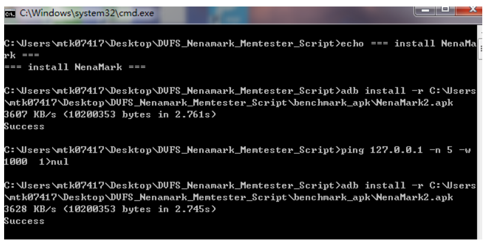
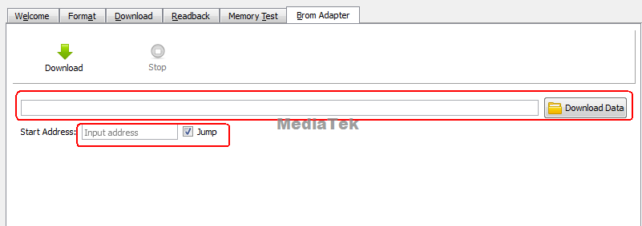

# Android SCP

由于memory 时序容易受到走线、电源系统及温度等因素的干扰，导致memory接口的不稳定，从而造成几率性不能下载、无法开机或者系统不稳定的情况；
使用ETT工具，自动同步memory设备，调试一组最优化的memory时序设定用于量产，同时检测memory接口的稳定性,避免因时序不稳定导致的系列问题；
因此，在导入新layout或者memory chip的时候都请跑一遍ETT。

## 参考文档

* [0001_MT6765_62_ETT_&_stress_test_reference_for_LP4X_V1.6.pdf](refer/0001_MT6765_62_ETT_&_stress_test_reference_for_LP4X_V1.6.pdf)

## 方法

* 具体请参考其中文档MT6765_62 ETT & stress test reference for LP4X V1.6.pdf，提出了以下几个测试点：

- ETT test step by step (ETT测试主要是调试一组最优化的memory时序设定用于量产，需要空板(emmc未烧录)+焊接串口) 这块主要是软件人员配合硬件在新DDR上做验证
- MTK Eye-Scan Function (判断ETT测试结果)
- DRAM Stress Test step by step  (3D TEST测试) 
- Nenamark2 + DVFS for Fast-K (同上)
- Suspend/Resume (休眠唤醒压力测试)
- Reboot(DDR Reserve mode,Full-K,Fast-k)   （重启压力测试）

## 参考

### 1.烧过efuse的机器如何download ett bin进行ett测试

[DESCRIPTION]
 
1.目前绝大多数客户项目，出厂或量产前会烧录efuse并开启secure boot，烧录efuse过后的cpu在用普通方式下载ETT bin时出现download fail.
 
2.在处理跟dram相关问题时，可能会需要对机器进行跑ETT测试，以便确认机器dram哪部分可能有问题。
 
3.本文针对烧过efuse的机器，说明如何进行ett bin download. 
 
  对于未烧过efuse的机器，烧录ett bin方法仍参考MVG online ->QVL(new)对应平台的ETT压力测试文档
 
[SOLUTION]
 
1. 登陆mtkonline，下载DCC文档《Secure 2.1 Configuration SOP.docx》
 
2. 按照《Secure 2.1 Configuration SOP.docx》文档中第6节的方法生成scert file。
 
3.在flashtool里面加载scert file。
  工具UI window下面勾选security mode，然后在Certification File栏位加载步骤2生成的scert file。

4.加载ETT bin download.
        按ctrl+alt+a，在Brom Adapter界面加载对应物料的ETT bin，并按普通未烧录efuse的CPU ic操作进行ett测试即可。

