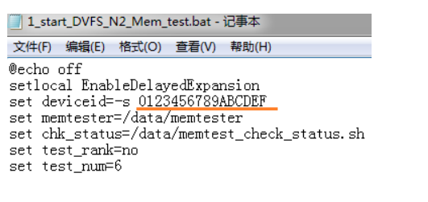

# Android memery

由于memory 时序容易受到走线、电源系统及温度等因素的干扰，导致memory接口的不稳定，从而造成几率性不能下载、无法开机或者系统不稳定的情况；
使用ETT工具，自动同步memory设备，调试一组最优化的memory时序设定用于量产，同时检测memory接口的稳定性,避免因时序不稳定导致的系列问题；
因此，在导入新layout或者memory chip的时候都请跑一遍ETT。

## 参考文档

* [0001_MT6765_62_ETT_&_stress_test_reference_for_LP4X_V1.6.pdf](refers/0001_MT6765_62_ETT_&_stress_test_reference_for_LP4X_V1.6.pdf)

* [Android脱离USB执行Shell脚本的方法](https://blog.csdn.net/MzTestor/article/details/79206427?spm=1001.2101.3001.6650.1&utm_medium=distribute.pc_relevant.none-task-blog-2%7Edefault%7ECTRLIST%7ERate-1.pc_relevant_paycolumn_v3&depth_1-utm_source=distribute.pc_relevant.none-task-blog-2%7Edefault%7ECTRLIST%7ERate-1.pc_relevant_paycolumn_v3&utm_relevant_index=2)

## ETT实验过程

### 1.ett测试条件

* 未烧录过的单板
* 下载过程序的板子请务必先Format whole flash
* 工具:支持MT6765_62平台的Flash tool(W1748以后版本)
* ETT BIN说明:https://online.mediatek.com/qvl/_layouts/15/mol/qvl/ext/QVLHomeExternal.aspx 下载对应平台、对应memory的ETT bin。
* 必须用电源给VBAT供电，高低温环境下测试不能使用电池
* 手机上的NTC需要下拉10K电阻到GND， 模拟电池本身的NTC

### 2.ett测试过程

* 1.测试型号：

  * [32+3：KMDX60018M_B425](refers\MT6765_ETT-enc_KMDX60018M_B425_RELEASE.bin)
  * [64+4：KMDH6001DA-B422](refers\MT6765_ETT-enc_KMDH6001DA_B422_RELEASE.bin)

* 2.bin文件下载方式：


#### 1.烧录bin无打印问题分析

* 组合键Ctrl+Alt+A调出flash tool的brom Adapter选择ETT bin设置start address(0x204000)勾上Jump点击download；


烧录后发现无打印，咨询MTK后，发现串口TX/RX实际电压为1.8v，因为下载`MT6765_ETT-enc_KMDX60018M_B425_RELEASE.bin`后并没有打开3.3v电平转换开关，我们用的3.3v串口，电平不匹配，原理图如下，需要硬件打开以下两个供电：

IO_3V3(GPIO_EXT1 B:GPIO164)需要打开：


GPIO_EXT8 B:GPIO171 串口电平转换：


#### 2.Vdram电平为0问题

(Vcore NV, Vdram NV, Vddq NV)请用万用表测试对应环境温度的电压， 确认Vcore,Vmem, Vddq电压在20mV范围以内即可。


1.经测量Vcore 和Vddq 是正常的，但是无法调高调低。

2.vdram量出来是0，量的是MT6357 H17 vdram脚，不知道什么原因。根据MTK回复，要我换成VDD2进行测试，常温测试结果为1.12v，符合要求。


3.按照文档MT6765_62 ETT & stress test reference for LP4X V1.6.pdf操作，EET测试了10几分钟，卡住了，更换MTK重新提供的bin文件后测试ok，并提示成功，打印如下：

```log
根据文档描述，判断成功的两个依据：
1.Dram Data rate = 3200表示memery能跑到3200MHZ。
2.全部都是PASS。
[HQA] information for measurement,      Dram Data rate = 3200
[Read Voltage]
[HQALOG] 3200 Vcore_HQA = 800000
[HQALOG] 3200 Vdram_HQA = 1125000
[HQALOG] 3200 Vddq_HQA = 600000


[Cmd Bus Training window]
VrefCA Range : 1
VrefCA
[HQALOG] 3200 VrefCA Channel0 Rank0 41
[HQALOG] 3200 VrefCA Channel0 Rank1 41
[HQALOG] 3200 VrefCA Channel1 Rank0 46
[HQALOG] 3200 VrefCA Channel1 Rank1 42
CA_Window
[HQALOG] 3200 CA_Window Channel0 Rank0 57 (bit 3)
[HQALOG] 3200 CA_Window Channel0 Rank1 56 (bit 3)
[HQALOG] 3200 CA_Window Channel1 Rank0 57 (bit 3)
[HQALOG] 3200 CA_Window Channel1 Rank1 56 (bit 4)
CA Min Window(%)
[HQALOG] 3200 CA_Window(%) Channel0 Rank0 90% (PASS)
[HQALOG] 3200 CA_Window(%) Channel0 Rank1 88% (PASS)
[HQALOG] 3200 CA_Window(%) Channel1 Rank0 90% (PASS)
[HQALOG] 3200 CA_Window(%) Channel1 Rank1 88% (PASS)

[RX minimum per bit window]
Delaycell measurement(/100ps)
VrefRX
[HQALOG] 3200 VrefRX Channel0 Rank0 12
[HQALOG] 3200 VrefRX Channel0 Rank1 11
[HQALOG] 3200 VrefRX Channel1 Rank0 12
[HQALOG] 3200 VrefRX Channel1 Rank1 12
RX_Window
[HQALOG] 3200 RX_Window Channel0 Rank0 34 (bit 7)
[HQALOG] 3200 RX_Window Channel0 Rank1 35 (bit 2)
[HQALOG] 3200 RX_Window Channel1 Rank0 36 (bit 12)
[HQALOG] 3200 RX_Window Channel1 Rank1 36 (bit 3)
RX Window(%)
[HQALOG] 3200 RX_Window(%) Channel0 Rank0 22134/100ps (71%) (PASS)
[HQALOG] 3200 RX_Window(%) Channel0 Rank1 22785/100ps (73%) (PASS)
[HQALOG] 3200 RX_Window(%) Channel1 Rank0 23436/100ps (75%) (PASS)
[HQALOG] 3200 RX_Window(%) Channel1 Rank1 23436/100ps (75%) (PASS)


[TX minimum per bit window]
VrefDQ Range : 0
VrefDQ
[HQALOG] 3200 VrefDQ Channel0 Rank0 20
[HQALOG] 3200 VrefDQ Channel0 Rank1 20
[HQALOG] 3200 VrefDQ Channel1 Rank0 26
[HQALOG] 3200 VrefDQ Channel1 Rank1 22
TX_Window
[HQALOG] 3200 TX_Window Channel0 Rank0 20 (bit 4)
[HQALOG] 3200 TX_Window Channel0 Rank1 23 (bit 5)
[HQALOG] 3200 TX_Window Channel1 Rank0 21 (bit 2)
[HQALOG] 3200 TX_Window Channel1 Rank1 23 (bit 2)
TX Min Window(%)
[HQALOG] 3200 TX_Window(%) Channel0 Rank0 63% (PASS)
[HQALOG] 3200 TX_Window(%) Channel0 Rank1 72% (PASS)
[HQALOG] 3200 TX_Window(%) Channel1 Rank0 66% (PASS)
[HQALOG] 3200 TX_Window(%) Channel1 Rank1 72% (PASS)
```

具体LV/NV/HV测试结果请参考以下文件：

* [测试结果](refers/测试结果)

### 3.编译LV/NV/HV不同preloader镜像

分别修改和编译NTNV， HTLV， LTHV对应的三份preloader bin， 测试的时候需要选择对应的preloader bin。

> 请务必使用ENG版本，不能使用userdebug版本和user版本，否则测试脚本无法正常运行。

* 根据以下修改，设置不同宏编译三份preloader：

```diff
--- a/vendor/mediatek/proprietary/bootable/bootloader/preloader/platform/mt6765/src/drivers/inc/emi.h
+++ b/vendor/mediatek/proprietary/bootable/bootloader/preloader/platform/mt6765/src/drivers/inc/emi.h
@@ -361,7 +361,7 @@ void dram_fatal_set_err(unsigned int err_code, unsigned int mask, unsigned int o
 //================================================
 //=============pmic related api for ETT HQA test ==============
 //================================================
-#if __ETT__
+#if 1
 #define DRAM_HQA
 #endif

 #ifdef DRAM_HQA

//#define HVCORE_HVDRAM
#define NVCORE_NVDRAM     //设置不同宏编译三份preloader
//#define LVCORE_LVDRAM
//#define HVCORE_LVDRAM
//#define LVCORE_HVDRAM
```

### pass判断方法

* 具体请参考其中文档MT6765_62 ETT & stress test reference for LP4X V1.6.pdf，提出了以下几个测试点：

- ETT test step by step (ETT测试主要是调试一组最优化的memory时序设定用于量产，需要空板(emmc未烧录)+焊接串口) 这块主要是软件人员配合硬件在新DDR上做验证
- MTK Eye-Scan Function (判断ETT测试结果)


## 4.Stress Test电压测量

为了验证DRAM的稳定性，接下来便做Stress test，stress test前测量Vcore电压需要在开机后测量，并参考以下说明，设定固定的Vcore档位后再用示波器测量。


1.测量电压时， 请注意分别download对应HV/NV/LV的preloader bin开机后测试，经测试3+32型号机器符合表格要求。

* 查看dvfs,发现和文档中描述的节点有点不一致：

```log
PAYTABLETM8:/ # find sys -name dvfsrc*
sys/devices/platform/10012000.dvfsrc/dvfsrc-up
sys/devices/platform/10012000.dvfsrc/10012000.dvfsrc:dvfsrc-met/dvfsrc_met_dump
sys/devices/platform/10012000.dvfsrc/10012000.dvfsrc:dvfsrc-debug/dvfsrc_force_vcore_dvfs_opp
sys/devices/platform/10012000.dvfsrc/10012000.dvfsrc:dvfsrc-debug/dvfsrc_req_hrtbw
sys/devices/platform/10012000.dvfsrc/10012000.dvfsrc:dvfsrc-debug/dvfsrc_req_vcore_opp
sys/devices/platform/10012000.dvfsrc/10012000.dvfsrc:dvfsrc-debug/dvfsrc_req_vscp
sys/devices/platform/10012000.dvfsrc/10012000.dvfsrc:dvfsrc-debug/dvfsrc_freq_hopping
sys/devices/platform/10012000.dvfsrc/10012000.dvfsrc:dvfsrc-debug/dvfsrc_req_ext_bw
sys/devices/platform/10012000.dvfsrc/10012000.dvfsrc:dvfsrc-debug/dvfsrc_req_bw
sys/devices/platform/10012000.dvfsrc/10012000.dvfsrc:dvfsrc-debug/dvfsrc_dump
sys/devices/platform/10012000.dvfsrc/10012000.dvfsrc:dvfsrc-debug/dvfsrc_req_ddr_opp
sys/devices/platform/10012000.dvfsrc/10012000.dvfsrc:dvfsrc-up/dvfsrc_opp_table
sys/firmware/devicetree/base/scp_dvfs/dvfsrc-opp-num
sys/firmware/devicetree/base/dvfsrc@10012000
sys/firmware/devicetree/base/dvfsrc@10012000/dvfsrc-up
sys/firmware/devicetree/base/dvfsrc@10012000/dvfsrc-met
sys/firmware/devicetree/base/dvfsrc@10012000/dvfsrc-debug
sys/firmware/devicetree/base/__symbols__/dvfsrc_freq_opp1
sys/firmware/devicetree/base/__symbols__/dvfsrc
sys/firmware/devicetree/base/__symbols__/dvfsrc_freq_opp2
sys/firmware/devicetree/base/__symbols__/dvfsrc_freq_opp0


130|PAYTABLETM8:/ # cat sys/devices/platform/10012000.dvfsrc/10012000.dvfsrc:dvfsrc-debug/dvfsrc_dump
Vcore     : 650000   uv
DDR       : 1534000  khz
GPS_HOPPING: 0
PTPOD_0   : 00100090
PTPOD_10  : 000f9855
INFO2     : 00000000

BASIC_CONTROL   : 0x0000017b
SW_REQ 1~2      : 00000000, 00000000
SW_BW_0~4       : 0, 3, 1, 0, 0
INT             : 0x00000000
INT_EN          : 0x00000003
MD_SCENARIO     : 0x00000000
MD_RSV0         : 0x00000001
SCP_VCORE_REQ   : 0x000c0000
CURRENT_LEVEL   : 0x00010000
FORCE_OPP_IDX   : 16
CURR_DVFS_OPP   : 15
CURR_VCORE_OPP  : 3
CURR_DRAM_OPP   : 2

DVFSRC_LAST      : 0x00000007
[0]DVFSRC_REC 0~2: 003cb721,00000000,82100010
[1]DVFSRC_REC 0~2: 003cb721,00000000,81000010
[2]DVFSRC_REC 0~2: 003cb7e8,00000000,81200090
[3]DVFSRC_REC 0~2: 003cb7e9,00000000,82000090
[4]DVFSRC_REC 0~2: 003cba18,00000000,82100010
[5]DVFSRC_REC 0~2: 003cba19,00000000,81000010
[6]DVFSRC_REC 0~2: 003cbaa5,00000000,01000010
[7]DVFSRC_REC 0~2: 003cbaa6,00000000,00000010

POWERON_CONFIG_EN       : 0x00000003
SPM_SW_FLAG             : 0x00200182
SPM_SW_RSV_9            : 0x80000001
MD2SPM_DVFS_CON         : 0x00000000
SPM_DVFS_EVENT_STA      : 0xffff0000
SPM_DVFS_LEVEL          : 0x00000000
SPM_DFS_LEVEL           : 0x00000001
SPM_DVS_LEVEL           : 0x00010001
SPM_DVFS_CMD0~4         : 0x152a002d, 0x152a0025, 0x152a001d, 0x152a0015, 0x152a0015
PCM_IM_PTR              : 0x77ff5d6c

1|PAYTABLETM8:/ # cat sys/devices/platform/10012000.dvfsrc/10012000.dvfsrc:dvfsrc-met/dvfsrc_met_dump
NUM_VCORE_OPP : 16
NUM_OPP_INFO : 4
OPP : 6
FREQ : 3200000
VCORE : 800000
x__SPM_LEVEL : 512
NUM SRC_REQ: 15
MD2SPM : 0
DDR__SW_REQ1_PMQOS : 2
DDR__SW_REQ2_CM : 1
DDR__EMI_TOTAL : 0
DDR__QOS_BW : 0
VCORE__SW_REQ1_PMQOS : 0
VCORE__SW_REQ2_CM : 0
VCORE__SCP : 0
PMQOS_TOTAL : 24
PMQOS_BW0 : 0
PMQOS_BW1 : 19
PMQOS_BW2 : 1
PMQOS_BW3 : 4
PMQOS_BW4 : 0
MD_REQ_OPP : 1
```

* 2.查看当前vcore的DVFS OPP table，如下图所示显示NV电压，有的cat出来OPP13，OPP14是0.675V或0.65V，以cat出来的值为准，测量电压只要与cat值一致即可。

```log
130|PAYTABLETM8:/ # cat sys/devices/platform/10012000.dvfsrc/10012000.dvfsrc:dvfsrc-up/dvfsrc_opp_table
FW_TYPE : 1
NUM_VCORE_OPP : 4
NUM_DDR_OPP : 3
NUM_DVFSRC_OPP : 16

[OPP0 ]: 800000   uv 3200000  khz
[OPP1 ]: 800000   uv 3200000  khz
[OPP2 ]: 800000   uv 3200000  khz
[OPP3 ]: 800000   uv 2400000  khz
[OPP4 ]: 800000   uv 3200000  khz
[OPP5 ]: 800000   uv 2400000  khz
[OPP6 ]: 800000   uv 3200000  khz
[OPP7 ]: 800000   uv 2400000  khz
[OPP8 ]: 700000   uv 2400000  khz
[OPP9 ]: 700000   uv 2400000  khz
[OPP10]: 700000   uv 1534000  khz
[OPP11]: 700000   uv 2400000  khz
[OPP12]: 700000   uv 1534000  khz
[OPP13]: 650000   uv 1534000  khz
[OPP14]: 650000   uv 1534000  khz
[OPP15]: 650000   uv 1534000  khz
```

* 3.执行adb命令分别固定5档位，每执行一条命令固定一个档位，测量一次Vcore电压， 共执行5次命令测量5次，看和设定的电压差异多大，默认测量到的是Opp0的Vcore电压。后续测量到的电压要覆盖到三种频率（3200,2400,1534）， 三种电压（0.8， 0.,0.65）即可，例如：频率2400电压0.8v可以测试OPP1也可以测试OPP2。

```log
实测vcore电压0.7v：
echo 8 > sys/devices/platform/10012000.dvfsrc/10012000.dvfsrc:dvfsrc-debug/dvfsrc_force_vcore_dvfs_opp
实测vcore电压0.8v：
echo 7 > sys/devices/platform/10012000.dvfsrc/10012000.dvfsrc:dvfsrc-debug/dvfsrc_force_vcore_dvfs_opp
实测vcore电压0.65v：
echo 13 > sys/devices/platform/10012000.dvfsrc/10012000.dvfsrc:dvfsrc-debug/dvfsrc_force_vcore_dvfs_opp
```

查看设置是否生效：

```log
echo 13 > sys/devices/platform/10012000.dvfsrc/10012000.dvfsrc:dvfsrc-debug/dvfsrc_force_vcore_dvfs_opp
下面表示生效了
cat sys/devices/platform/10012000.dvfsrc/10012000.dvfsrc:dvfsrc-debug/dvfsrc_dump
Vcore     : 650000   uv
DDR       : 1534000  khz
GPS_HOPPING: 0
PTPOD_0   : 00100090
PTPOD_10  : 000f9855
INFO2     : 00000000
```

## 5.Stress test测试步骤

#### Step1： 搭建环境

```log
• Download and install JAVA：
▪ http://www.java.com
• Install Android SDK to have ADB.
▪ http://developer.android.com/sdk/index.html
▪ Remember to add ADB in your PATH.
• EX: C:\ path = %path%; YOU_ADB_PATH
• 获取ADB之后，在ADB安装位置的tool文件夹下产生一个monkeyrunner.bat的文件，请把该文
件的路径添加到计算机的PATH， EX： ADB装在D:\Program Files， monkeyrunner.bat位于
D:\Program Files\Android\android-sdk\tools，把D:\Program Files\Android\android-sdk\tools添加
到PC系统的PATH；
• Install a python environment to be able to run python programs.
▪ For example, download Python 2.7.3 Windows Installer (Windows binary -- does not include source) from
http://www.python.org/getit/

DVFS_Nenamark_Memtester_Script，suspend_and_DVFS script在OA的路径当中不能包含空格和中文
```

### Step2.根据测试场景选择对应的load (HTLV/LTHV/NTNV),下载后第一次开机进行
如下设置
  * 设置>显示>休眠>30分钟，
  * 设置>Developer options>stay awake 设置为不休眠
  * 手机设置为飞行模式，关闭MTK mobile log

注意: Nenamark的测试有可能上传手机资讯, 测试时请不要连接网络,如有
疑虑, 请不要进行此项测试， 脚本会关闭MD和wifi

### Step3.设置device id

DVFS_Nenamark_memtest_script_LPDDR4文件夹中编辑start_DVFS_N2_Mem_test.bat脚本。 把set deviceid=-s 0x?? 设置成所测试手机的device id,如下图所示,然后保存.



### Step4. Install_Nenamark2.bat


安装完毕会自动结束，可以在手机里面找到一个NenaMark2的图标, 双击会出现 choose what to allow NenaMark2 to access 的讯息, 点击 continue给权限。然后双击Nenamark2的图标，点击run需要先跑一次3D动画。

### Step5. Push.bat

编辑Push.bat脚本，把set deviceid=-s 0x?? 设置成所测试手机的deviceid，双击运行Push.bat(出现下图并退出),主要是以下几个文件：

```log
echo "=== push run.sh, start, back ==="
adb %deviceid% push run.sh /data/run.sh
adb %deviceid% shell "chmod 777 /data/run.sh"
adb %deviceid% push n2_run /data/n2_run   //需要配置run键 x/y坐标
adb %deviceid% push n2_back /data/n2_back

echo "=== install DVFS script ==="
adb %deviceid% push vcorefs_cervino /data/vcorefs_cervino
adb %deviceid% push vcorefs_cervino.sh /data/vcorefs_cervino.sh
adb %deviceid% shell "chmod 777 /data/vcorefs_cervino"
adb %deviceid% shell "chmod 777 /data/vcorefs_cervino.sh"

goto :eof
```

这里需要配置n2_run文件中的run键 x/y坐标，实例如下：


### Step6. OPP table配置

* 如果做HV测试先双击set_opp_table_HV.bat进行配置HV OPP table
* 如果做LV测试先双击set_opp_table_LV.bat进行配置LV OPP table
* 如果做NV测试不需要配置OPP table

注意：上述脚本都需要编辑填入手机正确的device id。

### Step7. run.sh && vcorefs_cervino.sh

执行以下指令：

```log
C:\Users\wugangnan>adb shell
PAYTABLETM8:/ # sh /data/run.sh &
PAYTABLETM8:/ # sh /data/vcorefs_cervino.sh &
```

### Step8. start_DVFS_N2_Mem_test.bat

DVFS_Nenamark_memtest_script_LPDDR4文件夹中双击start_DVFS_N2_Mem_test.bat脚本，会弹出n个框图,同时手机屏幕上3D动画在自动跑动,如果3D动画无法自动run请查看文档display the x and y point.pdf进行设置，这个脚本是测试DDR DVFS功能压力测试。


### Step9. 注意事项

* 此时千万不要拔掉USB，需要跑8小时Stress test
* 请参看‘判断测试pass的方法’对测试结果进行分析
* 重复上述步骤将>3部手机的HTLV\LTHV\NTNV所有条件下的Stress test完成。
* 高温环境测试换用低压preloader bin, 低温环境测试换用高压preloader bin, 常温环境用
常温preloader bin.
* 每次变化环境都要重新download.

## 6.Nenamark2 + DVFS for Fast-K测试步骤

根据文档描述，就是烧录高温/低温的preloader进行相同的测试。


## 7.Suspend/Resume测试步骤

* Preloader bin使用默认的即可.
* 屏幕不要设置为always on， 手机设置为飞行模式，关闭MTK mobile log
* Step1. 打开suspend_test_v0.4文件夹，手机开debug功能
* Step2.连接手机，双击suspend_loop_push.bat脚本，运行完毕后按任意键结束
* Step3. 调出一个cmd命令框，输入如下命令
```log
• adb shell
• sh /data/suspend_loop.sh &
```
* Step4.拔掉usb,拔掉usb,拔掉usb, 重要的事情说三次

> 可接power monitor，也可以接usb adapter，不要直接用电脑供电给手机
  测试时间12个小时

* 发现拔掉usb后，自动休眠唤醒就停止了，经研究发现sh的父进程是adbd，当usb连接断掉的时候，就导致程序退出，在网上找到参考方法nohup，注意:nohup是永久执行,&是指在后台运行,如下步骤：

```log
1.首先使用paxtool.bat工具unlock功能将机器解锁。
2.adb remount
3.双击suspend_loop_push.bat和suspned_resume_test_v0.4.bat
4.adb shell "nohup /data/suspend_loop.sh &"
```

## 8.REBOOT测试步骤

### 1.DDR reserve mode Reboot测试步骤

DDR Reserve mode test： 就是在打开DDR reserve mode 功能情况下测试reboot， DDR reserve mode是在reboot前让DRAM 进入self refresh, 确保reboot时DRAM资料可以保留, 在
reboot后再把资料捞出來debug用。

* Step1. Preloader bin使用默认的即可.
屏幕不要设置为always on，手机设置为飞行模式，关闭MTK mobile log

* Step2.打开reboot_script文件夹，编辑reboot_ddr_reserve_mode.bat把device id改成测试机器 id后保存，双击该脚本出现下图的框图，和其他reboot比较区别在于有 ”reboot with ddr reserve mode”字样 Note:Opp table 每16次循环。

* Step3.需要抓UART log进行分析， 需要抓UART log进行分析， 需要抓UART log进行分析,重要的事情说三遍，测试时间12小时。

* Step4.请参看‘判断测试pass的方法1和3’ 对测试结果进行分析。

* Step5.请打开UART log，对UART log进行关键字搜索,如果log太大请用File-Splitter （网上下载） 把log分割成小份进行分析。

```log
测试Fail的关键字搜索“[RGU] WDT DDR reserve mode FAIL!”
▪ 测试PASS的关键字搜索“ DDR RESERVED “会出现如下log表示测试pass
[RGU] WDT DDR reserve mode success! 1387F1
[DDR Reserve] DCS/DVFSRC success! (dcs_en=0, dvfsrc_en=1)
[RGU] WDT DDR reserve mode success! 1387F1
[RGU] DDR RESERVE Success 1
[DDR Reserve] release dram from self-refresh PASS!
```

* Step6. 重复上述步骤将>3部手机在常温条件下reboot完成。

* 脚本修改点：

由于系统节点`dvfsrc_enable`不需要，`dvfsrc_force_vcore_dvfs_opp`路径也不一样，需要修改脚本如下：

```bat
@echo off
setlocal EnableDelayedExpansion
set deviceid=-s XCSKR4VGSCNNV46D

set round=0

:loop

for /l %%x in (0, 1, 15) do (

adb %deviceid% wait-for-device && adb %deviceid% root

adb %deviceid% wait-for-device && adb %deviceid% shell "echo %%x > /sys/devices/platform/10012000.dvfsrc/10012000.dvfsrc:dvfsrc-debug/dvfsrc_force_vcore_dvfs_opp"
::: sleep 1 sec
ping 1.1.1.1 -n 1 -w 1000 > nul

adb %deviceid% wait-for-device && adb %deviceid% reboot ddr-reserve

echo reboot ddr-reserve, opp table: %%x
echo %date% %time% 
)
set /a round=%round%+16
echo reboot ddr-reserve, round: %round%, opp table: %%x

goto loop
pause
```

### 2.Full-K Reboot测试步骤

* Step1. Preloader 使用full k bin，软件修改点：

```C++
--- a/vendor/mediatek/proprietary/bootable/bootloader/preloader/platform/mt6765/src/drivers/inc/dramc_pi_api.h
+++ b/vendor/mediatek/proprietary/bootable/bootloader/preloader/platform/mt6765/src/drivers/inc/dramc_pi_api.h
@@ -615,7 +615,7 @@ typedef unsigned char       BOOL;
 #define NULL 0
 #define DDR_BASE 0x40000000
 #endif
-#if FOR_DV_SIMULATION_USED==1
+#if FOR_DV_SIMULATION_USED==0
 #define DDR_BASE 0x40000000
 #endif
 /***********************************************************************/
diff --git a/vendor/mediatek/proprietary/bootable/bootloader/preloader/platform/mt6765/src/drivers/inc/emi.h b/vendor/mediatek/proprietary/bootable/bootloader/preloader/platform/mt6765/src/drivers/inc/emi.h
index 65b6fc45fda..58986c7f4a6 100644
--- a/vendor/mediatek/proprietary/bootable/bootloader/preloader/platform/mt6765/src/drivers/inc/emi.h
+++ b/vendor/mediatek/proprietary/bootable/bootloader/preloader/platform/mt6765/src/drivers/inc/emi.h
@@ -361,8 +361,8 @@ void dram_fatal_set_err(unsigned int err_code, unsigned int mask, unsigned int o
 //================================================
 //=============pmic related api for ETT HQA test ==============
 //================================================
-#if __ETT__
-#define DRAM_HQA
+#if 1
+//#define DRAM_HQA
 #endif
```

* Step 2.屏幕不要设置为always on，手机设置为飞行模式，关闭MTK mobile log。

* Step3.编辑 reboot_full_k.bat把device id改成测试机器id后保存，双击该脚本。

```
Note1: Full k 每5次更新。
Note2：脚本若无device id，则不需修改。
```

* Step4. opp table显示当前频率档位。

* 测试结果：

```
▪ 测试时间12个小时
▪ Step5.请参看‘判断测试pass的方法1和3’ 对测试结果进行分析
▪ Step6. 重复上述步骤将>3部手机在常温条件下reboot完成。
```

* 该脚本也需要修改`dvfsrc_force_vcore_dvfs_opp`节点路径。

### 3.Fast-k Reboot测试步骤

* 此测试项目只对LPDDR4， LPDDR3不需要做这个项目， Preloader bin使用LV bin在常温下测试。

* Fast-k Stress test目的：下载软件后第一次开机的校准数据需要保存下来，为后续测试所用。

* Step1.打开reboot_script文件夹，编辑reboot_fast_K.bat把device id改成自己的。

* Step2. 双击reboot_fast_K.bat进行测试，测试需要12小时。

* Step3.请参看‘判断测试pass的方法’对测试结果进行分析。

* Step4.请打开UART log，对UART log进行关键字搜索， 测试Fail的关键字搜索“Save calibration result to emmc”，测试PASS的关键字搜索“Bypass saving calibration result to emmc“。

* Step5. 重复上述步骤将>3部手机在NT条件下reboot完成。

* 脚本代码修改：

```bat
@echo off

::: REGDUMP BEGIN 1

set devid=XCSKR4VGSCNNV46D
set round=0
set freq=0

::: REGDUMP END 1

:: reboot
adb -s %devid% wait-for-device && adb -s %devid% reboot

:loop

::: REGDUMP BEGIN 2

set /a round=%round%+1
set /a freq=round%%4

::: REGDUMP END 2

:: sleep 40 sec
adb -s %devid% wait-for-device && adb -s %devid% root
ping -n 40 127.1 > nul

adb -s %devid% wait-for-device && adb -s %devid% shell "echo %freq% > /sys/devices/platform/10012000.dvfsrc/10012000.dvfsrc:dvfsrc-debug/dvfsrc_force_vcore_dvfs_opp"
adb -s %devid% wait-for-device && adb -s %devid% shell "cat /sys/devices/platform/10012000.dvfsrc/10012000.dvfsrc:dvfsrc-debug/dvfsrc_dump"

:: reboot
adb -s %devid% wait-for-device && adb -s %devid% reboot

echo reboot, round: %round%, opp table: %freq%
echo %date% %time% 
goto loop

pause
```

> Note：若上述Fail和PASS关键字均没有搜索到, 请先自行检查code,看是否有修改掉对应log。

## 判断测试pass的方法

* 1. 连续测试后仍能正常运行：测试N小时后还在连续跑测试；
* 2. 如果有跑memtester的项目：连续测试后memtester还是在跑，如果memtester停止下来就是fail。

memtester的窗口停掉了会出现Error detected，如下图所示：


请运行collect_memtest_log.bat，会出现一个log文件夹把memtester fail log直接抓出来，打包上传给MTK分析即可。

* 3.在下面两个路径下检查是否有这4个字样： KE,HWT， HW_reboot, MEMTEST,如果下面两个路径中有任何一个字样表示fail,没有那3个字样表示pass：

```log
/data/vendor/aee_exp 
/data/aee_exp 
```


上述3个条件任一不满足即可判定为 fail, 这时请将log发送给MTK分析。

