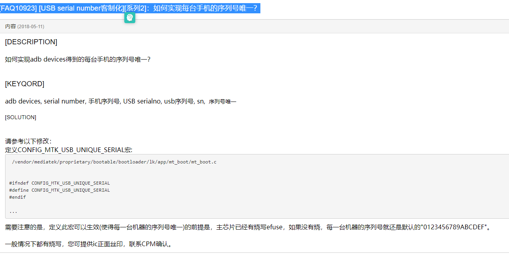
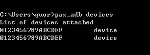

# 简述

Android出厂唯一serialno分析

## 参考

* [如何实现每台手机的序列号唯一](https://online.mediatek.com/FAQ#/SW/FAQ10923)



## 概述

在无SN的情况下，执行pax_adb devices命令，多台M8等机型获取的device ID是一样的，这就导致工厂在资源包下载、应用下载的时候不支持一拖多，效率很低，现在很多项目都已经修改了软件，支持无SN的情况下，多台终端获取ID不一样，如A930等，麻烦后续版本增加支持，对生产至关重要，谢谢！



* 1.目前`pax_adb devices`指令获取的序列号是如下属性定义的，在mtk平台就是写serialno。

```log
gPAYPHONEM50:/ $ getprop | grep 9HJJDADU7PPFDYU8
[ro.boot.bt.serialno]: [9HJJDADU7PPFDYU8]
[ro.boot.serialno]: [9HJJDADU7PPFDYU8]
[ro.serialno]: [9HJJDADU7PPFDYU8]
[ro.vendor.pax.fac.sn]: [9HJJDADU7PPFDYU8]
```

## 代码修改

* `vendor/mediatek/proprietary/bootable/bootloader/lk/app/mt_boot/mt_boot.c`:

```C++
--- a/vendor/mediatek/proprietary/bootable/bootloader/lk/app/mt_boot/mt_boot.c
+++ b/vendor/mediatek/proprietary/bootable/bootloader/lk/app/mt_boot/mt_boot.c
@@ -236,6 +236,7 @@ static uint8_t AB_retry_count;
  */
 /* The following option should be defined in project make file. */
 #define SERIAL_NUM_FROM_BARCODE
+#define CONFIG_MTK_USB_UNIQUE_SERIAL

@@ -2013,9 +2022,11 @@ static inline int read_product_usbid(char *serialno)
                key = (key << 32) | (unsigned int)get_devinfo_with_index(
                              12 + i * 2); /* 12, 14 */

-               if (key != 0) {
+               if (key != 0) {
+                   pal_log_err("Set serial # key: %d chip_code: %d serial_num:%s\n", errcode,chip_code,serial_num);
                        get_serial(key, chip_code, serial_num);
                        ser_len = strlen(serial_num);
+                       pal_log_err("Set serial # serial_num:%s\n", serial_num);
                } else {
                        ser_len = strlen(DEFAULT_SERIAL_NUM);
                        memcpy(serial_num, DEFAULT_SERIAL_NUM, ser_len);
@@ -2051,15 +2062,7 @@ static void set_serial_num(void)
                sn_buf[len] = '\0';
        }

-#ifdef CONFIG_MTK_USB_UNIQUE_SERIAL
-       int errcode = read_product_usbid(sn_buf);
-       if (errcode)
-               pal_log_err("Set serial # from efuse. error: %d\n", errcode);
-       len = strlen(sn_buf);
-       len = (len < SN_BUF_LEN) ? len : SN_BUF_LEN;
-       sn_buf[len] = '\0';
-#endif  // CONFIG_MTK_USB_UNIQUE_SERIAL
-
+// [NEW FEATURE]-BEGIN by wugangnan@paxsz.com 2021-03-03, add default random sereialno by hash the key with chip id
 #ifdef SERIAL_NUM_FROM_BARCODE
        len = (unsigned int)read_product_info(sn_buf, pn_buf);  // sn_buf[] may be changed.
        if (len == 0) {
@@ -2070,8 +2073,21 @@ static void set_serial_num(void)
                len = (len < SN_BUF_LEN) ? len : SN_BUF_LEN;
        sn_buf[len] = '\0';
 #endif  // SERIAL_NUM_FROM_BARCODE
+       pal_log_err("Serial #1: \"%s\"\n", sn_buf);
+
+#ifdef CONFIG_MTK_USB_UNIQUE_SERIAL
+    if (!strcmp(DEFAULT_SERIAL_NUM, sn_buf)) {
+               int errcode = read_product_usbid(sn_buf);
+               if (errcode)
+                       pal_log_err("Set serial # from efuse. error: %d sn_buf = %s\n", errcode,sn_buf);
+               len = strlen(sn_buf);
+               len = (len < SN_BUF_LEN) ? len : SN_BUF_LEN;
+               sn_buf[len] = '\0';
+       }
+#endif  // CONFIG_MTK_USB_UNIQUE_SERIAL
+// [NEW FEATURE]-END by wugangnan@paxsz.com 2021-03-03, add default random sereialno by hash the key with chip id

-       //pal_log_err("Serial #: \"%s\"\n", sn_buf);
+       pal_log_err("Serial #2: \"%s\"\n", sn_buf);
```

## 实现原理

* 原理就是根据chipid，然后对chip id进行hash处理，得到随机的字母排序serialno,需要注意的是，serialno原本定义了`SERIAL_NUM_FROM_BARCODE`，是使用proinfo分区的barcode字段，这个需要先处理，逻辑应该是barcode为空，我们才使用随机serialno，否则使用barcode。

```C++
* #ifdef CONFIG_MTK_USB_UNIQUE_SERIAL
  * read_product_usbid(sn_buf);
    * get_serial(key, chip_code, serial_num);
      * u16 hashkey[4];
      * hashkey[idx] = (hashkey[idx] >> digit) | (hashkey[idx] << (16 - digit)); //digit就是chip_code，6765，hash the key with chip id
      * ser[ser_idx++] = (char)(hashkey[idx] & 0x001f);

具体hash代码：
#ifdef CONFIG_MTK_USB_UNIQUE_SERIAL
static inline int read_product_usbid(char *serialno)
{
	u64 key;
	u32 hrid_size, ser_len;
	u32 i, chip_code, errcode = 0;
	char *cur_serialp = serialno;
	char serial_num[SERIALNO_LEN];

	/* read machine type */
	chip_code = board_machtype();

	/* read hrid */
	hrid_size = get_hrid_size();

	/* check ser_buf len. if need 128bit id, should defined into cust_usb.h */
	if (SN_BUF_LEN  < hrid_size * 8) {
		hrid_size = 2;
		errcode = 1;
	}

	for (i = 0; i < hrid_size / 2; i++) {
		key = get_devinfo_with_index(13 + i * 2); /* 13, 15 */
		key = (key << 32) | (unsigned int)get_devinfo_with_index(
			      12 + i * 2); /* 12, 14 */

		if (key != 0) {  
		    pal_log_err("Set serial # key: %d chip_code: %d serial_num:%s\n", errcode,chip_code,serial_num);
			get_serial(key, chip_code, serial_num);
			ser_len = strlen(serial_num);
			pal_log_err("Set serial # serial_num:%s\n", serial_num);
		} else {
			ser_len = strlen(DEFAULT_SERIAL_NUM);
			memcpy(serial_num, DEFAULT_SERIAL_NUM, ser_len);
			errcode = 2;
		}
		/* copy serial from serial_num to sn_buf */
		memcpy(cur_serialp, serial_num, ser_len);
		cur_serialp += ser_len;
	}
	cur_serialp = '\0';

	return errcode;
}
#endif

#if defined(CONFIG_MTK_USB_UNIQUE_SERIAL) || (defined(MTK_SECURITY_SW_SUPPORT) && defined(MTK_SEC_FASTBOOT_UNLOCK_SUPPORT))
static char udc_chr[32] = {"ABCDEFGHIJKLMNOPQRSTUVWXYZ456789"};

int get_serial(u64 hwkey, u32 chipid, char ser[SERIALNO_LEN])
{
	u16 hashkey[4];
	u32 idx, ser_idx;
	u32 digit, id;
	u64 tmp = hwkey;

	memset(ser, 0x00, SERIALNO_LEN);

	/* split to 4 key with 16-bit width each */
	tmp = hwkey;
	for (idx = 0; idx < ARRAY_SIZE(hashkey); idx++) {
		hashkey[idx] = (u16)(tmp & 0xffff);
		tmp >>= 16;
	}

        pal_log_err("get_serial  # hashkey[0]=0x%x hashkey[1]=0x%x hashkey[2]=0x%x hashkey[3]=0x%x \n", hashkey[0],hashkey[1],hashkey[2],hashkey[3]);
	/* hash the key with chip id */
	id = chipid;
	for (idx = 0; idx < ARRAY_SIZE(hashkey); idx++) {
		digit = (id % 10);
		hashkey[idx] = (hashkey[idx] >> digit) | (hashkey[idx] << (16 - digit));
		id = (id / 10);
	}

        pal_log_err("get_serial  # hashkey[0]=0x%x hashkey[1]=0x%x hashkey[2]=0x%x hashkey[3]=0x%x \n", hashkey[0],hashkey[1],hashkey[2],hashkey[3]);
	/* generate serail using hashkey */
	ser_idx = 0;
	for (idx = 0; idx < ARRAY_SIZE(hashkey); idx++) {
		ser[ser_idx++] = (char)(hashkey[idx] & 0x001f);
        pal_log_err("ser[%d]=%d  %d\n", ser_idx - 1,ser[ser_idx - 1],hashkey[idx] & 0x001f);
		ser[ser_idx++] = (char)((hashkey[idx] & 0x00f8) >> 3);
        pal_log_err("ser[%d]=%d  %d\n", ser_idx - 1,ser[ser_idx - 1],(hashkey[idx] & 0x00f8) >> 3);
		ser[ser_idx++] = (char)((hashkey[idx] & 0x1f00) >> 8);
        pal_log_err("ser[%d]=%d  %d\n", ser_idx - 1,ser[ser_idx - 1],(hashkey[idx] & 0x1f00) >> 8);
		ser[ser_idx++] = (char)((hashkey[idx] & 0xf800) >> 11);
        pal_log_err("ser[%d]=%d  %d \n", ser_idx - 1,ser[ser_idx - 1],(hashkey[idx] & 0xf800) >> 11);
	}
	for (idx = 0; idx < ser_idx; idx++){
		ser[idx] = udc_chr[(int)ser[idx]];
                pal_log_err("final ser[%d]=%d \n", idx,ser[idx]);
        }
	ser[ser_idx] = 0x00;
	return 0;
}
#endif /* CONFIG_MTK_USB_UNIQUE_SERIAL */
```

* 具体打印如下：

```log
[1806] begin read proinfo
[1807] [PROFILE] mmc read 1 blks in 0 ms: 8KB/s
[1808] [LK_BOOT] Load 'proinfo' partition to 0x48191a44 (512 bytes in 1 ms)
[1809] get serialno from proinfo: ""
[1809] get PN from proinfo: ""
[1810] Serial #1: "0123456789ABCDEF"
[1810] Set serial # key: 1 chip_code: 6765 serial_num:>-
[1811] get_serial  # hashkey[0]=0x27e9 hashkey[1]=0xc0e8 hashkey[2]=0xbe97 hashkey[3]=0x30fd 
[1812] get_serial  # hashkey[0]=0x493f hashkey[1]=0xa303 hashkey[2]=0x2f7d hashkey[3]=0xf4c3 
[1813] ser[0]=31  31
[1813] ser[1]=7  7
[1814] ser[2]=9  9
[1814] ser[3]=9  9 
[1814] ser[4]=3  3
[1814] ser[5]=0  0
[1815] ser[6]=3  3
[1815] ser[7]=20  20 
[1815] ser[8]=29  29
[1815] ser[9]=15  15
[1816] ser[10]=15  15
[1816] ser[11]=5  5 
[1816] ser[12]=3  3
[1817] ser[13]=24  24
[1817] ser[14]=20  20
[1817] ser[15]=30  30 
[1817] final ser[0]=57 
[1818] final ser[1]=72 
[1818] final ser[2]=74 
[1818] final ser[3]=74 
[1819] final ser[4]=68 
[1819] final ser[5]=65 
[1819] final ser[6]=68 
[1820] final ser[7]=85 
[1820] final ser[8]=55 
[1820] final ser[9]=80 
[1821] final ser[10]=80 
[1821] final ser[11]=70 
[1821] final ser[12]=68 
[1822] final ser[13]=89 
[1822] final ser[14]=85 
[1822] final ser[15]=56 
[1823] Set serial # serial_num:9HJJDADU7PPFDYU8
[1823] Set serial # from efuse. error: 1 sn_buf = 9HJJDADU7PPFDYU8
[1824] Serial #2: "9HJJDADU7PPFDYU8"
```